# CH01 통신

## 1. 통신의 역사
> 1800년대에 이르러 전기를 통신 수단으로 사용할 수 있는 것을. 알게 되었고 전기를 이용한 전신기를 발명함으로써 인류의 통신. 혁명이 시작 되었다.

### (1) 통신은 세계대전을 통해 유럽에서 발전

- 따라서 통신을 하기 위한 문자 단위는 당연히 `영어 문자`입니다.

### (2) bit

#### 도체, 부도체, 반도체

먼저 bit를 알려면 도체, 부도체, 반도체 3가지를 알아야 합니다.

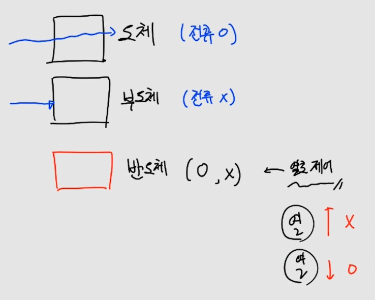

- `도체` : 전류가 통과
- `부도체` : 전류가 통과 X
- `반도체` : 전류를 열로 제어 --> 통과 or 통과 X
  - 열이 많으면 전류 통과 X
  - 열이 적으면 전류 통과

반도체의 경우, 다음 그림과 같이 PC가 많은 전산실을 예시로 들 수 있습니다. 즉 열을 조절하므로써 온도를 유지시키는 것입니다.

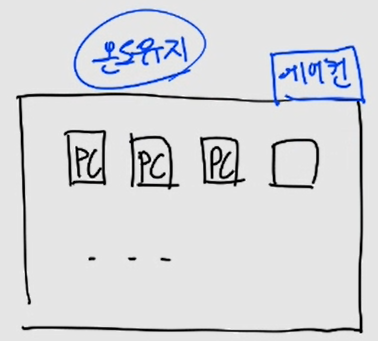

#### bit 비트

그래서 반도체의 경우 앞서말한 특징 때문에 0과 1로 표현을 할 수 있습니다. 즉 `0과 1로 표현할 수 있는 bit가 될수 있는 것`입니다.

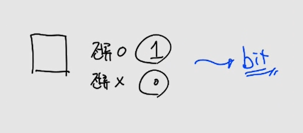

따라서 형광등을 예시로 들을 수 있습니다. 만약 부도체 2개, 즉 2개의 bit가 있다면 경우의 수는 4개가 된다는 것입니다. 아래의 선풍기 처럼 말입니다.

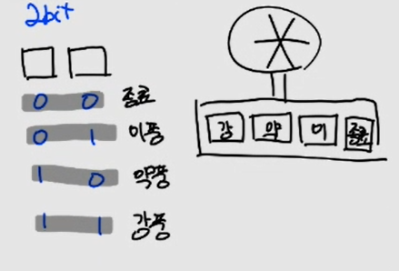

### (3) Protocol

하지만 선풍기에게 2bit인 4가지 경우의 수 00, 01, 10, 11을 보내기만 한다면, 작동은 하지 않습니다. 왜냐하면 선풍기 입장에서는 00, 01, 10, 11가 무엇인지 모르기 때문입니다.

따라서 선풍기쪽에도 서로 각각의 00, 01, 10, 11이 어떤 의미를 가지고 있는지 약속을 해야합니다.

**서로 약속을 하는 것을 프로토콜(Protocol)** 이라고 하고 **서로 공유하는 것**입니다. 예시로는 **ASCII CODE**가 있습니다.

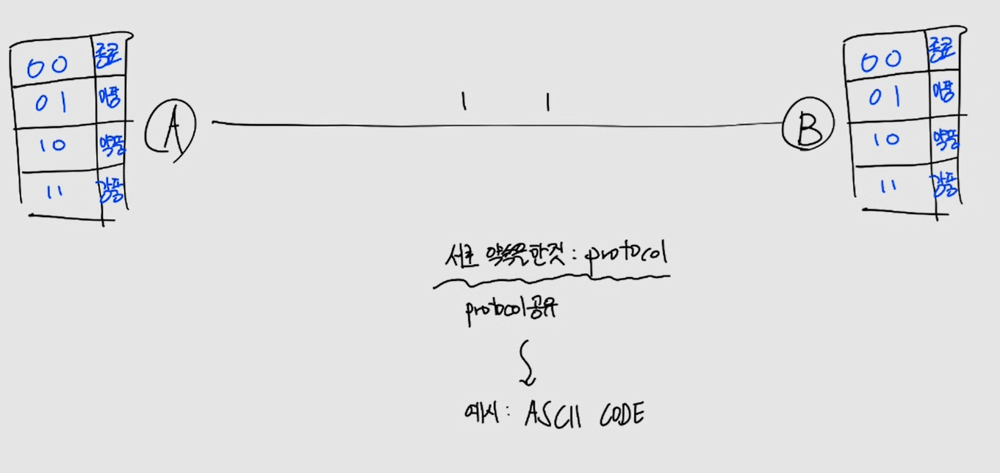

### (4) 8bit, byte

`영어 문자는 8bit로 표현이 가능해서 256가지 경우의 수를 포함하며 모든 대문자, 소문자, 숫자, 특수문자를 표현할 수 있는 범위`입니다.

`8bit 단위로 전송되는 2진수 데이터는 아스키코드를 통해 변환이 가능`합니다.

또한 통신은 bit단위로 전송되지만, 사람은 모든것을 추상화 하기 때문에 8bit 단위로 끊어 읽습니다.

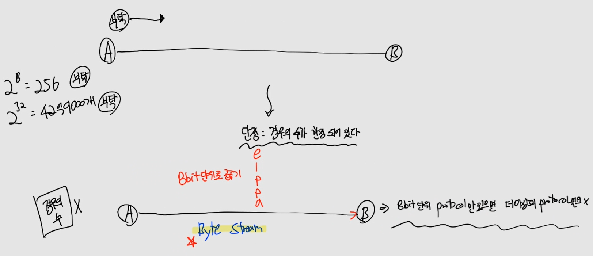

예시로, apple을 8bit로 끊어 읽으면 a, p, p, l, e 각 단어마다 8bit로 읽는 것입니다.

통신으로 전달되는 데이터는 물리적으로는 광케이블로 전송되지만, 논리적으로는 `Byte Stream`을 통해 전송됩니다.

즉, `Byte Stream 이 경수의 수가 한정되어 있는 문제를 해결`해주고, 8bit 단위로 끊어서 끊어 읽게 만듭니다. 그리고 8bit protocol 만 있으면 더 이상의 protocol 은 필요 없게 됩니다.

### (5) Cpu, Ram, Register

통신으로 전달되는 데이터는 어딘가에 저장되어야 CPU로 처리가 가능해집니다. 그 장소는 메모리이며 메모리 공간의 최소 단위는 8bit입니다. 왜냐하면 하나하나의 단어가 최소 8bit를 차지하기 때문입니다.

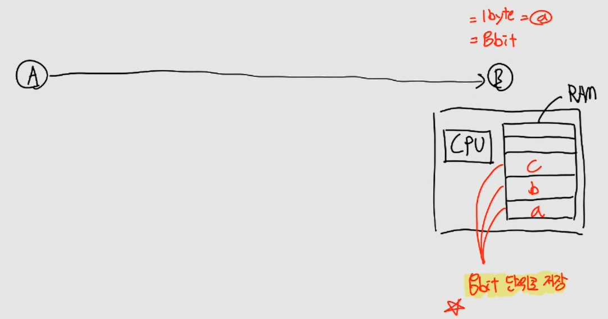

a, b, c 는 각각 8bit(= 1byte) 단위로 Ram에 저장이 됩니다. 더 자세하게 들여다 봅시다.

컴퓨터 중에 8bit 컴퓨터, 16bit 컴퓨터를 들어보셨을 겁니다. 이 각각의 의미는 Ram에서 몇 bit씩 가져올 수 있는 것인지를 의미합니다.

- 8bit 컴퓨터: Ram으로 부터 데이터 a 1개를 가져옴.
- 16bit 컴퓨터: Ram으로 부터 데이터 a, b 2개를 가져옴. 

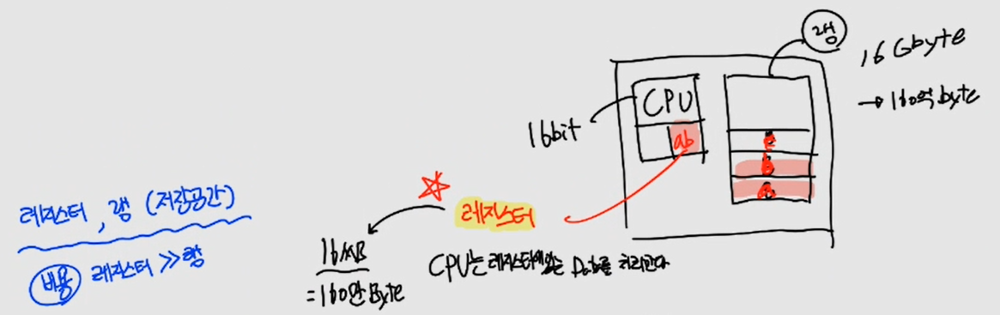

그림을 보면 `Cpu안에 Register가 있고, Cpu가 Regitster에 있는 Data를 처리`합니다. Ram에는 8bit 단위로 데이터가 적재되어 있는 것을 알 수 있습니다.

> Register VS Ram 가격차이
- Register는 16MB(160만 바이트)
- Ram은 16GByte(160억 바이트)
- Register >> Ram

### (6) Cache memory

이제 캐시 메모리에 관한 것을 알아볼 것입니다. 일단 캐시 메모리는 `상대적인 것`입니다.

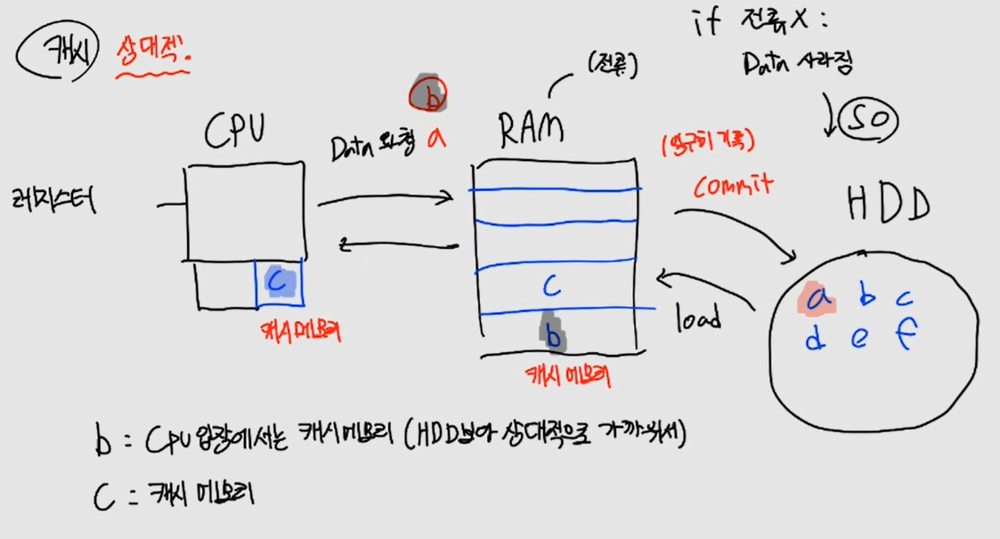

#### Cache memory

- Cpu에서 b, c를 찾는 경우 (캐시 메모리)
  - b 경우
    - Cpu에서 Register에 b가 있는지 확인
    - 존재 X, Ram에게 b 데이터를 요청
    - Ram에 b가 존재
    - Cpu입장: b가 캐시 메모리
      - 이유: HDD보다 상대적으로 가까워서
  - c 경우
    - Cpu에서 Register에 c가 있는지 확인
    - 존재
    - Cpu 입장: c는 캐시 메모리
      - 이유: HDD보다 상대적으로 가까워서

- Cpu에서 a를 찾는 경우
  - Cpu에서 Register에 a가 있는지 확인
  - 존재 X, Ram에게 a 데이터를 요청
  - Ram에 a가 존재 X
  - HDD에서 a를 load
  - Ram에 a가 적재
  - Register로 데이터 a를 보냄
  - Cpu 입장: a는 캐시 메모리 X
    - 이유: HDD까지 접근했기 때문에

> Ram과 전류
- Ram은 전류와의 연결이 끊기면, Data가 전부 삭제 됩니다.
- 따라서 HDD에 영구히 저장하도록, HDD에 commit을 해야합니다.

### (7) UTF-8

8bit 단위로 전송되는 영문자는, 한글, 중국어, 고대 고어, 일본어를 표현하지 못한다. 그래서 모든 문자를 표현하는 문자 인코딩 방식이 필요하게 됬습니다. 

#### 완성형 문자셋 

아스키코드(영문자, 1byte 필요)와 EUR-KR(한글, 2byte 필요)은 2개 모두 완성형 문자셋입니다. `완성형 문자셋이란 이미 표가 있는 것`입니다.

단점은 제한적이고, 표에 없으면 "뵑"같은 단어는 깨지는 것입니다.

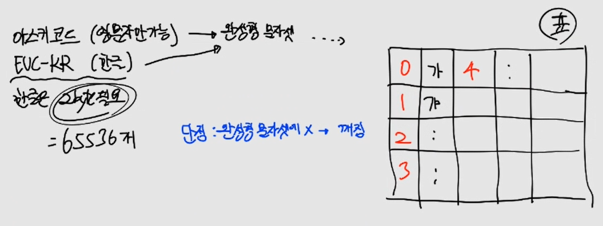

#### 조합형과 UTF-8

완성형 문자셋을 보완하기 위해서 나왔습니다. 일단 UTF-8은 아스키코드, EUR_KR 처럼 byte 가 정해져 있지 않고 `1 ~ 4byte 가변문자셋`으로 되어있습니다.

따라서 `표 또한 존재하지 않습니다.`

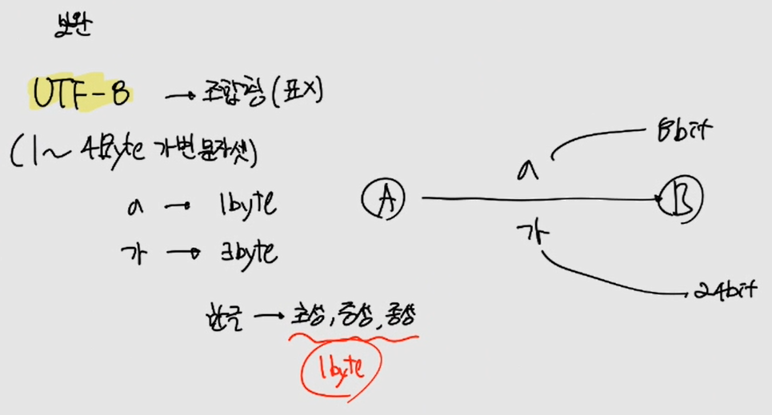

- 영어
  - 영어의 경우는 8bit, 1byte로 끊습니다.
- 한글
  - 하지만 한글의 경우 초성, 중성, 종성으로 구분이 되어있습니다.
  - 따라서 1byte씩 총 3byte로 끊습니다.

현재에 이르러서 우리는 `글로벌 통신`을 하고 있습니다. 따라서 모두가 UTF-8을 기준으로 통신을 하고 있습니다. 왜냐하면 대부분의 언어를 다 포괄하기 때문입니다.

## 2. TCP/UDP 통신
> TCP는 연속성보다 신뢰성 있는 전송이 중요할 때에 사용되는 프로토콜이며, UDP는 TCP보다 빠르고 네트워크 부하가 적다는 장점이 있지만 신뢰성 있는 데이터 전송을 보장하지는 않습니다.그렇기 때문에 신뢰성보다는 연속성이 중요한 실시간 스트리밍과 같은 서비스에 자주 사용됩니다.

### (1) 청군100명 백군 80명 누가 전쟁에서 승리할까?
청군 100명과 백군 80명이 싸우고 있습니다. 청군 100명을 이끄는 콘스탄티누스가 전쟁에서 승리하기 위해서는 동시에 백군과 싸우는 방법만 존재합니다. 어떻게 해야 동시에 싸울수 있는지 알아보겠습니다.

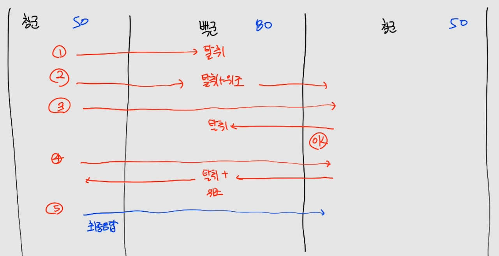

동시에 싸우기 위해서는 언제, 몇시에, 어디에서 싸울지 정보들이 필요합니다. 그러기 위해서는 해당 정보를 같은 청군에게 전달해야 합니다.

하지만 4가지의 경우의 수가 있습니다.
- 탈취
- 탈취 + 위조 후 전달
- 제대로 전달, 응답 시 탈취
- 제대로 전달, 응답 시 탈취 + 위조, 그리고 전달

하지만 이렇게 응답을 받아도 전쟁에서 승리할 수 없습니다. 반드시 최종 응답을 1번더 날려야합니다.

### (2) 3-way-handShake

위와 같은 과정을 `3-way-handShake` 라고 합니다. `TCP 통신에 기본`이 됩니다. TCP 통신의 경우 신뢰성이 있습니다. 하지만 아직 무결성, 가용성등 여러 문제가 남아있습니다. 단지 **전달**은 되었습니다. (TCP의 반대 개념은 UDP 입니다.)

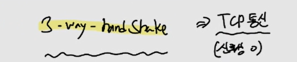

> TCP 통신 vs UDP 통신
- `TCP`: 3-way-handShake
  - Spring 모든 통신에 기반
  - 기계가 처리하는 모든 것
  - Id, Pw 를 이용한 네이버 로그인
- `UDP`: 한방향으로 보내기만 함
  - 영상, 사진, 전화에 사용
  - 영상의 경우 초당 사진 24장 기반
  - 1장이 없더라도, 사람은 추측 가능
  - 즉, 일부 데이터가 소실되어도 사람이 추측한 것에 사용

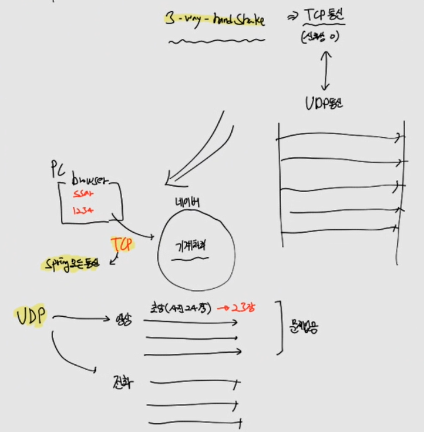

### (3) TCP + CIA

`TCP는 신뢰성이 있는 통신`이고, `CIA는 보안의 3요소`입니다.
- `Confidential`: 기밀성
- `Integrity`: 무결성
- `Availability`: 가용성

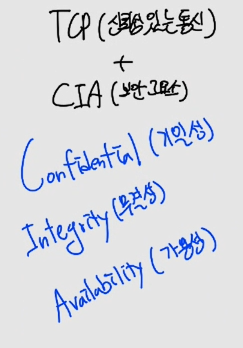

현재 청군은 TCP까지는 가능하지만, 보안은 매우 취약합니다. 따라서 감옥에 있는 죄수들을 이용합니다. 감옥에 있는 죄수들을 대머리로 만들고, 암호를 적는 것입니다. 죄수들이 머리를 기르면 암호는 보이지 않게 됩니다.

#### 기밀성, 가용성, 무결성

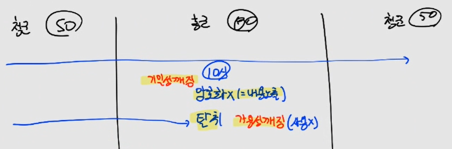

Confidential(기밀성)은 내용노출 여부를 의미합니다. 즉, 암호화 여부를 뜻합니다.

암호화가 되지 않은 상태로 TCP 통신이 되면, 기밀성이 깨진 것입니다.

Availability(가용성)은 사용여부를 의미합니다. 기밀성이 지켜진 내용을 보내는 와중에 탈취를 당하면, 가용성이 깨지고 아무도 사용을 할 수 없게 됩니다.

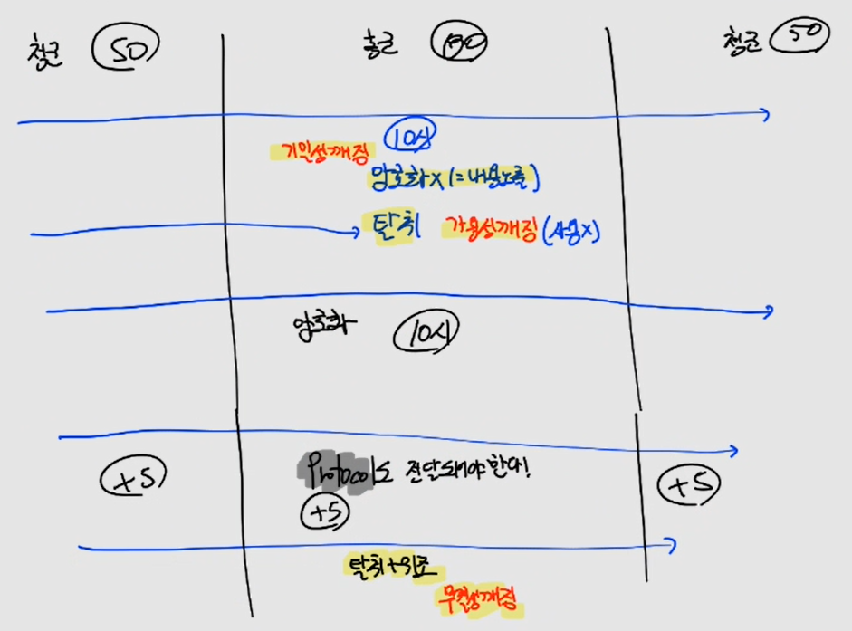

우리는 기밀성과 가용성을 지켜서 보내야합니다. 하지만, 암호를 받아도 암호를 해동하는 방법을 같은 팀이 모르면 의미가 없습니다. 마치 대머리에 암호를 적어도 같은 팀이 그 사실을 모르면 죄수가 도착한 의미가 사라지는 것입니다.

따라서 Protocol(약속)도 같이 전달되어야 합니다. 

하지만 중간에 홍군이 탈취 + 위조를 해서 Integrity(무결성)을 깨트릴 수 있습니다. 같이 전쟁을 하는 것이 아닌 각기 다른 시간에 전쟁을 할 수 있도록 말입니다.

### (4) 대칭키, RSA

모든 통신은 노출이 되어있기 때문에, 우리는 노출되지 않게 해야합니다. 청군 또한 암호화에 전략을 써야합니다.

#### 대칭키

먼저 대칭키 방식은 키를 1개로 사용하는 방식입니다. 키가 1개라는 의미는 Protocol도 동일하다는 의미가 됩니다. 따라서 키를 전달해야하는 문제가 있습니다.

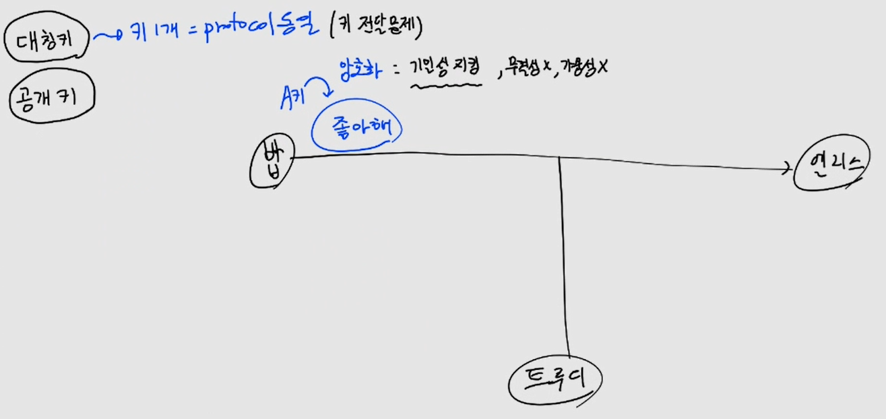

밥이 A키를 가지고 편지를 암호화 한 후, 엘리스가 편지를 받아도 A키가 존재하지 않으면 편지를 열어볼 수 없습니다. 이 경우는 기밀성 O, 무결성 X, 가용성 X 상태가 됩니다.  

#### RSA 공개키, RSA 개인키

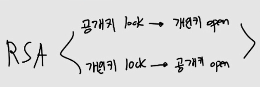

RSA 는 공개키와 개인키를 기반으로 합니다.

- RSA 공개키 lock: 개인키 open
  - 공개키: 누구나 볼 수 있는 키
- RSA 개인키 lock: 공개키 open
  - 개인키: 노출되면 안되는 키

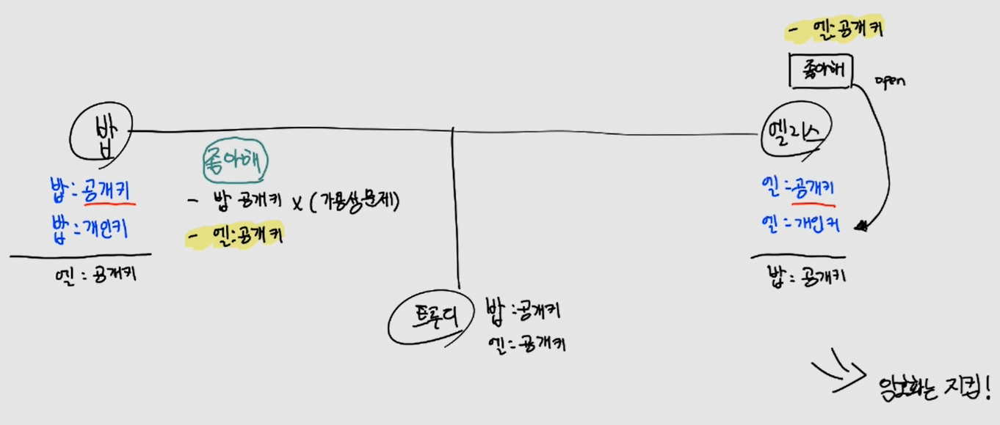

- 밥: 밥 공개키, 밥 개인키, 엘 공개키
- 엘: 엘 공개키, 엘 개인키, 밥 공개키
- 트루디: 밥 공개키, 엘 공개키

2가지 경우의 수를 보겠습니다.

- 밥의 공개키로 편지를 암호화한 경우
  - 밥의 개인키로만 open
  - 엘리스는 밥의 개인키를 X
  - 가용성 깨짐

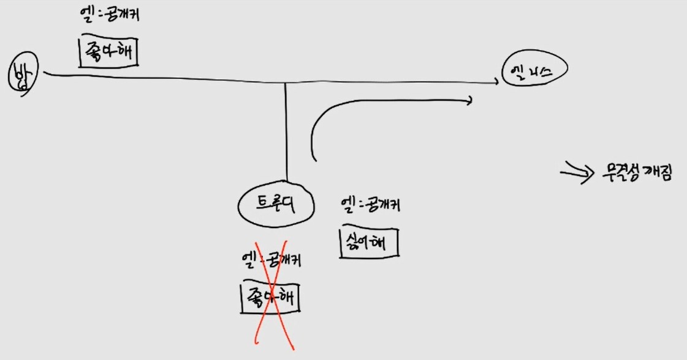

- 엘리스의 공개키로 편지를 암호화한 경우
  - 엘리스의 개인키로 open
  - 가용성 O
  - 만약 트루디가 탈취 + 엘리스 공개키로 위조
  - 무결성 깨짐

### (5) RSA + Encapsulation(캡슐화)

밥이 엘리스에게 편지를 암호화해서 올바르게 전달하려면, 보내고 싶은 편지(payload 즉, body data)를 엘리스의 공개키로 캡슐화 해야합니다. 그리고 밥의 개인키로 1번 더 캡술화를 해야합니다.

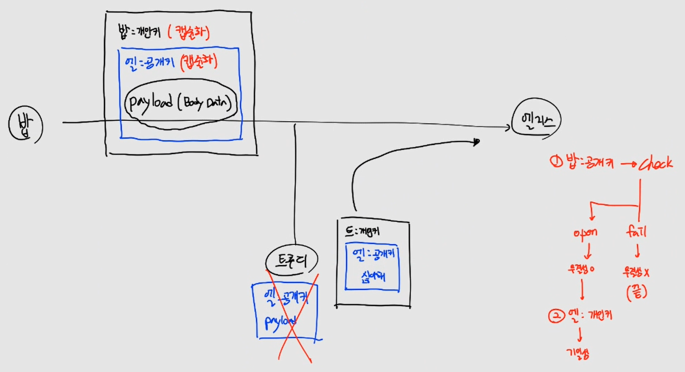

왜냐하면 엘리스는 밥과 통신을 하기 때문에 다음과 같은 로직을 가지게 됩니다. 가장 먼저 밥의 공개키로 열리는지 먼저 확인합니다.

- 엘리스의 로직
  - 밥 공개키로 open O
    - 무결성 지킴
    - 엘리스의 개인키 open O
      - 기밀성 O
      - 암호화가 되었기 때문에
  - 밥 공개키로 open X
    - 무결성 깨짐
    - 트루디의 위조 가능성

중간에 트루디가 편지를 탈취 + 위조 해도 트루디는 밥의 개인키를 가지고 있지 않아서 트루디의 개인키로 캡슐화를 해서 엘리스에게 보내도, 엘리스는 밥의 공개키로 열리지 않으면 바로 해당 편지를 버리게 됩니다.

> s 의 비밀
- https, ssh 등 s를 포함하는 단어들
- 모두 RSA 공개키 기반 구조

### (6) 청군이 백군에게 완벽하게 승리하는 방법

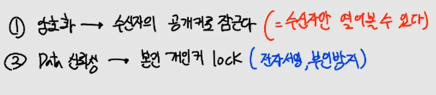

- 암호화: 수신자의 공개키로 lock
  - 수신자 개인키로만 open
- data 신뢰성: 본인 개인키 lock
  - 본인 공개키로만 open
  - 전자서명, 부인방지에 사용

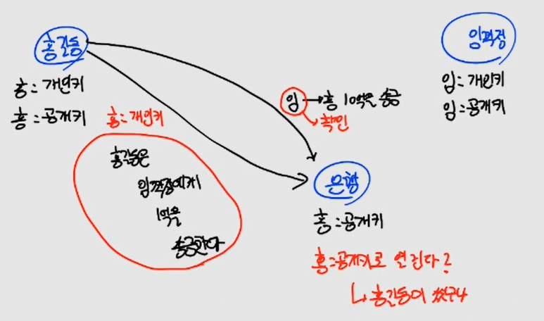

송금 과정을 알아보겠습니다. "홍길동은 임꺽정에게 1억을 송금한다. " 이 내용은 은행입장에서는 홍길동에게 확인을 해야합니다. 왜냐하면 송금하는 사람이 홍길동이기 때문입니다.

따라서 해당 내용을 홍길동의 공개키로 열리는지 확인을 해서, 홍길동 이외에 사람이 보냈는지 확인을 하는 것입니다.

#### 청군의 완벽한 승리 전략

여태까지 배운 내용을 바탕으로 청군 100명을 이끄는 콘스탄티누스가 전쟁에서 승리하기 위해서는 **TCP + RSA**를 이용해야 전쟁에서 승리할 수 있습니다.

> OAuth 제공자가 대칭키를 활용하여 서비스할 때 서버의 프로세스에 관한 고민

먼저 발행주체와 검증주체에 관한 이해를 해야합니다.

- 발행주체 == 검증주체
  - 대칭키 기반(HS512)
  - 키 교환 X
  - 버스회사에서 생성하고 검증
  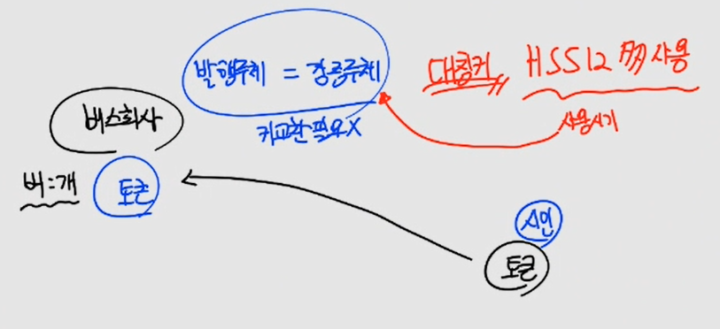
- 발행주체 != 검증주체
  - RSA 기반
  - 국가토큰 발행, 버스회사 검증
  - 버스회사는 국가 공개키로 검증
  - 국가에서 발행한 토큰임을 입증
  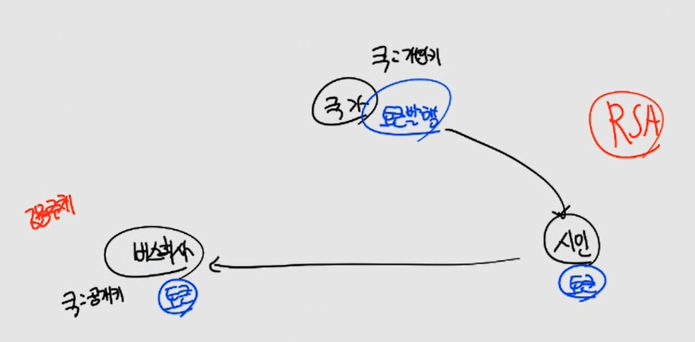

이제 OAuth가 어떤 로직을 가지고 있는지 알아보겠습니다.

- 네이버 소셜 로그인 방식
  - RSA 기반
  - OAuth(Open Authentication)
  - 소셜 로그인시, 네이버 토큰 생성
  - 회사에서는 네이버 공개키로 토큰이 열리는지 검증
  - 열린경우, 네이버에서 토큰을 받은 것이 입증
  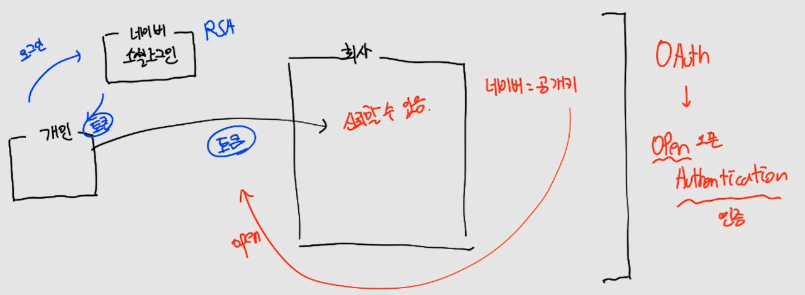

> 버스회사 이야기
- 대칭키
  - 키가 1개
  - 가계는 버스회사에게 토큰을 주고, 버스회사가 검증을 해야합니다.
  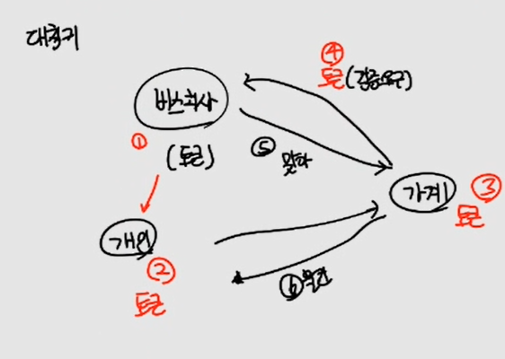
- RSA
  - 다음과 같은 로직만 가지게 됩니다.
  - 가계에서 버스회사의 공개키로 열리는지 검증해야 합니다.
  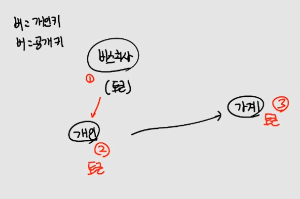

## 3. 서킷 스위칭과 패킷 스위칭
> 서킷스위칭은 하나의 회선을 할당받아 데이터를 주고받는 방식이다. 패킷스위칭은 데이터를 패킷이라는 단위로 쪼개서 전송하는 방식이다.

### (1) 서킷 스위칭

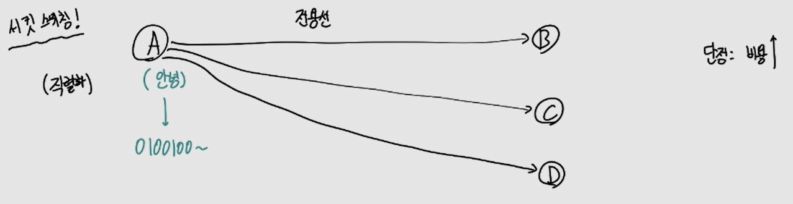

서킷 스위칭 특징은 통신을 위한 쫙 뻗은 전용선입니다. 데이터를 내는 경우, "안녕"을 바이너리 데이터 형태로 직렬화해서 보냅니다. 

하지만 단점으로는 단일 통신이 아닌 여러 통신을 하고 싶으면 매번 전용선을 깔아야 하는데, 비용이 매우 큽니다.

### (2) 패킷 스위칭

이를 보완하기 위해서 패킷스위칭이 나오는데, 패킷 스위칭의 특징은 **공유**입니다.

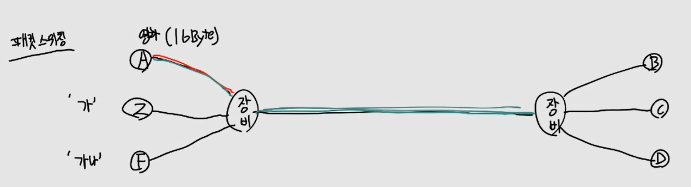

전용선 끝에 장비를 두어서 전용선 비용을 절감하고, 장비가 조절하는 것입니다.

예를 들어

- A: 영화(먼저 보냄)
- Z: 가
- F: 가나

A를 먼저 보낸 경우, 장비에서는 A를 받아들이고 Z, F의 경우는 **동기화**가 됩니다. 멍 때린다고 표현을 하기도 합니다.

> 동기화란?
- 프로그래밍에서의 동기화
  - 일에 순서가 있다는 의미
  - A -> Z -> F
- 데이터에서의 동기화
  - iPhone 과 클라우드가 연동
  - iPhone으로 3장의 사진 찍은 경우
  - 클라우드에도 사진 3장이 동기화

### (3) Round Robin(라운드 로빈)

만약 장비가 A만 계속 받아들이면 Z, F는 오랜 시간뒤에 연결이 될 것입니다. 따라서 이를 보완하기 위해 라운드 로빈이 사용됩니다.

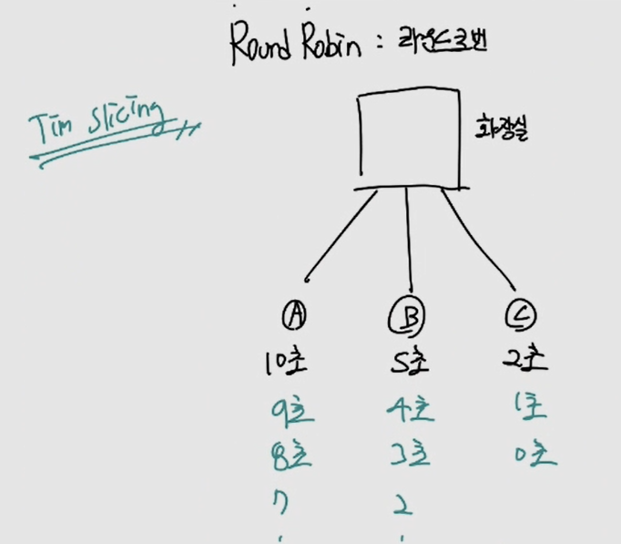

라운드 로빈은 Time Slicing 을 기반으로 작동합니다. 빠르게 번갈아 갑니다. 예를 들면 화장실을 A, B, C 가 1초의 Time Slicing을 기준으로 빠르게 번갈아 가면서 사용하는 것입니다.

그러면 한쪽에만 쏠리는 것을 방지하게 됩니다.

### (4) 패킷, ip

#### 패킷

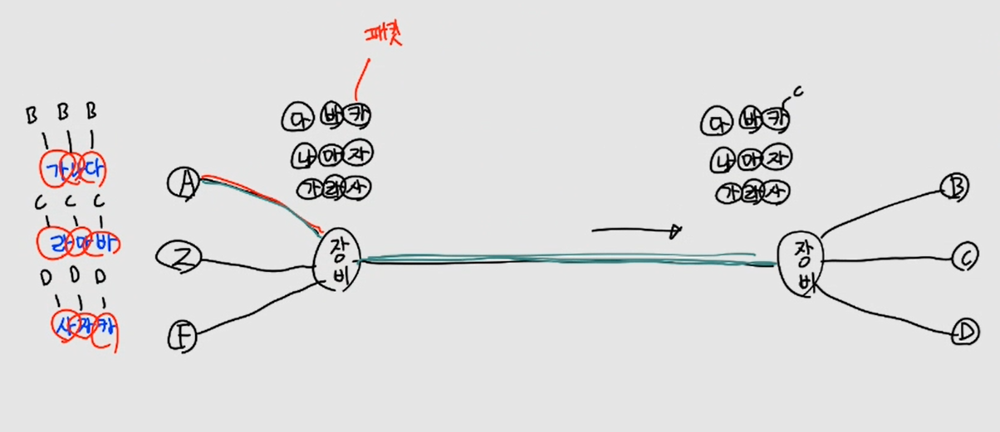

왼쪽 데이터를 오른쪽으로 보내겠습니다.

- A: 가, 나, 다
- B: 라, 마, 바
- C: 사, 자, 카

데이터 1개 마다 패킷이라고 부릅니다. 패킷들은 Round Robin(라운드 로빈)에 의해, 일정하게 장비에 들어갑니다.

순서는 **가-라-사-나-마-자-다-바-카** 가 됩니다. 그리고 오른쪽으로 이동하고 각 패킷의 목적지로 이동합니다.

#### IP, 인터넷 세상 주소

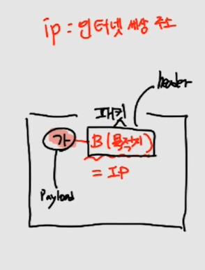

패킷을 자세하게 보면, "가"는 payload이고, payload에 header가 연결되어 있습니다. header 내부에는 B라고 하는 목적지 즉, ip가 존재합니다. ip는 인터넷 세상 주소입니다.

### (5) payload, header, 라우터

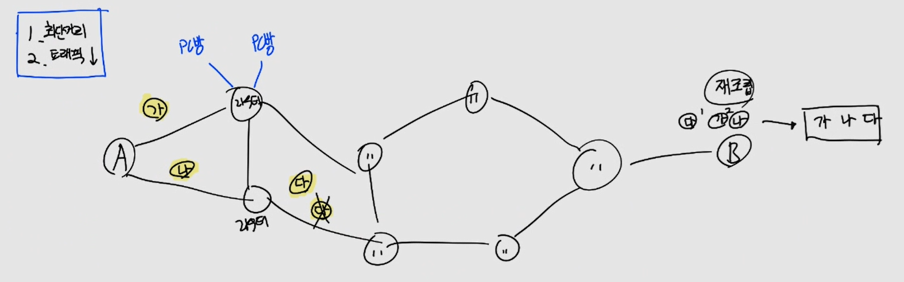

통신을 할 때, 많은 라우터들이 존재합니다. 라우터는 본인에게 오는 패킷을 **포워딩** 해주는 역할을 가집니다. 

- 라우터의 패킷 포워딩시 고려사항
  - 최단거리
  - 트래픽이 적은 곳

이 2가지를 기반으로 패킷을 어떤 라우터로 보낼지 결정합니다. 예를 들어, 한 라우터에 PC방이 많이 있으면, 트래픽이 높아서 다른 라우터로 보내게 됩니다. 따라서 패킷은 각기 다르게 이동을 합니다.

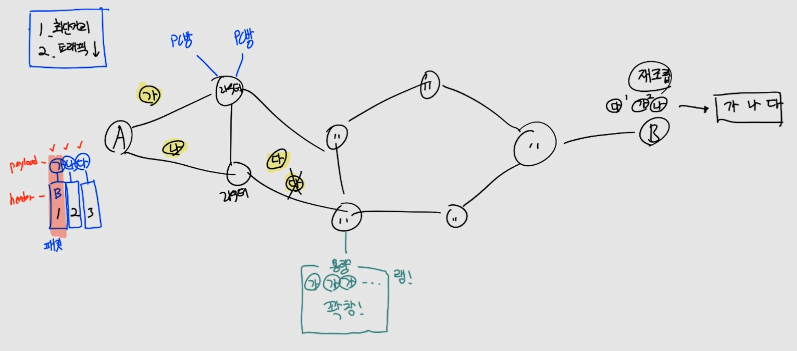

만약 "가", "나", "다" 데이터가 존재하고 B로 보내는 경우, 각각의 패킷은 payload 와 header로 나누어지고, header 에는 인터넷 주소인 ip와 순번이 들어갑니다.

여기서 순번의 역할은 도착 후 "가", "나", "다" 데이터가 지금과 같은 순서로 온다는 보장이 없기 때문에 어떤 순서인지 의미합니다.

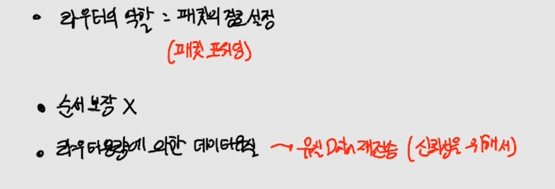

- 순서가 보장이 되지않는 이유
  - 라우터가 패킷 포워딩을 다르게 하기 때문에, 도착순서의 차이가 생김
  - 라우터는 Ram으로 구성이 되어있기 때문에, 라우터가 꽉차게 되면 뒤따라 들어오던 패킷은 들어오지 못하고 소실
  - 만약 소실이 되는 경우, 데이터의 신뢰성을 지키기 위해서 소실된 데이터를 다시 보냄

- header 에 필요성
  - 순서가 보장이 되지 않기 때문에, 재조립을 위해

### (6) Interface vs Protocol

Interface 와 Protocol 모두 규약이라는 의미를 가지고 있습니다. 하지만 명백한 차이점이 있습니다.

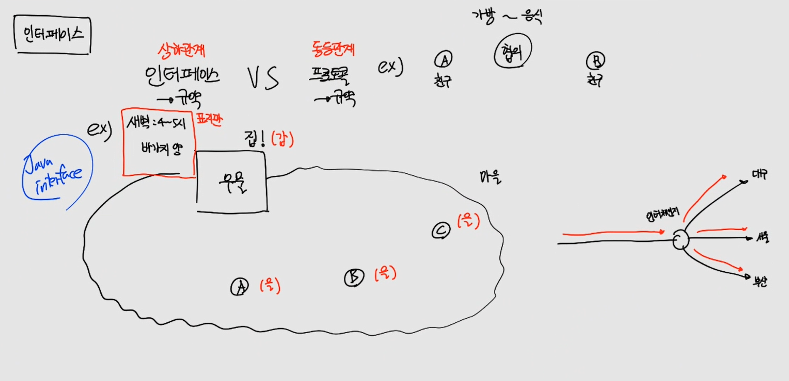

#### Interface
- 상하관계의 규약
- 갑과 을의 규약이라고 생각
- Java Interface
- 을이 갑의 우물을 사용하고 싶은 상황, 표지판에 규약을 걸어두는 것
- 고속도로 InterChange 에서 오직 3가지 길 중 1개만 선택 가능한 경우

#### Protocol
- 동등관계의 규약
- 친구끼리의 규약
- 여행시, 서로 무엇을 챙겨올지 협의하는 것

따라서 라우터의 경우, 정해진 규칙과 경로를 따르기 때문에 인터페이스가 됩니다.

## 4. 마인드 맵

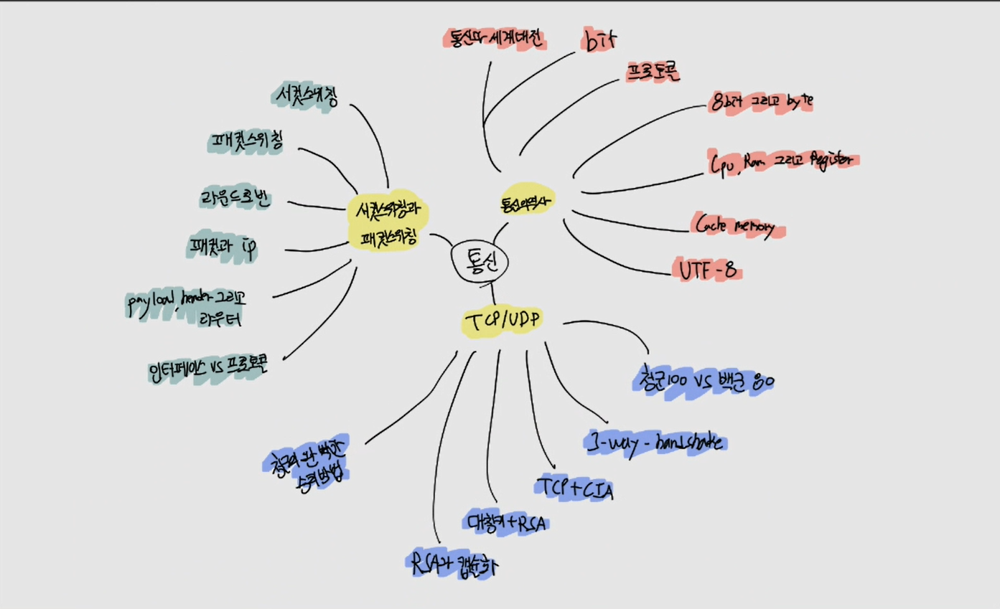