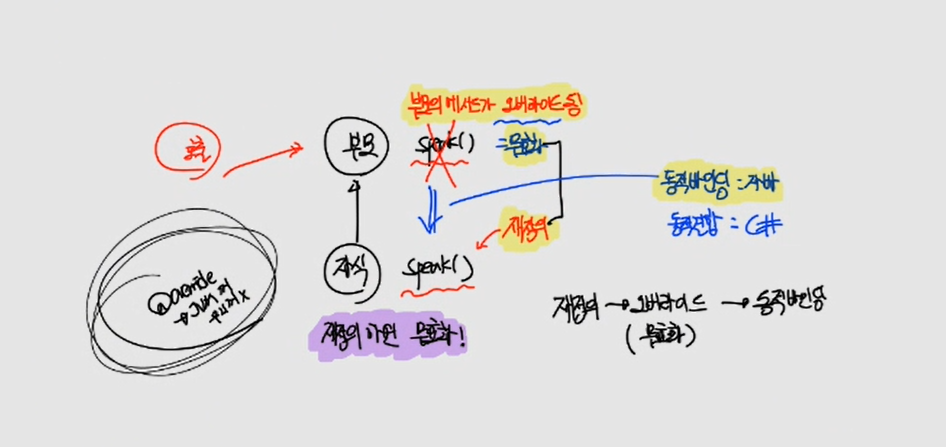
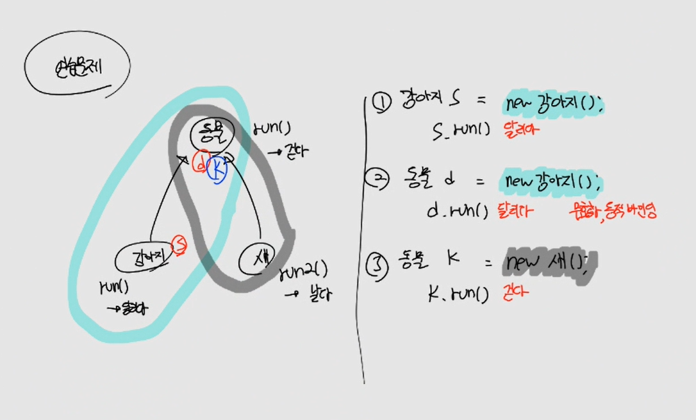
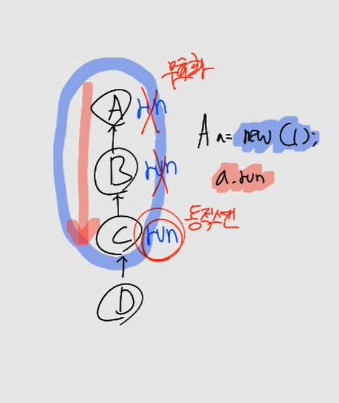
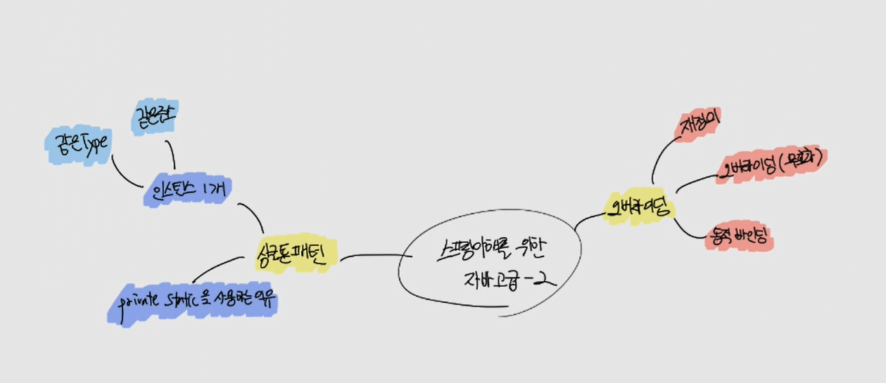

# CH10 스프링 이해를 위한 자바 고급-2

#### 소스코드

https://github.com/codingspecialist/javahigh-oop2.git

## 1. 오버라이딩
> 오버라이딩(Overriding)은 객체지향 프로그래밍에서 사용되는 개념입니다. 클래스 상속 관계에서 자식 클래스가 부모 클래스의 메서드를 재정의하는 것을 말합니다.
>
> 일반적으로 상속 관계에서 부모 클래스에 정의된 메서드를 자식 클래스에서 그대로 사용할 수 있습니다. 하지만 때로는 자식 클래스에서 특정 메서드의 동작을 변경하거나 확장해야 할 경우가 있습니다. 이때 오버라이딩을 사용하여 부모 클래스의 메서드를 자식 클래스에서 재정의하고, 자식 클래스에서 재정의한 메서드가 호출될 수 있도록 할 수 있습니다.
>
> 오버라이딩을 하려면 자식 클래스에서 부모 클래스의 메서드와 동일한 이름, 매개변수, 반환형을 가져야 합니다. 자식 클래스에서 오버라이딩한 메서드는 부모 클래스의 메서드를 대체하며, 동일한 시그니처(메서드 이름, 매개변수, 반환형)를 가지기 때문에 부모 클래스의 인스턴스를 사용하는 코드에서 자식 클래스의 오버라이딩된 메서드가 호출될 수 있습니다.
>
> 오버라이딩을 통해 코드의 재사용성과 유연성을 높일 수 있으며, 다형성(polymorphism)의 특성을 구현하는 데에도 중요한 역할을 합니다.

### (1) 오버라이딩
> 오버라이딩(overriding)이란 상속 관계에 있는 부모 클래스에서 이미 정의된 메소드를 자식 클래스에서 같은 시그니쳐를 갖는 메소드로 다시 정의하여 부모의 메서드를 무효화 시키는 것이다.

오버라이딩을 통해 OCP를 지킬 수 있다.



- 순서
  - 재정의
    - 부모의 메소드를 다시 재정의 한다.
  - 오버라이딩(= 무효화)
    - 부모의 메소드를 호출한 경우, 부모 메소드는 무효화가 된다.
    - 왜냐하면 자식이 재정의를 했기 때문이다.
  - 동적 바인딩
    - 이때 부모의 자식중에 재정의된 메소드를 찾는 과정을 동적 바인딩(자바)이라고 한다.

> 연습문제, 생각해봅시다.
>
> 
>
> ```java
> 강아지 s = new 강아지();
> ```
> - 메모리: 강아지, 동물
> - Type: 강아지
>
> ```java
> 동물 d = new 강아지();
> ```
> - 메모리: 강아지, 동물
> - Type: 동물
> - 부모 run() 무효화(= 오버라이딩)
>   - 동적바인딩
> 
> ```java
> 동물 k = new 새();
> ```
> - 메모리: 새, 동물
> - Type: 동물

> 동적바인딩의 원리
> 
> 
> 
> ```java
> C a = new C();
> ```
> - 메모리: C, B, A
> - a Type: C
> - run() 실행시
>   - 메모리에 같은 메소드가 있는지 전부 동적으로 찾음
>   - C에 run이 존재 -> 부모의 run 들은 무효화

### (2) 실습코드

- src/ex01/MemEx01.java

```java
class 지구인{
    String name = "지구인";
}
class 아시아인 extends 지구인{
    String name = "아시아인";
}
class 아프리카인 extends 지구인{
    String name = "아프리카인";
}
class 일본인 extends 아시아인{
    String name = "일본인";
}
class 한국인 extends 아시아인{ // new 아시안() -> 아시아인, 지구인
    String name = "한국인";
}
class 소말리아인 extends 아프리카인{ // new 소말리아인() -> 소말리아인, 아프리카인, 지구인
    String name = "소말리아인";
}

/**
 * 타입에 따라 변수를 찾아간다.
 * 상속을 통해 메모리 구조를 디자인할 수 있다.
 */
public class MemEx01 {
    public static void main(String[] args) {
        한국인 n1 = new 한국인(); // (한국인) - 아시아인 - 지구인
        System.out.println("타입 한국인 : " +n1.name);
        
        지구인 n2 = new 한국인(); // 한국인 - 아시아인 - (지구인)
        System.out.println("타입 지구인 : " +n2.name);

        지구인 n3 = new 소말리아인(); // 소말리아인 - 아프리카인 - (지구인)
        System.out.println("타입 지구인 : " +n3.name);
    }
}
```

- src/ex02/MemEx02.java
  - 주석을 바꿔가며 확인

```java
/**
 * 지구인 : 걷는다 (행위 특징), 말한다 (행위 특징 - 공통적이지 않다.)
 * 아시아인 : 황색피부 (상태 특징)
 * 아프리카인 : 검정색피부 (상태 특징)
 * 일본인 (Object) : 일본어로 말한다 (행위 특징)
 * 한국인 (Object) : 한국어로 말한다 (행위 특징)
 * 소말리아인 (Object) : 소말리어어로 말한다 (행위 특징)
 */

class 지구인 {
    public void walk() {System.out.println("걷는다");}

    // 무효화, step4
    // public void speak() {
    //     // 본인이 뭘 할지 모르니까
    // }
}
class 아시아인 extends 지구인 {
    String skin = "황색피부";
}
class 아프리카인 extends 지구인 {
    String skin = "검정색피부";
}
class 일본인 extends 아시아인 {
    // 재정의
    public void speak() {System.out.println("일본어로 말한다");}
}
class 한국인 extends 아시아인 {
    // 재정의
    public void speak() {System.out.println("한국어로 말한다");}
}
class 소말리아인 extends 아프리카인 {
    // 재정의
    public void speak() {System.out.println("소말리아어로 말한다");}
}

/**
 * 타입에 따라 변수를 찾아간다.
 * 상속을 통해 메모리 구조를 디자인할 수 있다.
 */
public class MemEx02 {

    // step1
   public static void start() {
       한국인 obj = new 한국인(); // (한국인) - 아시아인 - 지구인
       System.out.println(obj.skin);
       obj.walk();
       obj.speak();
   }

    // step2
//    public static void start(한국인 obj) { // 구체적인 것에 의존
//        System.out.println(obj.skin);
//        obj.walk();
//        obj.speak();
//    }

    // step3
    // 구체적인 한국인에 의존하고 있었는데, 지금은 좀 더 추상적인 아시아인에 의존 (DIP)
//    public static void start(아시아인 obj) {
//        System.out.println(obj.skin);
//        obj.walk();
//        obj.speak(); // 동적바인딩
//    }

    // step4
    // public static void start(지구인 obj) {
    //     //System.out.println(obj.skin); // skin 문제 발생!!
    //     obj.walk();
    //     obj.speak(); // 동적바인딩
    // }

    public static void main(String[] args) {
        // step1
        start();

        // step2
        //start(new 한국인()); // DI코드 -> 다른 타입 불가능

        // step3
        //start(new 일본인()); // 소말리아인 X

        // step4
        //start(new 소말리아인());
    }
}
```

- src/ex03/MemEx03.java

```java
/**
 * 지구인 : 걷는다 (행위 특징), 말한다 (행위 특징)
 * 아시아인 : 황색피부 (상태 특징)
 * 아프리카인 : 검정색피부 (상태 특징)
 * 일본인 (Object) : 일본어로 말한다 (행위 특징)
 * 한국인 (Object) : 한국어로 말한다 (행위 특징)
 * 소말리아인 (Object) : 소말리어어로 말한다 (행위 특징)
 */

class 지구인{
    public void walk(){System.out.println("걷는다");}
    
    // 오버라이드
    public void speak(){
        // ? 어떻게 말하는지 구체적인 것은 모르겠어!
    }
    
    // 오버라이드
    public String getSkin(){
        return "";  // 내가 무슨 색인지 모르겠어
    }
}
class 아시아인 extends 지구인{
    String skin = "황색피부";

    // 재정의
    public String getSkin() {return skin;}
}
class 아프리카인 extends 지구인{
    String skin = "검정색피부";

    // 재정의
    public String getSkin() {return skin;}
}
class 일본인 extends 아시아인{
    public void speak(){System.out.println("일본어로 말한다");}
}
class 한국인 extends 아시아인{
    public void speak(){System.out.println("한국어로 말한다");}
}
class 소말리아인 extends 아프리카인{
    public void speak(){System.out.println("소말리아어로 말한다");}
}
class 중국인 extends 아시아인 { // OCP
    public void speak() {System.out.println("중국어로 말한다");}
}

/**
 * 타입에 따라 변수를 찾아간다.
 * 상속을 통해 메모리 구조를 디자인할 수 있다.
 */
public class MemEx03 {

    // DIP를 지켰음 (구체적인 것이 아닌 추상적인 것에 의존함)
    // OCP를 지켰음 (코드 변경이 일어나지 않음)
    public static void start(지구인 obj) {
        System.out.println(obj.getSkin()); // 동적바인딩
        obj.walk();
        obj.speak(); // 동적바인딩
    }

    public static void main(String[] args) {
        start(new 한국인()); // 한국인(speak), 아시아인(getSkin), 지구인(speak 무효화, walk, getSkin 무효화)
        start(new 일본인());
        start(new 소말리아인());
        start(new 중국인()); // OCP
    }
}
```

- src/ex04/MemEx04.java

```java
/**
 * 1. 지구인, 아시아인, 아프리카인은 오브젝트가 아니다.
 * 2. 지구인, 아시아인, 아프리카인을 new 해서 메서드 인수에 집어 넣으면 프로그램은 망가진다.
 * 3. 아시아인과 아프리카인이 재정의를 안하게 된다면 프로그램이 망가진다.
 * 4. 지구인, 아시아인, 아프리카인에 추상 메서드를 만들어서 메서드 재정의를 강제시킨다.
 */
abstract class 지구인{
    public void walk(){System.out.println("걷는다");}
    public abstract void speak();
    public abstract String getSkin();
}
abstract class 아시아인 extends 지구인{
    String skin = "황색피부";

    @Override
    public String getSkin() {return skin;}
}
abstract class 아프리카인 extends 지구인{
    String skin = "검정색피부";

    @Override
    public String getSkin() {return skin;}
}
class 일본인 extends 아시아인{
    public void speak(){System.out.println("일본어로 말한다");}
}
class 한국인 extends 아시아인{
    public void speak(){System.out.println("한국어로 말한다");}
}
class 소말리아인 extends 아프리카인{
    public void speak(){System.out.println("소말리아어로 말한다");}
}
class 중국인 extends 아시아인{
    @Override
    public void speak() {System.out.println("중국어로 말한다");}
}

public class MemEx04 {

    public static void start(지구인 obj) {
        System.out.println(obj.getSkin());
        obj.walk();
        obj.speak();
    }
    public static void main(String[] args) {
        start(new 한국인());
        start(new 일본인());
        start(new 소말리아인());
        start(new 중국인());
    }
}
```

## 2. 싱글톤 패턴

> 소프트웨어 디자인 패턴에서 싱글턴 패턴(Singleton pattern)을 따르는 클래스는, 생성자가 여러 차례 호출되더라도 실제로 생성되는 객체는 하나이고 최초 생성 이후에 호출된 생성자는 최초의 생성자가 생성한 객체를 리턴한다. 이와 같은 디자인 유형을 싱글턴 패턴이라고 한다.

### (1) 싱글톤 패턴

> 싱글톤(Singleton) 패턴의 정의는 단순하다. 객체의 인스턴스가 오직 1개만 생성되는 패턴을 의미

- 같은 Type
- 같은 주소 

### (2) 실습코드

- src/ex05/SingleEx01.java

```java
class DoorMan {
    // 1. private로 생성자 호출을 막는다
    private DoorMan(){}
    // 2. static으로 main 시작전에 new 한다.
    public static DoorMan instance = new DoorMan();
}

public class SingleEx01 {
    public static void main(String[] args) {
        DoorMan d1 = DoorMan.instance;
        DoorMan d2 = DoorMan.instance;
        System.out.println(d1);
        System.out.println(d2);
        System.out.println(d1 == d2);
    }
}
```

> 문제상황
>
> ```java
> public class SingleEx01 {
>     public static void main(String[] args) {
>         DoorMan.instance = null; // 문제 발생
>         DoorMan d1 = DoorMan.instance;
>         DoorMan d2 = DoorMan.instance;
>         System.out.println(d1);
> ```
> 
> - 해결방법은?
>   - 접근 O, 수정 X
> 
> ```java
> class DoorMan {
> 
>     private DoorMan(){}
> 
>     private static DoorMan instance = new DoorMan();
>
>     public static Doorman getInstance() {
>         return instance;
>     }
> }
> 
> public class SingleEx01 {
>     public static void main(String[] args) {
>         DoorMan d1 = DoorMan.getInstance;
>         DoorMan d2 = DoorMan.getInstance;
>         System.out.println(d1);
>         System.out.println(d2);
>         System.out.println(d1 == d2);
>     }
> }
> ```

## 3. 마인드 맵

