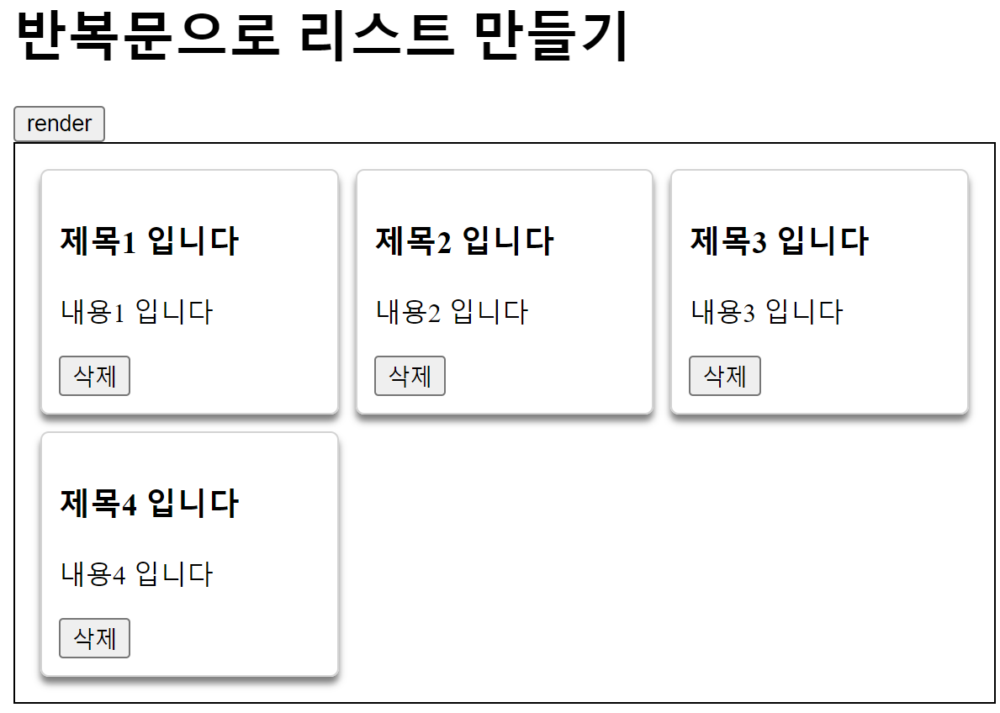

# CH11  자바스크립트

#### 소스 코드

https://github.com/codingspecialist/javascript-class

> `자바스크립트`
>
> 자바스크립트(JavaScript)는 웹 브라우저에서 동작하는 스크립트 언어 중 하나입니다. HTML, CSS와 함께 웹 프로그래밍을 할 수 있도록 고안되었으며, 다양한 용도로 사용됩니다.
>
> 자바스크립트는 클라이언트 측에서 실행되는 스크립트 언어로, 웹 페이지를 동적으로 만들고, 사용자와 상호작용하는 기능을 구현할 수 있습니다. 예를 들어, HTML 요소의 속성 값을 변경하거나, 이벤트 핸들러를 등록하여 사용자의 동작에 따라 새로운 기능을 수행하도록 할 수 있습니다. 또한, AJAX를 이용하여 서버와 비동기적으로 데이터를 주고받는 기능을 구현할 수도 있습니다.
>
> 자바스크립트는 브라우저를 제어하는 데 주로 사용되지만, Node.js와 같은 서버 측 프레임워크를 이용하여 서버 측에서도 사용될 수 있습니다. 이러한 이유로, 자바스크립트는 현재 가장 널리 사용되는 언어 중 하나이며, 다양한 분야에서 사용되고 있습니다.

- 스크립트언어 : 기생언어
  - 독자적으로 무엇인가를 할 수 없는 언어


## 1. 자바스크립트 자료형

### (1) 자료형

자바스크립트에서는 다음과 같은 기본 자료형을 제공합니다.

> 1. 숫자(Number)
>
> - 정수와 실수를 모두 표현할 수 있습니다.
>
> 2. 문자열(String)
>
> - 문자열을 표현할 수 있습니다.
>
> 3. 불리언(Boolean)
>
> - true와 false 두 가지 값 중 하나를 가집니다.
>
> 4. null
>
> - 값이 없음을 나타내는 자료형입니다.
>
> 5. undefined
>
> - 값이 할당되지 않은 상태를 나타내는 자료형입니다.
>
> 6. 객체(Object)
>
> - 다양한 형태의 데이터를 저장할 수 있는 자료형입니다.
>
> 7. 배열(Array)
>
> - 여러 개의 값을 순서대로 저장하는 자료형입니다.
>
> 8. 함수(Function)
>
> - 일련의 작업을 수행하는 코드 블록입니다.

자바스크립트는 동적 타이핑(dynamic typing)을 지원하므로, 변수를 선언할 때 데이터 타입을 명시할 필요가 없습니다. 변수에 할당되는 값에 따라 자동으로 데이터 타입이 결정됩니다.

### (2) 프로젝트 생성


### (3) 자바스크립트 자료형 실습코드

```javascript
<!DOCTYPE html>
<html lang="en">
<head>
    <meta charset="UTF-8">
    <title>Title</title>
</head>
<body>
  <script>
    let n1 = 1; 
    let n2 = 1.5;
    console.log("정수", n1); 
    console.log("실수", n2);

    let n3 = "자바스크립트 `자료형` 강좌";
    console.log("문자열", n3);

    let n4 = true;
    console.log("불리언", n4);

    let n5 = null;
    console.log("널", n5);

    let n6 = undefined; // 정의되지 않은 타입
    let n7; // 정의되지 않은 타입
    console.log("언디파인", n6);
    console.log("언디파인", n7);

    // Json : JavaScript Object Notaion
    // 자바스크립트 오브젝트
    let user = {
      id: 1,
      username: "ssar",
      password: "1234"
    };

    console.log("객체", user);
    console.log("객체", user.id);
    console.log("객체", user.username);
    console.log("객체", user.password);

    let arr = [1, 2, 3]; // 연속되게 들어가지 않는다.
    console.log("배열", arr);
    console.log("배열", arr[0]);
    console.log("배열", arr[1]);
    console.log("배열", arr[2]);

    function fun1(){
      console.log("fun1 함수");
    }
    fun1();

    // 익명함수 : 변수명이 있기 때문에, function 이름이 필요 없어서
    let fun2 = function(){ 
      console.log("fun2 함수");
    };
    fun2();

  </script>
</body>
</html>
```

실행 -> F12


라인이 위에서부터 아래로 실행될 때마다 heap에 바로 띄웁니다. 따라서 동적으로 작동합니다. 자바처럼 static, heap, stack 으로 나뉘지 않습니다.

> `선언형 언어와 인터프리터 언어의 차이점`
>
> - 인터프리터 언어 : 느림
>   - 이유 : 실행시에 사이즈를 배정하기 때문에 연산이 추가됩니다.

> `자바와 자바스크립트 차이점`
>
> - 자바는 Class로 되어있기 때문에 필요할 때 static, heap, stack 중에 올리고 싶은 곳에 올리면 된다.
> - 하지만 자바스크립트는 각 행이 실행될 때마다 모두 heap에 띄워지게 된다. 따라서 자바처럼 new 가 필요없다.

> `자바스크립트가 자바보다 느린이유`
>
> - 자바 : 자바 배열의 경우 Access가 연속적으로 되어있습니다. 따라서 다음 인덱스로 바로 찾으면 됩니다.
> - 자바스크립트 : 자바스크립트 배열의 경우 연속적으로 되어있지 않기 때문에 미리 메모리를 확보할 수 없습니다. 따라서 다음 인덱스로 이동시 찾아가는데 시간이 걸립니다.

> `1급 객체`
>
> 특징
> 1. 최상단에 위치할 수 있는 코드
> 2. 변수에 담을 수 있습니다. 
> - 자바스크립트에서의 1급 객체 : 모든 것
>   - 따라서 변수에 함수를 담을 수 있습니다.
> - 자바에서의 1급 객체 : class 
>   - 이유 : 메소드, 변수 등 모두 class 내부에 존재해야 합니다.

따라서 다음과 같은 코드가 만들어 질 수 있습니다.

```javascript
let board = {
    id: 1,
    title: "제목1",
    content: "내용1",
    user: {
        id: 1,
        username: "ssar",
        password: "1234",
        honbby: ["농구", "축구"]
    }
};
```

### (4) 호이스팅

> 호이스팅(Hoisting)은 자바스크립트에서 변수 선언과 함수 선언을 해당 스코프의 최상단으로 "끌어올리는" 동작을 말합니다. 즉, 코드 실행 전에 변수 및 함수 선언이 메모리에 먼저 올려지는 것처럼 동작합니다.

```javascript
fun1(); // 실행 가능

function fun1(){
    console.log("fun1 함수");
}

fun2(); // 실행 불가

let fun2 = function(){ // 익명함수
    console.log("fun2 함수");
};

```

- 버튼 클릭 후, 1번 라인 실행 전, function만 모두 찾음
- function을 최상단으로 끌어올려, 먼저 메모리에 할당
- 따라서 fun1()의 경우 호이스팅을 통해 실행가능
- 하지만 fun2()의 경우 함수가 아니라 변수이기 때문에 실행 불가

호이스팅을 하면 가독성이 매우 떨어집니다. 따라서 익명함수를 써서 변수로 만드는 방법을 추천합니다.

https://hanamon.kr/javascript-%ED%98%B8%EC%9D%B4%EC%8A%A4%ED%8C%85%EC%9D%B4%EB%9E%80-hoisting/

## 2. 자바스크립트 이벤트

> 자바스크립트 이벤트(JavaScript events)는 웹 페이지에서 발생하는 동작이나 사건을 나타냅니다. 이벤트는 사용자의 상호작용(마우스 클릭, 키보드 입력 등)이나 웹 페이지의 상태 변화(로딩 완료, 이미지 로딩 등)에 응답하여 실행되는 코드 블록입니다. 이벤트를 통해 웹 페이지는 동적으로 반응하고 사용자와 상호작용할 수 있습니다.

### (1) 이벤트

우리는 자바스크립트를 HTML 요소의 속성 값을 변경하거나, 이벤트 핸들러 등록, AJAX 통신으로만 사용할 것이다.

#### HTML 요소에 직접 이벤트 핸들러 등록하기(버튼 관점)

이벤트 사용시 해당 방법을 추천합니다.


```javascript
// 버튼 클릭시 이벤트 발동
// window객체 생략 가능
<button onclick="alert('Hello World!')">Click me</button>
```

이 방법은 간단하지만, 이벤트 핸들러가 HTML과 JavaScript 코드에 모두 들어가므로 유지 보수가 어려울 수 있습니다.


#### addEventListener() 메서드를 사용하여 이벤트 핸들러 등록하기(리스너 관점)


```javascript
// 버튼에 id(유일한 값)를 준다
<button id="myBtn">Click me</button>
<script>
    // document화면에 보이는 전체 영역을 의미 (window가 들고 있음)
    const myBtn = document.getElementById("myBtn"); 
    myBtn.addEventListener("click", function() {
        alert("Hello World!");
    }); 
</script>
```

이 방법은 HTML과 JavaScript 코드를 분리하여 유지 보수를 쉽게 할 수 있습니다. addEventListener() 메서드는 이벤트 이름과 이벤트 핸들러 함수를 인자로 받습니다.

> 1. `click`: 요소를 클릭할 때 발생합니다.
> 2. `dblclick`: 요소를 더블 클릭할 때 발생합니다.
> 3. `mousedown`: 요소에서 마우스 버튼이 눌릴 때 발생합니다.
> 4. `mouseup`: 요소에서 마우스 버튼이 떼어질 때 발생합니다.
> 5. `mousemove`: 요소에서 마우스가 움직일 때 발생합니다.
> 6. `mouseover`: 요소에 마우스 커서가 올라갈 때 발생합니다.
> 7. `mouseout`: 요소에서 마우스 커서가 벗어날 때 발생합니다.
> 8. `keydown`: 키보드에서 키를 누를 때 발생합니다.
> 9. `keyup`: 키보드에서 키를 뗄 때 발생합니다.
> 10. `submit`: 폼을 제출할 때 발생합니다.
> 11. `change`: 요소의 값이 변경될 때 발생합니다.
> 12. `load`: 웹 페이지나 이미지 등이 로딩되었을 때 발생합니다.

#### jQuery를 이용하여 이벤트 핸들러 등록하기

```javascript
<button id="myBtn">Click me</button>
<script src="https://code.jquery.com/jquery-3.6.0.min.js"></script>
<script>
    // # : id 찾을 때, . : class 찾을 때
    $("#myBtn").on("click", function() {
        alert("Hello World!");
    });
</script>
```

이 방법은 jQuery 라이브러리를 사용하여 간단하게 이벤트 핸들러를 등록할 수 있습니다. on() 메서드를 사용하여 이벤트 이름과 이벤트 핸들러 함수를 인자로 받습니다.

### (2) 이벤트 맛보기 실습코드

```javascript
<!DOCTYPE html>
<html lang="en">
<head>
    <meta charset="UTF-8">
    <title>Title</title>
</head>
<body>
    // 방법 1 (추천)
    <button onclick="alert('Hello World!')">Click me</button>
    <button id="myBtn">Click me</button>

    // 방법 2
    <script>
        const myBtn = document.querySelector("#myBtn");
        myBtn.addEventListener("click", function() { // 익명함수
            alert("Hello World!");
        });
    </script>

</body>
</html>
```


## 3. DOM

> DOM(Document Object Model)은 JavaScript를 사용하여 웹 페이지의 요소에 접근하고 조작하는 방법을 제공하는 인터페이스입니다. DOM은 HTML 문서를 트리 구조로 표현하며, 각각의 요소를 노드로 나타냅니다. JavaScript를 사용하여 DOM을 조작하면 웹 페이지의 요소를 동적으로 변경하거나 이벤트를 처리할 수 있습니다. DOM을 통해 요소의 속성, 스타일, 내용 등을 조작할 수 있으며, 새로운 요소를 생성하거나 기존 요소를 제거하는 등의 작업도 가능합니다. JavaScript를 사용하여 DOM을 조작하면 동적이고 상호작용적인 웹 페이지를 개발할 수 있습니다.

### (1) DOM 숨기기


#### 실습코드

```javascript
<!DOCTYPE html>
<html lang="en">
<head>
    <meta charset="UTF-8">
    <title>Title</title>
    <style>
        .box { <!-- . : Css 클래스 생성--> 
            border: 1px solid black; <!-- border : 테두리--> 
            padding: 10px; <!-- padding : 박스와 글자 간격--> 
        }
    </style>
</head>
<body>
    <h1>숨기기</h1>
    <button onclick="hideDisplay()">display로 숨기기</button>
    <button onclick="hideVisible()">visible로 숨기기</button> 
    <div class="box">
        <div class="box" id="innerBox1">
            내부박스1
        </div>
        <div class="box" id="innerBox2">
            내부박스2
        </div>
    </div>

    <script> 
        // 자바스크립트는 무조건 </body>위에 있어야 합니다. 
        function hideDisplay(){
            // querySelector : CSS 선택자를 사용할 수 있습니다. (. 점 - 클래스, # 샵 - id)
            let el = document.querySelector("#innerBox1"); 
            console.log(el);
            el.style.display = "none"; // 자바스크립트로 CSS 제어
        }
        function hideVisible(){
            let el = document.querySelector("#innerBox2");
            el.style.visibility = "hidden";
        }
    </script>
</body>
</html>
```

- visible : 숨기기 버튼 -> 공간 같이 지우기 X
- display : 숨기기 버튼 -> 공간 같이 지우기 O

> `querySelector, querySelectorAll 사용시점`
>
> - querySelector : id 찾기
> - querySelectorAll : class, element 찾기

### (2) DOM 나타내기


#### 실습코드

```html
<!DOCTYPE html>
<html lang="en">
<head>
    <meta charset="UTF-8">
    <title>Title</title>
    <style>
        .box {
            border: 1px solid black;
            padding: 10px;
        }
        #innerBox1 {
            display: none;
        }
        #innerBox2 {
            visibility: hidden;
        }
    </style>
</head>
<body>
    <h1>나타내기</h1>
    <button onclick="showByDisplay()">display로 나타내기</button>
    <button onclick="showByVisible()">visible로 나타내기</button>
    <div class="box" id="outerBox">
        <div class="box" id="innerBox1">
            내부박스1
        </div>
        <div class="box" id="innerBox2">
            내부박스2
        </div>
    </div>

    <script>
        function showByDisplay(){
            let el = document.querySelector("#innerBox1");
            el.style.display = "block";
        }
        function showByVisible(){
            let el = document.querySelector("#innerBox2");
            el.style.visibility = "visible";
        }
    </script>
</body>
</html>
```

### (3) DOM 추가하기 (중요)


#### 실습코드

```html
<!DOCTYPE html>
<html lang="en">
<head>
    <meta charset="UTF-8">
    <title>Title</title>
    <style>
        .box {
            border: 1px solid black;
            padding: 10px;
        }
    </style>
</head>
<body>
    <h1>추가하기</h1>
    <button onclick="addAppend()">append로 추가하기</button>
    <button onclick="addPrepend()">prepend로 추가하기</button>
    <button onclick="addBefore()">before로 추가하기</button>
    <button onclick="addAfter()">after로 추가하기</button>

    <div class="box" id="outerBox">
        
    </div>

    <script>
        function addAppend(){
            let newEl = document.createElement("div"); // div 생성, 객체
            newEl.setAttribute("class", "box");
            newEl.setAttribute("id", "innerBox1");
            newEl.innerHTML = "내부박스1"; // 내부에 html 넣기, innerText로 바꿔서 실행

            let el = document.querySelector("#outerBox");
            el.append(newEl);
        }
        function addPrepend(){
            let newEl = document.createElement("div");
            newEl.setAttribute("class", "box");
            newEl.setAttribute("id", "innerBox2");
            newEl.innerHTML = "내부박스2";

            let el = document.querySelector("#outerBox");
            el.prepend(newEl);
        }
        function addBefore(){
            let newEl = document.createElement("div");
            newEl.setAttribute("class", "box");
            newEl.setAttribute("id", "innerBox3");
            newEl.innerHTML = "내부박스3";

            let el = document.querySelector("#outerBox");
            el.before(newEl);
        }
        function addAfter(){
            let newEl = document.createElement("div");
            newEl.setAttribute("class", "box");
            newEl.setAttribute("id", "innerBox4");
            newEl.innerHTML = "내부박스4";

            let el = document.querySelector("#outerBox");
            el.after(newEl);
        }
    </script>
</body>
</html>
```

#### addAppend

```javascript
<div class="box" id="outerBox">
    <div>1</div>
    <div>2</div>
</div>
```

#### addPrepend

```javascript
<div class="box" id="outerBox">
    <div>2</div>
    <div>1</div>
</div>
```

#### addBefore

```javascript
<div>2</div>
<div class="box" id="outerBox">
    <div>2</div>
    <div>1</div>
</div>
```

#### addAfter

```javascript
<div class="box" id="outerBox">
    <div>1</div>
</div>
<div>2</div>
```

> `네이버 댓글 남기기`
> 
> 네이버 기사에 댓글을 남기는 경우는 addPrepend()방법을 사용해야합니다. 왜냐하면 댓글들을 감싸는 box를 찾고 댓글을 작성할 때마다 최상단에 둬야하기 때문입니다.

### (4) DOM 삭제하기


#### 실습코드

```html
<!DOCTYPE html>
<html lang="en">
<head>
    <meta charset="UTF-8">
    <title>Title</title>
    <style>
        .box {
            border: 1px solid black;
            padding: 10px;
        }
    </style>
</head>
<body>
    <h1>삭제하기</h1>
    <button onclick="del()">remove로 삭제하기</button>
    <div class="box" id="outerBox">
        <div class="box" id="innerBox1">
            내부박스1
        </div>
    </div>

    <script>
        function del(){
            let el = document.querySelector("#innerBox1");
            el.remove();
        }
    </script>
</body>
</html>
```

### (5) DOM LIST 추가하기 (렌더링)


하나하나를 Component라고 합니다. 형태는 같지만 데이터 값만 달라지고 있습니다.



#### 실습코드

```html
<!DOCTYPE html>
<html lang="en">
<head>
    <meta charset="UTF-8">
    <title>Title</title>
    <style>
        .box {
            display: grid;
            grid-template-columns: 1fr 1fr 1fr;
            border: 1px solid black;
            padding: 10px;
        }

        .card {
            border: 1px solid lightgray;
            box-shadow: 0 4px 4px 0 grey;
            padding: 10px;
            margin: 5px;
            border-radius: 5px;
        }
    </style>
</head>
<body>
    <h1>반복문으로 리스트 만들기</h1>
    <button onclick="render()">render</button>
    <div class="box" id="outerBox">

    </div>

    <script>
        function render(){
            let el = document.querySelector("#outerBox");
            for (let i = 1; i < 5; i++) {
                el.append(makeCard(i));
            }
        }

        function makeCard(id){
            let card = document.createElement("div");
            card.setAttribute("class", "card");
            card.setAttribute("id", "card-"+id);

            // 컴포넌트, ``사이에 자바스크립트 바인딩 가능
            card.innerHTML = `
                <h3>제목${id} 입니다</h3>
                <p>내용${id} 입니다</p>
                <button onclick="del(${id})">삭제</button>
            `;
            return card; // div를 만들어서 return
        }

        function del(id){
            let el = document.querySelector("#card-"+id);
            el.remove();
        }
    </script>
</body>
</html>
```

### (6) DOM Toggle 하기

 


#### 실습코드

```html
<!DOCTYPE html>
<html>
<head>
    <meta charset="UTF-8">
    <title>Title</title>
    <style>
        .like-heart {
            font-size: 24px;
            color: gray;
            cursor: pointer;
        }

        .like-heart.liked {
            color: red;
        }
    </style>
</head>
<body>

<span class="like-heart" onclick="likeToggle()">&#10084;</span>

<script>
    // https://www.htmlsymbols.xyz/heart-symbols
    // https://fontawesome.com/
    function likeToggle() {
        let likeHeart = document.querySelector('.like-heart');
        likeHeart.classList.toggle('liked');
    }
</script>

</body>
</html>
```

> `div, span`
>
> - div : 끝까지 차지하는 것
>   - display = block
>
> 
> 
> - span : 자기의 크기만큼만 display를 가지고 있는 것
>
> 


## 4. Promise (중요)

> 자바스크립트 Promise는 비동기 작업을 처리하기 위한 객체입니다. Promise는 어떤 작업의 결과를 반환하는 객체로서, 이를 통해 비동기적으로 실행되는 작업을 처리하고 그 결과를 콜백 함수 등을 이용해 처리할 수 있습니다.
>
> Promise는 총 3가지 상태를 갖습니다.
>
> 1. 대기(pending): Promise 객체가 생성되었으나 아직 처리가 진행되지 않은 상태입니다.
> 2. 이행(fulfilled): Promise 객체가 처리를 완료하여 결과를 반환한 상태입니다.
> 3. 거부(rejected): Promise 객체가 처리를 실패하였거나 오류가 발생한 상태입니다.

> 자바스크립트 엔진은 싱글 스레드로 동작하며, 이벤트 루프를 통해 비동기 작업을 처리합니다.
> 이벤트 루프는 Call Stack, Message Queue, Event Loop로 구성되어 있습니다.
> Call Stack은 현재 실행 중인 함수를 기록하는 스택입니다. 
> Message Queue는 비동기 작업이 완료되었을 때 등록되는 작업 목록입니다.
> Event Loop는 Call Stack과 Message Queue를 주시하면서 Call Stack이 비어있을 때 Message Queue에서 작업을 꺼내와 실행합니다.

> 일반적으로 자바스크립트에서 함수는 동기적으로 실행됩니다. 즉, 함수가 호출되면 해당 함수가 끝날 때까지 다른 코드는 실행되지 않습니다.
>
> 하지만, 자바스크립트에서는 비동기적인 작업을 처리할 수 있도록 `setTimeout`, `setInterval`, `fetch`, 등의 메서드와 객체를 제공합니다. 이러한 메서드와 객체를 사용하면 비동기적으로 실행되는 함수를 만들 수 있습니다.
>
> 비동기적으로 실행되는 함수는 `Task Queue`에 등록됩니다. `Task Queue`에 등록된 함수는 현재 실행 중인 함수가 끝나면 JavaScript 엔진이 순서대로 꺼내어 실행합니다. 이때, `Task Queue`에 등록된 함수는 해당 함수가 등록된 시점에서의 스코프(Scope)를 유지합니다.
>
> 따라서, 자바스크립트에서 모든 함수가 `Task Queue`에 등록되는 것은 아니며, 비동기적으로 실행되는 함수만 `Task Queue`에 등록됩니다.

> `Promise` 객체 자체는 비동기적으로 실행되지 않습니다. `Promise` 객체는 비동기 작업의 결과를 다루기 위한 JavaScript의 내장 객체입니다.
>
> `Promise` 객체는 생성될 때 즉시 실행됩니다. `Promise` 객체를 생성한 후, 비동기 작업을 수행하고 작업이 완료될 때 `resolve()`나 `reject()` 메서드를 호출하여 새로운 `Promise` 객체를 반환합니다.
>
> `Promise` 객체가 반환되면, 해당 객체는 `then()` 메서드와 `catch()` 메서드를 사용하여 비동기 작업의 결과를 처리할 수 있습니다. 이때, `then()` 메서드와 `catch()` 메서드에 등록된 콜백 함수는 비동기 작업의 결과가 처리되는 시점에서 `Task Queue`에 등록됩니다.
>
> 따라서, `Promise` 객체 자체는 비동기적으로 실행되지 않지만, `then()` 메서드와 `catch()` 메서드에 등록된 콜백 함수는 비동기적으로 실행됩니다.

### (1) 동작원리

초기 세팅(코드 실행 전)


실행을 하기전에 먼저 전체를 스캔하면서 오래걸릴 코드와 오래 걸리지 않는 코드들을 구분합니다. 오래걸리는 코드는 taskQueue에 넣고 나머지는 taskQueue에 넣습니다.

코드 실행


- 순서
  - callStack을 먼저 실행
  - callStack이 비워지면 eventLoop 이동
  - 3번 통신을 실행 후 계속 확인(리스너 처럼 행동)
  - 3번 통신 완료시, 3번을 callStack에 옮기고, 메인 스레드도 같이 이동
  - callStack 비우기
  - callStack, taskQueue가 모두 비워졌기 때문에, 다시 eventLoop에서 Event 발생할때까지 리스너 역할
    - 모든 Event는 taskQueue에 적재됩니다. 왜냐하면 해당 Event가 얼마나 오래 걸릴지 모르기 때문입니다.

### (2) Promise 동작원리


1 ~ 5번 코드 중에서 3번은 event, 4번은 event + promise

- 순서
  - 스레드가 callStack 1, 2, 4번 실행
    - 하지만 4번이 통신이 필요한 코드, 따라서 taskQueue로 이동
  - callStack 비워졌으니 eventLoop 이동
  - 3번 부터 통신 실행
  - 스레드는 리스너 역할 시작
  - 3번 통신 끝나면 callStack 이동 후, 실행
  - 4번도 마찬가지

### (3) 실습코드


```html
<!DOCTYPE html>
<html>
<head>
    <meta charset="UTF-8">
    <title>Title</title>
</head>
<body>

<button onclick="test1()">Promise1 Test</button>
<button onclick="test2()">Promise2 Test</button>
<button onclick="test3()">Promise3 Test</button>
<button onclick="test4()">Promise4 Test</button>
<script>
    function test1() {
        console.log('test1 Start'); // callStack
        new Promise(() => {
            setTimeout(() => { // 2초있다가 실행, taskQueue
                console.log("promise 처리완료");
            }, 2000);
        });
        console.log('test1 End'); // callStack
    } // test1 Start - test1 End - 2초후 promise 처리완료

    async function test2() { 
        console.log('test2 Start');
        await new Promise(() => { // await : 스레드 여기서 멈춤
            setTimeout(() => {
                console.log("promise 처리완료");
            }, 2000);
        });
        console.log('test2 End');
    } // async : await만 실행하고 function을 빠져나옴, test2 End 실행 안됨, Promise 종료시 다시 와서 내부 실행

    async function test3() {
        console.log('test3 Start');
        await new Promise((resolve) => {
            setTimeout(() => {
                console.log("promise 처리완료");
                resolve("처리 완료");
            }, 2000);
        });
        console.log('test3 End');
    }

    async function test4() {
        console.log('test4 Start');
        await new Promise((resolve, reject) => {
            setTimeout(() => {
                console.log("promise 처리완료");
                reject("처리 실패");
            }, 2000);
        });
        console.log('test4 End');
    }
</script>
</body>
</html>
```

> `await를 사용하는 이유`
> 
> 해당 부분만 동기적으로 사용하기 위해서, 캡처링 기법으로 await가 있으면 function을 나가기 직전에 복제를 해놓고, 나중에 다시 돌아와서 await가 있던 부분부터 시작을 합니다.

> `비동기 속도`
>
> 단일 스레드가 멀티 스레드보나 매우 빠릅니다. 왜냐하면 컨텍스트 스위칭이 없기 때문입니다.

## 5. Promise Callback

> Promise Callback은 JavaScript에서 비동기 작업을 다룰 때 사용되는 개념입니다. Promise 객체를 사용하여 비동기 작업의 결과를 나타내고, 이후에 처리해야 할 작업을 콜백 함수로 등록합니다. Promise Callback은 비동기 작업이 완료되었을 때 또는 실패했을 때 해당 작업을 처리하는 함수입니다. 이를 통해 비동기 코드의 흐름을 제어하고, 작업이 완료되거나 실패한 후에 필요한 후속 작업을 수행할 수 있습니다.

> Promise가 실행된 뒤, 거부 당하거나, 성공했을 때의 콜백 메서드 만들어보기


### (1) 실습코드

```html
<!DOCTYPE html>
<html>
<head>
    <meta charset="UTF-8">
    <title>Title</title>
</head>
<body>

<button onclick="runAsyncTask()">Promise Callback Test</button>
<script>
    function doAsyncTask() {
        return new Promise(function(resolve, reject) {
            setTimeout(function() {
                let success = false;
                if (success) {
                    resolve('Async task completed successfully.');
                } else {
                    reject('Async task failed.');
                }
            }, 1000);
        });
    }

    async function runAsyncTask() {
        console.log("test start");
        try {
            const result = await doAsyncTask();
            console.log(result);
        } catch (error) {
            console.error(error);
        }
        console.log("test end");
    }
</script>
</body>
</html>
```

## 6. Ajax Fetch

> AJAX는 "Asynchronous JavaScript and XML"의 약자로, 자바스크립트를 사용하여 비동기적으로 서버와 데이터를 주고받는 기술입니다.
>
> 기존에는 웹 페이지에서 사용자 입력을 받고, 서버로 데이터를 전송하여 새로운 페이지를 받아와서 보여주는 방식이었습니다. 이러한 방식은 화면이 깜빡이는 등의 불편한 경험을 제공하며, 데이터의 양이 많아지면 더욱 느려질 수 있습니다.
>
> AJAX는 이러한 문제점을 개선하기 위해, 웹 페이지에서 동적으로 데이터를 가져오거나 업데이트하는 기술입니다. AJAX를 사용하면, 서버와 비동기적으로 데이터를 주고받아 필요한 부분만 화면을 갱신할 수 있으며, 화면 전환이 발생하지 않아 사용자가 불편한 경험을 하지 않습니다.
>
> AJAX는 자바스크립트를 사용하여 서버에 요청을 보내고, 이에 대한 응답을 처리합니다. 이를 위해 `XMLHttpRequest` 객체를 사용하여 서버와 통신합니다. 최근에는 `fetch` API를 사용하는 방법이 많이 사용되고 있습니다.
>
> AJAX를 사용하면 사용자 경험이 개선되고, 서버의 부하가 감소하여 웹 애플리케이션의 성능을 개선할 수 있습니다.

> 그림 설명 필요 (CSR과 SSR 차이) 누락


### (1) 실습코드

```html
<!DOCTYPE html>
<html>
<head>
    <meta charset="UTF-8">
    <title>Title</title>
</head>
<body>

<button onclick="fetchTodo()">통신하기</button>
<script>
    // https://jsonplaceholder.typicode.com
    // async -> 비동기함수가 되기 위한 키워드
    // await -> Promise가 처리될 때까지 기다리는 키워드
    async function fetchTodo() {
        try {
            let promiseData = await fetch("https://jsonplaceholder.typicode.com/todos/1");
            let todos = await promiseData.json();
            console.log(todos);
        } catch (err) {
            console.log(err);
        }
    }
</script>
</body>
</html>
```

## 7. AJAX Fetch Render

> AJAX Fetch Render는 웹 개발에서 사용되는 기술로, 클라이언트와 서버 간의 비동기 통신을 통해 데이터를 가져오고 동적으로 콘텐츠를 업데이트하는 방식입니다. 클라이언트는 JavaScript의 Fetch API를 사용하여 서버로 데이터 요청을 보내고, 서버는 요청을 처리하고 필요한 데이터를 응답으로 전송합니다. 클라이언트는 이 응답을 받아와서 동적으로 웹 페이지의 내용을 갱신하거나 새로운 콘텐츠를 생성하여 사용자에게 보여줍니다. 이를 통해 웹 페이지의 일부분만 업데이트하거나 로딩 시간을 줄일 수 있습니다.

https://jsonplaceholder.typicode.com/


### (1) 실습코드

```html
<!DOCTYPE html>
<html>
<head>
    <meta charset="UTF-8">
    <title>Title</title>
    <style>
        .box {
            border: 1px solid black;
            padding: 10px;
        }
    </style>
</head>
<body>
<input type="text" id="num" rrr="100" value="1"/> <button onclick="fetchTodo()">통신하기</button>
<div class="box" id="box">

</div>
<script>
    async function fetchTodo() {
        let el = document.querySelector("#num");
        let id = el.value;
        let rrr = el.getAttribute("rrr");
        console.log("기본속성이 아니면 getAttribute()", rrr);
        try {
            let promiseData = await fetch("https://jsonplaceholder.typicode.com/todos/"+id); // fetchTodo 탈출
            let todo = await promiseData.json();
            render(todo);
        } catch (err) {
            console.log(err);
        }
    }

    function render(todo){
        let le = document.querySelector("#box");
        le.innerHTML = todo.title;
    }
</script>
</body>
</html>
```

## 8. ToDoList 만들어보기

> 디자인은 참고로 ChatGpt 사용함


### (1) 실습코드

```html
<!DOCTYPE html>
<html>
<head>
    <meta charset="UTF-8">
    <title>To-Do List</title>
    <link rel="stylesheet" href="/css/style.css">
</head>
<body>
<div class="container">
    <h1>To-Do List</h1>
    <button onclick="todoAllFetch()">todo 가져오기</button>
    <ul class="todo-list" id="todoBox">

    </ul>
</div>
<script>
    async function todoAllFetch() {
        let promiseData = await fetch("https://jsonplaceholder.typicode.com/todos");
        let todos = await promiseData.json();
        render(todos);
    }

    function render(todos) {
        let el = document.querySelector("#todoBox");
        for (const todo of todos) {
            let newEl = document.createElement("li");
            newEl.innerHTML = `
                <input type="checkbox" id="todo-${todo.id}" style="text-decoration: none">
                <label for="todo-1">${todo.title}</label>
            `;
            el.append(newEl);
        }
        addCheckBoxEvent();
    }

    function addCheckBoxEvent(){
        const checkboxes = document.querySelectorAll('input[type="checkbox"]');
        checkboxes.forEach((checkbox) => {
            checkbox.addEventListener('click', () => {
                if (checkbox.checked) {
                    checkbox.nextElementSibling.style.textDecoration = 'line-through';
                } else {
                    checkbox.nextElementSibling.style.textDecoration = 'none';
                }
            });
        });
    }

</script>
</body>
</html>
```

```css
.container {
    width: 400px;
    margin: 0 auto;
    text-align: center;
    font-family: Arial, sans-serif;
}

h1 {
    font-size: 2rem;
    margin: 0;
    padding: 20px 0;
    color: #444;
}

ul {
    list-style: none;
    padding: 0;
    margin: 0;
}

li {
    border-bottom: 1px solid #ddd;
    padding: 10px;
    font-size: 16px;
    display: flex;
    align-items: center;
}

li:last-child {
    border-bottom: none;
}

label {
    margin-left: 10px;
}

input[type="checkbox"] {
    margin: 0;
    transform: scale(1.5);
    margin-right: 10px;
}
```


## 9. 마인드 맵

