# CH12 스프링부트 컨트롤러 기본 - 요청

### 소스코드

https://github.com/codingspecialist/Springboot-Controller

## 1. 스프링 컨트롤러 요청 방식 4가지
> 스프링부트 컨트롤러는 웹 애플리케이션의 엔드포인트(최종주소)를 처리하는 데 사용되는 핵심 구성 요소입니다. 컨트롤러는 클라이언트로부터 요청을 수신하고, 적절한 로직을 수행한 후 응답을 반환합니다. (스프링 컨트롤러의 책임, SOLID의 단일 책임의 원칙 SRP)
>
> 스프링부트 컨트롤러는 일반적으로 `@RestController` 또는 `@Controller` 어노테이션을 사용하여 정의됩니다. `@RestController` 어노테이션을 사용하면 각 메서드가 `@ResponseBody` 어노테이션과 함께 작동하여 HTTP 응답의 본문에 직접 데이터를 씁니다. 반면에 `@Controller` 어노테이션을 사용하는 경우 메서드는 뷰를 반환하거나, 다른 메서드로 리디렉션을 수행할 수 있습니다.
>
> 컨트롤러의 메서드는 대개 HTTP 요청 메서드와 연결됩니다. 예를 들어, `GET` 요청을 처리하려면 `@GetMapping` 어노테이션을 사용합니다. 이와 같은 어노테이션을 사용하면 요청 경로와 매핑되는 메서드를 지정할 수 있습니다.

- 스프링 컨트롤러 요청 방식 4가지
  - GET
  - POST
  - PUT
  - DELETE

- Controller 종류
  - RestController: Data 응답
    - 최근 가장 많이 사용
    - RESTful
  - Controller: View 응답

### (1) 프로젝트 생성 및 세팅

JDK 버전 11일 경우 3.0.X 버전을 선택할 수 없습니다. 해당 버전은 JDK 17부터 지원합니다.

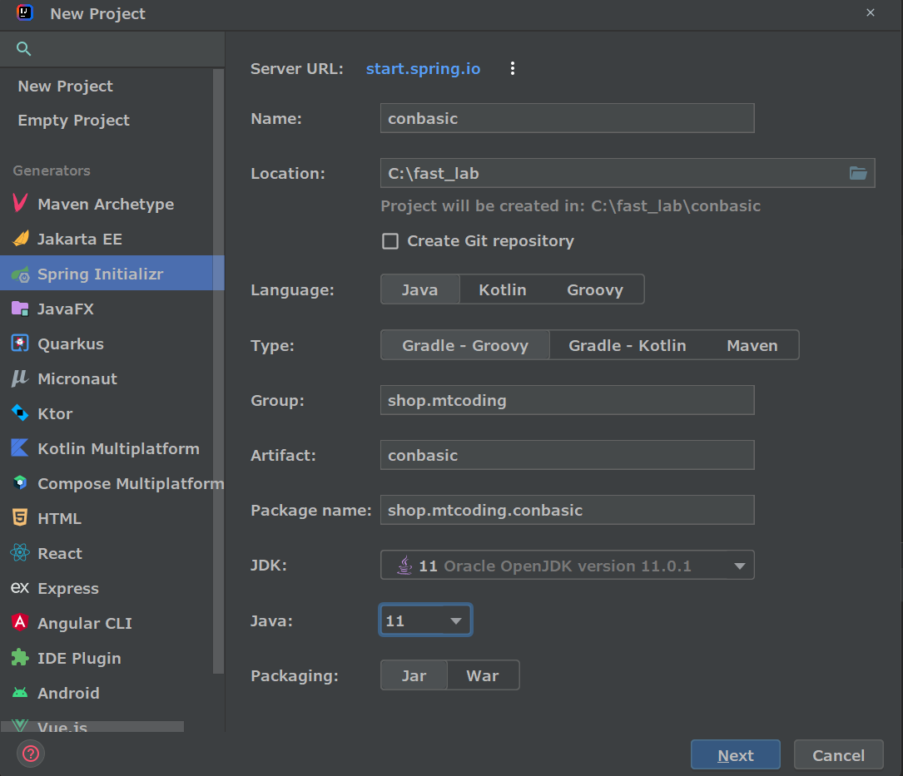

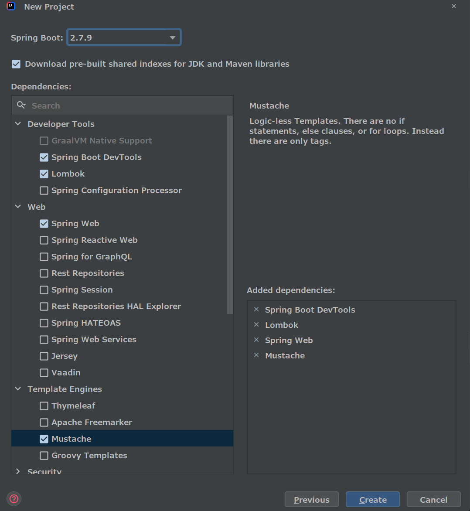

#### Dependencies

- Spring Boot DevTools
  - 자동 컴파일 후 배포(리로드)
- Lombok
- Spring Web
  - DispatcherServlet 자동생성
- Mustache
  - template engine

#### 실행시 콘솔창

서버를 실행한 뒤 확인


```
- Starting ConbasicApplication using Java 11.0.1 on getinthere with PID 21020 
(실행 중인 프로세스 번호)

- No active profile set, falling back to 1 default profile: "default" 
(현재 프로파일이 설정되어 있지 않다. 프로파일을 설정하자)

- Devtools property defaults active! Set 'spring.devtools.add-properties' to 'false' to disable 
(Devtools 작동)

- For additional web related logging consider setting the 'logging.level.web' property to 'DEBUG'

- Tomcat initialized with port(s): 8080 (http)
Starting service [Tomcat] 
(톰캣 초기화, 내장톰켓, dev모드)

- Starting Servlet engine: [Apache Tomcat/9.0.71]

- Initializing Spring embedded WebApplicationContext 

- Root WebApplicationContext: initialization completed in 586 ms 
(DispatcherServlet 생성, Component scan)

- LiveReload server is running on port 35729 
(저장 순간 자동 컴파일, 리스너, 서버 리로드)

-Tomcat started on port(s): 8080 (http) with context path '' 
(컨텍스트 패스)

- Started ConbasicApplication in 1.04 seconds (JVM running for 1.772) 
(JVM 실행 완료)
```

#### Resources 수정

스프링부트에 yaml확장자는 없습니다. 따라서 .html파일을 만들고 이름을 .yml로 바꿔줍니다.

- yaml 문법
  - https://www.redhat.com/ko/topics/automation/what-is-yaml

- application.yml

```yml
spring:
  profiles:
    active: dev

server:
  servlet:
    encoding:
      charset: UTF-8
      force: true
      enabled: true
```

- application-dev.yml
  - 개발

```yml
server:
  port: 8080
```

- application-prod.yml
  - 배포

```yml
server:
  port: 8000
```

resource 변경 후 재실행

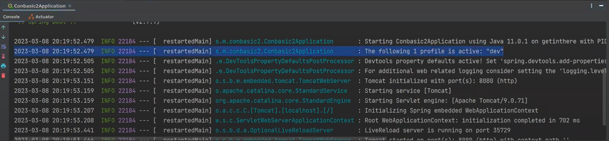

> `Component Scan`
> - 본인 artifact 이하만 적용(프로젝트 실행 순간, heap에 띄움)
> - shop.mtcoding.conbasic (artifact)

### (2) GET 요청

> HTTP GET 메서드는 HTTP 프로토콜을 사용하여 서버에서 클라이언트로 정보를 보내는 방법 중 하나입니다. GET 메서드는 서버로부터 데이터를 요청하고, 응답으로 받은 데이터를 클라이언트에게 전송합니다.
>
> GET 메서드는 URL에서 쿼리 매개 변수(query parameter)를 사용하여 요청하는 데이터를 전달합니다. 예를 들어, `https://example.com/search?q=keyword`와 같은 URL에서 `q` 매개 변수에 `keyword` 값을 전달하고 있습니다. GET 메서드를 사용하여 데이터를 요청할 때, `요청 헤더와 요청 본문을 사용하지 않습니다.`
>
> GET 메서드는 보통 웹 브라우저에서 링크를 클릭하거나 URL을 직접 입력하여 페이지를 요청할 때 사용됩니다. 또한 RESTful API에서 자원을 조회할 때도 사용됩니다.

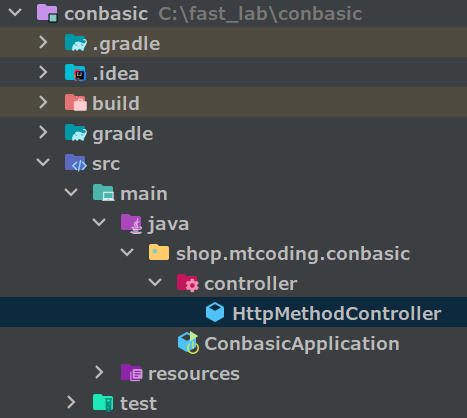

- controller/HttpMethodController.java

```java
package shop.mtcoding.conbasic.controller;

import org.springframework.web.bind.annotation.GetMapping;
import org.springframework.web.bind.annotation.RestController;

@RestController
public class HttpMethodController {

    @GetMapping("/req/get")
    public String methodGet(){
        return "<h1>get 요청</h1>";
    }
}
```

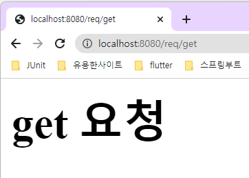

> `Initializing Spring embedded WebApplicationContext`
> 
> Spring에서 Embedded WebApplicationContext를 초기화하는 동안 다음과 같은 일이 발생합니다.
> 
> 1. Spring의 DispatcherServlet이 등록됩니다. DispatcherServlet은 요청을 처리하고, 컨트롤러와 뷰를 연결하는 Spring의 핵심 웹 컴포넌트입니다.
> 2. 웹 애플리케이션 컨텍스트에 서블릿이 등록됩니다. 서블릿이 등록되면 HTTP 요청을 처리할 수 있게 됩니다.
> 
> Embedded WebApplicationContext를 초기화하는 과정은 Spring 애플리케이션의 웹 계층을 구성하는 데 필요한 모든 구성 요소를 생성하고 등록하는 작업입니다. 이 과정이 완료되면 애플리케이션은 HTTP 요청을 처리할 준비가 된 상태가 됩니다.

> `DevTools 작동방법 (for 인텔리J)`
> 
> 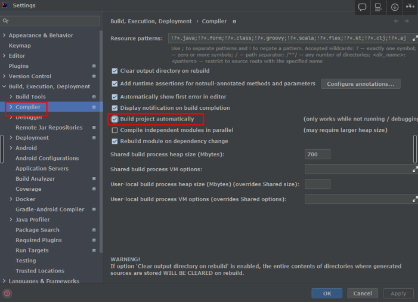
> 
> 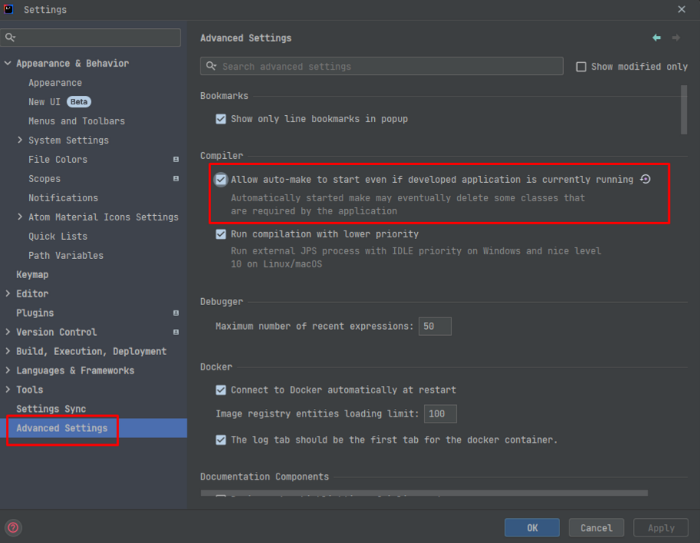

> `@RestController`
> - @RestController 어노테이션이 적용된 클래스는 HTTP 요청을 처리하는 메서드의 결과를 HTTP 응답 본문(response body)으로 직접 반환할 수 있습니다.

### (3) POST 요청

> HTTP POST 메서드는 HTTP 프로토콜을 사용하여 서버에 데이터를 제출하는 방법 중 하나입니다. POST 메서드는 클라이언트에서 서버로 데이터를 전송하며, 보안적인 이유로 GET 메서드보다 더 많은 데이터를 전송할 수 있습니다.
>
> `POST 메서드는 HTTP 요청 본문(request body)에 데이터를 포함시켜 전송합니다.` 요청 본문은 텍스트, JSON, XML, 바이너리 데이터 등 다양한 형식으로 전송할 수 있습니다.
>
> POST 메서드를 사용하여 데이터를 전송할 때, 클라이언트는 서버에 요청하는 데이터를 명시적으로 지정해야 합니다. 이를 위해 보통 HTML `<form>` 요소에서 `method="POST"` 속성을 사용하거나, JavaScript를 사용하여 XMLHttpRequest 객체를 생성하여 데이터를 전송합니다.

```java
@PostMapping("/req/post")
public String methodPost(){
    return "<h1>post 요청</h1>";
}
```

POST, PUT, DELETE 요청은 브라우저에서 URL을 입력하여 테스트할 수없고, PostMan과 같은 도구를 사용하여 테스트해야 합니다.

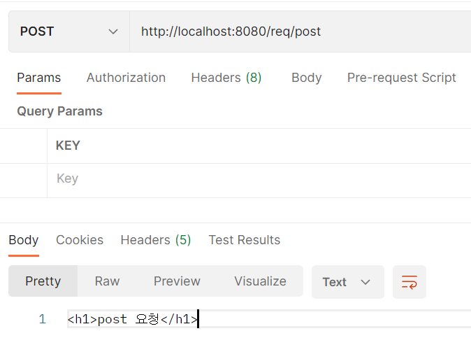

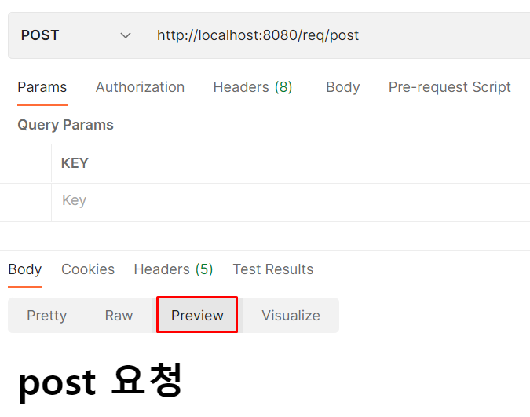

> `Content-Type 바꿀수 있나?`
>
> - Content-Type: text/plain
>
> 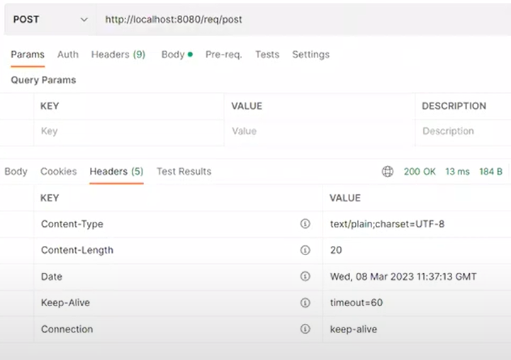
> 
> ```java
> @PostMapping("/req/post")
> public String methodPost(HttpServletResponse response){
>     response.setContentType("text/html; charset=utf-8");
>     return "<h1>post 요청</h1>";
> }
> ```
> 
> 
> 
> 아무것도 바뀌지 않는다. 이로써 알 수 있는 것은 DispatcherServlet에 기본세팅이 text/plain이라고 생각할 수 있다.

### (4) PUT 요청

> HTTP PUT 메서드는 HTTP 프로토콜을 사용하여 서버에 자원을 생성하거나 업데이트하는 방법 중 하나입니다. PUT 메서드는 서버에서 클라이언트로 데이터를 전송하지 않으며, 요청 본문(request body)에 클라이언트에서 보낸 데이터를 포함시켜 전송합니다.
>
> PUT 메서드를 사용하여 자원을 생성하거나 업데이트할 때는 클라이언트에서 생성하거나 업데이트할 자원의 식별자(identifier)를 요청 URL에 명시해야 합니다. PUT 메서드는 요청한 자원이 이미 존재하면 업데이트하고, 없으면 새로 생성합니다.
>
> RESTful API에서 PUT 메서드는 자원의 전체 업데이트에 사용됩니다. 만약 부분적인 업데이트가 필요하다면, PATCH 메서드를 사용합니다.
>
> PUT을 통해 모든 종류의 업데이트를 해도 됩니다. 굳이 PATCH를 통해 부분적 업데이트를 하지 않아도 됩니다.

```java
@PutMapping("/req/put")
public String methodPut(){
    return "<h1>put 요청</h1>";
}
```

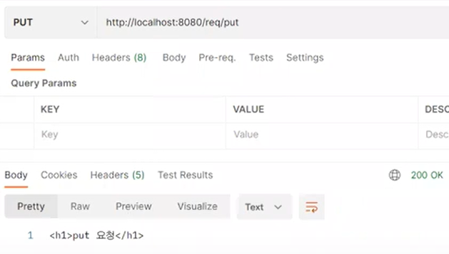

### (5) DELETE 요청

> HTTP DELETE 메서드는 HTTP 프로토콜을 사용하여 서버에서 자원을 삭제하는 방법 중 하나입니다. DELETE 메서드는 클라이언트에서 서버로 요청을 보내면, 서버에서 해당 자원을 삭제하고 성공적으로 삭제되었다는 응답을 보냅니다.
>
> DELETE 메서드를 사용하여 자원을 삭제할 때는 요청 URL에 삭제할 자원의 식별자(identifier)를 명시해야 합니다. 이 식별자는 URL의 일부 또는 요청 본문(request body)에 포함시킬 수 있습니다.
>
> RESTful API에서 DELETE 메서드는 자원을 삭제하기 위해 사용됩니다. 예를 들어, 사용자 계정을 삭제하는 API에서 DELETE 메서드를 사용할 수 있습니다.

```java
@DeleteMapping("/req/delete")
public String methodDelete(){
    return "<h1>delete 요청</h1>";
}
```

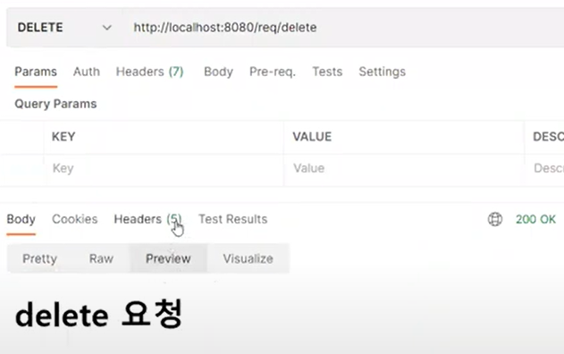

> `Http 잘못된 요청 405`
>
> 참고: https://developer.mozilla.org/ko/docs/Web/HTTP/Status
>
> 
>
> delete 요청을 할 때, Http Method가 PUT이라면 아래와 같은 오류를 응답 받습니다.
>
> ```
> {
>   "timestamp": "2023-03-05T03:30:37.958+00:00",
>   "status": 405,
>   "error": "Method Not Allowed",
>   "trace": "org.springframework.web.HttpRequestMethodNotSupportedException: Request method 'PUT' not supported"
> }
> ```
> timestamp는 응답된 시간입니다.
> status는 전 세계적으로 공통으로 사용하는 Http 상태코드입니다.
> 
> 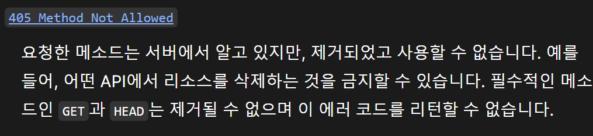
> 
> 즉, 405는 잘못된 Http 메서드로 요청을 했다는 뜻입니다.

## 2. 스프링 컨트롤러 데이터 전달 방식

> Spring 컨트롤러에 데이터를 전달하는 방법에는 여러 가지가 있습니다. 그 중에서도 가장 일반적인 방법은 다음과 같습니다. 아래는 예시입니다.
>
> 1. `@RequestParam` 어노테이션을 사용하여 요청 매개 변수를 전달하는 방법
> 
> ```java
> @GetMapping("/example")
> public String example(@RequestParam("id") String id) {
>     // 요청 매개 변수로 전달된 데이터를 사용하는 코드
>     return "example";
> }
>```
>
> 2. `@PathVariable` 어노테이션을 사용하여 URL 경로 변수를 전달하는 방법
> 
> ```java
> @GetMapping("/example/{id}")
> public String example(@PathVariable("id") String id) {
>     // URL 경로 변수로 전달된 데이터를 사용하는 코드
>     return "example";
> }
> ```
>
> 3. 요청 본문(request body)에 데이터를 전달하는 방법
>
> ```java
> @PostMapping("/example")
> public String example(@RequestBody ExampleDto exampleDto) {
>     // 요청 본문에 전달된 데이터를 사용하는 코드
>     return "example";
> }
> ```
>
> 4. `HttpServletRequest` 객체를 사용하여 요청 정보를 전달하는 방법
>
> ```java
> @GetMapping("/example")
> public String example(HttpServletRequest request) {
>     // HttpServletRequest 객체를 사용하여 요청 정보를 사용하는 코드
>     return "example";
> }
> ```

### (1) QueryString

http body로 전달되는 x-www-form-urlencoded 값이나, http url로 전달되는 쿼리스트링 값을 받을 수 있습니다.

- controller/HttpQueryController.java

```java
package shop.mtcoding.conbasic.controller;

import org.springframework.web.bind.annotation.GetMapping;
import org.springframework.web.bind.annotation.RequestParam;
import org.springframework.web.bind.annotation.RestController;

/**
 * ?keyword=ssar: QueryString
 * keyword=ssar: x-www-form-urlencoded
 *
 * QueryString: x-www-form-urlencoded (주소에 붙는다)
 * RequestParam: MVC 패턴에서의 requestGetParameter() X / value 값 보고 파싱
 */
@RestController
public class HttpQueryController {

    @GetMapping("/data/query/v1")
    public String queryV1(@RequestParam("keyword") String keyword){
        return "받은 값 : "+keyword;
    }

    @GetMapping("/data/query/v2")
    public String queryV2(@RequestParam(value = "keyword", required = false) String keyword){
        return "받은 값 : "+keyword;
    }

    @GetMapping("/data/query/v3")
    public String queryV3(@RequestParam(value = "keyword", required = false, defaultValue = "cos") String keyword){
        return "받은 값 : "+keyword;
    }

    @GetMapping("/data/query/v4")
    public String queryV4(String keyword){
        return "받은 값 : "+keyword;
    }

    @GetMapping("/data/query/v5")
    public String queryV5(String keyword, String type){
        return "받은 값 : "+keyword+", "+type;
    }
}
```

#### /data/query/v1

- http://localhost:8080/data/query/v1
  - @RequestParam 없는 경우 400 에러발생

```
There was an unexpected error (type=Bad Request, status=400).
   
Required request parameter 'keyword' for method parameter type String is not present
   
org.springframework.web.bind.MissingServletRequestParameterException: Required request parameter 'keyword' for method parameter type String is not present at 
```

왜냐하면 QueryString이 전달되지 않았기 때문입니다.

- http://localhost:8080/data/query/v1?keyword=ssar

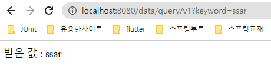

#### /data/query/v2

- http://localhost:8080/data/query/v2
- 이번에는 오류가 나지 않습니다. 그 이유는 required = false 속성을 통해 null을 허용할 수 있기 때문입니다.
- 이로써 알 수 있는 것은 required = true 가 default 라는 것입니다.

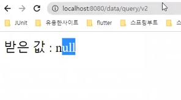

#### /data/query/v3

- http://localhost:8080/data/query/v3
- 이번에는 받은 값 : cos 가 응답됩니다. 그 이유는 defaultValue = "cos" 속성을 통해 기본값을 할당했기 때문입니다. 
- defaultValue에는 String 타입의 문자열만 할당할 수 있습니다.

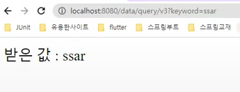

#### /data/query/v4

- http://localhost:8080/data/query/v4?keyword=ssar
- @RequestParam 어노테이션은 생략 가능합니다.

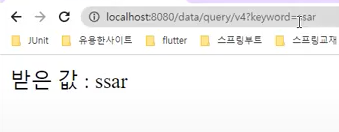

#### /data/query/v5	
   
- http://localhost:8080/data/query/v5?keyword=ssar&type=title
- QueryString은 &로 여러개의 데이터를 구분해서 전달할 수 있습니다.

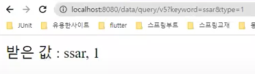

> `RequestParam 사용 시점`
> - defaultValue 주고 싶은 경우: @RequestParam 사용 O
> - defaultValue 주고 싶지 않은 경우: @RequestParam 사용 X
> - 페이징하는 경우

> `defaultValue가 String만 되는 이유`
> - 모든 데이터는 String으로 넘어오기 때문에

> `?keyword=ssar 과 keyword=ssar의 차이`
> - ?keyword=ssar: 주소에 붙는 QueryString
> - keyword=ssar: Http body에 붙는 x-www-form-urlencoded

### (2) PathVariable

어노테이션을 사용하여 URL 경로 변수를 전달하는 방법입니다.

- controller/PathController.java

```java
package shop.mtcoding.conbasic.controller;

import org.springframework.web.bind.annotation.GetMapping;
import org.springframework.web.bind.annotation.PathVariable;
import org.springframework.web.bind.annotation.RestController;

@RestController
public class HttpPathController {

    @GetMapping("/data/path/v1/{id}")
    public String pathV1(@PathVariable("id") int id){
        return "받은 값 : "+id;
    }
}
```

- http://localhost:8080/data/path/v1/99

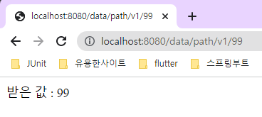

> `QueryString, PathVariable 사용 시점`
> - QueryString: Primary Key X
> - PathVariable: Primary Key O
> - WHERE 절에 줄 데이터 = 구체적인 요청을 하는 데이터
> ```
> QueryString:
> SELECT * FROM user WHERE email = 'ssar@gmail.com';
> -> http://localhost:8080/user?email=ssar@gmail.com
>
> PathVariable:
> SELECT * FROM user WHERE id = 1;
> -> http://localhost:8080/user/1
> ```


### (3) HttpBody

http로 전달되는 body 데이터를 받을 수 있습니다. 스프링부트에서 body값의 MIME 타입 기본값은 정해져 있습니다. x-www-form-urlencoded 입니다.

#### x-www-form-urlencoded

> `x-www-form-urlencoded`는 HTML 폼(form)에서 데이터를 서버로 전송하기 위해 사용되는 인코딩 방식 중 하나입니다. 이 방식은 각각의 이름과 값 쌍을 구분자(delimiter)로 구분하여 인코딩하며, 구분자는 일반적으로 `&` 기호를 사용합니다.
>
> 예를 들어, 다음과 같은 폼이 있다고 가정해보겠습니다.
>
> ```
> <form action="/example" method="post">
>   <input type="text" id="name" name="name"><br><br>
>   <input type="email" id="email" name="email"><br><br>
>   <input type="submit" value="Submit">
> </form>
> ```
>
> 위 폼에서 사용자가 `name`과 `email` 필드에 데이터를 입력하고 제출(submit) 버튼을 누르면, 서버로는 다음과 같은 `x-www-form-urlencoded` 형식의 데이터가 전송됩니다.
>
> ```
> name=John+Doe&email=johndoe%40example.com
> ```
>
> 위 데이터에서 `name`과 `email`은 각각의 이름, `=`는 이름과 값의 구분자, `&`는 각각의 이름-값 쌍을 구분하는 구분자입니다. 값이 문자열인 경우, 공백은 `+`로, 특수문자는 URL 인코딩을 적용하여 `%`로 시작하는 16진수로 인코딩됩니다.
>
> `x-www-form-urlencoded`는 HTML 폼에서 데이터를 서버로 전송하는 가장 일반적인 방식 중 하나입니다. 이 방식은 간단하고 쉽게 구현할 수 있어서, 많은 웹 프로그래밍 언어와 프레임워크에서 지원하고 있습니다.

- controller/HttpBodyController.java

```java
package shop.mtcoding.conbasic.controller;

import org.springframework.web.bind.annotation.PostMapping;
import org.springframework.web.bind.annotation.RequestParam;
import org.springframework.web.bind.annotation.RestController;

@RestController
public class HttpBodyController {

    @PostMapping("/data/body/v1")
    public String bodyV1(@RequestParam("title") String title){
        return "받은 값 : "+title;
    }

    @PostMapping("/data/body/v2")
    public String bodyV2(@RequestParam("title") String title, @RequestParam("content") String content){
        return "받은 값 : "+title+", "+content;
    }
}
```

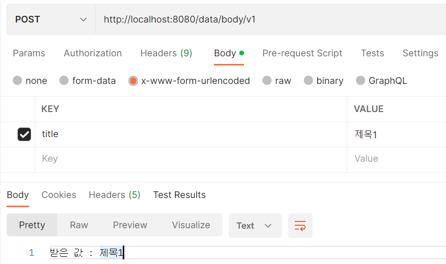

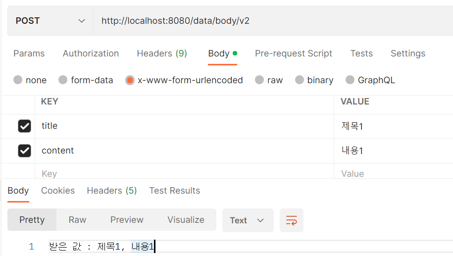

> `API 문서에 명시 해주자`
>
> -> 스프링이 2개다(QueryString, Body) 지원을 하기 때문에 어떤 형식으로 데이터를 POST 할지 알려줘야합니다. 따라서 API 문서에 명시되어야 합니다.
> 
> host = localhost:8080
> endpoint = /data/body/v1
> method = POST
> 
> 1. Body = x-www-form-urlencoded = title (String) 
> 2. QueryString = title

#### Json

> JSON(JavaScript Object Notation)은 경량 데이터 교환 형식으로, 인터넷에서 자료를 주고받을 때 많이 사용됩니다. JSON은 자바스크립트에서 객체를 생성하는 데 사용되는 문법을 기반으로 하고 있으며, 텍스트 기반의 데이터 교환 형식입니다.
>
> JSON 데이터는 "키-값" 쌍으로 구성된 객체(object)와 배열(array)의 순서화된 집합으로 구성됩니다. 이러한 구조는 자바스크립트 객체와 배열과 매우 유사합니다. 예를 들어, 다음과 같은 JSON 객체가 있다고 가정해보겠습니다.
>
> ```
> {
>   "name": "John Doe",
>   "age": 30,
>   "email": "johndoe@example.com"
> }
> ```
>
> 위 JSON 객체는 `name`, `age`, `email`의 세 개의 키-값 쌍으로 구성되어 있습니다. 이러한 JSON 객체는 많은 프로그래밍 언어와 프레임워크에서 지원되므로, 서로 다른 플랫폼과 시스템 간에 데이터를 교환하는 데 매우 유용합니다.
>
> JSON은 다른 데이터 교환 형식과 비교하여 경량이며, 가독성이 높고 쉽게 이해할 수 있어서, 대부분의 웹 애플리케이션에서 사용되는 표준 데이터 교환 형식 중 하나입니다.

- dto/BoardReqDto.java

```java
package shop.mtcoding.conbasic.dto;

import lombok.Getter;
import lombok.Setter;

@Setter
@Getter
public class BoardReqDto {

    private String title;
    private String content;
}
```

스프링부트에서 Json 데이터를 받기 위해서는 @RequestBody 어노테이션과 해당 데이터를 받을 그릇, 즉 DTO 클래스가 필요합니다.

> 요청 DTO(Data Transfer Object)는 클라이언트에서 서버로 전달되는 데이터를 저장하는 객체입니다. DTO는 일반적으로 데이터베이스 엔티티와 관련된 필드와 매우 유사한 필드를 가지고 있으며, 클라이언트에서 서버로 전송되는 데이터의 일부 또는 전체를 저장합니다.
>
> 요청 DTO는 일반적으로 HTTP 요청 본문(request body)에서 전송되는 JSON, XML 또는 폼 데이터 등의 형식으로 전달됩니다. 컨트롤러에서 요청 DTO를 인자로 받아 필요한 작업을 수행하고, 응답을 반환하는 방식으로 동작합니다.
>
> 예를 들어, 다음과 같은 요청 DTO가 있다고 가정해보겠습니다.
>
> ```java
> public class ExampleDto {
>    
>     private Long id;
>     private String name;
>     private String email;
> 
>     // Getter and Setter methods
> }
> ```
>
> 위 요청 DTO는 `id`, `name`, `email` 필드를 가지고 있으며, 클라이언트에서 서버로 전달되는 데이터를 저장하는 데 사용됩니다.
>
> 요청 DTO를 사용하면 클라이언트에서 서버로 전달되는 데이터를 간편하게 관리할 수 있습니다. DTO는 데이터베이스 엔티티와 분리되어 있기 때문에, 컨트롤러와 서비스 레이어에서 엔티티와 DTO 간의 변환을 수행할 수 있습니다. 이를 통해 엔티티와 DTO 간의 의존성을 낮출 수 있으며, 애플리케이션의 유지 보수성과 확장성을 향상시킬 수 있습니다.

- controller/HttpBodyController.java

```java
@PostMapping("/data/body/v3")
public String bodyV3(@RequestBody BoardReqDto boardReqDto){
    // 기본 스프링 전략: x-www-form-urlencoded
    return "받은 값 : "+boardReqDto.getTitle()+", "+boardReqDto.getContent();
}
```

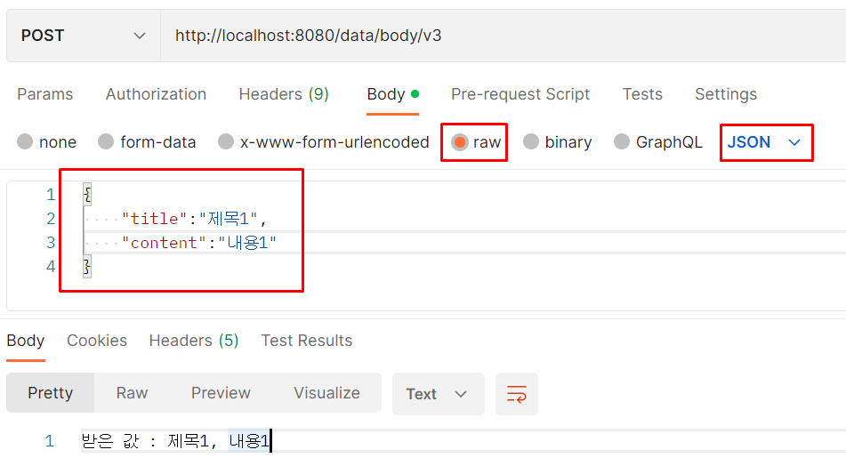

> `Json 형태가 아닌 x-www-form-urlencoded 방법으로 전송해보자!`
>
> 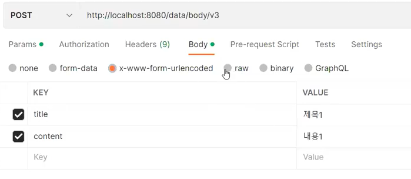

> `/data/body/v3를 기존 HttpServletRequest 방법으로 한다면?`
> 
> ```java
> @PostMapping("/data/body/v3")
> public String bodyV3(HttpServletRequest request) throws  IOException{
>     BufferedReader br = new BufferedReader();
>     String body = br.readline();
> 
>     Gson gson = new Gson();
>     BoardReqDto boardReqDto = gson.fromJson(body, BoardReqDto.class);
> 
>     return "받은 값 : "+boardReqDto.getTitle()+", "+boardReqDto.getContent();
> }
> ```

> `@RequestBody 전략`
> 
> 1. 버퍼발동
> 2. 다음에 변수 Type이 Object면, Gson(Jackson) 발동 O
> 3. 다음에 변수 Type이 Object가 아니면, Gson(Jackson) 발동 X 따라서 그대로 데이터를 제공
> 
> ```java
> @PostMapping("/data/body/v3")
> public String bodyV3(@RequestBody String boardReqDto){
>     return "받은 값 : "+boardReqDto;
> }
> ```
> 
> 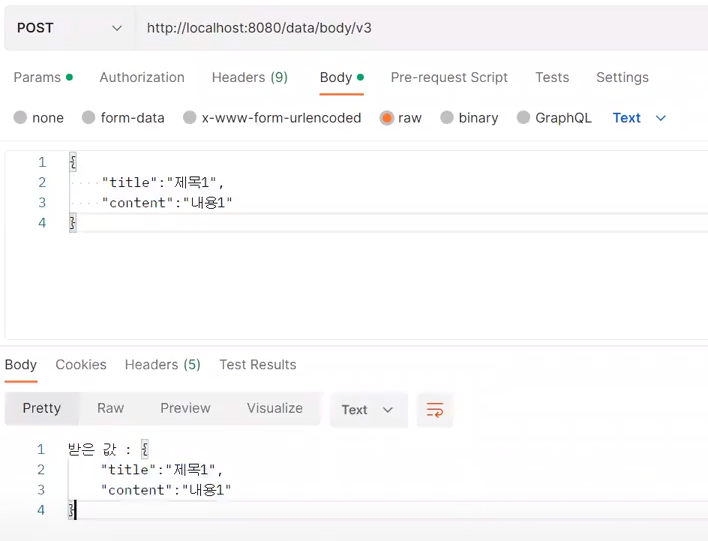

## 3. 마인드 맵

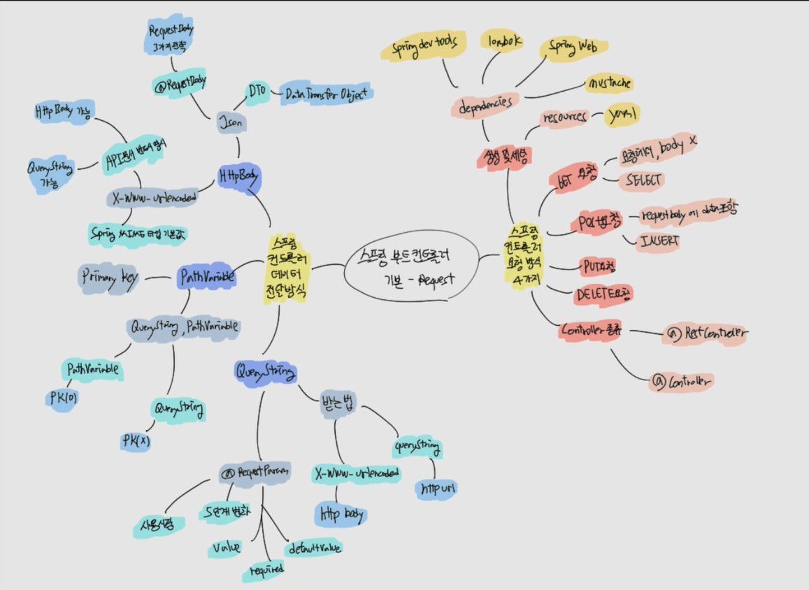