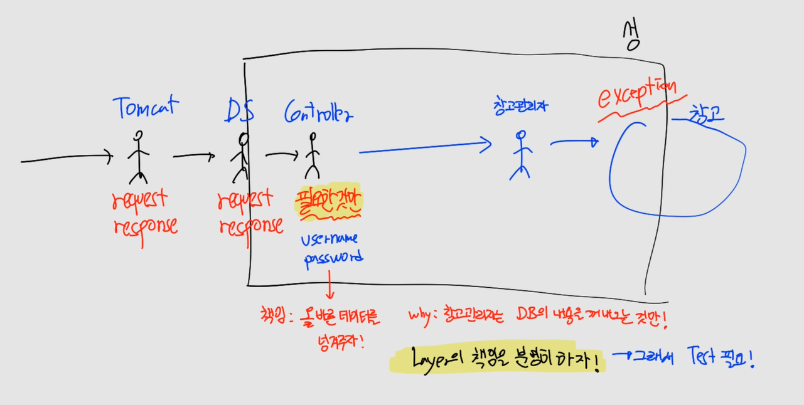

# CH13 스프링부트 컨트롤러 기본 - 응답

#### 소스코드

https://github.com/codingspecialist/Springboot-Controller

## 1. 스프링 컨트롤러 응답 방식 4가지

> 1. `View` : JSP, Freemarker, Thymeleaf 등의 뷰(View)를 사용하여 HTML 페이지를 반환하는 방식입니다. 이 방식은 주로 HTML 페이지를 반환하는 웹 애플리케이션에서 사용됩니다.
>
> ```java
> @GetMapping("/example")
> public String example() {
>     return "loginForm"; // ViewResolver가 발동하여 파일을 찾아서 text/html이 응답된다.
> }
> ```
>
> 2. `Text` : 텍스트 데이터를 반환하는 방식입니다. 이 방식은 주로 텍스트 파일을 반환하는 애플리케이션에서 사용됩니다.
>
> ```java
> @GetMapping("/example")
> @ResponseBody
> public String example() {
>     return "Hello, world!"; // text/html이 응답된다.
> }
> ```
>
> 3. `Object` : Java 객체를 반환하는 방식입니다. 이 방식은 주로 JSON 형식으로 변환하여 반환됩니다.
>
> ```java
> @GetMapping("/example")
> public ExampleDto getExample() {
>     ExampleDto exampleDto = exampleService.getExample();
>     return exampleDto; // application/json이 응답된다.
> }
> ```
>
> 4. `ResponseEntity` : HTTP 응답 코드, 헤더, 본문 등을 직접 지정할 수 있는 방식입니다. 이 방식은 주로 RESTful API에서 HTTP 응답 코드와 메시지를 지정할 때 사용됩니다.
>
> ```java
> @GetMapping("/example/{id}")
> public ResponseEntity<ExampleDto> getExample(@PathVariable Long id) {
>     ExampleDto exampleDto = exampleService.getExample(id);
>     if (exampleDto == null) {
>         return new ResponseEntity<>(HttpStatus.NOT_FOUND);
>     }
>     return new ResponseEntity<>(exampleDto, HttpStatus.OK); // text/html과 http status가 함께 응답된다.
> }
> ```

- 스프링 컨트롤러 응답 방식 4가지
  - View 응답
  - Text 응답
  - Object 응답
  - ResponseEntity 응답

## 2.  View 응답

> JSP 템플릿 엔진이 아닌, Mustache 템플릿 엔진을 사용하도록 하겠습니다.
>
> 우선 툴에서 mustache 파일을 인식할 수 있게 plugin을 설치합니다.
>
> 

- resources/templates/home.mustache

```html
<!doctype html>
<html lang="en">
<head>
    <meta charset="UTF-8">
    <meta name="viewport"
          content="width=device-width, user-scalable=no, initial-scale=1.0, maximum-scale=1.0, minimum-scale=1.0">
    <meta http-equiv="X-UA-Compatible" content="ie=edge">
    <title>Document</title>
</head>
<body>
    <h1>Home</h1>
</body>
</html>
```

> `@Controller`와 `@RestController`는 각각 다른 목적을 가지며, 사용하는 방식도 다릅니다. `@Controller`는 뷰(View)를 생성하거나 반환하는 컨트롤러를 정의할 때 사용하며, `@RestController`는 데이터를 반환하는 RESTful 웹 서비스를 구현할 때 사용합니다.

```
@RestController
- 가끔 Object가 리턴될 때 JSON 파싱(= Message Converter 발동)
- response.getWriter().println()
- RESTful 웹 서비스를 구현할 때 사용

@Controller
- ViewResolver
- request.getRequestDispatcher()
```

- controller/ResponseController.java

```java
package shop.mtcoding.conbasic.controller;

import org.springframework.stereotype.Controller;
import org.springframework.web.bind.annotation.GetMapping;

@Controller // ViewResolver 발동
public class ResponseController {

    @GetMapping("/resp/v1")
    public String respV1(){
        // home.mustache에 강제 접근 불가 : MVC 패턴이 강제가 된다.
        return "home"; 
    }
}
```

새로운 mustache 파일이 생성되었기 때문에, 서버를 종료한 뒤 다시 실행해야 파일 인식이 됩니다.


> `Template Engine의 suffix와 prefix`
> - prefix(공통) : /resources/templates
> - suffix(각기 다르다) : .mustache
> - 변경하지 않는 것이 좋다.(프레임워크이기 때문에)
>
> 

## 3.  View 응답 - Model에 담기

> `HttpServletRequest`의 `setAttribute()` 메서드와 `Model`의 `addAttribute()` 메서드는 모두 데이터를 저장하는 메서드이지만, 저장하는 위치와 범위에서 차이가 있습니다.
>
> `HttpServletRequest`의 `setAttribute()` 메서드는 HTTP 요청의 속성(attributes)을 설정하는 데 사용됩니다. 속성은 HTTP 요청을 처리하는 모든 컴포넌트에서 공유되며, 요청 범위(request scope) 내에서 유지됩니다. 즉, `setAttribute()` 메서드를 사용하여 설정한 속성은 해당 HTTP 요청을 처리하는 모든 컴포넌트에서 접근할 수 있습니다.
>
> ```java
> @GetMapping("/example")
> public String example(HttpServletRequest request) {
>     request.setAttribute("message", "Hello, world!");
>     return "example";
> }
> ```
>
> `Model`의 `addAttribute()` 메서드는 뷰(View)에서 사용할 데이터를 저장하는 데 사용됩니다. `addAttribute()` 메서드로 저장한 데이터는 뷰에서 참조할 수 있으며, 뷰 범위(view scope) 내에서 유지됩니다. 즉, `addAttribute()` 메서드로 저장한 데이터는 해당 요청에 대한 응답을 반환할 때까지 유지됩니다.
>
> ```java
> @GetMapping("/example")
> public String example(Model model) {
>     model.addAttribute("message", "Hello, world!");
>     return "example";
> }
> ```
>
> 따라서, `HttpServletRequest`의 `setAttribute()` 메서드와 `Model`의 `addAttribute()` 메서드는 저장하는 위치와 범위에서 차이가 있으며, 데이터를 저장하는 목적과 사용 방법도 다르게 사용됩니다. `HttpServletRequest`의 `setAttribute()` 메서드는 주로 HTTP 요청을 처리하는 컴포넌트 간에 데이터를 공유할 때 사용하며, `Model`의 `addAttribute()` 메서드는 주로 뷰에서 참조할 데이터를 저장할 때 사용합니다.

- controller/ResponseController.java

```java
// WAS -> Scope 4개(application, session, request, pageContext)
@GetMapping("/resp/v2")
public String respV2(Model model){
    model.addAttribute("title", "제목1"); // model에 담으면 View까지 끌고감
    return "main";
}
```

> `Model의 내부적 구현`
> ```java
> class MyModel {
> 
>     HttpServletRequest request;
> 
>     public MyModel(HttpServletRequest request) {
>         this.request = request;
>     }
> 
>     public void addAttribute(String key, Object value) {
>         request.setAttribute(key, value);
>     }
> }
> ```

- resources/templates/main.mustache

```html
<!doctype html>
<html lang="en">
<head>
    <meta charset="UTF-8">
    <meta name="viewport"
          content="width=device-width, user-scalable=no, initial-scale=1.0, maximum-scale=1.0, minimum-scale=1.0">
    <meta http-equiv="X-UA-Compatible" content="ie=edge">
    <title>Document</title>
</head>
<body>
    <h1>Main</h1>
    <hr/>
    <h3>{{title}}</h3>
</body>
</html>
```

> `mustache, jsp 차이`
>
> - jsp : ${}
> - mustache : {{}}


## 4. Text 응답

> 스프링부트 컨트롤러에 메서드에서 String을 응답하면 text/html 이 응답되고 상태코드는 200이 응답된다.
>
> 그리고 문자 인코딩은 자동으로 UTF-8이 적용된다.
>
> @Controller는 View를 응답하기 때문에 메서드에 return type 앞에 @ResponseBody를 붙여줘야 Text를 리턴하는 메서드로 변환된다.
>
> 즉, @RestController는 @Controller와 @ResponseBody가 결합되어 만들어진 어노테이션이다.
>
> 

- controller/ResponseController.java

```java
@GetMapping("/resp/v3")
public @ResponseBody String respV3() { // 버퍼
    return "<h1>text/html 응답</h1>";
}
```


## 5. Object 응답 

> 스프링부트에서는 Object를 응답하면 MessageConverter 클래스가 일을 처리합니다. MessageConverter는 Object를 Json으로 변환하여 응답해줍니다.
>
> 이때 사용되는 라이브러리는 Jackson 이고, 아래 3개의 라이브러리가 필요합니다.
>
> 
>
> 인텔리J에서 External Libraries를 살펴보면 확인 가능합니다.
>
> 

- controller/ResponseController.java

```java
@GetMapping("/resp/v4")
public @ResponseBody BoardRespDto respV4() { // 버퍼 + Jackson(Gson)
    return new BoardRespDto(1, "제목1", "내용1");
}
```


> `Json Viewer`
>
> 브라우저에서 위와 같이 JSON으로 변환된 데이터가 예쁘게 출력되지 않는다면, 크롬 확장프로그램에서 Json Viewer를 설치하면 된다.
>
> 

## 6. ResponseEntity 응답

> 스프링부트의 기본 응답 코드는 200 이다. 내부적으로 예외가 발생하지 않는 이상 200을 응답한다. ResponseEntity를 이용하면 상태코드를 자유롭게 응답할 수 있다.
>
> 물론 HttpServletResponse에 직접 header값을 추가해줄 수 도 있다.
>
> ```java
> @GetMapping("/example")
> public void example(HttpServletResponse response) throws IOException {
>     response.setStatus(HttpStatus.OK.value());
> }
> ```
>
> 하지만 ResponseEntity를 활용하는 것이 좋다.
>
>  `ResponseEntity` 클래스를 사용하여 HTTP 응답을 반환할 수도 있습니다. `ResponseEntity`는 HTTP 응답 본문뿐만 아니라 상태 코드, 헤더 등의 정보를 모두 포함한 객체입니다.
>
> ```java
> @GetMapping("/example")
> public ResponseEntity<Void> example() {
>     return ResponseEntity.ok().build();
> }
> ```
>
> `@Controller`에서 `ResponseEntity`를 사용하면 `@ResponseBody` 어노테이션을 사용하지 않아도 됩니다. `ResponseEntity`는 HTTP 응답 본문뿐만 아니라 HTTP 응답 상태 코드, 헤더 등의 정보를 모두 포함한 객체입니다. 따라서, `ResponseEntity`를 반환하면 스프링은 HTTP 응답을 생성하여 클라이언트에게 반환하게 됩니다.

```
- @Controller -> 파일 리턴
- ResponseEntity가 리턴타입에 붙으면 자동으로 @ResponseBody 발동!
- 상태코드를 리턴
- 따라서 ResponseEntity는 무조건 Data 응답
```

- controller/ResponseController.java

```java
@GetMapping("/resp/v5")
public ResponseEntity<Void> respV5() {
    return new ResponseEntity<>(HttpStatus.BAD_REQUEST);
}

@GetMapping("/resp/v6")
public ResponseEntity<String> respV6() {
    return new ResponseEntity<>("hello", HttpStatus.FORBIDDEN);
}

@GetMapping("/resp/v7")
public ResponseEntity<?> respV7(@RequestParam(defaultValue = "1") String value) { // 와일드카드
    if (value.equal("1")) {
        return new ResponseEntity<>("hello", HttpStatus.OK);
    } else {
        return new ResponseEntity<>(1, HttpStatus.OK);
    }
}
```

> ResponseEntity는 응답의 body값의 타입을 제네릭으로 지정해야 합니다. 하지만 그 타입이 동적이면 미리 알 수 없는 경우들이 있습니다.
>
> 예를 들어, A라는 요청이 들어오면 String을 반환하고, B라는 요청이 들어오면 Integer를 반환해야 한다면 반환타입을 미리 지정해둘 수 없습니다. 이럴 때는 제네릭의 와일드카드를 사용합니다. 와일드카드를 사용하면 메서드가 return될 때 반환타입이 동적으로 결정됩니다.


## 6. Redirection

> Spring Boot에서 `redirect:`는 HTTP 요청을 다른 URI로 리디렉션하는 데 사용됩니다. 즉, `redirect:`를 사용하면 클라이언트의 요청을 다른 URI로 전달하게 됩니다.
>
> `redirect:`는 `String` 형태의 URI를 반환하는 컨트롤러 메서드에서 사용됩니다.
>
> ```java
> @GetMapping("/example")
> public String example() {
>     return "redirect:/new-page";
> }
> ```
>
> 참고로 redirect는 @Controller에서만 사용 가능합니다.

- controller/ResponseController.java

```java
@GetMapping("/resp/v8")
public String respV8() {
    return "redirect:/resp/v1"; // ViewResolver 타야하는데, redirect: 해라!
}
```


## 7. 단위 테스트

> 스프링 부트(Spring Boot)에서의 단위 테스트는 애플리케이션의 각 구성 요소를 격리하여 개별적으로 테스트하는 기능을 제공합니다. 단위 테스트는 개발자가 작성한 코드의 동작을 확인하고 문제를 발견하고 수정하는 데 도움을 줍니다.
> 
> 스프링 부트에서 단위 테스트를 작성하기 위해 일반적으로 JUnit과 같은 테스트 프레임워크를 사용합니다. 스프링 부트는 테스트를 위한 많은 기능을 제공하여 테스트 환경을 구성하고, 애플리케이션의 다양한 레이어를 테스트할 수 있습니다.
> 
> 단위 테스트를 작성하는 일반적인 절차는 다음과 같습니다:
> 
> @Test 애노테이션을 사용하여 테스트 메서드를 작성합니다. 테스트 메서드는 JUnit 프레임워크가 인식하고 실행하는 메서드입니다.
> 
> 테스트 메서드에서는 특정한 기능 또는 메서드를 호출하고, 그 결과가 예상한 대로 동작하는지 확인합니다. 예를 들어, 특정 메서드의 반환 값을 검증하거나, 예외가 발생하는지 확인할 수 있습니다.
> 
> 필요한 경우에는 @Before나 @After 애노테이션을 사용하여 테스트 전후에 실행되는 메서드를 정의할 수 있습니다. 이를 통해 테스트 실행 전에 초기화 작업을 수행하거나, 테스트 이후에 정리 작업을 수행할 수 있습니다.
> 
> 스프링 부트에서는 @RunWith(SpringRunner.class) 애노테이션을 사용하여 스프링 테스트 컨텍스트를 로드하고 관리할 수 있습니다. 이를 통해 스프링 관련 빈을 사용하는 테스트를 수행할 수 있습니다.
> 
> 필요한 경우에는 @MockBean 애노테이션을 사용하여 가짜(mock) 객체를 생성하고 주입할 수 있습니다. 이를 통해 외부 의존성을 가진 빈을 가짜 객체로 대체하여 테스트 환경을 격리할 수 있습니다.
> 
> 스프링 부트 단위 테스트는 애플리케이션의 각 구성 요소를 독립적으로 테스트할 수 있는 강력한 도구입니다. 이를 통해 개발자는 작성한 코드의 동작을 검증하고 문제를 발견하고 수정할 수 있습니다. 단위 테스트를 통해 코드의 품질을 향상시키고, 안정성과 신뢰성을 높이는 데 도움을 줍니다.

> `Controller의 책임`
>
> - 값 전달 받기 (QueryString, PathVariable, Body)
> - 유효성 검사하기 (Post, Put 요청일 경우에만, 즉 Body에 데이터가 있을 경우)
> - 인증 체크하기 (아직 배우지 않음)
> - 비지니스(mvc에서 m)에게 일 위임하기 (아직 배우지 않음)
> - 값 응답하기 (View, ResponseEntity)

### (1) 본코드 작성하기

- dto/UserRespDto.java

```java
package shop.mtcoding.conbasic.dto;

import lombok.Getter;
import lombok.Setter;

@NoArgConstructor 
@Setter
@Getter
public class UserRespDto {

    private int id;
    private String username;
    // password는 응답하지 않음.
    private String tel;

    public UserRespDto(int id, String username, String tel) {
        this.id = id;
        this.username = username;
        this.tel = tel;
    }

    @Override
    public String toString() {
        return "UserRespDto{" +
                "id=" + id +
                ", username='" + username + '\'' +
                ", tel='" + tel + '\'' +
                '}';
    }
}
```

- resources/templates/detail.mustache

```html
<!doctype html>
<html lang="en">
<head>
    <meta charset="UTF-8">
    <meta name="viewport"
          content="width=device-width, user-scalable=no, initial-scale=1.0, maximum-scale=1.0, minimum-scale=1.0">
    <meta http-equiv="X-UA-Compatible" content="ie=edge">
    <title>Document</title>
</head>
<body>
    <h1>Detail</h1>
    <hr/>
    <h3>번호 : {{user.id}}</h3>
    <h3>아이디 : {{user.username}}</h3>
    <h3>전화번호 : {{user.tel}}</h3>
</body>
</html>
```


> `Mustache문법`
> 1. 직접 만든 Getter 있으면, 호출
> 2. Getter가 존재하지 않으면 Reflection으로 찾음 (private 변수 접근 가능)
> - {{user.id}}
> - {{user.username}}
> - {{user.tel}}

> 주소에 api가 붙은 메서드는 Text 혹은 Json을 응답하는 메서드이고, api가 없는 메서드는 View를 응답하는 메서드이다.

- controller/UserController.java

```java
package shop.mtcoding.conbasic.controller;

import org.springframework.http.ResponseEntity;
import org.springframework.stereotype.Controller;
import org.springframework.ui.Model;
import org.springframework.web.bind.annotation.GetMapping;
import org.springframework.web.bind.annotation.PathVariable;
import org.springframework.web.bind.annotation.PostMapping;
import org.springframework.web.bind.annotation.ResponseBody;
import shop.mtcoding.conbasic.dto.UserRespDto;

import java.net.URI;

@Controller // ViewResolver
public class UserController {

    @PostMapping("/api/users")
    public ResponseEntity<?> addUser(String username, String password, String tel){
        // 1. 유효성 검사
        if(username == null || username.isEmpty()){
            return ResponseEntity.badRequest().body("<h1>username 입력하세요</h1>");
        }
        if(password == null || password.isEmpty()){
            return ResponseEntity.badRequest().body("<h1>password 입력하세요</h1>");
        }
        if(tel == null || tel.isEmpty()){
            return ResponseEntity.badRequest().body("<h1>tel 입력하세요</h1>");
        }

        // 2. 비지니스 로직 처리 (아직 배우지 않았음)
        int id = 1; // DB에 저장된 PK값을 받아옴

        // 3. 저장된 User 정보의 URI 응답 (201 - 새로운 리소스가 서버에 추가되었을 때)
        URI location = URI.create("/api/users/"+id);
        return ResponseEntity.created(location).build();
    }

    @GetMapping("/api/users/{id}")
    public ResponseEntity<?> getUser(@PathVariable int id){
        // 1. 인증 검사 (아직 배우지 않았음)

        // 2. 비지니스 로직 처리 (아직 배우지 않았음)
        UserRespDto userRespDto = new UserRespDto(1, "ssar", "0102222"); // DB에 저장된 User 정보를 받아옴

        // 3. 조회된 데이터를 응답(200)
        return ResponseEntity.ok().body(userRespDto);
    }

    @GetMapping("/users/{id}")
    public String detail(@PathVariable int id, Model model){
        // 1. 인증 검사 (아직 배우지 않았음)

        // 2. 비지니스 로직 처리 (아직 배우지 않았음)
        UserRespDto userRespDto = new UserRespDto(1, "ssar", "0102222"); // DB에 저장된 User 정보를 받아옴

        // 3. 받아온 Data를 Model에 담기 (request Scope에 담는 것과 동일)
        model.addAttribute("user", userRespDto);
        
        // 4. View 응답
        return "detail"; // 아무설정 안하면 200
    }
}
```


### (2) 테스트코드 작성하기

> 컨트롤러가 잘 만들어졌는지를 확인하려면, 직접 브라우저 혹은 포스트맨을 열어서 테스트를 해봐야 한다. 이는 매우 번거러운 일이다. 테스트 코드를 작성해보자.
>
> 해당 테스트의 목적은 값을 잘 전달 받는지, 유효성 검사는 잘하는지, 응답은 잘되는지를 체크하는 것이다.


#### addUser 테스트

> 테스트 코드에서 `given-when-then` 패턴은 테스트 메서드를 구성하는 세 가지 섹션입니다.
>
> - `given`: 테스트 실행 전에 필요한 데이터를 설정합니다.
> - `when`: 실제로 테스트할 동작을 실행합니다.
> - `then`: 동작 실행 후 결과를 검증합니다.
>
> 이러한 패턴은 테스트 메서드가 코드 블록의 섹션으로 나뉘어 가독성이 높아지고, 어떤 테스트를 수행하는지 쉽게 이해할 수 있도록 도와줍니다.
>
> 아래의 예제 코드를 현재 모두 이해하려고 하지 마세요. 단 한가지만 기억하세요!!
> MockMvc를 통해서 Controller에 Request 요청을 해볼 수 있다. 그리고 그 결과를 받아서 값을 검증해볼 수 있다.

- test/java/shop.mtcoding.conbasic/controller/UserControllerTest.java

```java
package shop.mtcoding.conbasic.controller;

import org.junit.jupiter.api.Test;
import org.springframework.beans.factory.annotation.Autowired;
import org.springframework.boot.test.autoconfigure.web.servlet.WebMvcTest;
import org.springframework.http.MediaType;
import org.springframework.test.web.servlet.MockMvc;
import org.springframework.test.web.servlet.ResultActions;
import org.springframework.test.web.servlet.ResultMatcher;
import org.springframework.test.web.servlet.request.MockHttpServletRequestBuilder;
import org.springframework.test.web.servlet.request.MockMvcRequestBuilders;
import org.springframework.test.web.servlet.result.MockMvcResultMatchers;
import org.springframework.test.web.servlet.setup.MockMvcBuilders;

import static org.springframework.test.web.servlet.request.MockMvcRequestBuilders.*;

// @SpringBootTest // 전부 띄우기 
@WebMvcTest // Filter, DispatcherServlet, Controller, MockMvc를 IoC 컨테이너에 로드한다. (웹 계층 관련된 모든 객체)
public class UserControllerTest {

    @Autowired // DI
    private MockMvc mockMvc;

    @Test // @Test를 붙이면 해당 메서드를 테스트할 수 있다.
    public void addUser_test() throws Exception{ // test 메서드는 파라메터를 전달받을 수 없다.
        // given (파라메터로 요청되는 데이터를 임의로 준비한다)
        String requestBody = "username=ssar&password=1234&tel=0102222"; // x-www-form-urlencoded

        // when (본코드 테스트를 수행한다)
        ResultActions actions = mockMvc.perform(
            .post("/api/users")
            .content(requestBody)
            .contentType(MediaType.APPLICATION_FORM_URLENCODED)
        );

        // then (본코드 테스트 결과를 검증한다)
        actions.andExpect(status().isCreated());
        actions.andExpect(header().string("Location", "/api/users/1"));
    }
}
```

테스트를 실행


username의 값을 지우고 실패를 유도

```java
String requestBody = "username=&password=1234&tel=0102222"; // x-www-form-urlencoded
```

```
MockHttpServletResponse:

            Status = 400
     Error message = null
           Headers = [Content-Type:"text/plain;charset=UTF-8", Content-Length:"33"]
      Content type = text/plain;charset=UTF-8
              Body = username 입력하세요
     Forwarded URL = null
    Redirected URL = null
           Cookies = []

 Status expected:<201> but was:<400>
 Expected :201
 Actual   :400
```

테스트를 한 뒤 코드를 정상적으로 돌려두겠습니다.

```java
String requestBody = "username=ssar&password=1234&tel=0102222"; // x-www-form-urlencoded
```

> `초록색 버튼을 누르고 시간이 걸리는 이유`
> 
> - 테스트를 할때는 아무것도 없기 때문에 테스트와 관련된 것들을 메모리에 올리기 때문에 시간이 걸립니다.

#### getUser 테스트

- test/java/shop.mtcoding.conbasic/controller/UserControllerTest.java

```java
@Test
public void getUser_test() throws Exception{
    // given
    int id = 1;

    // when
    ResultActions actions = mockMvc.perform(get("/api/users/"+id));

    // then
    actions.andExpect(status().isOk());
    actions.andExpect(jsonPath("id").value("1"));
    actions.andExpect(jsonPath("username").value("ssar"));
    actions.andExpect(jsonPath("tel").value("010222"));
}
```

검증을 하는 방법에는 2가지가 있습니다. 2가지 방법중에 JSON을 Java로 파싱하지 않고 JSON 자체로 검증하는 방법을 추천합니다.

```java
// 방법 1 - JSON->Java 변경 후 검증, UserRespDto에 @NoArgConstructor 필요
ObjectMapper om = new ObjectMapper();
UserRespDto userRespDto = om.readValue(responseBody, UserRespDto.class);
Assertions,assertThat(userRespDto.getUsername()).isEqualTo("ssar");

// 방법 2 - JSON 검증 (추천)
actions.andExpect(jsonPath("$.id").value("1"));
```

> `jsonPath 문법`
> 
> 예시
> ```json
> {
>     "userId": "1",
>     "name": "ssar",
>     "user": {
>         "username": "cos"
>     }
> }
> ```
> - cos 찾기 : $.user.username
> - ssar 찾기 : $.name

전화번호를 틀리게 해서 테스트 수행

```
MockHttpServletResponse:

            Status = 200
     Error message = null
           Headers = [Content-Type:"application/json"]
      Content type = application/json
              Body = {"id":1,"username":"ssar","tel":"0102222"}
     Forwarded URL = null
    Redirected URL = null
           Cookies = []

JSON path "tel" expected:<010222> but was:<0102222>
Expected :010222
Actual   :0102222
```

정상적으로 테스트 수행


> `responseBody 직접 보기`
> 
> 예시
> ```java
> // when
> ResultActions actions = mockMvc.perform(get("/api/users/"+id));
> String responseBody = actions.andReturn().getResponse().getContentAsString();
> System.out.println(responseBody);
> ```

#### detail 테스트 (model 값 검증)

> 객체 안에 값을 비교할 때에는 toString을 재 정의하여 비교하는 것이 좋다.
> 객체를 비교하게 되면, 같은 값을 가지고 있더라도, 주소를 비교하기 때문이다.
>
> actions.andExpect()를 사용하고 싶지만 이 친구를 사용하면 값을 하나씩 꺼내서 비교해야 하기 때문에 객체의 값을 비교할 때에는 org.assertj.core.api.Assertions 라이브러리를 사용하여 검증하는 것이 좋다.

- test/java/shop.mtcoding.conbasic/controller/UserControllerTest.java

```java
@Test
public void detail_test() throws Exception {
    // given
    int id = 1;

    // when
    ResultActions actions = mockMvc.perform(get("/users/" + id));

    // then
    // model.attribute(key, value), key값으로 조회
    UserRespDto userRespDto =  (UserRespDto) actions.andReturn().getModelAndView().getModel().get("user"); 

    assertThat(userRespDto.getId()).isEqualTo(1);
    assertThat(userRespDto.getUsername()).isEqualTo("ssar");
    assertThat(userRespDto.getTel()).isEqualTo("0102222");
    actions.andExpect(status().isOk());
}
```

toString()을 붙이지 않고 테스트 수행

```
expected: "UserRespDto{id=1, username='ssar', tel='0102222'} (UserRespDto@3962ec84)"

but was: "UserRespDto{id=1, username='ssar', tel='0102222'} (UserRespDto@60b616c8)"
```

> 주소 값으로 비교하기 때문에 값 비교를 할 수 없습니다. 그렇다면 값을 하나씩 getter로 꺼내서 비교해봐도 됩니다. 하지만 값을 하나씩 꺼내서 비교하는 것은 toString()을 재정의하는 것보다 상대적으로 번거로운 일입니다.

toString()을 붙이고 정상적으로 테스트 수행


각 테스트가 통과했으니 전체 테스트 수행하면 됩니다.

## 8. 정리

### (1) Controller, RestController

@Controller는 View를 응답하거나, Redirect할 수 있습니다. @RestController는 Object를 응답하면 Json이 응답되고, String을 응답하면 text/html이 응답됩니다.

ResponseEntity를 사용하면 @Controller에서도 Json 혹은 String을 응답할 수 있고 상태코드 또한 응답할 수 있다.

 ### (2) 테스트를 하는 이유

Controller가 DispatcherSerlvet로부터 request와 resopnse중에서 필요한 것들만 받고, 창고관리자에게 받은 값들 중 올바르지 않은 값을 주면 Exception이 터집니다.

이때 각 레이어가 책임을 다하지 않았기 때문에 Exception이 발생한 것입니다.



하지만 미리 테스트를 사용하면 컨트롤러의 책임만 Check 해볼 수 있습니다. 추후에 Service, Repository 레이어가 생기더라도 Controller에서 문제가 난다면 UserControllerTest에서 문제가 생기게 됩니다. 따라서 Controller 부분에서 문제가 생겼다는 것을 바로 알 수 있습니다.

따라서 각 레이어의 책임을 분명히 만들기 위해서 테스트를 하는 것입니다.

## 9. 마인드 맵

