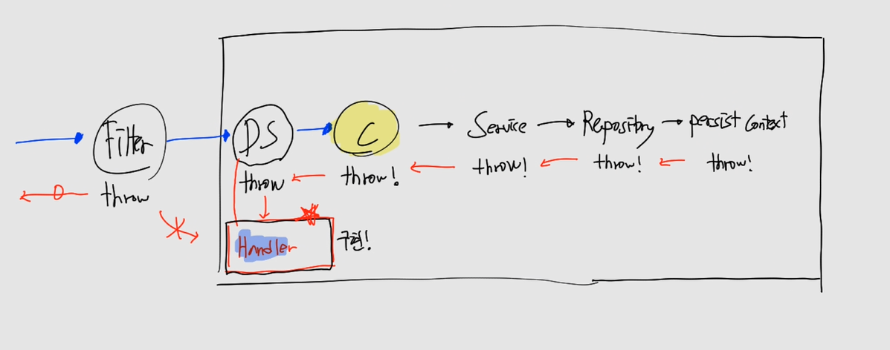

# CH14 스프링부트 컨트롤러 고급

#### 소스코드

https://github.com/codingspecialist/Springboot-Controller-High.git

## 1. 컨트롤러

### (1) 실습코드

- shop/mtcoding/filterandhandler/controller/UserController.java

```java
@Controller
public class UserController {

    @GetMapping({"/", "/home"})
    public String home(){
        return "home";
    }

    @GetMapping("/loginForm")
    public String loginForm(){
        return "loginForm";
    }

    @PostMapping("/login/v1")
    public String loginV1(){
        return "redirect:/"; // DB에서 username과 password를 체크하고 잘되면!! redirect 하겠다.
    }

    @PostMapping(value = "/login/v2", produces = "text/html; charset=utf-8")
    public @ResponseBody String loginV2(){
        return Script.href("/", "로그인성공"); // UX 증가
    }

    // 유효성 : POST, PUT만 해당
    @PostMapping("/login/v3")
    public @ResponseBody String loginV3(String username, String password){

        if(username == null || username.isEmpty()){
            return Script.back("username을 입력해주세요"); // history.back() 발동
        }
        if(password == null || password.isEmpty()){
            return Script.back("password을 입력해주세요");
        }
        return Script.href("/", "로그인성공");
    }

    @GetMapping("/joinForm")
    public String joinForm(){
        return "joinForm";
    }

    @PostMapping("/join/v1")
    public ResponseEntity<?> joinV1(JoinReqDto joinReqDto){

        if(joinReqDto.getUsername() == null || joinReqDto.getUsername().isEmpty()){
            ResponseDto<?> responseDto = new ResponseDto<>("username이 없습니다.");
            return new ResponseEntity<>(responseDto, HttpStatus.BAD_REQUEST);
        }
        if(joinReqDto.getPassword() == null || joinReqDto.getPassword().isEmpty()){
            ResponseDto<?> responseDto = new ResponseDto<>("password가 없습니다.");
            return ResponseEntity.badRequest().body(responseDto);
        }
        if(joinReqDto.getTel() == null || joinReqDto.getTel().isEmpty()){
            ResponseDto<?> responseDto = new ResponseDto<>("tel이 없습니다.");
            return ResponseEntity.badRequest().body(responseDto);
        }

        JoinRespDto joinRespDto = new JoinRespDto("cos", "0102222");
        ResponseDto<?> responseDto = new ResponseDto<>("회원가입 성공", joinRespDto);
        return ResponseEntity.ok().body(responseDto);
    }

    // 핸들러 사용, RestControllerException
    @PostMapping("/join/v2")
    public ResponseEntity<?> joinV2(@RequestBody JoinReqDto joinReqDto){

        if(joinReqDto.getUsername() == null || joinReqDto.getUsername().isEmpty()){
            throw new RestControllerException("username을 입력해주세요");
        }
        if(joinReqDto.getPassword() == null || joinReqDto.getPassword().isEmpty()){
            throw new RestControllerException("password를 입력해주세요");
        }
        if(joinReqDto.getTel() == null || joinReqDto.getTel().isEmpty()){
            throw new RestControllerException("tel을 입력해주세요");
        }

        JoinRespDto joinRespDto = new JoinRespDto("cos", "0102222");
        ResponseDto<?> responseDto = new ResponseDto<>("회원가입 성공", joinRespDto);
        return ResponseEntity.ok().body(responseDto);
    }

    // 핸들러 사용, ControllerException
    @PostMapping("/login/v4")
    public @ResponseBody String loginV4(String username, String password){

        if(username == null || username.isEmpty()){
            throw new ControllerException("username을 입력해주세요");
        }
        if(password == null || password.isEmpty()){
            throw new ControllerException("password를 입력해주세요");
        }
        return Script.href("/", "로그인성공");
    }
}
```

> `자바스크립트는 UX를 좋게합니다.`
>
> 예시
> - 회원가입 -> insert -> alert() -> location.href=로그인창
> - 로그인 -> select -> alert() -> location.href=메인페이지
> - 회원수정 -> update -> alert() -> location.href=회원상세보기 페이지
> - 회원탈퇴 -> deletel -> alert() -> location.href=메인페이지

## 2. 자바스크립트 응답

### (1) 실습코드

- shop/mtcoding/filterandhandler/util/Script.java

```java
package shop.mtcoding.filterandhandler.util;

public class Script {

    // 오버로딩
    public static String href(String uri){
        String sc = "";
        sc += "<script>";
        sc += "location.href='"+uri+"';";
        sc += "</script>";
        return sc;
    }

    // 오버로딩
    public static String href(String uri, String msg){
        String sc = "";
        sc += "<script>";
        sc += "alert('"+msg+"');";
        sc += "location.href='"+uri+"';";
        sc += "</script>";
        return sc;
    }

    public static String back(String msg){
        String sc = "";
        sc += "<script>";
        sc += "alert('"+msg+"');";
        sc += "history.back();";
        sc += "</script>";
        return sc;
    }
}

```

## 3. Fetch 요청

### (1) 실습코드

- src/main/resources/templates/loginForm.mustache

```html
<!doctype html>
<html lang="en">
<head>
    <meta charset="UTF-8">
    <meta name="viewport"
          content="width=device-width, user-scalable=no, initial-scale=1.0, maximum-scale=1.0, minimum-scale=1.0">
    <meta http-equiv="X-UA-Compatible" content="ie=edge">
    <title>Document</title>
</head>
<body>
<h1>로그인 페이지</h1>
<hr/>
<form action="/login/v4" method="post" enctype="application/x-www-form-urlencoded">
    <input type="text" name="username" placeholder="Enter username"/> <br/>
    <input type="password" name="password" placeholder="Enter password"/><br/>
    <button>로그인</button>
</form>
</body>
</html>
```

- src/main/resources/templates/joinForm.mustache

```html
<!doctype html>
<html lang="en">
<head>
    <meta charset="UTF-8">
    <meta name="viewport"
          content="width=device-width, user-scalable=no, initial-scale=1.0, maximum-scale=1.0, minimum-scale=1.0">
    <meta http-equiv="X-UA-Compatible" content="ie=edge">
    <title>Document</title>
</head>
<body>
    <h1>회원가입 페이지</h1>
    <hr/>
    <form>
        <input type="text" id="username" placeholder="Enter username" required/> <br/>
        <input type="password" id="password" placeholder="Enter password" required/><br/>
        <input type="tel" id="tel" placeholder="Enter tel" required/> <br/>
        <button type="button" onclick="join()">회원가입</button>
    </form>

    <script>
        async function join(){
            // this란 : https://www.youtube.com/watch?v=tDZROpAdJ9w
            this.event.preventDefault();

            let requestBody = {
                username: document.querySelector("#username").value,
                password: document.querySelector("#password").value,
                tel: document.querySelector("#tel").value,
            };

            try {
                let response = await fetch("/join/v1",{
                    method: "post",
                    body: JSON.stringify(requestBody), // JSON -> 문자열
                    headers: {
                        "Content-Type":"application/json; charset=utf-8"
                    }
                });
                let responseBody = await response.json();

                if(!response.ok){
                    throw new Error(responseBody.msg);
                }

                console.log(responseBody.data);
                alert(responseBody.msg);
                location.href = "/";

            }catch (err){
                alert(err);
                //console.error(err);
            }

        }
    </script>
</body>
</html>
```

- 아래의 방법은 추천하지 않는다. 왜냐하면 반복적으로 파고들기 때문에 비효율적이다.

```javascript
fetch("/join/v4", { // promise
    method: "post",
    body: JSON.stringify(requestBody),
    headers: {
        "Content-Type": "application/json; charset=utf-8"
    }
}).then((body)=>{
    // 통신
    // fetch..then..catch.. 반복 
}).catch((error)=>{

})
```

> `JSON.stringify(requestBody)`
>
> 

> `loginForm vs joinForm 차이`
>
> 액션의 유무
>
> ```html
> <form action="/login/v4" method="post" enctype="application/x-www-form-urlencoded">
>     <input type="text" name="username" placeholder="Enter username"/> <br/>
>     <input type="password" name="password" placeholder="Enter password"/><br/>
>     <button>로그인</button>
> </form>
> ```
>
> ```html
> <form>
>     <input type="text" id="username" placeholder="Enter username" required/> <br/>
>     <input type="password" id="password" placeholder="Enter password" required/><br/>
>     <input type="tel" id="tel" placeholder="Enter tel" required/> <br/>
>     <button type="button" onclick="join()">회원가입</button>
> </form>
> .
> .
> 비동기 코드
> ```

## 3. 예외처리

> 스프링 부트에서의 예외 처리 핸들러(Exception Handler)는 애플리케이션에서 발생하는 예외를 처리하는 기능을 제공합니다. 이를 통해 예외가 발생했을 때 원하는 방식으로 예외를 처리하고 클라이언트에게 알맞은 응답을 전달할 수 있습니다. 예외 처리 핸들러를 사용하면 애플리케이션의 안정성과 사용자 경험을 향상시킬 수 있습니다.

### (1) 예외처리 설명

예외처리를 할때는 다음과 같은 과정을 가집니다.



DispatcherSerlvet으로 모든 Exception 들을 throw하면, DispatcherSerlvet은 내부적으로 Handler라는 기법을 이용하여 Exception을 처리합니다. 하지만 Filter는 DispatcherSerlvet 앞에 위치해서, throw를 해도 Handler가 처리할 수 없습니다.

또한 DispatcherSerlvet은 RuntimeException만 처리합니다. 따라서 RuntimeException을 상속받는 커스텀Exception을 만들고, 커스텀Exception을 다루는 Handler를 만들어야합니다.

최종적으로는 DispatcherSerlvet이 위의 과정을 통해 Handler를 실행시킵니다.

> `모두 RuntimeException이면?`
>
> 다른 커스텀 Exception을 불러올 수 없습니다. 왜나하면 모든 것들은 RuntimeException을 상속받기 때문에, 만약 모두 RuntimeException이면 분기가 불가능하고 RuntimeException만 나오게 됩니다.

### (2) 실습코드

#### 커스텀Exception

- shop/mtcoding/filterandhandler/handler/ex/ControllerException.java 

```java
package shop.mtcoding.filterandhandler.handler.ex;

import lombok.Getter;
import lombok.Setter;
import org.springframework.http.HttpStatus;

@Getter @Setter
public class ControllerException extends RuntimeException{

    private HttpStatus httpStatus;

    public ControllerException(String msg) {
        this(msg, HttpStatus.BAD_REQUEST);
    }

    public ControllerException(String msg, HttpStatus httpStatus) {
        super(msg);
        this.httpStatus = httpStatus;
    }
}

```

- shop/mtcoding/filterandhandler/handler/ex/RestControllerException.java 

```java
package shop.mtcoding.filterandhandler.handler.ex;

import lombok.Getter;
import lombok.Setter;
import org.springframework.http.HttpStatus;

@Getter @Setter
public class RestControllerException extends RuntimeException{
    private HttpStatus httpStatus;

    public RestControllerException(String msg) {
        this(msg, HttpStatus.BAD_REQUEST);
    }

    public RestControllerException(String msg, HttpStatus httpStatus) {
        super(msg);
        this.httpStatus = httpStatus;
    }
}

```

#### Handler

- shop/mtcoding/filterandhandler/handler/ExHandler.java 

```java
package shop.mtcoding.filterandhandler.handler;

import org.springframework.http.ResponseEntity;
import org.springframework.web.bind.annotation.ExceptionHandler;
import org.springframework.web.bind.annotation.RestControllerAdvice;
import shop.mtcoding.filterandhandler.dto.ResponseDto;
import shop.mtcoding.filterandhandler.handler.ex.RestControllerException;
import shop.mtcoding.filterandhandler.handler.ex.ControllerException;
import shop.mtcoding.filterandhandler.util.Script;

@RestControllerAdvice 
public class ExHandler {

    // Controller : View, text/html 줘
    @ExceptionHandler(ControllerException.class)
    public String controllerException(ControllerException e){
        return Script.back(e.getMessage()); // Controller 예외처리방식
    }

    // RestController : Data 줘
    @ExceptionHandler(RestControllerException.class)
    public ResponseEntity<?> restControllerException(RestControllerException e){
        ResponseDto<?> responseDto = new ResponseDto<>(e.getMessage());
        return new ResponseEntity<>(responseDto, e.getHttpStatus()); // RestController 예외처리방식
    }
}
```

- 예외 발생 부분
  - 2개의 커스텀Exception 차이 이해
```java
throw new ControllerException("username을 입력해주세요");

throw new RestControllerException("username을 입력해주세요");
```

> `예외처리시 redirect를 보내고 싶은 경우`
> 
> ```java
> @ControllerAdvice 
> public class ExHandler {
> 
>    @ExceptionHandler(ControllerException.class)
>    public String controllerException(ControllerException e){
>        return "redirect:/";
>    }
>    .
>    .
>    .
>```

> `@RestControllerAdvice, @ControllerAdvice 차이점 이해`
>
> - @RestControllerAdvice : Data -> handler
> - @ControllerAdvice : View, redirect -> handler


## 4. 필터

> 자바 필터(Filter)는 서블릿(Servlet)의 요청과 응답 사이에서 요청과 응답의 흐름을 제어하고, 변형하거나 보강하는 기능을 제공하는 서블릿 컴포넌트입니다. 필터는 웹 애플리케이션의 여러 컴포넌트에 공통적으로 적용되는 로직을 구현하고 중복 코드를 줄일 수 있는 장점이 있습니다.
> 
> 자바 필터의 동작 방식은 다음과 같습니다:
> 
> 필터 체인: 여러 개의 필터는 체인 형태로 구성됩니다. 필터 체인은 웹 애플리케이션의 요청 처리 과정에서 필터들이 순차적으로 실행되는 구조입니다. 각 필터는 요청을 처리한 후, 다음 필터로 요청을 전달하거나 응답을 처리할 수 있습니다.
> 
> 필터 초기화: 필터는 웹 애플리케이션의 시작 시점에 초기화되며, 필터 인스턴스의 생성과 초기 설정을 수행합니다. 필터 초기화 시점에는 init() 메서드가 호출됩니다.
> 
> 요청 처리: 클라이언트로부터의 요청이 서블릿으로 전달되기 전에 필터 체인에서 필터가 요청을 가로챕니다. 필터는 요청을 검사하고 필요에 따라 요청을 변경하거나 부가적인 작업을 수행할 수 있습니다.
> 
> 응답 처리: 서블릿이 요청을 처리한 후, 응답이 클라이언트로 전송되기 전에 필터 체인에서 필터가 응답을 가로챕니다. 필터는 응답을 검사하고 필요에 따라 응답을 변경하거나 부가적인 작업을 수행할 수 있습니다.
> 
> 필터 종료: 필터는 웹 애플리케이션의 종료 시점에 종료되며, 필터 인스턴스의 리소스 정리 등의 마무리 작업을 수행합니다. 필터 종료 시점에는 destroy() 메서드가 호출됩니다.
> 
> 자바 필터는 주로 로깅, 인증과 권한 부여, 데이터 압축, XSS 방지 등과 같은 공통적인 작업을 수행하는 데 사용됩니다. 필터를 사용하면 이러한 로직들을 중복으로 구현하지 않고, 여러 서블릿에서 공유하여 사용할 수 있습니다. 스프링 프레임워크에서도 필터를 활용하여 다양한 작업을 수행할 수 있으며, 웹 애플리케이션의 보안, 로깅, 인증 등에 활용됩니다.

### (1) 필터 설명


Spring은 내부적으로 Filter까지 포함합니다. 하지만 Filter의 예외는 DispatcherServlet에서 처리하지 못합니다. Filter는 톰캣으로 부터 Request, Response를 받고 chain을 통해서 doFilter 메소드를 실행합니다.

예를 들어 4개의 Filter가 있다고 하면, chain을 걸어놓아서 계속 실행이 되게하고, 마지막 Filter가 끝이나면 DispatcherServlet이 실행됩니다.

- Filter의 장점
  - Filter에서 걸리면 DispatcherServlet까지 도달하지 않습니다.

### (2) 실습코드

#### 필터 생성

Filter를 implements 하면됩니다.

- shop/mtcoding/filterandhandler/filter/BlackListFilter.java 

```java
package shop.mtcoding.filterandhandler.filter;

import javax.servlet.*;
import java.io.IOException;

public class BlackListFilter implements Filter {

    @Override
    public void doFilter(ServletRequest request, ServletResponse response, FilterChain chain) throws IOException, ServletException {
        
        // x-www-urlencoded -> username=ssar 으로 들어올때 작동하는 코드
        String username = request.getParameter("username");
        if(username.equals("ssar")){
            // DS보다 먼저 작동한다.
            response.setContentType("text/plain; charset=utf-8"); // 제어가능 이유 : DS까지 가지 않기 때문에 제어권은 개발자가 가지고 있음
            response.getWriter().println("당신은 블랙리스트입니다.");
            return; // 필터가 걸리면 바로 종료
        }
        chain.doFilter(request, response); // 다음필터를 실행, 없으면 DS 실행
    }
}
```

- shop/mtcoding/filterandhandler/filter/WhiteListFilter.java

```java
package shop.mtcoding.filterandhandler.filter;

import javax.servlet.*;
import java.io.IOException;

public class WhiteListFilter implements Filter {

    @Override
    public void doFilter(ServletRequest request, ServletResponse response, FilterChain chain) throws IOException, ServletException {
        
        String username = request.getParameter("username");
        if (username.equals("cos")) {
            response.setContentType("text/plain; charset=utf-8");
            response.getWriter().println("당신은 화이트리스트입니다.");
            return;
        }
        chain.doFilter(request, response);
    }
}
```

#### 필터등록

필터를 생성하면 반드시 등록을 해야합니다.

- shop/mtcoding/filterandhandler/config/FilterRegister.java

```java
package shop.mtcoding.filterandhandler.config;

import org.springframework.boot.web.servlet.FilterRegistrationBean;
import org.springframework.context.annotation.Bean;
import org.springframework.context.annotation.Configuration;
import shop.mtcoding.filterandhandler.filter.BlackListFilter;

@Configuration
public class FilterRegister {

    // blackList
    @Bean   
    public FilterRegistrationBean<?> myFilterRegistration() {
        FilterRegistrationBean<BlackListFilter> registration = new FilterRegistrationBean<>();
        registration.setFilter(new BlackListFilter());
        registration.addUrlPatterns("/login/*");
        registration.setOrder(1); // 필터 순서 설정
        return registration;
    }

    // whiteList
    @Bean   
    public FilterRegistrationBean<?> myFilterRegistration2() {
        FilterRegistrationBean<BlackListFilter> registration = new FilterRegistrationBean<>();
        registration.setFilter(new WhiteListFilter());
        registration.addUrlPatterns("/login/*");
        registration.setOrder(2);
        return registration;
    }
}
```

Body 값으로 보내는 경우


QueryString으로 보내는 경우


## 5. 인터셉터

> 자바의 인터셉터(Interceptor)는 AOP(Aspect-Oriented Programming) 개념을 기반으로 하며, 메서드 호출이나 요청 처리 전후에 특정 작업을 수행하는 기능을 제공합니다. 인터셉터는 주로 웹 애플리케이션에서 요청 처리, 로깅, 인증과 권한 부여, 캐싱 등의 부가적인 작업을 수행하는 데 사용됩니다.
> 
> 자바의 인터셉터의 주요 특징과 동작 방식은 다음과 같습니다:
> 
> 관점(Aspect): 인터셉터는 주로 특정한 관점에서 동작하는 로직을 구현합니다. 예를 들어, 인증과 권한 관리, 로깅, 예외 처리 등의 관점에서 인터셉터를 적용할 수 있습니다.
> 
> 전처리와 후처리: 인터셉터는 대상 메서드의 호출이나 요청 처리 전후에 동작하는 로직을 구현할 수 있습니다. 이를 통해 메서드 호출 전에 선행 작업을 수행하거나, 응답 전에 후처리 작업을 수행할 수 있습니다.
> 
> 체인 형태: 인터셉터는 체인 형태로 구성되어 동작합니다. 여러 개의 인터셉터가 순차적으로 실행되며, 각 인터셉터는 작업을 수행한 후 다음 인터셉터로 제어를 전달합니다.
> 
> 확장성: 인터셉터는 기능을 확장하고 재사용하기 용이합니다. 인터셉터를 추가하거나 수정하여 기존의 동작을 변경하거나 새로운 동작을 추가할 수 있습니다.
> 
> 인터셉터는 주로 프레임워크나 라이브러리에서 제공하며, 웹 애플리케이션 개발에서 많이 활용됩니다. 예를 들어, 스프링 프레임워크에서는 HandlerInterceptor 인터페이스를 구현하여 요청 처리 전후에 인터셉터를 적용할 수 있습니다. 인터셉터를 사용하면 공통적인 로직을 중복으로 구현하지 않고, 여러 컨트롤러에서 공유하여 사용할 수 있으며, 애플리케이션의 효율성과 유지보수성을 향상시킬 수 있습니다.

### (1) 인터셉터 설명


인터셉터는 DispatcherServlet에서 컨트롤러 메소드 호출 전과 후를 담당합니다.

### (2) 인터셉터 실습코드

####  인터셉터 설정

- shop/mtcoding/filterandhandler/config/WebConfig.java

```java
package shop.mtcoding.filterandhandler.config;
.
.
.
@Configuration // new가 됨
public class WebConfig implements WebMvcConfigurer {

    @Override // 인터셉터
    public void addInterceptors(InterceptorRegistry registry) {
        registry.addInterceptor(new LoginInterceptor()).addPathPatterns("/login/*"); // 인터셉터 등록 코드, addInterceptor 타입 확인
    }
}
```

> `어뎁터 패턴이 사라진 이유`
> 
> 
>
> ```java
> interface Knife { // ISP 위배한 상태
>     // 추상메소드
>    public void 요리하다();
>    public void 공격하다();
>}
> class 백종원 implements Knife{
> 
>     @Override
>     public void 요리하다() {
>         System.out.println("김치찌개 만들기. ");
>     }
>     @Override
>     public void 공격하다() {}
> }
> class 검투사 implements Knife{
> 
>     @Override
>     public void 요리하다() {}
>     @Override
>     public void 공격하다() {
>         System.out.println("공격. ");
>     }
> }
> ```
> 쓸데없는 코드도 Override를 해야합니다. 따라서 체를 뜨는 어뎁터 패턴으로 바꿔봅시다.
> 
> ```java
> interface Knife {
>     public void 요리하다();
>     public void 공격하다();
> }
> // 추상클래스는 추상메소드를 들 수 있다.
> abstract class 요리사어댑터 implements Knife{ // 걸러내는 용도
>     @Override
>     public void 공격하다() {}
> }
> abstract class 전투사어댑터 implements Knife{ // 걸러내는 용도
>     @Override
>     public void 요리하다() {}
> }
> class 백종원 extends 요리사어댑터{
>     @Override
>     public void 요리하다() {
>         System.out.println("김치찌개 만들기. ");
>     }
> }
> class 검투사 extends 전투사어댑터{
>     @Override
>     public void 공격하다() {
>         System.out.println("공격. ");
>     }
> }
> ```
> 
>어뎁터 코드의 단점은 추상클래스에 걸러내는 과정이 매우 귀찮습니다. 예전에는 내가 필요한 메소드만 사용하기 위해 어뎁터 패턴을 사용했습니다. 하지만 지금은 default를 사용해서 이런 문제들을 해결했습니다.
> 
> ```java
>  interface Knife {
>     default public void 요리하다() {};
>     default public void 공격하다() {};
> }
> class 백종원 implements Knife{
>     @Override
>     public void 요리하다() {
>         Knife.super.요리하다();
>     }
> }
> class 검투사 implements Knife{
>     @Override
>     public void 공격하다() {
>         Knife.super.공격하다();
>    }
> }
> ```

#### 인터셉터

addInterceptor 타입 확인


- shop/mtcoding/filterandhandler/interceptor/LoginInterceptor.java

```java
package shop.mtcoding.filterandhandler.interceptor;

import org.springframework.web.servlet.HandlerInterceptor;
import org.springframework.web.servlet.ModelAndView;

import javax.servlet.http.HttpServletRequest;
import javax.servlet.http.HttpServletResponse;

public class LoginInterceptor implements HandlerInterceptor { // HandlerInterceptor 구현해야 하는 이유 : Type 떄문에

    // boolean 이유 : 메소드를 호출 O or X, 실행위치를 생각
    @Override
    public boolean preHandle(HttpServletRequest request, HttpServletResponse response, Object handler) throws Exception {
        System.out.println("preHandle 실행 됨");
        return true; // or false
    }

    @Override
    public void postHandle(HttpServletRequest request, HttpServletResponse response, Object handler, ModelAndView modelAndView) throws Exception {
        System.out.println("postHandle 실행 됨");
    }

    @Override
    public void afterCompletion(HttpServletRequest request, HttpServletResponse response, Object handler, Exception ex) throws Exception {
       System.out.println("afterCompletion 실행 됨");
   }
}
```

존재하지 않는 login/kk 테스트


 
> `인터셉터 사용 예시`
> 
> DispatcherServlet 예시
> loginForm 메소드를 기준으로 전, 후 그리고 가장 마지막 이렇게 구성이 되어있습니다.
> 

## 6. 마인드 맵

