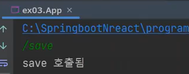

# CH15 리플렉션과 어노테이션

#### 소스코드

https://github.com/codingspecialist/java-reflection.git


자동차는 깃발을 보고, 어디로 갈지 결정하고, 이동을 합니다. 여기서 깃발은 어노테이션, 어디로 갈지 결정(= 분석)하는 것은 리플렉션, 이동(= 행위)를 하는 것을 메소드라고 합니다.

따라서 어노테이션, 리플렉션, 메소드는 쌍으로 이루어집니다.

## 1. 리플렉션

> 자바의 리플렉션(Reflection)은 실행 중인 프로그램의 클래스, 메서드, 필드 등에 대한 정보를 얻거나 조작하는 기능을 제공하는 API입니다. 즉, 클래스의 정보를 분석하거나, 클래스의 인스턴스를 생성하거나, 메서드를 호출하거나, 필드의 값을 가져오거나, 설정하는 등의 작업을 할 수 있습니다.
>
> 리플렉션은 다음과 같은 상황에서 유용합니다.
>
> 1. 런타임 시에 동적으로 클래스를 로드해야 하는 경우
> 2. 클래스의 구조, 메서드, 필드 등에 대한 정보를 가져와서 분석해야 하는 경우
> 3. 클래스의 인스턴스를 생성하거나 메서드를 호출하거나 필드의 값을 변경해야 하는 경우

## 2. 어노테이션

> 자바의 어노테이션(Annotation)은 프로그램의 코드에 메타데이터를 추가하는 기능을 제공하는 것으로, 컴파일러나 런타임 시에 코드를 처리하는 도구들에게 추가적인 정보를 제공합니다.
>
> 어노테이션은 `@어노테이션이름(속성1=값1, 속성2=값2, ...)` 형태로 사용하며, 주로 클래스, 메서드, 변수, 매개변수 등에 부착하여 사용됩니다.
>
> 자바에서 제공하는 어노테이션은 크게 세 가지 유형으로 나눌 수 있습니다.
>
> 1. 빌트인 어노테이션(Built-in Annotation) - 컴파일시 작동
>    - @Override: 상위 클래스나 인터페이스의 메서드를 오버라이드함을 나타냅니다.
>    - @Deprecated: 해당 요소(클래스, 메서드, 필드 등)가 더 이상 사용되지 않음을 나타냅니다.
>    - @SuppressWarnings: 컴파일러의 경고를 무시하도록 지정합니다.
> 2. 메타 어노테이션(Meta Annotation)
>    - @Retention: 어노테이션의 유지 정책을 지정합니다. (소스, 클래스, 런타임)
>    - @Target: 어노테이션을 부착할 수 있는 대상(클래스, 메서드, 필드 등)을 지정합니다.
>    - @Documented: 해당 어노테이션을 javadoc으로 문서화할 것인지를 나타냅니다.
>    - @Inherited: 해당 어노테이션을 상속 가능하도록 지정합니다.
> 3. 커스텀 어노테이션(Custom Annotation)
>    - 개발자가 직접 정의한 어노테이션으로, 애플리케이션에 맞는 사용자 정의 어노테이션을 만들 수 있습니다.
>
> 어노테이션은 주로 코드의 가독성을 높이고, 자동화된 코드 생성, 테스트, 디버깅 등에 활용됩니다.

## 3. 리플렉션과 어노테이션 실습

> ex01은 리플렉션을 사용하지 않는다. 그렇기 때문에 App.java를 팔 수 없다.
>
>ex02은 리플렉션을 사용하여 uri를 분석한다. 하지만, 컴퍼넌트 스캔을 .하지 않기 때문에 팔 수 없다.
>
> ex03은 리플렉션을 사용하여 URI를 분석하고, 컴퍼넌트 스캔을 통하여 객체를 생성한다. 팔 수 있다.

### (1) 실습코드

#### ex01

```java
public class App {

    public static void main(String[] args) {
        Scanner sc = new Scanner(System.in);
        String path = sc.nextLine();

        // path = "/login" -> uc.login() 호출
        // path = "/join" -> uc.join() 호출
        UserController uc = new UserController();

        if(path.equals("/login")){
            uc.login();
        }else if(path.equals("/join")){
            uc.join();
        } else if (path.equals("/loginForm")) { // 추가될 때마다 계속
            uc.loginForm();
        }
    }
}
```

```java
public class UserController {

    public void login(){
        System.out.println("login() 호출됨");
    }

    public void join(){
        System.out.println("join() 호출됨");
    }

    public void loginForm() { // 추가될 때마다 계속
        System.out.println("loginForm() 호출됨");
    }
}
```


단점은 매번 코드가 새로 추가될 때마다 알려달라고 해야합니다.

#### ex02

- 깃발 생성(= 어노테이션 생성)

```java
@Target(ElementType.METHOD) // FIELD, PARAMETER, TYPE_PARAMETER, TYPE, METHOD
@Retention(RetentionPolicy.RUNTIME) // SOURCE, RUNTIME, CLASS
public @interface RequestMapping {
    String uri(); // 추상메소드
}
```

- 깃발 등록(= 어노테이션 등록)

```java
public class UserController {

    @RequestMapping(uri = "/login") 
    public void login(){
        System.out.println("login() 호출됨");
    }

    @RequestMapping(uri = "/join")
    public void join(){
        System.out.println("join() 호출됨");
    }

    // 추가
    @RequestMapping(uri = "/joinForm")
    public void joinForm() {
        System.out.println("joinForm() 호출됨");
    }
}
```

> `누가 실수했는지 알 수 있다.`
> 
> 어느쪽에서 실수가 있었는지 정확하게 알 수 있습니다. 
> ```java
> @RequestMapping(uri = "joinFrom")
> public void joinForm() {
>    System.out.println("joinForm() 호출됨");
> }
>```
> 

- 깃발 분석(= 리플렉션)

```java
public class App {

    public static void findUri(UserController uc, String uri) throws Exception {
        boolean isFind = false;

        Method[] methods = uc.getClass().getDeclaredMethods(); // UserController의 모든 method 동적분석
        System.out.println(methods.length);

        for (Method mt : methods) {
            System.out.println(mt.getName()); // 모든 메소드 출력
            Annotation anno = mt.getDeclaredAnnotation(RequestMapping.class); // RequestMapping인지 확인(깃발 확인)
            RequestMapping rm = (RequestMapping) anno;

            if (rm.uri().equals(uri)) {
                isFind = true;
                mt.invoke(uc); // 해당 메소드 호출
            }
        }
        if(isFind == false){
            System.out.println("404 Not Found");
        }
    }

    public static void main(String[] args) throws Exception {
        // Scanner sc = new Scanner(System.in);
        // String uri = sc.nextLine(); // /login
        findUri(new UserController(), "/login"); // loginF 테스트
    }
}
```

#### ex03

- 깃발 생성(= 어노테이션 생성)

```java
@Target(ElementType.TYPE) // Class에 붙는다
@Retention(RetentionPolicy.RUNTIME)
public @interface Controller {
}
```

```java
@Target(ElementType.METHOD)
@Retention(RetentionPolicy.RUNTIME)
public @interface RequestMapping {
    String uri();
}
```

- 깃발 등록(= 어노테이션 등록)

```java
@Controller
public class UserController {

    @RequestMapping(uri = "/login")
    public void login() {
        System.out.println("login() 호출됨");
    }

    @RequestMapping(uri = "/join")
    public void join() {
        System.out.println("join() 호출됨");
    }
}
```

```java
@Controller
public class ReplyController {

    @RequestMapping(uri = "/reply")
    public void save() {
        System.out.println("댓글 쓰기 완료");
    }
}
```

```java
@Controller
public class BoardController {

    @RequestMapping(uri = "/save")
    public void save() {
        System.out.println("save 호출됨");
    }
}
```

- 깃발 분석(= 리플렉션)

```java
public class App {

    public static Set<Class> componentScan(String pkg) throws Exception {
        ClassLoader classLoader = Thread.currentThread().getContextClassLoader();
        Set<Class> classes = new HashSet<>(); // 자료구조: 중복 허용 X

        URL packageUrl = classLoader.getResource(pkg); // ex03 패키지 안의 모든 것 찾는 것
        File packageDirectory = new File(packageUrl.toURI());
        System.out.println(packageDirectory); // C:\fast_lab\ref2\out\production\ref2\ex03

        for (File file: packageDirectory.listFiles()) {
            if (file.getName().endsWith(".class")) {
                // App, BoardController, Controller, RequestMapping, UserController
                String className = pkg + "." + file.getName().replace(".class", "");
                System.out.println(className);

                Class cls = Class.forName(className); // 클래스 읽기(리플렉션 기술 )
                classes.add(cls);
            }
        }
        return classes;
    }

    // ex02: 매개변수 비교하기
    public static void findUri(Set<Class> classes, String uri) throws Exception {
        boolean isFind = false;
        for (Class cls : classes) {

            if (cls.isAnnotationPresent(Controller.class)) { // 해당 클래스에 어노테이션이 붙어있으면
                Object instance = cls.newInstance(); // new 하기 -> 컴포넌트 스캔
                Method[] methods = cls.getDeclaredMethods();

                for (Method mt : methods) {
                    Annotation anno = mt.getDeclaredAnnotation(RequestMapping.class);
                    RequestMapping rm = (RequestMapping) anno;
                    if (rm.uri().equals(uri)) {
                        isFind = true;
                        mt.invoke(instance);
                    }
                }
            }
        }
        if(isFind == false){
            System.out.println("404 Not Found");
        }
    }

    public static void main(String[] args) throws Exception{
        Scanner sc = new Scanner(System.in);
        String uri = sc.next();

        Set<Class> classes = componentScan("ex03");
        findUri(classes, uri);
    }
}
```




> `컴포넌트 스캔`
>
> 특정 패키지를 잡아서, 패키지 내부를 스캔하면서 new 하는 것
> ```java
> .
> .
> if (cls.isAnnotationPresent(Controller.class)) { // 해당 클래스에 어노테이션이 붙어있으면
>     Object instance = cls.newInstance(); // new 하기 -> 컴포넌트 스캔
>     Method[] methods = cls.getDeclaredMethods();
> .
> .
> ```

## 4. IoC 컨테이너

> 스프링(Spring) IoC(Inversion of Control) 컨테이너는 스프링 프레임워크의 핵심 기능 중 하나로, 객체의 생명 주기 관리와 의존성 주입(Dependency Injection)을 담당합니다. 이를 통해 스프링은 객체 지향 프로그래밍에서 느슨한 결합도(Loose Coupling)와 제어 역전(Inversion of Control)을 강조하는 개발 방식을 지원합니다.
> 
> 스프링 IoC 컨테이너의 주요 특징과 동작 방식은 다음과 같습니다:
> 
> 컨테이너: 스프링 IoC 컨테이너는 애플리케이션의 객체를 생성, 관리, 제공하는 역할을 합니다. 컨테이너는 빈(Bean)이라고 불리는 객체들을 인스턴스화하고, 필요한 의존성을 해결하여 객체를 주입합니다.
> 
> 빈(Bean): 스프링 IoC 컨테이너에서 관리되는 객체를 빈이라고 합니다. 빈은 컨테이너가 생성하고 관리하며, 애플리케이션에서 필요한 곳에서 사용됩니다. 빈은 설정 파일(XML 또는 애노테이션 등)이나 자바 설정 클래스를 통해 정의되며, 의존성 주입을 받을 수 있습니다.
> 
> 의존성 주입(Dependency Injection): 스프링 IoC 컨테이너는 객체 간의 의존성을 자동으로 주입해줍니다. 의존성 주입은 객체가 필요로 하는 의존성을 외부에서 주입하여 결합도를 낮추고 유연성과 재사용성을 높입니다. 의존성 주입은 생성자 주입, 세터 주입, 필드 주입 등의 방식으로 이루어집니다.
> 
> 컨테이너 설정: 스프링 IoC 컨테이너는 설정 파일(XML 또는 애노테이션 등)이나 자바 설정 클래스를 통해 컨테이너의 동작 방식을 정의합니다. 설정 파일은 빈의 정의, 빈 간의 의존성 설정, 빈의 생명 주기 등을 포함합니다. 설정 파일은 컨테이너가 로드되고 초기화될 때 읽혀져 컨테이너의 동작을 결정합니다.
> 
> 스프링 IoC 컨테이너를 사용하면 객체의 생명 주기 관리와 의존성 주입을 컨테이너에 위임하여 코드의 유지보수성과 테스트 용이성을 향상시킬 수 있습니다. 또한, 스프링은 다양한 기능과 모듈을 제공하여 애플리케이션 개발을 더욱 편리하게 지원합니다.


- IoC 동작 순서
  - base 패키지를 탐색(project 명, shop.mtcoding.filterandhandler)
  - 컴포넌트 스캔
    - 깃발 check, IoC 등록
  - new할 때는 싱글톤 시반
    - 2개생성 불가

리플렉션을 사용하는 것보다 IoC에 등록된 것들을 사용하는 것이 훨씬 좋습니다. 왜나하면 리플렉션을 사용하면 전부 분석을 하기 때문에 비효율적입니다.

## 5. 마인드 맵

