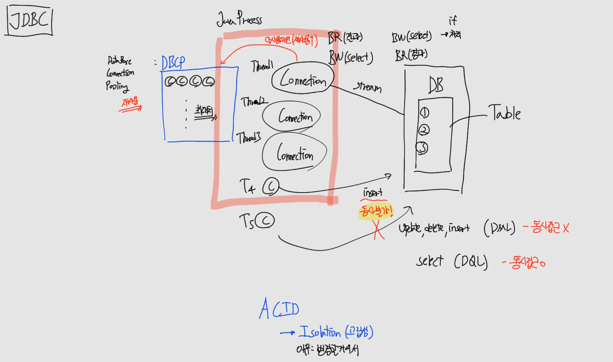
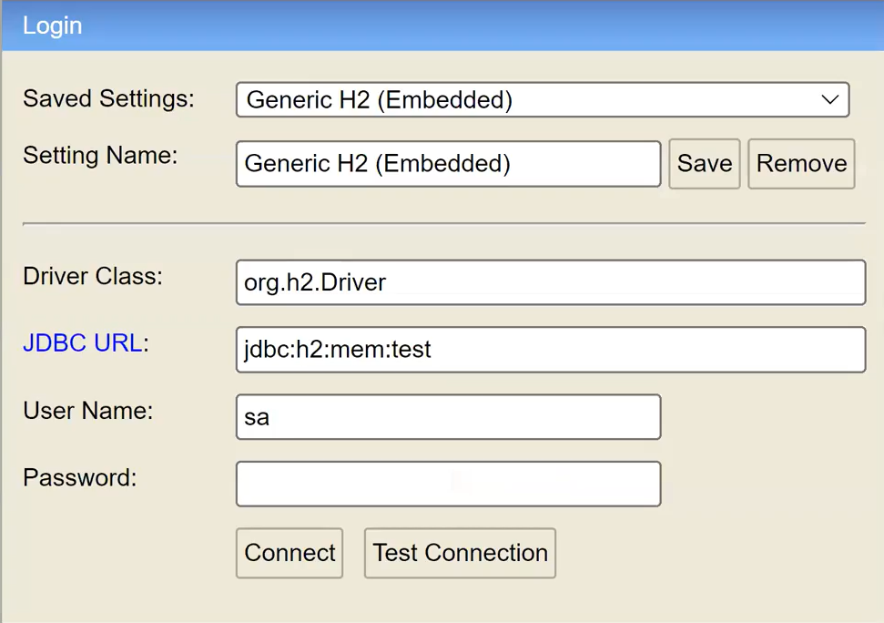
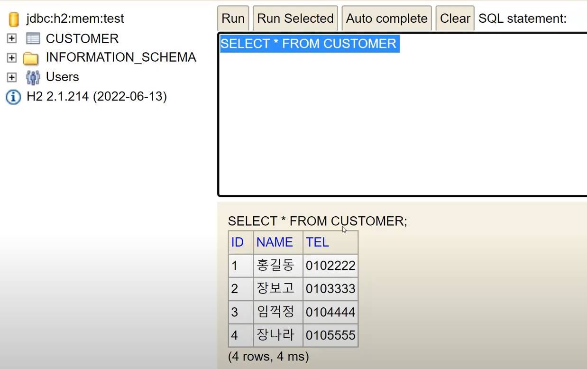
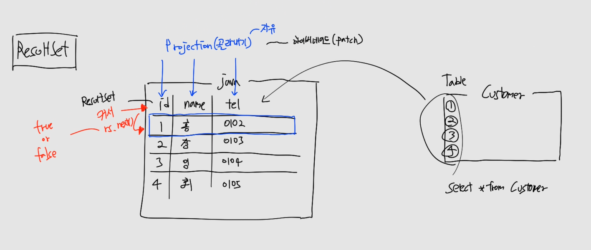
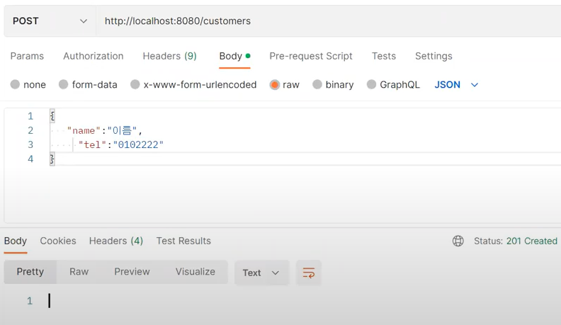
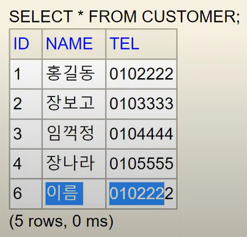
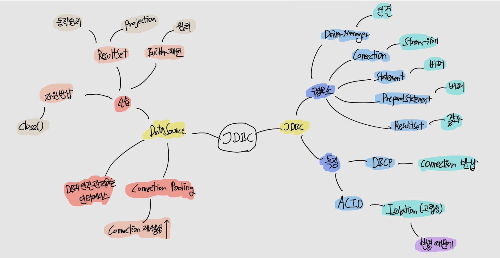

# CH16 스프링부트 레파지토리(저장소) - JDBC

### 소스코드

https://github.com/codingspecialist/Springboot-JDBC.git

## 1. JDBC

> JDBC(Java Database Connectivity)는 자바 언어에서 데이터베이스에 접속하고 SQL 쿼리를 실행하기 위한 API입니다.
>
> JDBC API는 데이터베이스에 대한 일반적인 인터페이스를 제공하여, 다양한 데이터베이스와 연결할 수 있도록 합니다. 이를 통해 개발자는 데이터베이스 연결과 관련된 작업을 프로그래밍으로 처리할 수 있습니다.
>
> JDBC API의 주요 구성 요소는 다음과 같습니다.
>
> 1. Driver Manager
>
> JDBC 드라이버를 로드하고 데이터베이스 연결을 관리하는 클래스입니다.
>
> 1. Connection
>
> 데이터베이스와의 연결을 나타내는 객체입니다.
>
> 1. Statement(프로토콜이 내장된 버퍼)
>
> SQL 쿼리를 실행하는 데 사용되는 객체입니다.
>
> 1. PreparedStatement(프로토콜이 내장된 버퍼)
>
> 미리 컴파일된 SQL 쿼리를 실행하는 데 사용되는 객체입니다.
>
> 1. ResultSet(결과를 받는 곳)
>
> SQL 쿼리 실행 결과로 반환된 데이터를 처리하는 데 사용되는 객체입니다.
>
> JDBC API를 사용하여 데이터베이스와 상호 작용하는 일반적인 절차는 다음과 같습니다.
>
> 1. JDBC 드라이버 로드
> 2. 데이터베이스 연결
> 3. SQL 쿼리 실행
> 4. 쿼리 실행 결과 처리
> 5. 데이터베이스 연결 해제
>
> JDBC API는 다양한 데이터베이스와 호환되며, 데이터베이스의 종류나 버전에 따라 조금씩 다른 구현 방법이 필요할 수 있습니다. 따라서, JDBC API를 사용할 때는 데이터베이스와의 호환성을 고려하여 구현해야 합니다.



- JDBC특징
  - DBCP(DataBase Connection Pooling)에서 Connection을 가져다가 사용 후 반드시 반납(재사용성)
  - DB에 Connection이 연결될 때마닫 Thread 가 달림
  - 또한 1개의 Thread에서 insert 작업 시, 다른 Thread는 update, delete, insert 불가
    - ACID의 I(Isolation, 고립성) 반영
    - 이유 : insert로 변경 할 것이기 때문에

## 2. DataSource

> Java에서 DataSource는 데이터베이스와의 연결을 관리하는 인터페이스입니다. JDBC를 사용하여 데이터베이스에 연결할 때는 DriverManager를 사용하여 연결을 관리하지만, DataSource를 사용하면 더욱 안정적인 데이터베이스 연결을 구현할 수 있습니다.
>
> DataSource는 일반적으로 커넥션 풀링(connection pooling)을 구현하며, 데이터베이스와의 연결을 미리 만들어두고 필요할 때마다 커넥션을 재사용하여 성능을 향상시킵니다. 또한, DataSource는 데이터베이스와의 연결을 설정하는 데 필요한 정보를 포함하며, 데이터베이스 종류, 호스트, 포트, 사용자 이름, 비밀번호 등의 정보를 설정할 수 있습니다.
>
> Java에서는 javax.sql.DataSource 인터페이스를 제공하며, 이 인터페이스를 구현하는 다양한 데이터베이스 연결 풀 라이브러리가 존재합니다. 예를 들어, Apache Commons DBCP, HikariCP, Tomcat JDBC 등이 있습니다. 이러한 라이브러리를 사용하여 DataSource를 쉽게 구현할 수 있으며, 데이터베이스 연결 관리를 편리하게 할 수 있습니다.

### (1) 세팅

#### gradle

```gradle
dependencies {
   implementation 'org.springframework.boot:spring-boot-starter-jdbc'
   implementation 'org.springframework.boot:spring-boot-starter-web'
   compileOnly 'org.projectlombok:lombok'
   developmentOnly 'org.springframework.boot:spring-boot-devtools'
   runtimeOnly 'com.h2database:h2'
   annotationProcessor 'org.projectlombok:lombok'
   testImplementation 'org.springframework.boot:spring-boot-starter-test'
}
```

- h2database : Spring 뜰때, 잠깐 뜨는 데이터베이스

#### application.yml

```yml
server:
  port: 8080
  servlet:
    encoding:
      charset: utf-8
      force: true # 고정시키기
spring:
  datasource:
    url: jdbc:h2:mem:test;MODE=MySQL # MySQL 모드로 바꾸기, 모드 변경 가능
    driver-class-name: org.h2.Driver
    username: sa
    password:
  sql:
    init:
      schema-locations: # 서버 실행시 테이블을 자동 생성
        - classpath:db/table.sql # classpath 는 resource 폴더 의미
      data-locations:
        - classpath:db/data.sql
  h2:
    console:
      enabled: true # h2 접속 가능하게 함
```

#### resources/db

- data.sql

```sql
insert into customer(name, tel) values('홍길동', '0102222');
insert into customer(name, tel) values('장보고', '0103333');
insert into customer(name, tel) values('임꺽정', '0104444');
insert into customer(name, tel) values('장나라', '0105555');
```

- table.sql

```sql
create table customer
(
    id int auto_increment primary key,
    name varchar(10) not null,
    tel varchar(10) not null
);
```

#### localhost:8080/h2-console





### (2) 실습코드

#### model

- model/Customer.java

```java
@Setter
@Getter
public class Customer {
    private Long id;
    private String name;
    private String tel;

    public Customer() {
        // Jackson은 리플렉션으로 발동하기 때문에 setter가 없어도 private 변수에 접근 가능
        System.out.println("Jackson 발동시 디폴트 생성자 실행");
    }

    @Builder
    public Customer(Long id, String name, String tel){
        System.out.println("조회시에 mapper 동작할 때 풀 생성자 실행");
        this.id = id;
        this.name = name;
        this.tel = tel;
    }

    public void update(String name, String tel){
        this.name = name;
        this.tel = tel;
    }
}
```

- model/CustomerRepository.java

```java
@Slf4j
@Repository
public class CustomerRepository {

    private DataSource dataSource; // IoC에 있음

    public CustomerRepository(DataSource dataSource) { // DI
        this.dataSource = dataSource;
    }

    public void save(Customer customer) {
        Connection connection = null; // stream 연결해야 되서
        PreparedStatement statement = null; // 버퍼로 써야하니까(프로토콜 존재)
        try {
            String sql = "INSERT INTO customer (name, tel) VALUES (?, ?)"; // 쿼리 생성
            connection = dataSource.getConnection(); // DBCP에서 connection 가져오기

            statement = connection.prepareStatement(sql); // 버퍼에 sql 담기(프로토콜)
            statement.setString(1, customer.getName()); // ? 바인딩
            statement.setString(2, customer.getTel()); // ? 바인딩

            statement.executeUpdate(); // flush, executeUpdate : insert, delete, update만 사용
        } catch (SQLException e) {
            log.error(e.getMessage()); // sentry.io
            throw new RuntimeException(e.getSQLState());
        } finally { // 무조건 실행하는 것
            try {
                statement.close(); // 자원 반납
                connection.close(); // 자원 반납(DBCP)
            } catch (SQLException e) {
                log.error(e.getMessage());
            }
        }
    }

    public void update(Customer customer) {
        Connection connection = null;
        PreparedStatement statement = null;
        try {
            String sql = "UPDATE customer SET name = ?, tel = ? WHERE id = ?";
            connection = dataSource.getConnection();
            statement = connection.prepareStatement(sql);
            statement.setString(1, customer.getName());
            statement.setString(2, customer.getTel());
            statement.setLong(3, customer.getId());
            statement.executeUpdate();
        } catch (SQLException e) {
            log.error(e.getMessage());
            throw new RuntimeException(e.getSQLState());
        } finally {
            try {
                statement.close();
                connection.close();
            } catch (SQLException e) {
                log.error(e.getMessage());
            }
        }
    }

    public void delete(Long id) {
        Connection connection = null;
        PreparedStatement statement = null;
        try {
            String sql = "DELETE FROM customer WHERE id = ?";
            connection = dataSource.getConnection();
            statement = connection.prepareStatement(sql);
            statement.setLong(1, id);
            statement.executeUpdate();
        } catch (SQLException e) {
            log.error(e.getMessage());
            throw new RuntimeException(e.getSQLState());
        } finally {
            try {
                statement.close();
                connection.close();
            } catch (SQLException e) {
                log.error(e.getMessage());
            }
        }
    }

    public Customer findById(Long id) {
        Connection connection = null;
        PreparedStatement statement = null;
        ResultSet rs = null; // 결과를 받아와야 해서
        try {
            String sql = "SELECT * FROM customer WHERE id = ?";
            connection = dataSource.getConnection();
            statement = connection.prepareStatement(sql);
            statement.setLong(1, id);
            rs = statement.executeQuery(); // executeQuery는 ResultSet 반환
            if (rs.next()) { // 1번만 커서 이동
                return mapper(rs);
            } else {
                throw new RuntimeException("DB warning : 해당 id의 고객이 없습니다");
            }
        } catch (SQLException e) {
            log.error(e.getMessage());
            throw new RuntimeException(e.getSQLState());
        } finally {
            try {
                rs.close();
                statement.close();
                connection.close();
            }catch (SQLException e){
                log.error(e.getMessage());
            }
        }
    }

    public List<Customer> findAll(int page) {
        Connection connection = null;
        PreparedStatement statement = null;
        ResultSet rs = null;
        try {
            final int row = 2;
            String sql = "SELECT * FROM customer limit ?, ?"; // 1페이지에 2개씩 (페이징)
            connection = dataSource.getConnection();
            statement = connection.prepareStatement(sql);
            statement.setInt(1, page * row);
            statement.setInt(2, row);
            rs = statement.executeQuery();
            List<Customer> customers = new ArrayList<>();
            while (rs.next()) {
                Customer c = mapper(rs);
                customers.add(c);
            }
            return customers;
        } catch (SQLException e) {
            log.error(e.getMessage());
            throw new RuntimeException(e.getSQLState());
        } finally {
            try {
                rs.close();
                statement.close();
                connection.close();
            }catch (SQLException e){
                log.error(e.getMessage());
            }
        }
    }

    // Object Mapping -> JDBC의 경우 개발자가 직접 제어, 귀찮다.
    public Customer mapper(ResultSet rs) throws SQLException {
        System.out.println("mapper 실행");
        return new Customer(
            rs.getLong("id"), 
            rs.getString("name"), 
            rs.getString("tel")
        ); // Projection 3개 -> 선택해서 Projection 할 수 있다.
    }
}
```

> `빌더 패턴의 원리(선택적 매개변수)`
> 
> ```java
> public class Person {
>     private int id;
>     private String name;
> 
>     public Person id(int id) { // setter
>         this.id = id;
>         return this; // 항상 자기자신 리턴하기
>     }
> 
>     public Person name(String name) {
>         this.name = name;
>         return this; // 항상 자기자신 리턴하기
>     }
> 
>     public static Person builder() { // setter
>         return new Person();
>     }
> 
>     public static void main(String[] args) {
>         Person p = Person.builder().id(1).name("ssar");
>     }
> }
> ```

> `Builder 패턴을 이용한 Projection`
>
>```java
> // Object Mapping -> JDBC의 경우 개발자가 직접 제어, 귀찮다.
> public Customer mapper(ResultSet rs) throws SQLException {
>   System.out.println("mapper 실행");
>   return Customer.builder()
>       .id(rs.getLong("id"))
>       .name(rs.getName("name"))
>       .build();
> }
> ```

> `ResultSet, Projection`
>
> 
> Customer에 있는 1 ~ 4번을 자바 세상을 가져오게 되면 표처럼 되어있습니다. 그리고 ResultSet은 이때 id, name, tel row에 위치하게 됩니다.
> 
> rs.next() 실행 시, 커서가 밑으로 한칸 내려가게 됩니다. 따라서 findById 의 경우 1번만 rs.next() 가 실행이 되고, findAll 경우는 while 을 돌면서 커서를 가장 끝까지 가도록 만듭니다.
> 
> rs.next()는 return 값으로 true와 false를 주기 때문에 해당 row의 존재여부를 알 수 있습니다.
>
> 그리고 존재하는 row를 Project을 통해 원하는 값들을 골라올 수 있습니다. JDBC 에서는 Projection, Hibernate에서는 Patch라고 부릅니다.

#### handler

- handler/ExHandler.java

```java
@ControllerAdvice
public class ExHandler {

    @ExceptionHandler(RuntimeException.class)
    public ResponseEntity<?> dbError(RuntimeException e){
        ResponseDto<?> dto = new ResponseDto<>(e.getMessage());
        return new ResponseEntity<>(dto, HttpStatus.INTERNAL_SERVER_ERROR);
    }
}
```

#### dto

- dto/ResponseDto.java

```java
@Getter @Setter
public class ResponseDto<T> {
    private String msg;
    private T data;

    public ResponseDto(String msg) {
        this.msg = msg;
    }

    public ResponseDto(String msg, T data) {
        this.msg = msg;
        this.data = data;
    }
}
```

#### controller

- controller/CustomerController.java

```java
@RestController
public class CustomerController {

    private CustomerRepository customerRepository;

    public CustomerController(CustomerRepository customerRepository) {
        this.customerRepository = customerRepository;
    }

    @GetMapping("/customers/{id}")
    public ResponseEntity<?> findById(@PathVariable Long id){
        Customer customerPS = customerRepository.findById(id);
        ResponseDto<?> dto = new ResponseDto<>("한건 조회 성공", customerPS);
        return new ResponseEntity<>(dto, HttpStatus.OK);
    }

    @GetMapping("/customers")
    public ResponseEntity<?> findAll(@RequestParam(defaultValue = "0") int page){
        List<Customer> customerListPS = customerRepository.findAll(page);
        ResponseDto<?> dto = new ResponseDto<>("전체 조회 성공", customerListPS);
        return new ResponseEntity<>(dto, HttpStatus.OK);
    }

    @PostMapping("/customers")
    public ResponseEntity<?> save(@RequestBody Customer customer) {
        customerRepository.save(customer);
        return new ResponseEntity<>(HttpStatus.CREATED);
    }

    @PutMapping("/customers/{id}")
    public ResponseEntity<?> update(@PathVariable Long id, @RequestBody Customer customer){
        // 1. 존재 여부 확인 : 최소한의 트랜잭션 발동 and Setter 만들지 않기
        Customer customerPS = customerRepository.findById(id);
        
        // 2. 객체 값 변경
        customerPS.update(customer.getName(), customer.getTel());
        
        // 3. 변경된 객체로 DB 수정
        customerRepository.update(customerPS);
        return new ResponseEntity<>(HttpStatus.OK);
    }

    @DeleteMapping("/customers/{id}")
    public ResponseEntity<?> delete(@PathVariable Long id){
        // 1. 존재 여부 확인 : 최소한의 DB 트래픽
        customerRepository.findById(id);
        
        // 2. 존재하면 삭제
        customerRepository.delete(id);
        return new ResponseEntity<>(HttpStatus.OK);
    }
}
```

- save 메소드 실행





## 2. 마인드 맵

