# CH17 스프링부트 레파지토리(저장소) - Hibernate JPQL

#### 소스코드

https://github.com/codingspecialist/Springboot-Hirbernate.git

## 1. Hibernate

> 스프링부트에서 Hibernate는 ORM(Object-Relational Mapping) 기술을 사용하여 데이터베이스와의 상호 작용을 쉽게 할 수 있도록 지원합니다.
>
> Hibernate를 사용하면 자바 객체와 데이터베이스 테이블 간의 매핑을 쉽게 설정할 수 있으며, 객체(자바 Object)를 데이터베이스에 저장, 검색, 수정 및 삭제할 수 있습니다. 즉, 자바 오브젝트로 DB를 다룰 수 있습니다. Hibernate는 이러한 기능을 제공하기 위해 JPA(Java Persistence API)를 구현하며, JPA는 Java에서 ORM을 구현하기 위한 API 표준입니다.
>
> 스프링부트에서 Hibernate를 사용하려면, `spring-boot-starter-data-jpa` 의존성을 추가하고, `application.yml` 파일에 데이터베이스 연결 정보를 설정합니다. 또한, Entity 클래스를 작성하여 데이터베이스와 매핑을 설정합니다. Entity 클래스는 데이터베이스 테이블과 매핑됩니다.
>
> Hibernate를 사용하면 데이터베이스 연결, 트랜잭션 관리 등의 기능을 쉽게 구현할 수 있습니다. 또한, Hibernate는 캐싱, 지연로딩 등의 기능을 제공하여 성능을 향상시킬 수 있습니다.

### (1) JDBC와 Hibernate 차이점

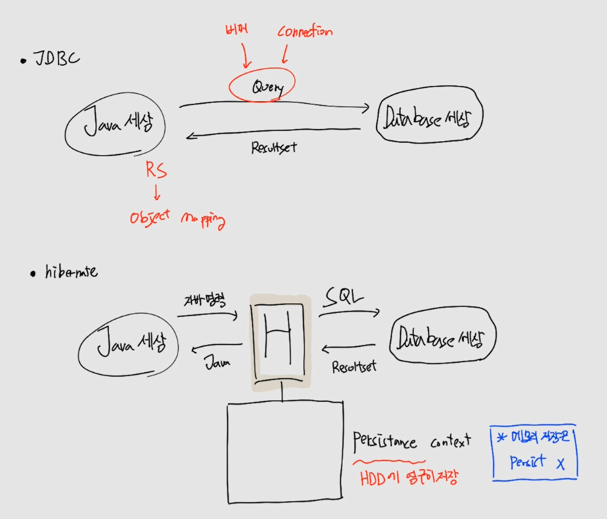

16장에서는 JDBC를 통해서 Java에서 Database로 직접 Query를 날리고 그 결과를 Resultset으로 받아왔습니다. 받아온 Resultset을 Projection을 통해서 ObjectMapping을 했습니다.

하이버네이트는 JDBC처럼 하지 않고 Java와 Database 사이에 Hibernate가 존재합니다. Java는 Hibernate에게 자바 명령을 하고 Java를 리턴받으며, Datebase는 Hibernate애개 SQL을 날리고 Resultset을 전달받습니다.

즉, Hibernate는 기존 JDBC에서 했던 중간과정을 전부 처리해줍니다. 따라서 우리는 Java 명령을 주고, Java Object를 받는 것에 집중을 하면 됩니다.

> `Hibernate, Persistance Context`
>
> Persist는 HDD에 영구히 저장하는 것입니다. 메모리에 저장하는 것이 아닙니다.

## 2. ORM

> OM은 객체지향 프로그래밍 언어에서 데이터베이스에 저장된 데이터를 객체로 변환하는 기술을 말합니다. 즉, Object Mapping은 Projection해서 Object에 옮기는 것을 의미합니다. 이 때, 객체와 데이터베이스 사이의 매핑을 수동으로 정의하고 구현합니다.
>
> ORM은 객체지향 프로그래밍 언어와 관계형 데이터베이스 사이의 데이터를 변환하는 기술로, ORM 프레임워크가 자동으로 객체와 테이블 간의 매핑을 수행합니다. ORM은 JPA(Java Persistence API)와 같은 표준 API를 사용하여 데이터베이스와 연동할 수 있습니다.
>
> 즉, OM은 ORM의 일종으로 볼 수 있습니다. OM은 ORM보다 덜 복잡하지만, 매핑 작업을 직접 수행해야 하므로 시간과 노력이 더 필요합니다. ORM은 매핑 작업을 자동화하여 생산성을 높이고, 객체지향적인 코드 작성을 촉진합니다.

### (1) Object Mapping 과 Object Relation Mapping 차이점

```java
class Board {
    private int id; // OM
    private String title; // OM
    private String content; // OM
    private User user; // ORM, FK
}

class User {
    private int id;
    private String username;
    private String password;
}
```
```sql
SELECT * FROM board WHERE id = 1
```

위에와 같은 쿼리를 날린다면, board에서 id, title, content 까지는 Object Mapping으로 데이터를 가져옵니다. 하지만 user의 경우는 User와 관계가 있으므로 관련된 user까지 끌고와서 맵핑을 합니다. 이것을 Object Relation Mapping 이라고 합니다.

## 3. 의존성

> H2 데이터베이스는 오픈 소스 기반의 경량형 인메모리 데이터베이스로, 자바에서 사용할 수 있습니다. 스프링부트에서는 H2 데이터베이스를 기본적으로 지원하며, 별도의 설정 없이 쉽게 사용할 수 있습니다.
>
> H2 데이터베이스는 다음과 같은 특징을 가지고 있습니다.
>
> 1. 인메모리 데이터베이스로서 파일로 저장되지 않습니다.
> 2. 경량형 데이터베이스이기 때문에 실행 속도가 빠릅니다.
> 3. JDBC API를 지원하므로 자바에서 간단하게 사용할 수 있습니다.
> 4. MySQL, PostgreSQL 등과 유사한 SQL 문법을 지원합니다.
> 5. 쿼리 결과를 웹 브라우저를 통해 확인할 수 있는 콘솔 기능을 제공합니다.

```gradle
dependencies {
   implementation 'org.springframework.boot:spring-boot-starter-data-jpa'
   implementation 'org.springframework.boot:spring-boot-starter-web'
   compileOnly 'org.projectlombok:lombok'
   developmentOnly 'org.springframework.boot:spring-boot-devtools'
   runtimeOnly 'com.h2database:h2'
   annotationProcessor 'org.projectlombok:lombok'
   testImplementation 'org.springframework.boot:spring-boot-starter-test'
}
```

## 4. Application.yml 설정

> `방언`
> 1. Oracle 모드 `jdbc:h2:mem:test;MODE=Oracle` Oracle 데이터베이스와 유사한 기능을 제공합니다.
> 2. PostgreSQL 모드 `jdbc:h2:mem:test;MODE=PostgreSQL` PostgreSQL 데이터베이스와 유사한 기능을 제공합니다.
> 3. DB2 모드 `jdbc:h2:mem:test;MODE=DB2` IBM DB2 데이터베이스와 유사한 기능을 제공합니다.
> 4. MSSQLServer 모드 `jdbc:h2:mem:test;MODE=MSSQLServer` Microsoft SQL Server 데이터베이스와 유사한 기능을 제공합니다.
> 5. MySQL 모드 jdbc:h2:mem:test;MODE=MySQL

```yaml
server:
  servlet:
    encoding:
      charset: utf-8
      force: true

spring:
  datasource:
    url: jdbc:h2:mem:test;MODE=MySQL
    driver-class-name: org.h2.Driver
    username: sa
    password:
  h2:
    console:
      enabled: true

  jpa:
    hibernate:
      ddl-auto: create # create : 자동생성
      # DDL(Data Definition Language)을 자동으로 작성하여 테이블을 생성하거나 수정해주는 것 
    show-sql: true # 실행 시, 콘솔에 테이블 생성 쿼리발동
    properties:
      hibernate:
        format_sql: true # 콘솔 쿼리문을 이쁘게 만듬
```

> ddl-auto를 설정하면 @Entity로 선언된 객체의 테이블을 서버실행시에 생성해줍니다. 만약에 테이블이 존재한다면 drop후에 다시 생성해줍니다.
>
> show-sql: true로 설정하면 hibernate가 실행하는 쿼리를 로그로 보여줍니다.
>
> h2.console.enabled: true로 설정하면 localhost:8080/h2-console 에서 DB를 다룰 수 있게 됩니다.

- ddl-auto, show-sql, format_sql 확인

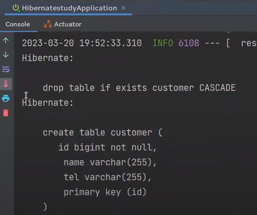

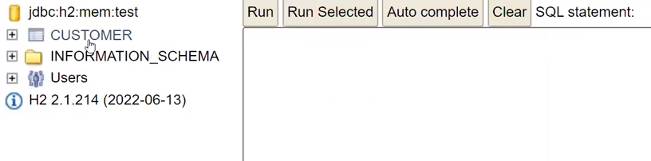

> `필드 추가 테스트`
> 
> ```java
> @Getter
> @Table(name = "customer_tb")
> @Entity
> public class Customer {
> 
>     @Id
>     private Long id;
>     private String name;
>     private String tel;
>     private String hahaha; // 테스트
> ```
> 
> 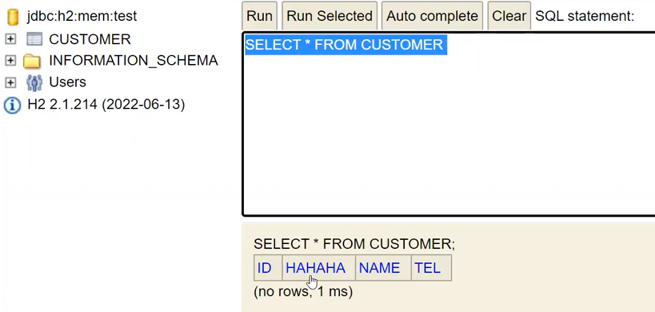

## 5. Entity

> @Entity를 붙이면 Hibernate가 관리하는 객체가 됩니다.
> @Id 는 해당 필드를 Primary Key로 사용하겠다고 Hibernate에게 알려주는 어노테이션입니다.
> @GeneratedValue(strategy = GenerationType.IDENTITY)로 Auto_Increment로 PK 자동증가를 설정합니다.
> 필드에 아무런 어노테이션이 없으면 String은 varchar(255)로 설정됩니다.

- model/Customer.java

```java
@Table(name = "customer_tb")
@Getter
@Entity // 하이버네이트가 관리해주는 어노테이션
public class Customer {

    @Id // PK
    @GeneratedValue(strategy = GenerationType.IDENTITY) // auto increment 전략
    private Long id;
    private String name;
    private String tel;

    public Customer() {
        // setter가 없지만, 리플렉션을 통해서 private 변수에 직접 접근해서 값을 할당
        System.out.println("디폴트 생성자 호출 : Hibernate가 DB 레코드를 영속화(자바 객체로) 시킬 때");
    }

    @Builder // 선택적 매개변수
    public Customer(Long id, String name, String tel){
        System.out.println("조회시에 mapper 동작할 때 풀 생성자 실행");
        this.id = id;
        this.name = name;
        this.tel = tel;
    }

    // 의미있는 setter
    public void update(String name, String tel){
        this.name = name;
        this.tel = tel;
    }
}
```

> `@GeneratedValue(strategy = GenerationType.IDENTITY) 이외에도 Hibernate에서는 다음과 같은 자동 생성 전략을 제공합니다.`
>
> 1. GenerationType.AUTO: 데이터베이스에 따라 자동으로 GenerationType.IDENTITY, GenerationType.SEQUENCE, GenerationType.TABLE 중 하나를 선택합니다.
> 2. GenerationType.SEQUENCE: 데이터베이스 시퀀스를 이용하여 PK 값을 생성합니다. 이 전략을 사용할 때는 @SequenceGenerator 어노테이션을 이용하여 시퀀스를 생성해야 합니다.
> 3. GenerationType.TABLE: 데이터베이스에 별도의 테이블을 생성하여 PK 값을 관리합니다. 이 전략을 사용할 때는 @TableGenerator 어노테이션을 이용하여 테이블을 생성해야 합니다.
> 4. GenerationType.IDENTITY: 데이터베이스의 Identity 컬럼을 이용하여 PK 값을 생성합니다. 이 전략을 사용할 때는 데이터베이스가 Identity 컬럼을 지원하는지 확인해야 합니다
>
> GenerationType.IDENTITY는 데이터베이스의 Identity 컬럼을 이용하여 PK 값을 생성하는 자동 생성 전략입니다. 이 때, 데이터베이스의 Identity 컬럼이란 데이터베이스에서 자동으로 값을 생성해주는 기능을 가진 컬럼을 의미합니다. 이 기능을 지원하는 데이터베이스에는 MySQL, SQL Server, PostgreSQL 등이 있습니다.
>
> 그러나 Identity 컬럼이 지원되지 않는 데이터베이스에서는 GenerationType.IDENTITY 전략을 사용할 수 없습니다. 이 경우에는 다른 자동 생성 전략을 사용해야 합니다. 그리고 데이터베이스의 Identity 컬럼이 제대로 설정되어 있지 않으면, GenerationType.IDENTITY 전략을 사용해도 PK 값을 제대로 생성하지 못할 수 있습니다. 따라서 데이터베이스의 Identity 컬럼이 잘 설정되어 있는지 확인하고, 사용 가능한 데이터베이스인지 여부를 먼저 파악해야 합니다.

> `@GeneratedValue - auto_increment 확인`
>
> 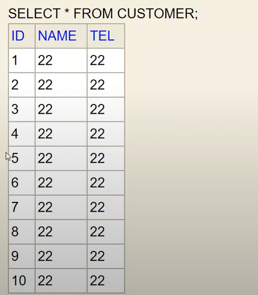

## 6. CreateNativeQuery

JDBC 코드랑 비교하면 훨씬 간결해졌습니다. 왜나하면 Hibernate가 connection의 연결, connection 회수 등 여러가지들을 대신 해주기 때문입니다.

### (1) 실습코드

#### NativeQueryRepository

- model/CustomerNativeQueryRepository.java

```java
@Slf4j
@Repository
public class CustomerNativeQueryRepository {

    private EntityManager em;

    public CustomerNativeQueryRepository(EntityManager em) {
        this.em = em;
    }

    @Transactional
    public void save(Customer customer) {
        Query query = em.createNativeQuery("INSERT INTO customer (name, tel) VALUES (:name, :tel)"); // 실제 쿼리 작성
        query.setParameter("name", customer.getName()); // 바인딩
        query.setParameter("tel", customer.getTel()); // 바인딩
        query.executeUpdate(); // executeUpdate : insert, delete, update만 사용
    }

    @Transactional
    public void update(Customer customer) {
        Query query = em.createNativeQuery("UPDATE customer SET name = :name, tel = :tel WHERE id = :id");
        query.setParameter("name", customer.getName());
        query.setParameter("tel", customer.getTel());
        query.setParameter("id", customer.getId());
        query.executeUpdate();
    }

    @Transactional
    public void delete(Customer customer) {
        Query query = em.createNativeQuery("DELETE FROM customer WHERE id = :id");
        query.setParameter("id", customer.getId());
        query.executeUpdate();
    }

    public Customer findById(Long id) {
        Query query = em.createNativeQuery("SELECT * FROM customer WHERE id = :id", Customer.class);
        query.setParameter("id", id);
        return (Customer) query.getSingleResult(); // 1건
    }

    public List<Customer> findAll(int page) {
        final int row = 2;
        Query query = em.createNativeQuery("select * from customer limit :page, :row", Customer.class);
        query.setParameter("page", page*row);
        query.setParameter("row", row);
        return query.getResultList(); // 리스트
    }
}
```

#### NativeQueryRepositoryTest

- test/java/shop/mtcoding/hibernatestudy/model/CustomerNativeQueryRepositoryTest.java

```java
@Import(CustomerNativeQueryRepository.class)
@DataJpaTest
public class CustomerNativeQueryRepositoryTest {

    @Autowired
    private CustomerNativeQueryRepository customerRepository;
    @Autowired
    private EntityManager em;

    @BeforeEach
    public void setUp(){
        em.createNativeQuery("ALTER TABLE customer ALTER COLUMN `id` RESTART WITH 1").executeUpdate();
        customerRepository.save(new Customer(1L, "고객1", "0101111"));
        customerRepository.save(new Customer(2L, "고객2", "0102222"));
        customerRepository.save(new Customer(3L, "고객3", "0103333"));
    }

    @Test
    public void save_test(){
        // given
        Customer customer = new Customer(null, "고객4", "0104444");

        // when
        customerRepository.save(customer);

        //then
        Customer customerPS = customerRepository.findById(4L);
        Assertions.assertThat(customerPS.getId()).isEqualTo(4L);
        Assertions.assertThat(customerPS.getName()).isEqualTo(customer.getName());
        Assertions.assertThat(customerPS.getTel()).isEqualTo(customer.getTel());
    }

    @Test
    public void update_test(){
        // given
        Customer customer = new Customer(3L, "고객3", "0109999");

        // when
        customerRepository.update(customer);

        //then
        Customer customerPS = customerRepository.findById(3L);
        Assertions.assertThat(customerPS.getTel()).isEqualTo(customer.getTel());
    }

    @Test
    public void delete_test(){
        // given
        Customer customer = new Customer(3L, "고객3", "0103333");

        // when
        customerRepository.delete(customer);

        //then
        Assertions.assertThatThrownBy(()->{
            customerRepository.findById(3L);
        });

    }

    @Test
    public void findById_test(){
        // given
        Long id = 1L;

        // when
        Customer customerPS = customerRepository.findById(id);

        //then
        Assertions.assertThat(customerPS.getTel()).isEqualTo("0101111");
    }

    @Test
    public void findAll_test(){
        // given
        int page = 0;

        // when
        List<Customer> customerListPS = customerRepository.findAll(page);

        //then
        Assertions.assertThat(customerListPS.size()).isEqualTo(2);
    }
}
```

## 7. CreateQuery (JPQL)

### (1) 실습코드

#### CustomerRepository

- model/CustomerRepository.java

```java
@Slf4j
@RequiredArgsConsturctor
@Repository
public class CustomerRepository {
    
    private final EntityManager em; // DI

    @Transactional
    public Customer save(Customer customer) {
        // customer 비영속 (id = null)
        em.persist(customer); // 영속화 -> 자동 flush
        // customer 영속 (id = 1)
        return customer;
    }

    public Customer findById(Long id) {
        return em.find(Customer.class, id); // 조회 후, Customer에 Mapping
    }

    @Transactional
    public Customer update(Customer customer) {
        // 트랜잭션 시작
        return em.merge(customer);
        // 트랜잭션 종료(영속객체 변경 감지 자동 flush)
    }

    @Transactional
    public void delete(Customer customer) {
        em.remove(customer);
    }

    public List<Customer> findAll(int page) {
        final int row = 2;
        // JPQL 작성 -> 자바 객체 이름 넣기 Customer
        // Projection -> c.id, c.name
        return em.createQuery("select c from Customer c", Customer.class)
                .setFirstResult(page * row)
                .setMaxResults(row)
                .getResultList();
    }
}
```

#### RepositoryTest

- test/java/shop/mtcoding/hibernatestudy/model/CustomerRepositoryTest.java
  - 실행 후, insert 쿼리 로그 확인

```java
/**
 * DataJpaTest 특징
 * 1) hibernate(Entity Manager, db연결 객체) -> JpaRespository를 상속한 클래스만 띄운다.
 * 2) @Transactional을 가지고 있어, Test마다 roll back 된다.
 */ 
@Import(CustomerRepository.class) // CustomerRepository 강제로 띄우기
@DataJpaTest
public class CustomerRepositoryTest {

    @Autowired
    private CustomerRepository customerRepository;
    @Autowired
    private EntityManager em;

    @Test
    public void save_test(){
        // given
        Customer customer = Customer.builder()
                .name("홍길동")
                .tel("0102222")
                .build();

        // when
        Customer customerPS = customerRepository.save(customer); // insert 쿼리 발동
        System.out.println(customerPS.getId());
        System.out.println(customerPS.getName());
        System.out.println(customerPS.getTel());
        System.out.println("==========================================");

        em.clear(); // 영속성 컨테이너 초기화

        Customer cs = customerRepository.findById(2L); // 조회쿼리 발동 -> DB 레코드 -> PC에 영속화 (디폴트 생성자 호출)
        System.out.println(cs.getId());
        System.out.println("==========================================");

        Customer cs2 = customerRepository.findById(2L); // PC를 캐싱(조회 쿼리 발동 X)
        System.out.println("==========================================");

        // then (검증)
        Assertions.assertThat(customerPS.getId()).isEqualTo(2);
    }

    @Test
    public void findById_test() throws Exception {
        // given1
        Customer customer = Customer.builder()
                .name("홍길동")
                .tel("0102222")
                .build();
        customerRepository.save(customer);
        em.clear();

        // given2
        Long id = 1L;

        // when
        Customer customerPS = customerRepository.findById(id);
        System.out.println(customerPS.getId());

        // then
        Assertions.assertThat(customerPS.getId()).isEqualTo(1);
    }

    @Test
    public void update_test() throws Exception {
        // given1
        Customer customer = Customer.builder()
                .name("홍길동")
                .tel("0102222")
                .build();
        customerRepository.save(customer); // insert 쿼리 실행
        em.clear();

        // given2
        Customer customerPS = customerRepository.findById(1L); // select 쿼리 실행
        customerPS.update("임꺽정", "0103333"); // Customer 객체에 의미있는 setter 생성, 변경

        // when
        customerRepository.update(customerPS); // update()에 @Transactional이 없으면 flush가 안됨, 변경감지 못함

        // then 생략
    }
}
```

코드를 보면 when 부분에서 모두 공통적인 모습이 있습니다. 따라서 해당 부분만 따로 setUp()으로 빼놓습니다. 즉, 더미 데이터를 미리 넣어놓는 것입니다.

그리고 전체 테스트를 돌리면 Transactional이 있어, 각 테스트마다 rollback이 되어도 auto_increment는 되지 않습니다. 따라서 setUp에 코드를 추가해줍니다.

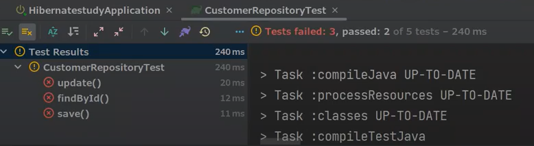

- test/java/shop/mtcoding/hibernatestudy/model/CustomerRepositoryTest.java 추가

```java
@BeforEach // 테스트 실행 직전마다 발동
public void setUp() 
    // auto_increment 전략 세팅, Customer -> @Table(name = "customer_tb") 추가
    em.createNativeQuery("ALTER TABLE customer_tb ALTER COLUMN id RESTART WITH 1")
        .executeUpdate(); 
    Customer customer = Customer.builder()
        .name("홍길동")
        .tel("0102222")
        .build();
    customerRepository.save(customer);
    em.clear();
}
```

> `long 비교시 고려사항`
>
> ```java
> Long id = 150L;
> Long id2 = 150L;
> 
> if (id.longValue() == id2.longValue()) {
>     System.out.println("값이 동일합니다. ");
> } else {
>     System.out.println("값이 동일하지 않습니다. ");
> }
> ```

## 8. 영속화

> Hibernate에서 영속화(Persistence)는 엔티티 객체를 데이터베이스와 연결하여 영구적으로 저장하는 과정을 의미합니다. 영속화를 하기 위해서는 엔티티 객체를 영속성 컨텍스트(Persistence Context)에 추가해야 합니다. 영속성 컨텍스트는 엔티티 객체를 관리하는 Hibernate의 핵심 메커니즘 중 하나로, 영속화된 엔티티 객체를 캐싱하고, 변경된 내용을 추적하여 데이터베이스에 반영합니다.
>
> Hibernate에서는 다음과 같은 영속화 관련 메소드를 제공합니다.
>
> 1. persist(entity) 영속성 컨텍스트에 엔티티 객체를 추가하여 영속화합니다. 이 때, 엔티티 객체는 데이터베이스에 저장되지 않은 상태이며, 영속성 컨텍스트 내에만 존재합니다. persist() 메소드는 엔티티 객체를 반환하지 않으며, void 타입을 반환합니다.
> 2. merge(entity) 엔티티 객체를 영속성 컨텍스트에 추가하거나, 이미 존재하는 엔티티 객체를 가져와서 변경된 내용을 데이터베이스에 반영합니다. merge() 메소드는 변경된 엔티티 객체를 반환하며, 이를 통해 엔티티 객체를 계속 사용할 수 있습니다.
> 3. flush() 영속성 컨텍스트에 있는 엔티티 객체의 변경 내용을 데이터베이스에 반영합니다. 이 때, 데이터베이스에 저장되지 않은 엔티티 객체는 데이터베이스에 저장되지 않습니다. flush() 메소드는 void 타입을 반환합니다.
> 4. clear() 영속성 컨텍스트에 있는 모든 엔티티 객체를 제거합니다. 이 때, 변경된 내용은 데이터베이스에 반영되지 않습니다. clear() 메소드는 void 타입을 반환합니다.

이전 코드 CustomerRepository, CustomerRepositoryTest를 통해서 영속화에 대해서 알아보겠습니다.

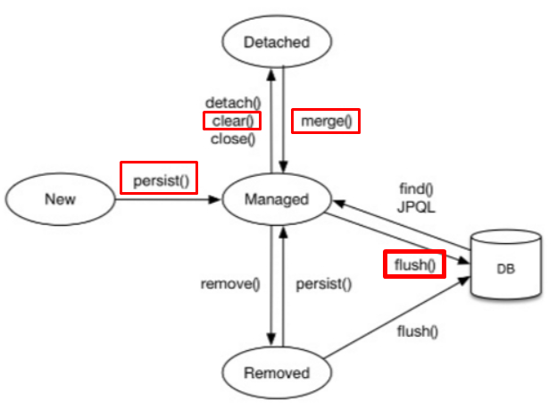

- persist() : 영속화
- clear() : 전체를 날리는 것
- detach() : 골라서 날리는 것
- flush() : DB에 반영하는 것

### (1) 영속화 그림 설명

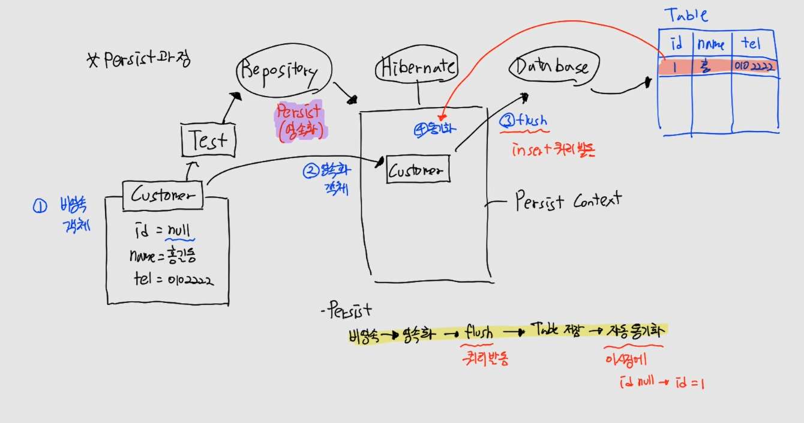

#### save() 동작원리

- 영속화 순서(Customer 입장, save 메소드)
  - Customer는 비
  영속 상태 (id = null, name = 홍길동, tel = 0102222)
  - Persist(영속화) 실행
  - Hibernate로 Customer 이동, Customer는 영속된 상태
    - Hibernate가 Customer를 Database로 자동 flush
    - 이때 insert 쿼리 발동
    - Table에 id 추가 후 내용 기록 (id = 1, name = 홍길동, tel = 0102222)
    - Hibernate와 Table 동기화
    - 동기화 되는 시점에 Customer의 null 자리에 1로 변경
  - Hibernate에 있는 Customer는 영속된 객체

#### 영속화 유무 상태에 따른 findById() 동작원리

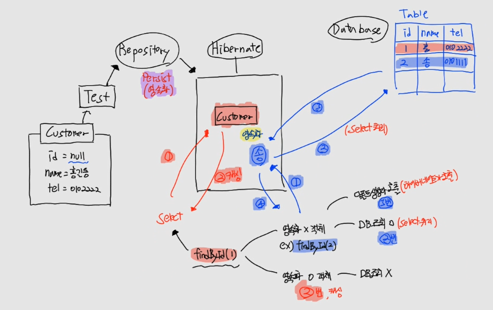

- 영속화 된 상태, findById(1L)
  - PC를 확인해서 찾고자 하는 객체가 영속화
  - 캐싱해서 바로 가져오기
  - DB 조회하는 쿼리 발동 X
- 영속화 안된 상태, findById(2L)
  - PC를 확인해서 찾고자 하는 객체가 영속화 안된 상태
  - 먼저 DB를 조회, 2번 Select
    - SELECT 쿼리 발생
  - Hibernate가 DB에서 꺼내 PC로 영속화하면서 디폴트 생성자 호출
    - Hibernate가 자바객체 생성
  - PC에 2L 객체 존재

#### update() 동작원리

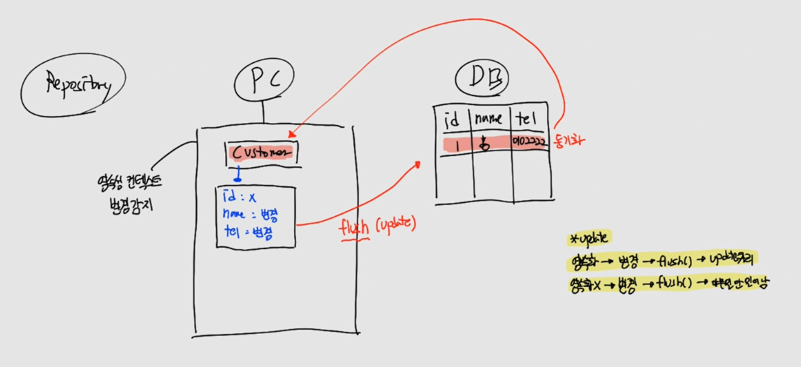

- update 순서
  - update를 하는 것 조회
    - 영속화를 시킨다.
  - 영속객체 수정
  - flush()

### (2) 순수객체, 영속객체, 비영속객체, 준영속객체

- 순수한 객체 : PK x
- 비영속 객체 : PK o or PK x
- 준영속 객체 : PK o, 영속화 하고 detach()한 것
- 영속 객체 : PK o, persist()한 것

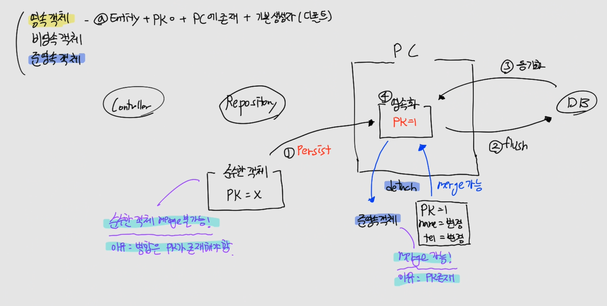

PC에는 4개의 객체 영속객체, 비영속 객체, 준영속 객체, 순수객체가 존재합니다. 순수한 객체는 PK를 들고 있지 않는 객체를 의미합니다.

준영속 객체는 영속된 상태였다가, detach()를 사용해서 PC에서 꺼낸 것을 의미합니다. 따라서 이때 PC는 비어있는 상태입니다.

영속 객체는 persist()된것을 의미합니다.

비영속 객체는 PK가 존재하거나 존재하지 않을 수 있습니다.

> `Junit Test 특징`
>
> 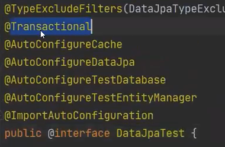
> 
> 내부적으로 Transactional을 들고 있어서, transaction commit이 되지 않습니다. 매번 rollback을 하기 때문입니다. 따라서 em.flush()를 통해서 봐야합니다.


> `merge() 동작원리`
>
> 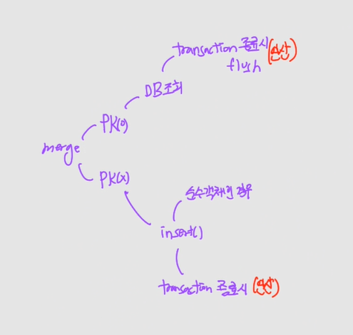
> merge는 우선 PK 존재 여부를 확인합니다. PK가 존재하는 경우, DB를 조회 합니다. 왜냐하면 진짜로 DB에 있는지 없는지 확인을 해야하기 때문입니다. 그리고 transactino이 종료되는 시점에 자동으로 flush()가 됩니다.
>
> 반면에 PK가 존재하지 않고 순수객체인 경우, insert()가 발동하게 됩니다. insert() flush는 똑같이 transaction이 종료되는 시점에 작동합니다.


> `transaction 동작 시점과 종료 시점`
>
> 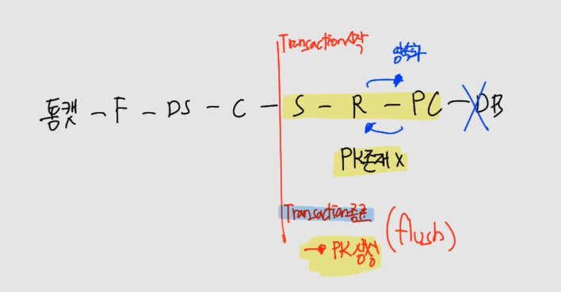
> Service단에서 Transaction이 시작이 됩니다. Repository에서 Persist Context로 영속화가 되고, DB로 가지않고 다시 Repository로 돌아옵니다. 그리고 Service단의 마지막에 transaction이 종료가 되면서 자동으로 flush()를 합니다.
>
> 따라서 영속화를 하고 flush()하기 전까지는 PK는 존재할 수 없습니다. 왜냐하면 PK는 영속화를 하고 flush()를 해야 테이블에 기록이 되며 바로 PC와 동기화가 되기 때문입니다.

> `save와 update 그리고 merge 사용 하지 않는 이유`
>
> 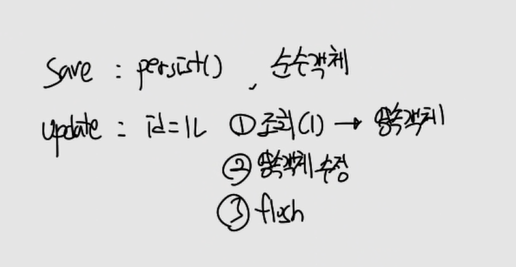
> 정리하면 save의 경우는 persist()만 하면 됩니다. update는 반드시 조회를 먼저 해야합니다. 왜냐하면 클리아언트로부터 받은 데이터는 신뢰할 수 없기 때문입니다. 따라서 조회를 한 후, 영속객체로 만듭니다. 그리고 수정을 하고, flush()를 합니다. 이런 이유 때문에 merge()는 사용할 필요가 없습니다.

## 9. 마인드 맵

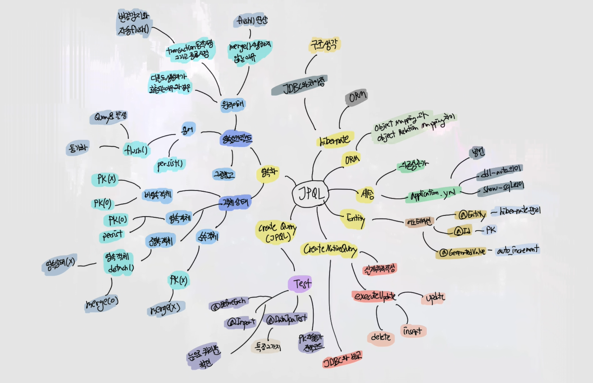