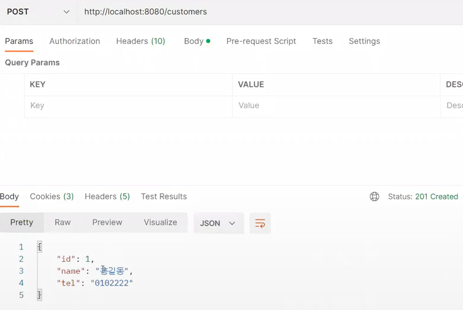
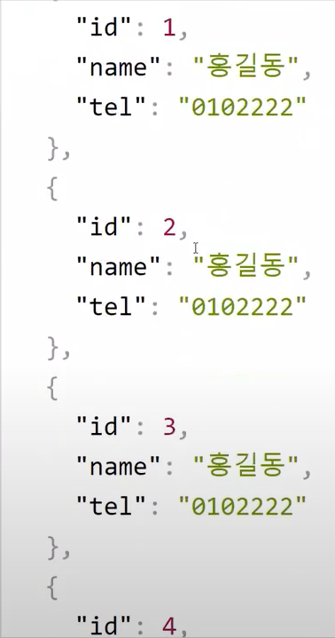
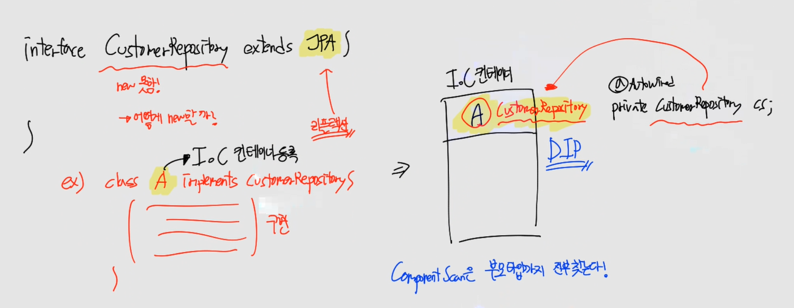
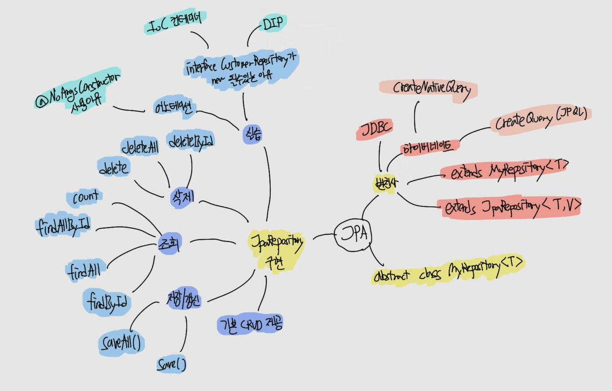

# CH18 스프링부트 레파지토리(저장소) - Hibernate JPA

> 아래 예제를 구현하기 전에 직접 Repository를 EntityManager로 구현해본다면 추상화된 MyRepository의 위력에 대해서 알수 있다.

## 1. MyRepository 구현

### (1) 소스코드

https://github.com/codingspecialist/Springboot-MyRepository

### (2) 실습코드

```java
package shop.mtcoding.hiberpc.model;

import javax.persistence.EntityManager;
import java.util.List;

public abstract class MyRepository<T> {

    private final EntityManager em;

    public MyRepository(EntityManager em) {
        this.em = em;
    }

    public T findById(int id){
        return em.find(getEntityClass(), id); // getEntityClass : 자식의 getEntityClass 실행 (동적 바인딩, 오버라이드)
    }

    public List<T> findAll(){
        // SELECT alias FROM T alias T.class
        return em.createQuery("select alias from "+getEntityName()+" alias", getEntityClass()).getResultList();
    }

    public T save(T entity){
        try {
            // Object id = getEntityClass().getMethod("getId").invoke(entity); // 리플렉션
            Object id = em.getEntityManagerFactory().getPersistenceUnitUtil().getIdentifier(entity);
            if (id == null) { // 순수객체
                em.persist(entity);
            } else {
                entity = em.merge(entity); // 동일 X : insert, 동일 : update(값의 변경이 있을 때)
            }
        } catch (Exception e) {
            throw new RuntimeException("Failed to save entity: " + entity, e);
        }
        return entity;
    }

    public void delete(T entity){
        em.remove(entity);
    }

    protected abstract Class<T> getEntityClass(); // 자식꺼 실행
    protected abstract String getEntityName(); // 자식꺼 실행
}
```

## 2. 상속해서 사용하는 방법

여태까지의 흐름을 알아보면, 먼저 JDBC로 코드를 만들었습니다. 번거로운 과정이 있어서 hibernate의 도움을 받았습니다. 하지만 그마저도 더 짧게 만들기 위해서 제네릭으로 공통 클래스(CRUD 클래스)를 구현했습니다.

### (1) 실습코드

- model/product/ProductRepository.java

```java
@Repository // component scan
public class ProductRepository extends MyRepository<Product> {

    public ProductRepository(EntityManager em) { // EntityManager 의존성 주입
        super(em);
    }

    @Override
    protected Class<Product> getEntityClass() {
        return Product.class;
    }

    @Override
    protected String getEntityName() {
        return "Product";
    }
}
```

- model/user/UserRepository.java

```java
@Repository
public class UserRepository extends MyRepository<User> {

    public UserRepository(EntityManager em) {
        super(em);
    }

    @Override
    protected Class<User> getEntityClass() {
        return User.class;
    }

    @Override
    protected String getEntityName() {
        return "User";
    }
}
```

- model/board/BoardRepository.java

```java
@Repository
public class BoardRepository extends MyRepository<Board> {

    public BoardRepository(EntityManager em) {
        super(em);
    }

    @Override
    protected Class<Board> getEntityClass() {
        return Board.class;
    }

    @Override
    protected String getEntityName() {
        return "Board";
    }
}
```

### (2) 테스트 실습코드

- model/MyDummyEntity.java

```java
public class MyDummyEntity { // 순수객체

    protected User newUser(String username){
        return User.builder()
                .username(username)
                .password("1234")
                .email(username+"@nate.com")
                .build();
    }
    
    protected Board newBoard(String title){
        return Board.builder()
                .title(title)
                .content(title)
                .author("홍길동")
                .build();
    }
}
```

- model/user/UserRepository.java
  - 콘솔창 확인 : 쿼리문

```java
@Import(UserRepository.class)
@DataJpaTest
public class UserRepositoryTest extends MyDummyEntity {

    @Autowired
    private UserRepository userRepository;
    @Autowired
    private EntityManager em;

    @BeforeEach
    public void setUp(){
        em.createNativeQuery("ALTER TABLE user_tb ALTER COLUMN id RESTART WITH 1").executeUpdate();
    }

    @Test
    public void save_test(){
        // given
        User user = newUser("ssar"); // 순수객체

        // when
        User userPS = userRepository.save(user); // em.persist

        // then
        assertThat(userPS.getId()).isEqualTo(1);
    }

    @Test
    public void findById_test(){
        // given 1 - DB에 영속화
        userRepository.save(newUser("ssar")); // 순수객체 -> 영속화
        em.clear(); // 준영속(detach X, detach 가능)

        // given 2
        int id = 1;

        // when
        User userPS = userRepository.findById(id); // SELECT 쿼리 발동, userPS: 영속객체

        // then
        assertThat(userPS.getUsername()).isEqualTo("ssar");
    }

    @Test
    public void update_test(){
        // given 1 - DB에 영속화
        userRepository.save(newUser("ssar"));
        em.clear(); // 준영속

        // given 2 - request 데이터
        String password = "5678";
        String email = "ssar@gmail.com";

        // when
        User userPS = userRepository.findById(1); // SELECT 쿼리
        userPS.update(password, email); // 데이터 수정 -> 하이버네이트만 변경 감지
        User updateUserPS = userRepository.save(userPS); // PK O -> merge, 
        em.flush(); // rollback 되니까 테스트시에만 붙여주자

        // then
        assertThat(updateUserPS.getPassword()).isEqualTo("5678");
    } // rollback 되니까 em.flush() 걸자

    @Test
    public void update_dutty_checking_test(){
        // given 1 - DB에 영속화
        userRepository.save(newUser("ssar"));
        em.clear();

        // given 2 - request 데이터
        String password = "5678";
        String email = "ssar@gmail.com";

        // when
        User userPS = userRepository.findById(1);
        userPS.update(password, email);
        em.flush();

        // then
        User updateUserPS = userRepository.findById(1);
        assertThat(updateUserPS.getPassword()).isEqualTo("5678");
    }

    @Test
    public void delete_test(){
        // given 1 - DB에 영속화
        userRepository.save(newUser("ssar")); // 순수객체
        em.clear(); // 준영속

        // given 2 - request 데이터
        int id = 1;
        User findUserPS = userRepository.findById(id); // 영속화, 조회하기(터질수도 있으니까)

        // DB는 read할때보다, 상대적으로 write할 때, 다른 사람들이 멍떄리게 됨
        // when
        userRepository.delete(findUserPS); // 비영속 객체
        em.flush();

        // then
        User deleteUserPS = userRepository.findById(1);
        Assertions.assertThat(deleteUserPS).isNull();
    }

    @Test
    public void findAll_test(){
        // given
        List<User> userList = Arrays.asList(newUser("ssar"), newUser("cos"));
        userList.stream().forEach((user)->{
            userRepository.save(user);
        });
        em.clear();

        // when
        List<User> userListPS = userRepository.findAll();
        //System.out.println("테스트 : "+userListPS);

        // then
        assertThat(userListPS.size()).isEqualTo(2);
    }
}
```

- model/board/BoardRepository.java

```java
@Import({BoardRepository.class})
@DataJpaTest
public class BoardRepositoryTest extends MyDummyEntity {

    @Autowired
    private BoardRepository boardRepository;
    @Autowired
    private EntityManager em;

    @BeforeEach
    public void setUp(){
        em.createNativeQuery("ALTER TABLE board_tb ALTER COLUMN id RESTART WITH 1").executeUpdate();
    }

    @Test
    public void save_test(){
        // given
        Board board = newBoard("제목1");

        // when
        Board boardPS = boardRepository.save(board);
        System.out.println("테스트 : "+boardPS);

        // then
        assertThat(boardPS.getId()).isEqualTo(1);
    }

    @Test
    public void findById_test(){
        // given 1
        boardRepository.save(newBoard("제목1"));

        // given 2
        int id = 1;

        // when
        Board boardPS = boardRepository.findById(id);

        // then
        assertThat(boardPS.getTitle()).isEqualTo("제목1");
    }

    @Test
    public void update_test(){
        // given 1
        boardRepository.save(newBoard("제목1"));
        em.clear();

        // given 2
        String title = "제목12";
        String content = "내용12";

        // when
        Board boardPS = boardRepository.findById(1);
        boardPS.update(title, content);
        em.flush();

        // then
        Board findBoardPS = boardRepository.findById(1);
        assertThat(findBoardPS.getContent()).isEqualTo("내용12");
    }

    @Test
    public void delete_test(){
        // given 1 - DB에 영속화
        Board board = newBoard("제목1"); 
        boardRepository.save(board);

        // given 2 - request 데이터 (Lazy, Eager 쿼리 테스트)
        // em.clear();
        int id = 1;
        Board findBoardPS = boardRepository.findById(id);

        // when
        boardRepository.delete(findBoardPS);

        // then
        Board deleteBoardPS = boardRepository.findById(1);
        Assertions.assertThat(deleteBoardPS).isNull();
    }

    @Test
    public void findAll_test(){
        // given
        List<Board> boardList = Arrays.asList(newBoard("제목1"), newBoard("제목2"));
        boardList.stream().forEach((board)->{
            boardRepository.save(board);
        });

        // when
        List<Board> boardListPS = boardRepository.findAll();
        //System.out.println("테스트 : "+userListPS);

        // then
        assertThat(boardListPS.size()).isEqualTo(2);
    }
}
```

## 3. JpaRepository 구현

> Spring Boot의 JpaRepository는 JPA의 기본 메서드 외에도 CRUD(create, read, update, delete) 기능을 제공하는 메서드를 제공합니다. JpaRepository는 이러한 메서드를 제공함으로써 개발자가 데이터 액세스 코드를 더욱 간편하게 작성할 수 있습니다.
>
> 1. 저장/갱신 관련 메서드
>
> - `save(S entity)`: 엔티티를 저장하고 반환합니다.
> - `saveAll(Iterable<S> entities)`: 여러 개의 엔티티를 저장하고 반환합니다.
>
> 2. 조회 관련 메서드
>
> - `findById(ID id)`: 주어진 기본 키로 엔티티를 검색합니다.
> - `findAll()`: 모든 엔티티를 검색합니다.
> - `findAllById(Iterable<ID> ids)`: 주어진 기본 키 목록으로 엔티티를 검색합니다.
> - `count()`: 엔티티의 총 개수를 반환합니다.
>
> 3. 삭제 관련 메서드
>
> - `deleteById(ID id)`: 주어진 기본 키로 엔티티를 삭제합니다.
> - `delete(T entity)`: 주어진 엔티티를 삭제합니다.
> - `deleteAll()`: 모든 엔티티를 삭제합니다.(비추천)
>
> JpaRepository는 이 외에도 다양한 메서드를 제공하며, 사용자가 직접 메서드를 정의할 수도 있습니다. 또한, 메서드 이름 규칙을 지켜 메서드를 작성하면, Spring Boot가 해당 메서드를 자동으로 구현해 줍니다. 이러한 방식으로 JpaRepository를 사용하면, 데이터 액세스 코드를 더욱 쉽게 작성할 수 있습니다.

### (1) 소스코드

https://github.com/codingspecialist/Springboot-JpaRepository.git

### (2) 의존성

```gradle
dependencies {
    implementation 'org.springframework.boot:spring-boot-starter-data-jpa'
    implementation 'org.springframework.boot:spring-boot-starter-web'
    compileOnly 'org.projectlombok:lombok'
    developmentOnly 'org.springframework.boot:spring-boot-devtools'
    runtimeOnly 'com.h2database:h2'
    annotationProcessor 'org.projectlombok:lombok'
    testImplementation 'org.springframework.boot:spring-boot-starter-test'
}
```

### (2) 실습코드

- controller/CustomerController.java

```java
@RequiredArgsConstructor
@RestController
public class CustomerController {

    private final CustomerRepository customerRepository;

    @PostMapping("/customers")
    public ResponseEntity<?> save() {
        Customer customer = Customer.builder()
                .name("홍길동")
                .tel("0102222")
                .build();
        Customer customerPS = customerRepository.save(customer);
        return new ResponseEntity<>(customerPS, HttpStatus.CREATED);
    }

    @GetMapping("/customers")
    public ResponseEntity<?> findAll() {
       List<Customer> customerListPS = customerRepository.findAll();
       return new ResponseEntity<>(customerListPS, HttpStatus.OK);
    }
}
```

- model/Customer.java

```java
/**
 * AllArgsConstructor: 비추, JUnit Test 할 떄 터진다
 * NoArgsConstructor(access = AccessLevel.PROTECTED): 하이버네이트만 사용, 개발자가 사용할 가능성이 있어서 PROTECTED 달기
 */
@NoArgsConstructor(access = AccessLevel.PROTECTED) // 오직 하이버네이트를 위한 깃발
@Entity
@Getter
public class Customer {

    @Id
    @GeneratedValue(strategy = GenerationType.IDENTITY)
    private Integer id; // 21억명 -> Long, Wrapper 사용 -> int는 null이 있기 때문에
    private String name;
    private String tel;

    @Builder
    public Customer(Integer id, String name, String tel) {
        this.id = id;
        this.name = name;
        this.tel = tel;
    }
}
```

- model/CustomerRepository.java

```java
public interface CustomerRepository extends JpaRepository<Customer, Integer> {

}
```

JPA의 기본 메소드는 테스트할 필요가 없습니다. 왜냐하면 잘 만들어져 있기 때문입니다. 만약 CustomerRepository를 테스트하려면 @DataJpaTest만 붙이면 됩니다. JPQL처럼 @Import를 할 필요가 없습니다.

 



> `interface CustomerRepository가 new 될 수 있는 이유`
>
> 
> CustomerRepository는 interface이기 때문에 new 할 수 없습니다. 따라서 CustomerRepository를 implements하는 class가 필요로 합니다.
>
> 예를 들어 class A가 CustomerRepository를 implements하면 IoC 컨테이너에는 A가 등록이 됩니다. 그리고 프로그램을 실행 시, component scan을 하면서 A의 부모인 CustomerRepository를 찾게 되는 것입니다.
>
> 따라서 이 과정 또한 DIP의 일부로 생각할 수 있습니다.

## 4. 마인드 맵

