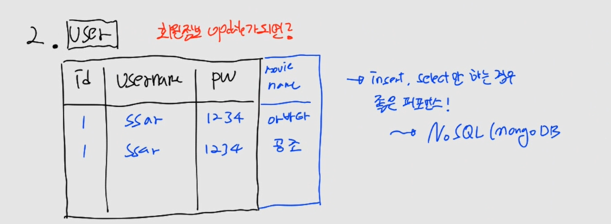

# CH19 스프링부트 레파지토리(저장소) - 테이블 연관 관계와 Lazy, Eager

#### 소스코드

https://github.com/codingspecialist/Springboot-ORM-Lazy-Eager

## 1. 연관관계

> Hibernate는 객체-관계 매핑(Object-Relational Mapping, ORM)을 지원하여, 객체 지향 프로그래밍에서 사용되는 객체와 관계형 데이터베이스의 테이블 간의 연관관계를 매핑할 수 있습니다.
>
> Hibernate에서는 다음과 같은 연관관계를 지원합니다.
>
> 1. 일대일(One-to-One) 연관관계 두 개의 엔티티 간에 하나의 관계만 존재하는 경우입니다.
> 2. 일대다(One-to-Many) 연관관계 하나의 엔티티가 다른 엔티티 여러 개와 연관된 경우입니다.
> 3. 다대일(Many-to-One) 연관관계 여러 개의 엔티티가 하나의 엔티티와 연관된 경우입니다.
> 4. 다대다(Many-to-Many) 연관관계 여러 개의 엔티티가 다른 여러 개의 엔티티와 연관된 경우입니다.
>
> 연관관계를 매핑할 때는 @ManyToOne, @OneToMany, @OneToOne, @ManyToMany 등의 어노테이션을 사용하여 매핑합니다. 연관관계의 주인은 mappedBy 속성으로 설정할 수 있습니다. Hibernate에서는 연관관계의 설정을 통해 객체 간의 관계를 매핑하고, 이를 바탕으로 SQL 쿼리를 생성하여 데이터베이스와 상호작용합니다.

User, Board, Reply 테이블을 설계하면 아래와 같은 연관관계가 설정됩니다. FK는 N쪽에 붙이면 됩니다. N 쪽이 항상 연관관계의 주인입니다.

> User(1) - Board(N)
>
> User(1) - Reply(N)
>
> Board(1) - Reply(N)

### (1) 연관관계 설명


```sql
SELECT * FROM user WHERE movie_name LIKE '%아바타%';
```

user_tb는  id, username, password를 가지고 있습니다. movie name을 추가할 것 입니다. 그럼 column에 movie name을 적고 아바타, 공조가 들어가게 됩니다. 이 경우는 지금 당장은 문제가 되지 않습니다. 하지만 아바타와 일치하는 데이터를 찾고 싶고 데이터가 1억건이 넘는 경우 문제가 됩니다.

왜냐하면 movie name을 Projection을 해서 전부 문자열과 비교하기 때문입니다.



1번째 방법을 보완하기 위해서 2번째 방법으로 만들었습니다. 이 방법의 경우는 insert(), select()하는 경우 매우 좋은 퍼포먼스를 가지고 있습니다. 하지만 update()를 하는 경우에는 id, username, password처럼 동일한 값들을 전부 바꿔줘야하는 문제가 생깁니다.


따라서 테이블을 2개로 쪼갭니다. user_tb, movie_tb로 쪼개고 연관관계를 살펴봐야합니다. 1명의 user는 N개의 movie를 볼 수 있고, 1개의 movie는 1개의 user가 볼 수 있다고 하겠습니다. 따라서 user 와 movie는 1 : N 관계를 가지게 됩니다. 그리고 N 쪽이 외래키를 들고 있어야 합니다.

그래서 N 쪽이 FK를 들고 있어서 연관관계의 주인이라고 부릅니다.


user_tb 인 상태에서 content, title을 추가하는 경우는 추가되는 데이터가 어떤 형태인지를 알아야 합니다. 먼저 Scala 형태가 아닌 경우는 데이터 자체를 테이블로 만들어서 추가해야 합니다. 하지만 Scala 형태인 경우에는 1번째와 2번째 처럼 비교를 해봐야합니다.

지금의 경우는 Scala가 아니기 때문에 board_tb를 만들고 연관관계를 생각합니다. 1명의 user는 N개의 board를 작성가능하고, 1개의 board는 1명의 user가 작성합니다. 따라서 user와 board는 1 : N 연관관계를 가집니다.

> `Scala, Vector, Matrix`
>
> - Scala : 1건
> - Vector : 리스트 형태 [1, 2, 3, 4, . . .]
> - Matrix : 2차우너 배열 (x, y)

## 2. 스프링 프로젝트 생성

### (1) Gradle 의존성

```gradle
dependencies {
    implementation 'org.springframework.boot:spring-boot-starter-data-jpa'
    implementation 'org.springframework.boot:spring-boot-starter-web'
    compileOnly 'org.projectlombok:lombok'
    developmentOnly 'org.springframework.boot:spring-boot-devtools'
    runtimeOnly 'com.h2database:h2'
    annotationProcessor 'org.projectlombok:lombok'
    testImplementation 'org.springframework.boot:spring-boot-starter-test'
}
```

### (2) Application 설정

```yaml
server:
  servlet:
    encoding:
      charset: utf-8
      force: true

spring:
  datasource:
    url: jdbc:h2:mem:test;MODE=MySQL
    driver-class-name: org.h2.Driver
    username: sa
    password:
  h2:
    console:
      enabled: true

  jpa:
    hibernate:
      ddl-auto: create
    show-sql: true
    properties:
      hibernate:
        format_sql: true
        #default_batch_fetch_size: 100
```

## 3. User Entity 생성

> @Entity가 테이블을 생성하는 것이 아닙니다. 하이버네이트가 해당 클래스를 테이블로 관리한다는 것입니다.
>
> @Table로 테이블명을 변경합니다. 변경하지 않으면 테이블명이 User가 됩니다. 
>
> @NoArgsConstructor를 사용한 이유는 Hibernate는 디폴트 생성자를 호출하여 데이터베이스 결과를 매핑해주기 때문입니다. 변수들이 private로 되어있기 때문에 리플렉션을 통해서 값 private 변수에 접근합니다.
>
> @Setter가 없는데 필드에 값을 어떻게 넣어주는지 궁금할 수 있습니다. 리플렉션을 통해서 private 변수에 직접 접근하여 값을 할당해줍니다.

- model/user/User.java

```java
@NoArgsConstructor // 하이버네이트, 리플렉션
@Getter
@Table(name = "user_tb")
@Entity
public class User {

    @Id
    @GeneratedValue(strategy = GenerationType.IDENTITY)
    private Integer id;
    private String username;
    @JsonIgnore // ObjectMapper가 파싱하지 않는다.
    private String password;
    private String email;
    @CreationTimestamp
    private Timestamp createdAt;

    @Builder
    public User(Integer id, String username, String password, String email, Timestamp createdAt) {
        this.id = id;
        this.username = username;
        this.password = password;
        this.email = email;
        this.createdAt = createdAt;
    }

    public void update(String password, String email){
        this.password = password;
        this.email = email;
    }

    @Override
    public String toString() {
        return "User{" +
                "id=" + id +
                ", username='" + username + '\'' +
                ", password='" + password + '\'' +
                ", email='" + email + '\'' +
                ", createdAt=" + createdAt +
                '}';
    }
}
```

## 4. Board Entity 생성

> @Many는 Board 입니다.
> @One은 User 입니다.
> 한 명의 유저는 여러개의 게시글을 작성할 수 있습니다. 그래서 @ManyToOne 어노테이션이 필요합니다.
>
> 데이터베이스는 User 타입의 칼럼이 없기 때문에, @ManyToOne 어노테이션을 붙여서 Hibernate에게 알려주면 Hibernate는 User 오브젝트의 @Id가 붙은 필드를 찾아서 해당 필드의 타입으로 FK를 칼럼으로 생성해줍니다.
>
> 이것이 ORM입니다. Hibernate를 통해서 자바는 자바 언어로 개발을 하고, Hibernate는 자바 언어를 분석하여 데이터베이스 세계로 옮겨줍니다.

- model/board/Board.java

```java
@NoArgsConstructor
@Getter
@Table(name = "board_tb")
@Entity
public class Board {

    @Id
    @GeneratedValue(strategy = GenerationType.IDENTITY)
    private Integer id;
    @ManyToOne // FK(연관관계의 주인), defalut : EAGER, OneToMany(defalut) : LAZY
    private User user; // Obejct Relation Mapping, DB 모든 Column은 Scala 형식(원자성), DB에 들어갈때 user_id
    private String title;
    private String content;

    @CreationTimestamp
    private Timestamp createdAt;

    @Builder
    public Board(Integer id, User user, String title, String content, Timestamp createdAt) {
        this.id = id;
        this.user = user;
        this.title = title;
        this.content = content;
        this.createdAt = createdAt;
    }

    public void update(String title, String content) {
        this.title = title;
        this.content = content;
    }

    @Override
    public String toString() {
        return "Board{" +
                "id=" + id +
                ", user=" + user +
                ", title='" + title + '\'' +
                ", content='" + content + '\'' +
                ", createdAt=" + createdAt +
                '}';
    }
}
```


> `Object Mapping`
>
> ```java
> .
> .
> private Integer userId;
> private String title;
> private String content;
> .
> .
> ```
> 위의 코드와 같이 Integer로 받는 경우는 Object Mapping이라고 합니다. 하지만 이제 Object Relation Mapping을 할 것이기 때문에 객체를 적습니다.

## 5. UserRepositoryTest

- model/user/UserRepository.java

```java
@Repository
public class UserRepository extends MyRepository<User> {

    public UserRepository(EntityManager em) {
        super(em);
    }

    @Override
    protected Class<User> getEntityClass() {
        return User.class;
    }

    @Override
    protected String getEntityName() {
        return "User";
    }
}
```

- test/java/shop/mtcoding/hiberpc/model/MyDummyEntity.java

```java
public class MyDummyEntity {

    protected User newUser(String username){
        return User.builder()
                .username(username)
                .password("1234")
                .email(username+"@nate.com")
                .build();
    }


    protected Board newBoard(String title, User userPS){
        if(userPS.getId() == null){
            System.out.println("영속화해서 넣어라!!");
            return null;
        }

        return Board.builder()
                .title(title)
                .content(title)
                .user(userPS)
                .build();
    }

    protected Reply newReply(String comment, User userPS){
        if(userPS.getId() == null){
            System.out.println("영속화해서 넣어라!!");
            return null;
        }

        return Reply.builder()
                .user(userPS)
                .comment(comment)
                .build();
    }
}
```

- test/java/shop/mtcoding/hiberpc/model/user/UserRepositoryTest.java

```java
@Import(UserRepository.class) // 만약 UserRepository 가 entends JpaRepository<User, Integer> 이면 @Import는 필요없다.
@DataJpaTest
public class UserRepositoryTest extends MyDummyEntity {

    @Autowired
    private UserRepository userRepository;
    @Autowired
    private EntityManager em;

    @BeforeEach
    public void setUp(){
        em.createNativeQuery("ALTER TABLE user_tb ALTER COLUMN id RESTART WITH 1").executeUpdate();
    }

    @Test
    public void save_test(){
        // given
        User user = newUser("ssar");

        // when
        User userPS = userRepository.save(user);

        // then
        assertThat(userPS.getId()).isEqualTo(1);
    }

    @Test
    public void findById_test(){
        // given 1
        userRepository.save(newUser("ssar"));
        em.clear(); // INSERT 쿼리

        // given 2
        int id = 1;

        // when
        User userPS = userRepository.findById(id);

        // then
        assertThat(userPS.getUsername()).isEqualTo("ssar");
    }

    @Test
    public void update_test(){
        // given 1
        userRepository.save(newUser("ssar"));
        em.clear(); // INSERT 보기, 준영속

        // given 2
        String password = "5678";
        String email = "ssar@gmail.com";

        // when
        // update 하는 법 : 1. 조회(영속화 시킨다.) 2. 변경한다. 3. flush(트랜잭션이 종료된다. 변경감지)
        User userPS = userRepository.findById(1); // SELECT 쿼리
        userPS.update(password, email);
        User updateUserPS = userRepository.save(userPS); // em.flush() 대체 가능(변경을 해서 알아서 감지하기 때문에)
        em.flush(); // roll back 되기 때문에, UPDATE 보기, hibernate 변경감지
 
        // then
        assertThat(updateUserPS.getPassword()).isEqualTo("5678");
        assertThat(updateUserPS.getEmail()).isEqualTo("ssar@gmail.com");
    }

    @Test
    public void update_dutty_checking_test(){
        // given 1
        userRepository.save(newUser("ssar"));
        em.clear();

        // given 2
        String password = "5678";
        String email = "ssar@gmail.com";

        // when
        User userPS = userRepository.findById(1);
        userPS.update(password, email);
        em.flush();

        // then
        User updateUserPS = userRepository.findById(1);
        assertThat(updateUserPS.getPassword()).isEqualTo("5678");
        assertThat(updateUserPS.getEmail()).isEqualTo("ssar@gmail.com");
    }

    @Test
    public void delete_test(){
        // given 1
        userRepository.save(newUser("ssar"));
        em.clear();

        // given 2
        int id = 1;
        User findUserPS = userRepository.findById(id);

        // when
        userRepository.delete(findUserPS);
        em.flush(); // DELETE 쿼리

        // then
        User deleteUserPS = userRepository.findById(1);
        Assertions.assertThat(deleteUserPS).isNull();
    } 

    @Test
    public void findAll_test(){
        // given
        List<User> userList = Arrays.asList(newUser("ssar"), newUser("cos"));
        userList.stream().forEach((user)->{
            userRepository.save(user);
        });

        // when
        List<User> userListPS = userRepository.findAll(); // SELECT 쿼리, 이유 : save 2건이 전체가 아닐 수도 있어서

        // then
        assertThat(userListPS.size()).isEqualTo(2);
    }
}
```

## 6. BoardRepositoryLevel1Test

> em.clear() 를 하면 영속화된 객체들이 다 비영속 상태로 변경됩니다.

- model/board/BoardRepository.java

```java
package shop.mtcoding.hiberpc.model.board;

import org.springframework.stereotype.Repository;
import shop.mtcoding.hiberpc.model.MyRepository;

import javax.persistence.EntityManager;
import java.util.List;

@Repository
public class BoardRepository extends MyRepository<Board> {

    private EntityManager em;

    public BoardRepository(EntityManager em) {
        super(em);
        this.em = em;
    }

    @Override
    protected Class<Board> getEntityClass() {
        return Board.class;
    }

    @Override
    protected String getEntityName() {
        return "Board";
    }
}
```

- test/java/shop/mtcoding/hiberpc/model/board/BoardRepositoryLevel1Test.java

```java
@Import({UserRepository.class, BoardRepository.class})
@DataJpaTest
public class BoardRepositoryLevel1Test extends MyDummyEntity {

    @Autowired
    private UserRepository userRepository;
    @Autowired
    private BoardRepository boardRepository;
    @Autowired
    private EntityManager em;

    @BeforeEach
    public void setUp(){
        em.createNativeQuery("ALTER TABLE user_tb ALTER COLUMN id RESTART WITH 1").executeUpdate();
        em.createNativeQuery("ALTER TABLE board_tb ALTER COLUMN id RESTART WITH 1").executeUpdate();
    }

    @Test
    public void save_test(){ // @ManyToOne(User, Eager)
        // given
        userRepository.save(newUser("ssar"));
        em.clear();
        User userPS = userRepository.findById(1);
        Board board = newBoard("제목1", userPS); // 비영속

        // when
        Board boardPS = boardRepository.save(board);
        System.out.println("테스트 : "+boardPS);

        // then
        assertThat(boardPS.getId()).isEqualTo(1);
        assertThat(boardPS.getUser().getId()).isEqualTo(1);
    }

    @Test
    public void findById_test(){ // @ManyToOne(User, Eager)
        // given 1
        User userPS = userRepository.save(newUser("ssar"));
        boardRepository.save(newBoard("제목1", userPS));
        em.clear();

        // given 2
        int id = 1;

        // when
        Board boardPS = boardRepository.findById(id); // ORM 적용됨, board만 SELECT -> + user LEFT OUTER JOIN

        // then
        assertThat(boardPS.getTitle()).isEqualTo("제목1");
    }

    @Test
    public void update_test(){ // @ManyToOne(User, Eager)
        // given 1
        User userPS = userRepository.save(newUser("ssar"));
        boardRepository.save(newBoard("제목1", userPS));
        em.clear();

        // given 2
        String title = "제목12";
        String content = "내용12";

        // when
        Board boardPS = boardRepository.findById(1);
        boardPS.update(title, content);
        em.flush();
        em.clear();

        // then
        Board findBoardPS = boardRepository.findById(1);
        assertThat(findBoardPS.getContent()).isEqualTo("내용12");
    }

    @Test
    public void delete_test(){ // @ManyToOne(User, Eager)
        // given 1
        User userPS = userRepository.save(newUser("ssar"));
        boardRepository.save(newBoard("제목1", userPS));
        em.clear();

        // given 2
        int id = 1;
        Board findBoardPS = boardRepository.findById(id);

        // when
        boardRepository.delete(findBoardPS);
        em.flush();
        em.clear();

        // then
        Board deleteBoardPS = boardRepository.findById(1);
        Assertions.assertThat(deleteBoardPS).isNull();
    }

    @Test
    public void findAll_test(){ // @ManyToOne(User, Eager)
        // given
        findAll_given();

        // when
        List<Board> boardListPS = boardRepository.findAll(); // 최악의 쿼리, N + 1문제
        System.out.println("테스트 : "+boardListPS);

        // then
        assertThat(boardListPS.size()).isEqualTo(3);
    }

    private void findAll_given(){
        User ssarPS = userRepository.save(newUser("ssar"));
        User cosPS = userRepository.save(newUser("cos"));
        User lovePS = userRepository.save(newUser("love"));
        List<Board> boardList = Arrays.asList(
            newBoard("제목1", ssarPS), 
            newBoard("제목2", cosPS),
            newBoard("제목3", lovePS));
        boardList.stream().forEach((board)->{
            boardRepository.save(board);
        });
        em.clear();
    }
}
```

- findById 테스트 결과
 


> `Flat, ORM`
>
> 
> 만약 PC가 존재하지 않는다면, DB로부터 Repository가 DTO를 받으면서 민감한 정보들도 받기 때문에 Service로 넘어갈 때 한번더 DTO를 변환해야 합니다.
>
> 하지만 PC가 있는 경우에는 DB로부터 Flat한 데이터를 hibernate(PC)가 받고, hibernate(PC)가 ORM을 해주고 Model을 만들어서 Repository에게 제공을 합니다.

> `제약조건 위배`
>
> Board.java, User.java - @Setter추가
> ```java
> @Test
> public void save2_test(){
>     User user = newUser("ssar");
>     user.setId(1);
> 
>     Board board = newBoard("제목1", user);
>     boardRepository.save(board); // 제약조건 위배
> }
> ```
> 
>
> 

> `JSON 데이터 보기`
>
> ```java
> ObjectMapper om = new ObjectMapper();
> String responseBody = om.writeValueAsString(boardPS);
> System.out.println("responseBody Test : " + responseBody);
> ```

> `연관관계의 주인을 조회` 
>
> ORM은 개발속도를 향상 시켜줍니다. 즉 생산성이 올라가게 됩니다.
> 1. 주인이 아닌 것 조회 (user)
> 2. 연관관계인 것들을 join해서 가져온다.
> 3. Flat - > ORM

> `findAll()의 N + 1 문제점`
>
> 만약 board에 100명의 user가 작성을 한 경우, board 전체 SELECT (1번) + 각 user SELECT (100번) = 101번의 DB 호출, 따라서 좋은 방법이 아닙니다.
>
> 1. 주인만 SELECT
> 2. 주인이 아닌 애들은, 각각 SELECT
>
> 해결방법
>
> 1. in-query 직접 query 작성
> 2. default_batch_fetch_size
> ```yaml
> .
> .
> spring:
>   jpa:
>     properties:
>       hibernate:
>         format_sql: true
>         default_batch_fetch_size: 100 # in query를 100개 까지 세팅
> .
> .
> ```
> 다음과 같이 yml을 세팅하면 board 전체 SELECT (1번) + user SELECT (1번) = 2번의 DB 호출이 생깁니다. 즉, 100명의 user까지 한번에 SELECT를 해오는 것입니다.
>
> 만약 default_batch_fetch_size를 10으로 바꾸고, 동일한 상황인 경우에는 board 전체 SELECT (1번) + user SELECT (10번) = 11번의 DB 호출이 생깁니다.

## 7. BoardRepositoryLevel2Test

- model/board/BoardRepository.java 추가
  - findAllJoin()
  - findAllJoinFetch()

```java
.
.
public BoardRepository(EntityManager em) {
    super(em);
    this.em = em;
}

public List<Board> findAllJoin(){
    return em.createQuery("select b from Board b join b.user", getEntityClass()).getResultList(); // JPQL, N + 1문제 발생
}

public List<Board> findAllJoinFetch(){
    return em.createQuery("select b from Board b join fetch b.user", getEntityClass()).getResultList();
}

@Override
protected Class<Board> getEntityClass() {
    return Board.class;
}
.
.
```

> 아래 두개의 테스트는 Lazy 전략으로 테스트합니다.
>
> - findByIdLazy_test()
> - findByIdLazyLoading_test()

```java
@ManyToOne(fetch = FetchType.LAZY)
private User user;
```

> 아래 두개의 테스트는 Eager 전략으로 테스트합니다.
>
> - findAllJoin_test()
> - findAllJoinFetch_test()

```java
@ManyToOne(fetch = FetchType.EAGER)
private User user;
```

> 아래의 메서드를 테스트할 때는 yml 설정을 한 뒤 테스트합니다. 테스트시에 in 쿼리가 발동합니다.
>
> - findAllBatchFetchSize_test()

> application.yml 에 아래 설정을 추가해줍니다.

```yaml
default_batch_fetch_size: 100
```

- test/java/shop/mtcoding/hiberpc/model/board/BoardRepositoryLevel2Test.java

```java
@Import({UserRepository.class, BoardRepository.class})
@DataJpaTest
public class BoardRepositoryLevel2Test extends MyDummyEntity {

    @Autowired
    private UserRepository userRepository;
    @Autowired
    private BoardRepository boardRepository;
    @Autowired
    private EntityManager em;

    @BeforeEach
    public void setUp(){
        em.createNativeQuery("ALTER TABLE user_tb ALTER COLUMN id RESTART WITH 1").executeUpdate();
        em.createNativeQuery("ALTER TABLE board_tb ALTER COLUMN id RESTART WITH 1").executeUpdate();
    }

    @Test
    public void findByIdLazy_test(){ // @ManyToOne(User, Lazy)
        // given 1
        User userPS = userRepository.save(newUser("ssar"));
        boardRepository.save(newBoard("제목1", userPS));
        em.clear();

        // given 2
        int id = 1;

        // when
        System.out.println("테스트 : board만 조회 ======================");
        Board boardPS = boardRepository.findById(id);

        // then
        assertThat(boardPS.getTitle()).isEqualTo("제목1");
    }

    @Test
    public void findByIdLazyLoading_test(){ // @ManyToOne(User, Lazy)
        // given 1
        User userPS = userRepository.save(newUser("ssar"));
        boardRepository.save(newBoard("제목1", userPS));
        em.clear();

        // given 2
        int id = 1;

        // when
        System.out.println("테스트 : board만 조회 ======================");
        Board boardPS = boardRepository.findById(id);
        System.out.println("테스트 : username Lazy Loading ======================");
        String username = boardPS.getUser().getUsername(); // no-Session 대신에 lazy loading 즉, SELECT 쿼리 발동
        System.out.println("테스트 : "+username);

        // then
        assertThat(boardPS.getTitle()).isEqualTo("제목1");
    }

    @Test
    public void findAllJoin_test(){ // @ManyToOne(User, Eager), default_batch_fetch_size 주석
        // given
        findAll_given();

        // when
        List<Board> boardListPS = boardRepository.findAllJoin(); // projection X, N + 1
        System.out.println("테스트 : "+boardListPS);

        // then
        assertThat(boardListPS.size()).isEqualTo(3);
    }

    @Test
    public void findAllJoinFetch_test(){ // @ManyToOne(User, Eager)
        // given
        findAll_given();

        // when
        List<Board> boardListPS = boardRepository.findAllJoinFetch(); // projection O, 한번에 들고온다, 
        System.out.println("테스트 : "+boardListPS);

        // then
        assertThat(boardListPS.size()).isEqualTo(3);
    }

    @Test
    public void findAllBatchFetchSize_test(){ // // @ManyToOne(User, Eager), default_batch_fetch_size: 100
        // given
        findAll_given();

        // when
        List<Board> boardListPS = boardRepository.findAll();
        System.out.println("테스트 : "+boardListPS);

        // then
        assertThat(boardListPS.size()).isEqualTo(3);
    }

    private void findAll_given(){
        User ssarPS = userRepository.save(newUser("ssar"));
        User cosPS = userRepository.save(newUser("cos"));
        User lovePS = userRepository.save(newUser("love"));
        List<Board> boardList = Arrays.asList(newBoard("제목1", ssarPS), newBoard("제목2", cosPS),newBoard("제목3", lovePS));
        boardList.stream().forEach((board)->{
            boardRepository.save(board);
        });
        em.clear();
    }
}
```

- findByIdLazy() 테스트


- findAllJoinFetch() 테스트


- findAllJoin() 테스트


- findAllJoinFetch() 테스트


> `Lazy loading 터지는 경우`
>
> ```java
> .
> .
> System.out.println("테스트 : board만 조회 ======================");
> Board boardPS = boardRepository.findById(id);
> System.out.println("테스트 : username Lazy Loading ======================");
> em.clear(); // 추가
> String username = boardPS.getUser().getUsername();
> System.out.println("테스트 : "+username);
> .
> .
> ```
> 
> 터지는 이유는 간단합니다. boardPS는 영속된 상태였는데, em.clear()를 통해서 영속성 컨텍스트에 들어가 있지 않기 때문입니다.
>
> 즉, boardPS.getUser().getUsername()을 하는데 참조해야할 값인 boardPS가 영속성 컨텍스트에 없기 때문입니다. 띠리사 no-Session 에러가 발생합니다.

> `findAll() 쿼리의 변화 확인`
> 
> ```sql
> SELECT b FROM Board b;
> ```
> 
> - board SELECT 1번 + user SELECT 3번
> 
> ```sql
> SELECT b FROM Board b join b.user;
> ```
> - board SELECT 1번 + user SELECT 3번
> - board SELECT 1번 + user SELECT 1번(만약 default_batch_fetch_size가 되어있으면 in-query 발동)
> 
> ```sql
> SELECT b FROM Board b join fetch b.user;
> ```
> - 한번에 board, user SELECT(1번), 강력추천

> `ManyToOne, OneToMany의 기본전략`
>
> @ManyToOne(default) : EAGER 
> - 이유 : 연관되어 있는데 1개 밖에 되지 않아 전부 가지고 와도 부하가 없기 때문에
> - EAGER의 기본 전략은 주인과 연관되어있는 테이블까지 같이 가져옵니다.
>
> @OneToMany(default) : LAZY
> - 이유 : 연관되어 있는게 List 형식이여서 전체를 가지고 오면 부하가 크기 때문에
> - LAZY의 기본 전략은 주인 테이블만 가져옵니다.

> `실무에서는 어떻게 할까?`
>
> 모든 연관관계를 LAZY로 통일을 합니다. 그리고 필요할 때 join fetch를 사용해서 가져옵니다. EAGER는 사용하지 않습니다.
> 
> 1. 모든 전략 LAZY
> 2. 필요 시, JPQL 쿼리 직접 짜기
> 3. 통계쿼리(QueryDSL -> ORM, NativeQuery -> 직접 ORM(QLRM)) 
> 
> 예시
> ```java
> public Board findByIdJoin(Integer id) {
>     return em.createQuery("SELECT b FROM Board b JOIN FETCH b.user WHERE b.id = :id", getEntityClass())
>         .setParameter("id", id)
>         .getSingleResult();
> }
> ```
> 

## 8. BoardRepositoryLevel3Test

> Board 엔티티에 양방향 매핑을 설정해줍니다.
>
> 양방향 매핑은 Java Persistence API (JPA)에서 사용되는 어노테이션 중 하나인 `@OneToMany`를 사용합니다. 이 어노테이션은 관계형 데이터베이스에서 One-to-Many 관계를 나타냅니다.
>
> 해당 어노테이션에서 `mappedBy` 속성은 양방향 매핑에서 주인 엔티티의 필드명을 지정합니다. 즉, `mappedBy` 속성값으로 지정한 필드에서는 `@ManyToOne` 어노테이션을 사용하여 다른 엔티티와 연결되어 있는 것을 나타냅니다.
>
> `cascade` 속성은 부모 엔티티와 자식 엔티티 간의 연관관계에서 부모 엔티티의 상태가 변경될 때 자식 엔티티의 상태를 어떻게 처리할지를 지정합니다. 이 코드에서는 `CascadeType.ALL`로 설정되어 있으므로 부모 엔티티의 모든 상태 변경에 대해 자식 엔티티에도 모두 적용됩니다.
>
> `orphanRemoval` 속성은 자식 엔티티가 부모 엔티티와의 연관관계를 끊었을 때, 즉 부모 엔티티에서 해당 자식 엔티티를 참조하지 않을 때, 자식 엔티티를 자동으로 삭제할 지 여부를 결정합니다. 이 코드에서는 `orphanRemoval` 속성이 `true`로 설정되어 있으므로 부모 엔티티에서 해당 자식 엔티티를 참조하지 않을 때 자식 엔티티를 자동으로 삭제합니다.

### (1) Reply 엔티티 생성

- model/reply/Reply.java

```java
@NoArgsConstructor
@Getter
@Table(name = "reply_tb")
@Entity
public class Reply {

    @Id
    @GeneratedValue(strategy = GenerationType.IDENTITY)
    private Integer id;
    @ManyToOne // FK
    private User user;
    @ManyToOne // FK
    private Board board;
    private String comment;

    @CreationTimestamp
    private Timestamp createdAt;

    public void syncBoard(Board board){
        this.board = board;
    }

    @Builder
    public Reply(Integer id, User user, String comment, Timestamp createdAt) {
        this.id = id;
        this.user = user;
        this.comment = comment;
        this.createdAt = createdAt;
    }
}
```

- model/reply/ReplyRepository.java

```java
@Repository
public class ReplyRepository extends MyRepository<Reply> {

    public ReplyRepository(EntityManager em) {
        super(em);
    }

    @Override
    protected Class<Reply> getEntityClass() {
        return Reply.class;
    }

    @Override
    protected String getEntityName() {
        return "Reply";
    }
}
```

### (2) Board 엔티티 양방향 매핑 설정

> 게시판(Board)과 게시글(Reply) 엔티티 간의 One-to-Many 양방향 연관관계를 설정하고, 이를 관리하기 위한 편의 관계 메서드인 `addReply`와 `removeReply`를 구현하고 있습니다.
>
> `addReply` 메서드는 `Reply` 엔티티를 `replyList` 필드에 추가한 후, 해당 댓글의 `syncBoard` 메서드를 호출하여 댓글이 작성될 게시판을 동기화합니다. 이를 통해 댓글이 작성될 때 게시판 엔티티에도 해당 댓글이 추가되도록 설정할 수 있습니다.
>
> `removeReply` 메서드는 `Reply` 엔티티를 `replyList` 필드에서 제거한 후, 해당 댓글의 `syncBoard` 메서드를 호출하여 댓글이 속한 게시판을 `null`로 설정합니다. 이를 통해 댓글이 삭제될 때 게시판 엔티티에서도 해당 댓글이 제거되도록 설정할 수 있습니다.
>
> 따라서, 위 코드에서 `addReply`와 `removeReply` 메서드를 사용하면 게시판과 댓글 간의 연관관계를 간편하게 관리할 수 있습니다.

- model/board/Board.java 추가

```java
@NoArgsConstructor
@Getter
@Table(name = "board_tb")
@Entity
public class Board {

    @Id
    @GeneratedValue(strategy = GenerationType.IDENTITY)
    private Integer id;
    @ManyToOne(fetch = FetchType.LAZY)
    private User user;
    @JsonIgnoreProperties("board")
    // @OneToMany(mappedBy = "board", fetch = FetchType.EAGER, cascade = CascadeType.ALL, orphanRemoval = true)
    @OneToMany(mappedBy = "board", cascade = CascadeType.ALL, orphanRemoval = true) // 양방향 Mapping
    private List<Reply> replyList = new ArrayList<>();
    private String title;
    private String content;

    @CreationTimestamp
    private Timestamp createdAt;

    public void addReply(Reply reply){
        replyList.add(reply);
        reply.syncBoard(this);
    }

    public void removeReply(Reply reply){
        replyList.remove(reply);
        reply.syncBoard(null);
    }

    @Builder
    public Board(Integer id, User user, String title, String content, Timestamp createdAt) {
        this.id = id;
        this.user = user;
        this.title = title;
        this.content = content;
        this.createdAt = createdAt;
    }

    public void update(String title, String content) {
        this.title = title;
        this.content = content;
    }

    @Override
    public String toString() {
        return "Board{" +
                "id=" + id +
                ", user=" + user +
                ", title='" + title + '\'' +
                ", content='" + content + '\'' +
                ", createdAt=" + createdAt +
                '}';
    }
}
```

> `@OneToMany 설정`
>
> mappedBy = "board" : Reply가 FK를 들고 있으므로, 관계의 주인이 아니라는 의미, 변수이름 할당
> 
> cascade = CascadeType.ALL : board가 영속화가 된 상태에서 replyList에 값이 들어오면, 영속성 전이 발생
> 
> orphanRemoval = true : 고아 데이터 삭제(데이터 무결성 보존)
> ```java
> public void addReply(Reply reply) {
>     replyList.add(reply);
>     reply.syncBoard(this);
> }
> ```

> `board를 가져오는 방법 2가지`
>
> 
> 1. 양방향 Mapping으로 가져오기
> 2. SELECT 2번(선호)

> `양방향 매핑`
> 
> 객체 지향 관점에서 이점이 많습니다. 한가지의 객체로 모든 데이터를 가져올 수 있습니다. 마치 NoSQL처럼 사용을 할 수 있습니다. 단 양방향 매핑을 하면 프로그램이 정말 복잡해집니다. 왜냐하면 고아, 영속성전이, 반대편 sync 등 여러가지를 알고 적용해야 하기 때문입니다.
> 따라서 2번 DB에 접근하는 SELECT를 만드는게 좋습니다. 이렇게 되면 프로그램이 매우 심플해집니다.

> `영속성전이`
>
> 
> user, board는 save를 통해 영속화가 되었습니다. 비영속 객체 reply를 영속화된 board에 넣으면 영속성 전이가 일어납니다.
>
> ```java
> @OneToMany(mappedBy = "board", fetch = FetchType.EAGER, cascade = CascadeType.ALL, orphanRemoval = true)
> ```
> cascade = CascadeType.ALL 는 비영속인 객체를 영속된 객체에 넣으면 알아서 자동으로 flush()를 하면서 INSERT쿼리를 날려줍니다.

### (3) BoardRepositoryLevel3Test 테스트하기

> 아래 코드에서 주석을 확인한 뒤, 해당 주석에 맞게 Lazy, Eager 설정을 변경하여 테스트 해보세요.

findByIdTwoWayJsonIgnoreProperties_test() 해당 테스트는 아래와 같은 설정이 필요합니다.

- model/board/Board.java

```java
@ManyToOne(fetch = FetchType.EAGER)
private User user;
@JsonIgnoreProperties({"board"}) // board만 JSON으로 만들지 않는다.
@OneToMany(mappedBy = "board" ,cascade = CascadeType.ALL, orphanRemoval = true)
private List<Reply> replyList = new ArrayList<>();
```

findByIdTwoWayJsonDto_test() 해당 테스트는 DTO가 필요합니다.

- dto/BoardRespDto.java

```java
/**
 * findByIdTwoWayJsonDto_test() 테스트할 때 사용
 * DTO는 재사용하지 않는 것을 추천한다. 화면은 계속 변한다.
 */
@Getter @Setter
public class BoardRespDto {

    private Integer id;
    private String title;
    private String content;
    private String createdAt;
    private UserDto user;
    private List<ReplyDto> replyList;

    public BoardRespDto(Board board) {
        this.id = board.getId();
        this.title = board.getTitle();
        this.content = board.getContent();
        this.createdAt = board.getCreatedAt().toLocalDateTime().toString();
        this.user = new UserDto(board.getUser());
        this.replyList = board.getReplyList().stream().map(
                (reply)-> new ReplyDto(reply)
        ).collect(Collectors.toList());
    }

    @Getter @Setter
    class UserDto {
        private Integer id;
        private String username;
        private String email;
        private String createdAt;

        public UserDto(User user) {
            this.id = user.getId();
            this.username = user.getUsername();
            this.email = user.getEmail();
            this.createdAt = user.getCreatedAt().toLocalDateTime().toString();
        }
    }

    @Getter @Setter
    class ReplyDto {
        private Integer id;
        private UserDto user;
        private String comment;
        private String createdAt;

        public ReplyDto(Reply reply) {
            this.id = reply.getId();
            this.user = new UserDto(reply.getUser());
            this.comment = reply.getComment();
            this.createdAt = reply.getCreatedAt().toLocalDateTime().toString();
        }
    }
}
```

- test/java/shop/mtcoding/hiberpc/model/board/BoardRepositoryLevel3Test.java

쿼리 확인

```java
@Import({UserRepository.class, BoardRepository.class, ReplyRepository.class})
@DataJpaTest
public class BoardRepositoryLevel3Test extends MyDummyEntity {

    @Autowired
    private UserRepository userRepository;
    @Autowired
    private BoardRepository boardRepository;
    @Autowired
    private ReplyRepository replyRepository;
    @Autowired
    private EntityManager em;

    @Test
    public void setUp_test(){

    }

    @Test
    public void findByIdTwoWay_test(){ // @ManyToOne(User, Eager), @OneToMany(Reply, Lazy)
        // given
        int id = 1;

        // when
        boardRepository.findById(id);

        // then
    }

    @Test
    public void findByIdTwoWayEager_test(){ // @ManyToOne(User, Eager), @OneToMany(Reply, Eager)
        // given
        int id = 1;

        // when
        boardRepository.findById(id);

        // then
    }

    // @ManyToOne(User, Eager), @OneToMany(Reply, Lazy)
    @Test
    public void findByIdTwoWayJsonFail_test() throws Exception {
        // given
        int id = 1;

        // when
        Board boardPS = boardRepository.findById(id);

        // then
        try {
            ObjectMapper om = new ObjectMapper();
            String boardJson = om.writeValueAsString(boardPS);
            System.out.println(boardJson);
        }catch (Exception e){
            System.out.println("테스트 : 무한루프 "+e.getMessage());
        }
    }

    // @JsonIgnoreProperties({"board", "user"}) (replyList)
    // @ManyToOne(User, Eager), @OneToMany(Reply, Lazy)
    @Test
    public void findByIdTwoWayJsonIgnoreProperties_test() throws Exception {
        // given
        int id = 1;

        // when
        Board boardPS = boardRepository.findById(id);

        // then
        ObjectMapper om = new ObjectMapper();
        String boardJson = om.writeValueAsString(boardPS);
        System.out.println("테스트 : "+boardJson);
    }

    // Dto
    // @ManyToOne(User, Eager), @OneToMany(Reply, Lazy)
    @Test
    public void findByIdTwoWayJsonDto_test() throws Exception {
        // given
        int id = 1;

        // when
        Board boardPS = boardRepository.findById(id);

        // then
        BoardRespDto boardRespDto = new BoardRespDto(boardPS);
        ObjectMapper om = new ObjectMapper();
        String boardRespJson = om.writeValueAsString(boardRespDto);
        System.out.println("테스트 : "+boardRespJson);
    }

    @BeforeEach
    public void setUp() {
        User ssarPS = userRepository.save(newUser("ssar"));
        User cosPS = userRepository.save(newUser("cos"));
        User lovePS = userRepository.save(newUser("love"));

        Board ssarBoardPS = boardRepository.save(newBoard("제목1", ssarPS));
        Board cosBoardPS = boardRepository.save(newBoard("제목2", cosPS));
        Board loveBoardPS = boardRepository.save(newBoard("제목3", lovePS));

        // 양발향 매핑으로 Board 엔티티로 연관된 객체를 관리할 수 있다. 
        ssarBoardPS.addReply(newReply("ssar 글 최고 form love", lovePS));
        ssarBoardPS.addReply(newReply("ssar 글 최고 form cos", cosPS));
        cosBoardPS.addReply(newReply("cos 글 최고 form ssar", ssarPS));
        cosBoardPS.addReply(newReply("cos 글 최고 form love", lovePS));
        loveBoardPS.addReply(newReply("love 글 최고 form ssar", ssarPS));

        em.flush();
        em.clear();

        em.createNativeQuery("ALTER TABLE user_tb ALTER COLUMN id RESTART WITH 1").executeUpdate();
        em.createNativeQuery("ALTER TABLE board_tb ALTER COLUMN id RESTART WITH 1").executeUpdate();
        em.createNativeQuery("ALTER TABLE reply_tb ALTER COLUMN id RESTART WITH 1").executeUpdate();
    }
}
```

## 9. ReplyRepositoryTest

> 해당 테스트는 직접 구현해 보세요.

```java
@Import({UserRepository.class, BoardRepository.class, ReplyRepository.class})
@DataJpaTest
public class ReplyRepositoryTest extends MyDummyEntity {

    @Autowired
    private UserRepository userRepository;
    @Autowired
    private BoardRepository boardRepository;
    @Autowired
    private ReplyRepository replyRepository;
    @Autowired
    private EntityManager em;

    @BeforeEach
    public void setUp() {
        User ssarPS = userRepository.save(newUser("ssar"));
        User cosPS = userRepository.save(newUser("cos"));
        User lovePS = userRepository.save(newUser("love"));
        Board ssarBoardPS = boardRepository.save(newBoard("제목1", ssarPS));
        Board cosBoardPS = boardRepository.save(newBoard("제목2", cosPS));
        Board loveBoardPS = boardRepository.save(newBoard("제목3", lovePS));
        ssarBoardPS.addReply(newReply("ssar 글 최고 form love", lovePS));
        ssarBoardPS.addReply(newReply("ssar 글 최고 form cos", cosPS));
        cosBoardPS.addReply(newReply("cos 글 최고 form ssar", ssarPS));
        cosBoardPS.addReply(newReply("cos 글 최고 form love", lovePS));
        loveBoardPS.addReply(newReply("love 글 최고 form ssar", ssarPS));

        em.flush();
        em.clear();

        em.createNativeQuery("ALTER TABLE user_tb ALTER COLUMN id RESTART WITH 1").executeUpdate();
        em.createNativeQuery("ALTER TABLE board_tb ALTER COLUMN id RESTART WITH 1").executeUpdate();
        em.createNativeQuery("ALTER TABLE reply_tb ALTER COLUMN id RESTART WITH 1").executeUpdate();
    }

    @Test
    public void findById_test() {

    }

    @Test
    public void save_test() {

    }

    @Test
    public void update_test() {

    }

    @Test
    public void delete_test() {

    }

    @Test
    public void findAll_test() {

    }
}
```

## 10. 마인드 맵

