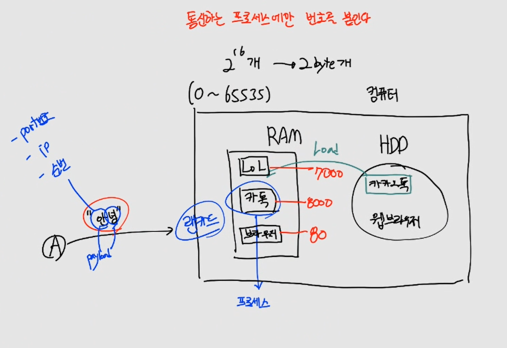
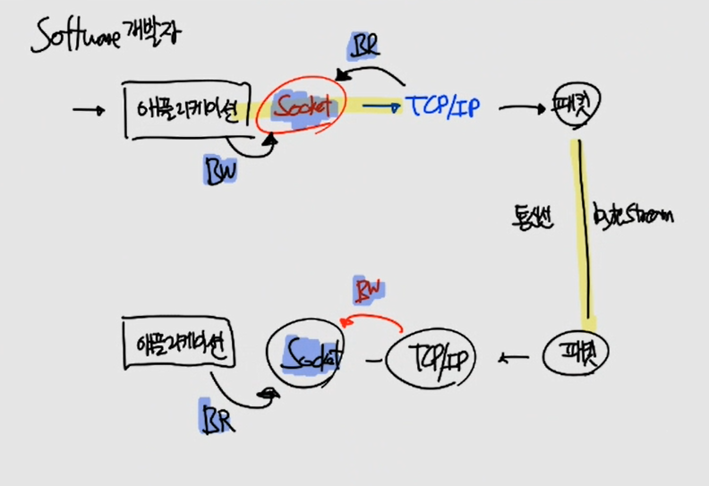
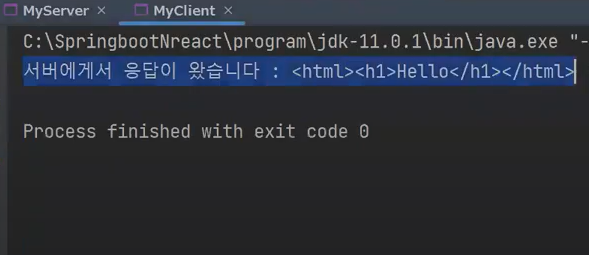
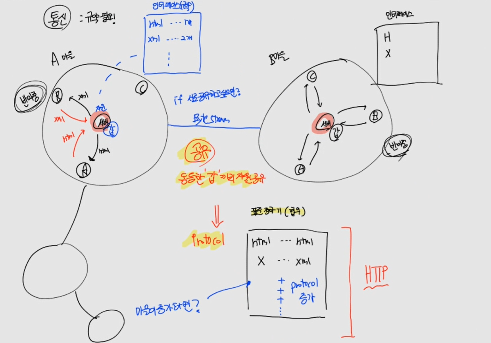

# CH02 소켓통신 기본
> 소켓통신의 개념을 이해하고, 단방향 통신 코드를 작성할 수 있다

## 1. TCP/IP 이해
> TCP/IP 네트워크 인터페이스 계층은 네트워크 계층의 IP 데이터그램을 특정 네트워크 기술이 이해하고 전송할 수 있는 패킷으로 형식화합니다. TCP/IP는 사용자와 애플리케이션이 통신할 고유 네트워크나 호스트를 식별할 수 있게 하는 인터넷 주소 지정 체계를 포함하고 있습니다.

### (1) 포트번호

컴퓨터에는 Ram 과 HDD가 있습니다. A에서 컴퓨터로 "안녕" 데이터를 보내게 되면 "안", "녕" 으로 쪼개집니다. 그리고 입구인 랜카드에 도착합니다.



랜카드는 본인에게 맞는 프로세스로 payload를 보냅니다. 프로세스에 보내기 위해서는 포트번호가 필요하게 됩니다. 따라서 payload 에는 ip, 순번에 port번호가 추가됩니다.

포트번호는 프로세스의 고유 번호입니다.

> 프로세스
- HDD에서 Ram으로 load 한 것을 의미합니다.
- 각 프로세스에는 서로 다른 포트번호가 부여됩니다.

### (2) 애플리케이션, TCP, IP


애플리케이션은 OS 위에 위치하고 있습니다. 그 사이에는 Socket 이 존재한다. 그리고 OS는 TCP 와 IP로 구분됩니다.

동작순서는 애플리케이션에서 "안녕"을 받아서 OS단에서 패킷으로 바뀝니다. 랜카드를 통해 바이너리 데이터로 변환이 되고, 반대편에서는 지금 과정을 반대로 진행하게 됩니다.

> Socket


- 소켓을 예시로 이해
- 카메라로 사진을 찍고 업로드를 하는 경우, 애플리케이션과 OS 사이에 File을 받는 곳이 생김
- File 이라는 곳에서 애플리케이션은 Buffered Read를 하며 File 이 비워지고, 카메라가 다음 사진을 빠르게 채워넣는 방식
- File 을 Socket 이라고 이해하면 됩니다.


### (3) Segment, Packet, Frame


OS 는 TCP 와 IP로 분리가 됩니다. 그렇기 때문에 단순히 OS 에서 패킷을 되는 것이 아니라, TCP를 걸치고 IP를 통과 후 패킷이 됩니다. 또한 Socket에서는 2가지 일이 일어납니다.

- Socket 에서 일어나는 일
  - 애플리케이션: Socket에 Buffered Write
  - OS(TCP): Buffered Read


- OS 에서 일어나는 일
  - OS(TCP): Socket 으로 부터 Buffered Read 한 데이터를 Segment 로 바꾸고 payload 안에 넣습니다.
    - Segment 는 port 번호, 순번을 붙입니다.
    - port 번호, 순번은 payload 가 아닌, header 에 들어갑니다.
  - OS(IP): OS(TCP) 로부터 Segment 를 받고, 패킷으로 변환하며 ip를 붙입니다.

그리고 나서 패킷을 랜카드에 주고 바이너리 데이터가 되는 것입니다.

### (4) 직렬화, 역직렬화

애플리케이션에서 랜카드를 내려가면 직렬화를 하게되고, 바이너리 데이터로 바뀝니다. 그리고 바이트 스트림을 통해 랜카드로 가고 애플리케이션으로 가는 과정이 생깁니다. 이 과정은 역직렬화입니다.


- 직렬화: 기계가 이해할 수 있도록 변환
- 역직렬화: 사람이 이해할 수 있도록 변환

> 7 계층
- 애플리케이션: L7, L6, L5
- OS: TCP(L4), IP(L3)
- LAN: L2, L1

> 소프트웨어 개발자가 이해해야 하는 부분

소프트웨어 개발자는 Socket 을 잘 다루어야 합니다. 따라서 애플리케이션에서 TCP/IP 가는 과정, TCP/IP 에서 애플리케이션으로 가는 Buffered Write 와 Buffered Read 과정의 이해가 다른 곳에 비해 많이 필요합니다.



## 2. 버퍼란
> 버퍼(Buffer)는 데이터를 일시적으로 저장하는 임시 메모리 영역입니다. 데이터의 전송이나 처리 속도의 차이로 인해 발생하는 속도 차이를 조절하고 데이터를 안정적으로 전송하거나 처리하는 데 사용됩니다.
>
> 버퍼는 입력 버퍼와 출력 버퍼로 구성될 수 있습니다. 입력 버퍼는 데이터를 받아들이는 임시 저장소이고, 출력 버퍼는 데이터를 전송하거나 처리하기 위해 임시로 저장하는 공간입니다. 버퍼는 일정한 크기로 지정되며, 데이터가 일정 크기에 도달하면 한 번에 전송되거나 처리됩니다.


### (1) stream 버퍼

> 스트림(Stream)이란? 
>
> 스트림을 가장 쉽게 이해하려면 수도꼭지를 생각하면 된다. 수도꼭지를 틀면 물이 나오고  수도꼭지를 잠그면 물이 나오지 않는다. A라는 곳에서부터 B라는 곳까지 수도관이 연결되어 있고  A에서 계속 물을 보낸다면 B에서 수도꼭지를 틀때마다 물이 나오게 될 것이다.  여기서 스트림은 A수도관에서 B수도관으로 이동하는 물의 흐름이라고 할 수 있다. 프로그래밍에서는 다음과 같은 것들을 스트림이라고 할 수 있다. 
>
> - 파일 데이터 (파일은 그 시작과 끝이 있는 데이터의 스트림이다.) 
> - HTTP 응답 데이터 (브라우저가 요청하고 서버가 응답하는 HTTP 응답 데이터도 스트림이다.) 
> - 키보드 입력 (사용자가 키보드로 입력하는 문자열은 스트림이다.)

### (2) 버퍼

4byte 버퍼가 있고 hello 단어를 보내, 각 과정을 알아보겠습니다.


- 버퍼의 과정
  - A 버퍼에 byte 단위로 h, e, l, l 이 꽉차게 들어감
  - A 버퍼에서는 꽉차면, 자동 flush
  - 이와 동시에, A 버퍼에는 바로 나머지 o 가 할당
  - h, e, l, l 는 소켓에서 패킷으로 변환되어 반대편 소켓으로 이동
  - B 버퍼에 h, e, l, l 이 채워지게 됨
    - 만약, B 버퍼가 꽉 찬 상태에서, A "o" 를 flush 하면 들어오게 되지 못하고, **버퍼링** 발생
    - 따라서 버퍼링을 피하기 위해, B 버퍼에서 빠른 소비
  - B 버퍼에서 read를 해서, String 에 채우기
  - A 버퍼에 있는 "o" 는 꽉 찬 상태가 X, 강제 flush
  - B 버퍼에서 들어온 "o" 를 read
  - String s = "hello";

### (3) 실습
```java
import java.io.IOException;
import java.io.InputStream;

/**
 * Socket: 소켓으로 데이터가 흘러가야 하는 길 (Byte Stream)
 */
public class StreamEx01 {

	public static void main(String[] args) {
		InputStream in = System.in; // 키보드

		try {
			// A = 65, AB = 65 (아스키 코드)
			int inData = in.read(); 
			System.out.println(inData);
			System.out.println((char)inData);
		} catch (IOException e) {
			e.printStackTrace();
		}
	}
}
```

```java
import java.io.InputStream;
import java.io.InputStreamReader;

public class StreamEx02 {

	public static void main(String[] args) {
		InputStream in = System.in; // 키보드에 연결된 스트림으로 정수를 받기
		InputStreamReader reader = new InputStreamReader(in); // 정수 -> char 캐스팅
		
		try {
			// 버퍼 만들기 (고정 길이)
			//char[] inData = new char[1];
			char[] inData = new char[2]; // AB -> AB, ABC -> AB
			//char[] inData = new char[3];
			reader.read(inData);
			System.out.println(inData);
		} catch (Exception e) {
			e.printStackTrace();
		}
	}
}
```
- 주민등록번호와 같이 고정되어 있는 경우에 사용

```java
import java.io.BufferedReader;
import java.io.InputStream;
import java.io.InputStreamReader;

public class StreamEx03 {

	public static void main(String[] args) {
		// 데코레이터 패턴
 	    InputStream in = System.in;
        InputStreamReader reader = new InputStreamReader(in);
        BufferedReader br = new BufferedReader(reader); // 가변길이 데이터를 받음, default size: 8192 byte

        try {
        	String inData = br.readLine();
        	System.out.println(inData);
		} catch (Exception e) {
			e.printStackTrace();
		}
	}
}
```
> 데코레이터 패턴
- 잘 만든 하나를 감싸서 만들고, 그거를 잘 만들어서 또 감싸서 만드는 패턴

```java
import java.io.BufferedReader;
import java.io.InputStream;
import java.io.InputStreamReader;

public class StreamEx04 {

	public static void main(String[] args) {
		OutputStream out = System.out; // 모니터에 연결된 Stream
		OutputStreamWriter ow = new OutputStreamWriter(out);
		BufferedWriter bw = new BufferedWriter(ow);

		try {
        		out.write("안녕하세요. ");
			out.flush();
		} catch (Exception e) {
			e.printStackTrace();
		}
	}
}
```
- System.out.println() 와 동일

## 3. 소켓통신 이해
> 소켓 통신(Socket communication)은 컴퓨터 네트워크에서 프로세스 간에 데이터를 주고받기 위한 통신 방식입니다. 소켓은 프로그램 간에 네트워크를 통해 데이터를 교환하기 위한 인터페이스로 동작합니다.
>
> 소켓 통신은 TCP(Transmission Control Protocol)와 UDP(User Datagram Protocol) 두 가지 프로토콜을 사용할 수 있습니다. TCP는 신뢰성 있는 연결 지향형 통신을 제공하며, UDP는 비연결형 통신으로 데이터 전송 속도가 빠르지만 데이터의 손실이 발생할 수 있습니다.
>
> 소켓 통신은 네트워크 상에서 클라이언트와 서버 간에 데이터를 주고받는 기본적인 메커니즘을 제공합니다. 이를 통해 웹 서버, 채팅 애플리케이션, 온라인 게임 등 다양한 네트워크 기반의 응용프로그램을 개발할 수 있습니다.


### (1) 실습 코드

https://github.com/codingspecialist/socket-study.git

### (2) 소켓

컴퓨터 OS 모니터와 키보드에 연결되어 있는 Socket에 달려있는 System.out 과 System.in 에 소프트웨어 개발자는 집중하면 됩니다. 이곳을 통해서 BufferedWrite, BufferedRead 를 하게 됩니다.


### (3) 단방향 통신 실습 코드 (클라이언트 쓰기, 서버 읽기)

```java
package oneway.server;

import java.io.BufferedReader;
import java.io.IOException;
import java.io.InputStreamReader;
import java.net.ServerSocket;
import java.net.Socket;

public class MyServer {

    public MyServer() throws IOException {
        // 1. 서버 대기중
        ServerSocket serverSocket = new ServerSocket(10000); // 리스너(계속 체크) 서버 생성
        Socket socket = serverSocket.accept(); // 클라이언트 연결 대기, 리스너(계속 체크), 이 소켓도 생성될 때 랜덤으로 포트번호가 잡힘
        System.out.println("클라이언트가 연결되었습니다.");

        // 2. 서버 메시지 읽음
        BufferedReader reader = new BufferedReader(new InputStreamReader(socket.getInputStream(), "utf-8"));
        String msg = reader.readLine(); // 버퍼의 \n까지 읽음, 리스너(계속 \n 체크)
        System.out.println("받은 메시지 : " + msg);
    }

    public static void main(String[] args) {
        try {
            new MyServer();
        } catch (IOException e) {
            throw new RuntimeException(e);
        }
    }
}
```

```java
package oneway.client;

import java.io.BufferedWriter;
import java.io.IOException;
import java.io.OutputStreamWriter;
import java.net.Socket;

public class MyClient {

    public MyClient() throws IOException {
        // 1. 서버 연결
        Socket socket = new Socket("localhost", 10000); // 서버 -> 클라이언트 (실행 순서)

        // 2. 메시지 전송
        BufferedWriter writer = new BufferedWriter(new OutputStreamWriter(socket.getOutputStream(), "utf-8"));
        writer.write("Hello world"); // payload
        writer.write("\n"); // 버퍼에 끝을 알려주는 프로토콜
        writer.flush(); // 버퍼에 담긴 메시지 전공

    }

    public static void main(String[] args) {
        try {
            new MyClient();
        } catch (IOException e) {
            throw new RuntimeException(e);
        }
    }
}
```

MyServer(갑) 를 실행하고 MyClient(을) 를 실행합니다. MyServer 쪽 콘솔창을 보면 다음과 같이 나와있습니다.


> 리스너란?
- 어떤 변화가 있는지 지속적으로 관찰하고 알아차리는 것

### (4) 단방향 통신 이해

말 그대로 단방향 통신은 한쪽 방향으로 흘러가기만 한 것입니다. 


위 코드 또한 단방향 통신의 예시입니다. 

#### 단방향 통신에서의 소켓

Client 쪽 Socket 과 Server 쪽 ServerSocket이 있습니다. 처음 통신을 위해서만 연결이 되고, 그 후로 Server 에서 new Socket을 만들고 Client의 socket이 새로운 서버 소켓에 연결되면, 기존에 있던 serverSocket은 끊기게 됩니다.

즉, serverSocket은 처음 통신을 할때에만 사용이 되는 것입니다.


Client가 BufferedWrite에 write(), flush() 합니다. 이때 꼭 **\n** 을 넣어야 합니다. 왜냐하면 Server 에서 readline할 때, **\n** 까지 읽기 때문입니다. 만약 **\n** 이 없다면, 처리를 하지 못합니다.

> new Socket 생성 시, 포트번호가 랜덤인 이유
- 일반적으로 포트번호는 0 ~ 65535 사이에서 생성
- 0 ~ 1023 은 사용하면 안되는 포트번호
- 만약 고정포트를 작성하면, 포트 충돌 발생
- 따라서 랜덤 사용

### (5) 반이중 통신 (선이 하나) 실습 코드(클라이언트 쓰기, 서버 읽고 쓰기, 클라이언트 읽기)

```java
package hdx;

import java.io.BufferedReader;
import java.io.InputStreamReader;
import java.io.PrintWriter;
import java.net.Socket;

public class MyClient {
    // GET 요청 (자원을 주세요 의미)
    public MyClient() throws Exception{
        // 1. 서버 연결
        Socket socket = new Socket("localhost", 10000);

        // 2. 클라이언트가 요청함 (xml, html) <- 클라이언트가 두 가지를 요청할 수 있다는 것을 알아야 함.
        PrintWriter request = new PrintWriter(socket.getOutputStream(), true);
        request.println("html 페이지 주세요");

        // 3. 클라이언트가 응답을 받음 (반이중)
        BufferedReader response = new BufferedReader(new InputStreamReader(socket.getInputStream(), "utf-8"));
        String msg = response.readLine(); // <html> 코드 읽음
        System.out.println("서버에게서 응답이 왔습니다 : " + msg);
    }

    public static void main(String[] args) {
        try {
            new MyClient();
        } catch (Exception e) {
            throw new RuntimeException(e);
        }
    }
}
```

```java
package hdx;

import java.io.BufferedReader;
import java.io.InputStreamReader;
import java.io.PrintWriter;
import java.net.ServerSocket;
import java.net.Socket;

public class MyServer {

    public MyServer() throws Exception {
        // 1. 서버 대기중
        ServerSocket serverSocket = new ServerSocket(10000); // 연결되면 끊긴다
        Socket socket = serverSocket.accept();// 리스너
        System.out.println("클라이언트가 연결되었습니다.");

        // 2. 서버 요청 받음
        BufferedReader request = new BufferedReader(new InputStreamReader(socket.getInputStream(), "utf-8"));
        String msg = request.readLine(); // client가 BW, Server가 BR
        System.out.println("클라이언트에게서 요청이 왔습니다. : " + msg);

        // 3. 서버 응답 (반이중)
        // PrintWriter: 내부적으로 BufferedWriter와 OutputStreamWriter가 되어 있다.
        PrintWriter response = new PrintWriter(socket.getOutputStream(), true);
        response.println("<html><h1>Hello</h1><html>"); // autoflush와 \n 있다!
        System.out.println("클라이언트에게 응답합니다.");
    }

    public static void main(String[] args) {
        try {
            new MyServer();
        } catch (Exception e) {
            throw new RuntimeException(e);
        }
    }
}
```
- Server 실행 -> Client 실행




- server 쪽에 분기가 되는 코드 만들기

```java
PrintWriter response = new PrintWriter(socket.getOutputStream(), true);
if (msg.equals("html")) {
    response.println("<html><h1>Hello</h1><html>");
} else if (msg.equals("xml")) {
    response.println("<xml>hello</xml>");
} else {
    response.println("잘못된 요청을 하셨습니다. ");
}
```

> PrintWriter 내부 형태
```java
class MyPrintWriter {

    BufferedWriter bw;

    public MyPrintWriter(OutputStream stream) {
        bw = new BufferedWriter(new OutputStreamWriter(stream));
    }

    public MyPrintWriter(OutputStream stream, boolean autoFlush) {
        bw = new BufferedWriter(new OutputStreamWriter(stream));

        if (autoFlush) {
            try {
                bw.flush();
            } catch (IOException e) {
                throw new RuntimeException(e);
            }
        }
    }

    public void print(String msg) {
        try {
            bw.write(msg);
        } catch (IOException e) {
            throw new RuntimeException(e);
        }
    }

    public void println(String msg) {
        try {
            bw.write(msg);
            bw.write("\n");
        } catch (IOException e) {
            throw new RuntimeException(e);
        }
    }
}
```

## 4. HTTP 탄생과 배경
> HTTP(Hypertext Transfer Protocol)는 인터넷에서 데이터를 주고받기 위해 사용되는 프로토콜입니다. 주로 웹 브라우저와 웹 서버 간에 데이터를 전송하는 데에 사용됩니다.
>
> HTTP는 클라이언트-서버 모델에 기반하며, 클라이언트가 서버에 요청(Request)을 보내고, 서버는 클라이언트의 요청에 응답(Response)하는 방식으로 동작합니다. 각각의 요청과 응답은 특정 형식을 갖고 있습니다.

- A마을: A 인터페이스(규약)
- B마을: B 인터페이스(규약)

A 마을과 B 마을은 서로 다른 인터페이스를 가지고 있습니다. 하지만 각 마을의 갑인 **서버**끼리 자원을 공유하고 싶어합니다. 그러면 마을의 중간에 **Byte Stream**으로 연결합니다.



이제 각자의 인터페이스를 **협의**를 통해 **동등한  갑**들끼리 자원을 공유하고 만드는 것이 바로 **프로토콜**입니다.

**즉, 프로토콜은 동등한 갑들끼리 자원을 공유하되 상호 협의를 통해 만들어내는 새로운 규약입니다.**

계속해서 마을들이 공유를 하게 되면 협의를 통해 새로운 규약이 늘어나게 되고, 우리는 이것을 **HTTP** 라고 부릅니다.


그리고 점차 전 세계적으로 확대되어서 그물말처럼 변하고 www (web) 인터넷이 됩니다. 여기서 HTTP라는 규약이 만들어 집니다.

- HTTP 규약 예시 
  - RFC 문서
    - RFC 1 (최초의 프로토콜)
    - RFC 8017 (= RSA)

### 5. 마인드 맵

