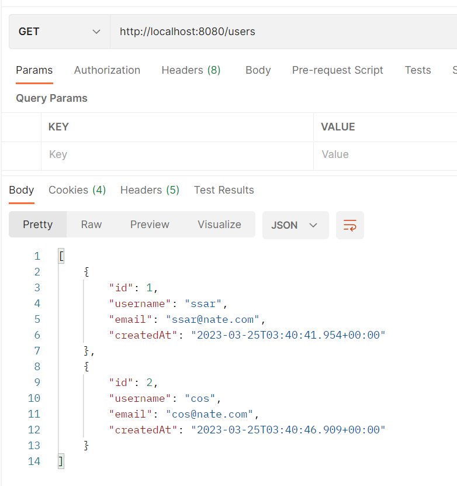
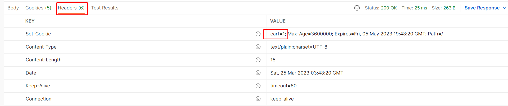
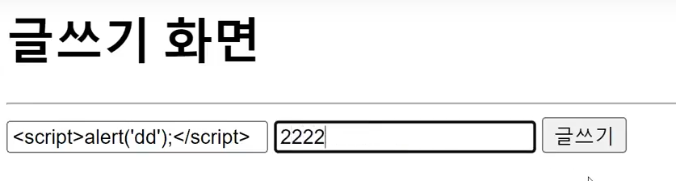
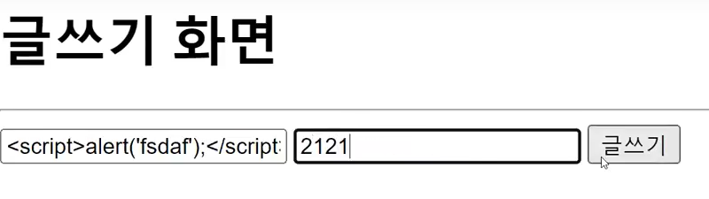

# CH20 스프링부트 인증 - 세션과 쿠키

#### 소스코드

https://github.com/codingspecialist/Springboot-Session-Cookie.git

## 1. 세션과 쿠키

> 대한 응답을 반환하기 전에 세션을 생성하고 클라이언트에게 세션 ID를 제공합니다. 클라이언트는 이 세션 ID를 사용하여 다음 요청에서 서버에 대한 자신의 식별자로 사용합니다. 세션은 기본적으로 서버 메모리에 저장되며, 필요한 경우 외부 저장소에 저장할 수 있습니다. (프로토콜)
>
> 반면 쿠키는 클라이언트 측에서 상태를 유지합니다. 서버는 요청에 대한 응답에서 쿠키를 생성하고 클라이언트에게 제공합니다. 클라이언트는 이 쿠키를 저장하고, 다음 요청에서 해당 쿠키를 서버에게 전달하여 자신을 식별합니다.
>
> 세션과 쿠키는 모두 상태를 유지하는 데 사용됩니다. 그러나 세션은 보안성이 높으며, 클라이언트에 대한 정보를 서버 측에서 유지하기 때문에 쿠키보다 더 많은 정보를 저장할 수 있습니다. 반면 쿠키는 클라이언트 측에서 저장되기 때문에, 서버에서 세션을 생성하는 것보다 더 빠르고 간단합니다. (stateful 서버)
>
> 스프링 부트에서는 세션과 쿠키 모두를 사용할 수 있습니다. 세션은 `HttpSession` 객체를 사용하여 관리하고, 쿠키는 `javax.servlet.http.Cookie` 클래스를 사용하여 생성 및 관리할 수 있습니다.

세션은 모든 유저가 공유하는 메모리 영역이기 때문에 IoC 컨테이너에서 의존성 주입을 할 수도 있고, DispatcherServlet에서 메서드 파라메터로 직접 의존성 주입 받을 수 도 있습니다.

### (1) stateless 서버


예전에는 Client가 Get요청을 하고 논문(데이터)를 받으면 바로 연결을 끊었습니다. 왜냐하면 서버는 데이터를 주고 연결이 되어있으면 부하가 컸기 때문입니다. 

따라서 다음번에 같은 Client가 접근을 해도 서버는 Client 상태를 기억하지 못하며, 데이터를 줄 때마다 연결을 끊기 때문에 트래픽 또한 낮습니다. 이 서버를 stateless 서버라고 부릅니다.

하지만 자원에 접근할 수 있는 상태가 되었기 때문에 Session 생성은 가능합니다.

### (2) stateful 서버 (왔던 Client)


시간이 지나면서 Get 요청 뿐만 아니라 Post, Put, Delete 가 생겼습니다. 그리고 서버는 stateful 서버가 되었고 이는 세션과 쿠키를 통해서 Client 상태를 서버가 기억하는 상태의 서버를 의미합니다.

- 서버 순서
  - Client가 최초 Get 요청
  - Client의 requestHeader에 cookie 값을 검사
  - JsessionId 유무 확인
  - 최초 요청이기 때문에 JsessionId X, 따라서 임의의 중복되지 않는 JsessionId를 생성 (ABC5)
    - JsessionId를 세션메모리 영역의 세션Key에 저장
  - controller, service, repository 작동
  - responseHeader, set-cookie에 JsessionId (ABC5) 담아서 응답
  


- 브라우저 순서(Client)
  - responseHeader, set-cookie에 JsessionId 확인 후, 브라우저의 쿠키에 Key, Value 로 저장
  - 2번째, 재 요청시 JsessionId를 requestHeader, cookie에 담아서 보냄
    - 가지고 있는 쿠키(JsessionId)를 전부 보냄

따라서 서버는 Client가 이전에 왔던 사람이구나만 알 수 있습니다.

### (3) stateful 서버 (구분이 가능)


이전에 왔던 Client인지 아는 단계에서 내부에 회원의 데이터를 저장만 하면, 세션Key를 가지고 구분이 가능합니다. 즉, 로그인 할때 로그인한 사람의 정보를 저장 세션에 저장했기 때문에 누구인지를 정확하게 알 수 있습니다.

> `세션의 구조`
>
> 세션은 내부에 세션Key, 데이터로 이루어져 있습니다. 세션ㅏey에는 JsessionId가 저장이 됩니다. 그리고 데이터 영역은 Key, Value(HashMap)으로 구현되어 있습니다. Key에는 String 값만 들어갈 수 있고, Value에는 Object가 들어갈 수 있습니다.

> `로그인`
>
> 세션영역(데이터 영역)에 Client 정보를 저장하는 것입니다. 따라서 절대로 해킹당하면 안됩니다.

## 2. JSessionID

> JSESSIONID는 웹 애플리케이션에서 세션을 구분하는 데 사용되는 식별자입니다. JSESSIONID는 클라이언트가 서버에 최초 요청을 보낼 때, 서버에서 생성되며, 서버에서 유지되는 세션 ID입니다. 클라이언트는 JSESSIONID를 쿠키 형태로 저장하고, 이후 요청에서는 JSESSIONID를 서버에게 전달하여 해당 클라이언트의 세션을 식별합니다. (프로토콜)
>
> JSESSIONID는 Java Servlet 스펙에 정의된 이름으로, Java 웹 어플리케이션 서버인 Tomcat, Jetty 등에서 기본적으로 사용됩니다. JSESSIONID는 클라이언트와 서버 간의 통신에서 중요한 역할을 합니다. 예를 들어, 사용자가 로그인하면 서버는 사용자를 구분하기 위해 JSESSIONID를 생성하고, 이후의 모든 요청에서 이 세션 ID를 사용하여 사용자의 상태를 유지합니다.
>
> JSESSIONID는 기본적으로 쿠키를 사용하여 클라이언트에 저장됩니다. 만약 클라이언트가 쿠키를 지원하지 않는 경우에는 URL 리다이렉션을 통해 JSESSIONID를 전달합니다. 이러한 경우에는 URL 뒤에 JSESSIONID를 추가하여 전달합니다.
>
> JSESSIONID는 기본적으로 안전하지 않은 형태로 전달됩니다. 따라서 HTTPS 프로토콜을 사용하거나, JSESSIONID를 암호화하거나, JSESSIONID를 포함한 쿠키를 HttpOnly 속성을 설정하여 XSS 공격으로부터 보호할 필요가 있습니다.

JsessionId를 가지고 있으면, 서버에서 이전에 왔던 Client인지 알 수 있고, 구분까지 가능하게 됩니다. 따라서 매우 중요하고 민감한 정보입니다. 하지만 JsessionId를 브라우저가 가지고 있고 request, response로 주고 받을 때 노출됩니다. 따라서 Cookie가 브라우저상에 서자바스크립트로 언제든지 탈취할 가능성이 높습니다.

```javascript
document.cookie; // javascript cookie 접근 방법
```

> `HttpOnly`
> 
> 
> 
> 네이버의 경우 Cookie를 보면 HttpOnly가 체크되어 있는 것과 체크가 되어 있지 않는 것이 존재합니다. 체크가 되어있는 것은 접근이 불가능한 Cookie이고, 나머지는 Cookie에 접근이 가능합니다.

## 3. 인증 서버 실습

### (1) 세팅

#### 의존성

```gradle
dependencies {
    implementation 'org.springframework.boot:spring-boot-starter-data-jpa'
    implementation 'org.springframework.boot:spring-boot-starter-web'
    compileOnly 'org.projectlombok:lombok'
    developmentOnly 'org.springframework.boot:spring-boot-devtools'
    runtimeOnly 'com.h2database:h2'
    annotationProcessor 'org.projectlombok:lombok'
    testImplementation 'org.springframework.boot:spring-boot-starter-test'
}
```

#### application.yml

```yaml
server:
  servlet:
    encoding:
      charset: utf-8
      force: true

spring:
  datasource:
    url: jdbc:h2:mem:test;MODE=MySQL
    driver-class-name: org.h2.Driver
    username: sa
    password:
  h2:
    console:
      enabled: true

  jpa:
    hibernate:
      ddl-auto: create
    show-sql: true
    properties:
      hibernate:
        '[format_sql]': true
```

#### model

- model/User.java

```java
@NoArgsConstructor
@Setter
@Getter
@Table(name = "user_tb")
@Entity
public class User {

    @Id
    @GeneratedValue(strategy = GenerationType.IDENTITY)
    private Integer id;
    @Column(nullable = false, length = 50, unique = true)// null 안된다, 길이 제한, 같은 이름 X
    private String username;
    @JsonIgnore // 파싱 X
    private String password;
    private String email;
    @CreationTimestamp
    private Timestamp createdAt;

    @Builder
    public User(Integer id, String username, String password, String email, Timestamp createdAt) {
        this.id = id;
        this.username = username;
        this.password = password;
        this.email = email;
        this.createdAt = createdAt;
    }

    public void update(String password, String email){
        this.password = password;
        this.email = email;
    }

    @Override
    public String toString() {
        return "User{" +
                "id=" + id +
                ", username='" + username + '\'' +
                ", password='" + password + '\'' +
                ", email='" + email + '\'' +
                ", createdAt=" + createdAt +
                '}';
    }
}
```

- mode/UserRepository.java

```java
public interface UserRepository extends JpaRepository<User, Integer> {

    @Query("select u from User u where u.username = :username and u.password = :password") // JPQL 쿼리(User 대문자)
    Optional<User> findByUsername(@Param("username") String username, @Param("password") String password); // 네임쿼리 사용하지 말기
}
```

#### dto

- dto/UserRequest.java

```java
public class UserRequest { // 내부클래스

    @Getter @Setter
    public static class JoinDto{
        private String username;
        private String password;
        private String email;

        public User toEntity(){ // insert, update 할떄 필요
            return User.builder()
                    .username(username)
                    .password(password)
                    .email(email)
                    .build();
        }
    }

    @Getter @Setter
    public static class LoginDto{
        private String username;
        private String password;
    }
}
```

#### handler

- handler/MyExceptionAdvice.java

```java
@RestControllerAdvice
public class MyExceptionAdvice {

    @ExceptionHandler(MyException.class)
    public ResponseEntity<?> error(MyException e){
        return new ResponseEntity<>(e.getMessage(), e.getHttpStatus());
    }
}
```

- handler/ex/MyException.java

```java
@Getter
public class MyException extends RuntimeException{
    private HttpStatus httpStatus;

    public MyException(String msg) { // 100% 유효성 검사 실패
        this(msg, HttpStatus.BAD_REQUEST); 
    }

    public MyException(String msg, HttpStatus httpStatus) {
        super(msg);
        this.httpStatus = httpStatus;
    }
}
```

### (2) 컨트롤러

- controller/UserController.java

```java
@RequiredArgsConstructor
@RestController
public class UserController { // DI : 생성자 주입(FROM IoC), 메서드 주입(FROM DispatcherServlet)

    private final UserRepository userRepository;
    private final HttpSession session; // 유일한 싱글톤 객체, 상태변수를 session에 두지 말것(공유하기 때문에 변경 시 매우 위험)

    @PostMapping("/join")
    public ResponseEntity<?> join(@RequestBody UserRequest.JoinDto joinDto) { // JSON 데이터로 보내라!
        User userPS = userRepository.save(joinDto.toEntity()); // 비영속 -> 영속화(INSERT 쿼리)
        return new ResponseEntity<>(userPS, HttpStatus.CREATED); // 영속화된 객체를 MessageConverter가 JSON으로 직렬화(그 떄 Getter -> Lazy 로딩으로 인한 무한참조 가능성 확인)
    }

    @PostMapping("/login")
    public ResponseEntity<?> login(@RequestBody UserRequest.LoginDto loginDto) {
        User userPS = userRepository.findByUsername(loginDto.getUsername(), loginDto.getPassword()).orElseThrow(
                () -> new MyException("아이디 혹은 비밀번호가 틀렸습니다.")
        );
        session.setAttribute("loginUser", userPS); // Key(String), Value(Obejct)
        return new ResponseEntity<>(HttpStatus.OK);
    }

    @GetMapping("/users")
    public ResponseEntity<?> userList() {
        List<User> userListPS = userRepository.findAll();
        return new ResponseEntity<>(userListPS, HttpStatus.OK);
    }

    // 주소로 전달되는 데이터: 신뢰할 수 없는 데이터(= 검증필요)
    // 인증과 권한 - 세션 찾기
    @GetMapping("/users/{id}/v1")
    public ResponseEntity<?> userDetailV1(@PathVariable Integer id) {
        User loginUser = (User) session.getAttribute("loginUser");
        if (!loginUser.getId().equals(id)) {
            throw new MyException("고객 정보를 볼 수 있는 권한이 없습니다", HttpStatus.FORBIDDEN);
        }
        User userPS = userRepository.findById(id).orElseThrow(
                () -> new MyException("해당 유저를 찾을 수 없습니다")
        );
        return new ResponseEntity<>(userPS, HttpStatus.OK);
    }

    @PostMapping("/products/{id}/cart")
    public ResponseEntity<?> addCart(@PathVariable Integer id, HttpServletRequest request, HttpServletResponse response) { // DS가 주입
        String productNames = "";
        Cookie[] cookies = request.getCookies();

        // 장바구니가 존재할 때
        boolean checkCookie = false;
        for (Cookie c : cookies) {
            if (c.getName().equals("cart")) {
                productNames += c.getValue() + "/" + id.toString(); // 100/200/300
                checkCookie = true;
            }
        }

        // 장바구니가 존재하지 않을 때
        if (checkCookie == false) {
            productNames = id.toString();
        }

        Cookie cookie = new Cookie("cart", productNames);
        cookie.setPath("/");
        cookie.setMaxAge(1000 * 60 * 60); // 1시간
        cookie.setHttpOnly(false); // document.cookie 접근가능
        response.addCookie(cookie);
        return new ResponseEntity<>("쿠키등록됨", HttpStatus.OK);
    }
}
```

> `Optional객체를 처리하는 정석 코드`
>
> ```java
> Optional<User> userOP = userRepository.findByUsername(loginDto.getUsername(), loginDto.getPassword());
> if (userOP.isPresent()) {
>     session.setAttribute("loginUser", userOP.get());
> } else {
>     throw new Myexception("아이디 혹은 비밀번호가 틀렸습니다. ");
> }
> ```

### (3) 로그인 상태 분기

#### 로그인 한 상태로 접근

원래는 각 컨트롤러에서 공통된 코드로 처리를 했습니다. 이제는 인터셉터로 처리를 합니다. 따라서 컨트롤러에서는 인증 검사를 하지 않고 핵심로직인 분기에 집중할 수 있게 됩니다.

- config/auth/LoginInterceptor.java

```java
public class LoginInterceptor implements HandlerInterceptor { // HttpSession 체크

    @Override
    public boolean preHandle(HttpServletRequest request, HttpServletResponse response, Object handler) throws Exception { // 메소드 실행 직전 작동
        HttpSession session = request.getSession();
        User loginUser = (User) session.getAttribute("loginUser");
        if(loginUser == null){
            response.setContentType("text/plain; charset=utf-8");
            response.getWriter().println("잘못된 접근입니다");
            return false; // 컨트롤러 진입 X
        }else{
            return true;
        }
    }
}
```

- config/WebMvcConfig.java

```java
@RequiredArgsConstructor
@Configuration
public class WebMvcConfig implements WebMvcConfigurer { // Interceptor 등록

    @Override
    public void addInterceptors(InterceptorRegistry registry) {
        registry.addInterceptor(new LoginInterceptor())
                .addPathPatterns("/users/**"); // 해당 주소면 모두 Interceptor먼저 발동 
    }
}
```



#### 로그인 하지 않은 상태

로그인을 하지 않은 상태에서 시도를 하면 인터셉터에 의해서 막힙니다.


### (4) 권한

#### 권한이 없는 상태


#### 권한이 있는 상태

> HandlerMethodArgumentResolver로 처리
>
> -> 리플렉션으로 처리하는 방식을 스프링부트에서 쉽게 제공해준다.

```java
@Target(ElementType.PARAMETER)
@Retention(RetentionPolicy.RUNTIME)
public @interface LoginUser {
}
```

```java
@RequiredArgsConstructor
@Configuration
public class MyLoginArgumentResolver implements HandlerMethodArgumentResolver {

    private final HttpSession session;

    @Override
    public boolean supportsParameter(MethodParameter parameter) {
        boolean check1 = parameter.getParameterAnnotation(LoginUser.class) != null;
        boolean check2 = User.class.equals(parameter.getParameterType());
        return check1 && check2;
    }

    @Override
    public Object resolveArgument(MethodParameter parameter, ModelAndViewContainer mavContainer, NativeWebRequest webRequest, WebDataBinderFactory binderFactory) throws Exception {
        return session.getAttribute("loginUser");
    }
}
```

```java
@RequiredArgsConstructor
@Configuration
public class WebMvcConfig implements WebMvcConfigurer {

    private final MyLoginArgumentResolver myLoginArgumentResolver;

    @Override
    public void addArgumentResolvers(List<HandlerMethodArgumentResolver> resolvers) {
        resolvers.add(myLoginArgumentResolver);
    }
}
```

```java
// 인증과 권한 - 리졸버
@GetMapping("/users/{id}/v2")
public ResponseEntity<?> userDetailV2(@PathVariable Integer id, @LoginUser User loginUser){
    if(!loginUser.getId().equals(id)){
        throw new MyException("고객 정보를 볼 수 있는 권한이 없습니다");
    }
    User userPS = userRepository.findById(id).orElseThrow(
            ()-> new MyException("해당 유저를 찾을 수 없습니다")
    );
    return new ResponseEntity<>(userPS, HttpStatus.OK);
}
```


## 4. 쿠키 실습

- controller/UserController.java

```java
@PostMapping("/products/{id}/cart")
public ResponseEntity<?> addCart(@PathVariable Integer id, HttpServletRequest request, HttpServletResponse response){
    String productNames = "";
    Cookie[] cookies = request.getCookies();

    // 장바구니가 존재할 때
    boolean checkCookie = false;
    for (Cookie c: cookies) {
        if(c.getName().equals("cart")){
            productNames += c.getValue()+"/"+id.toString(); // 100/200/300
            checkCookie = true;
        }
    }

    // 장바구니가 존재하지 않을 때
    if(checkCookie == false){
        productNames = id.toString();
    }

    Cookie cookie = new Cookie("cart", productNames);
    cookie.setPath("/");
    cookie.setMaxAge(1000*60*60); // 1시간
    cookie.setHttpOnly(false); // document.cookie
    response.addCookie(cookie);
    return new ResponseEntity<>("쿠키등록됨", HttpStatus.OK);
}
```




> 쿠키를 추가할 때 마다 Response Headers에 Set-Cookie에 /로 구분하여 하나씩 추가된다. 즉 1명이 여러개의 쿠키를 만들 수 있습니다.


> `쿠키 만들기`
> 
> ```java
> @PostMapping("/cookie/v1")
> public ResponseEntity<?> addCartV2(HttpServletRequest request, HttpServletResponse response) {
>     Cookie cookie = new Cookie("myId", "1234"); // 쿠키 만들기
>     cookie.setHttpOnly(false); // true
>     response.addCookie(cookie);
>     return new ResponseEntity<>("쿠키등록됨", HttpStatus.OK);
> }
> ```
> 
> 
>
> 
>
> ```javascript
> document.cookie
> ``` 
> 

## 5. CORS

> CORS(Cross-Origin Resource Sharing)는 웹 브라우저에서 실행되는 스크립트가 다른 도메인의 리소스에 접근할 때 적용되는 보안 정책입니다. 일반적으로, 웹 브라우저는 보안상의 이유로 자바스크립트에서 다른 도메인의 리소스에 접근하는 것을 허용하지 않습니다. 이를 Same-Origin Policy라고 부릅니다.
>
> 여기서 Cross-Origin는 FE와 BE의 도메인이 서로 다르다는 것입니다.
>
> CORS 정책은 이러한 Same-Origin Policy를 우회할 수 있는 방법을 제공합니다. 서버 측에서는 리소스에 대한 요청 헤더에 허용할 도메인을 명시하여, 해당 도메인에서의 요청에 한해 리소스 접근을 허용할 수 있습니다.
>
> CORS 정책은 다음과 같은 방식으로 동작합니다.
>
> 1. 브라우저에서 웹 페이지가 로드되면, 자바스크립트에서 다른 도메인의 리소스를 요청합니다.
> 2. 서버는 요청 헤더에 Origin이 포함된 요청을 받습니다.
> 3. 서버는 해당 Origin이 허용된 도메인인지 확인합니다.
> 4. 허용된 도메인일 경우, 서버는 응답 헤더에 Access-Control-Allow-Origin을 포함하여, 해당 도메인에서의 요청에 한해 리소스 접근을 허용합니다.
> 5. 브라우저는 Access-Control-Allow-Origin 헤더를 확인하고, 허용된 도메인에서의 요청에 한해 리소스에 접근합니다.
>
> CORS 정책은 보안상의 이유로 브라우저에서 실행되는 스크립트에만 적용되며, 서버 간 통신에는 적용되지 않습니다. 따라서, 서버 간 API 호출 등에서는 다른 방법으로 보안을 구성해야 합니다.

```java
@CrossOrigin(originPatterns = "http://localhost:3000")
@GetMapping("/board")
public String boardList() {
.
.
.
```

어노테이션으로 특정 컨트롤러만 허용을 할 수 있습니다. 하지만 가장 좋은 방법은 Filter 레이어에서 전역적으로 Cross-Origin을 거는 것이 가장 좋습니다.

CORS의 소유권은 서버가 가지고 있습니다. 왜냐하면 자바스크립로 공격을 할 수 있기 때문입니다. 때문에 Filter에서 FE 서버가 요청한 도메인만 CORS를 허용해주는 설정을 해줘야합니다.

그리고 허용된 도메인의 경우 서버는 응답 헤더에 Access-Control-Allow-Origin을 포함하여, 해당 도메인에서의 요청에 한해 리소스 접근을 허용합니다.


```java
.
.
.
@GetMapping("/")
public String boardList(HttpServletResponse response) {
    response.setHeader("Access-Control-Allow-Origin", "http://localhost:3000");
.
.
.
```

이런 이유들 때문에 자바, 파이썬은 가능하지만 브라우저에 접근할 수 있는 자바스크립트의 공격을 CORS는 원하는 도메인을 제외한 나머지는 전부 차단을 하는 것입니다.

> `Cross-Origin`
>
> http://localhost:8080 : BE 도메인 서버
> 
> 1. FE 요청(http://localhost:8080/board") 시, 크로스 도메인이 들어왔다고 파악
> 2. 자바, 파이썬 허용
> 3. 단, 크로스 도메인일 때의 자바스크립트 요청만 거부(보안 때문에)
> 4. 같은 도메인: jsp 코드(fetch) 안막음
>
> http://localhost:3000 : FE 도메인 서버
> 
> 1. 리엑트(자바스크립트)
> 2. fetch("http://localhost:8080/board") 요청
> 3. CORS 허용 오류 발생 -> BE가 CORS의 주도권을 가지고 있기 때문에 설정을 해줘야한다.

> `CORS 목적`
>
> 리소스를 들고 있는 서버가 자바스크립트로 공격하는 특정 누군가에게 자원을 주지 않겠다는 것입니다. 따라서 서버가 주도권을 가집니다.

## 6. XSS 공격 - 본인사이트에서 공격

### (1) 소스코드

https://github.com/codingspecialist/Springboot-Javascript-Attack.git

### (2) XXS(자바스크립트 공격)

> XSS(Cross-Site Scripting) 공격은 웹 사이트에서 발생하는 보안 취약점 중 하나로, 공격자가 악성 스크립트를 삽입하여 사용자의 개인정보를 탈취하거나, 세션 하이재킹 등의 악의적인 행동을 할 수 있게 됩니다.
>
> XSS 공격은 보통 웹 애플리케이션에서 입력 값 검증이나 출력 값 인코딩이 제대로 이루어지지 않을 때 발생합니다. 공격자는 이러한 취약점을 이용하여 악성 스크립트를 삽입하고, 사용자의 브라우저에서 이 스크립트가 실행될 수 있도록 합니다.
>
> XSS 공격은 크로스 사이트 스크립팅(Cross-Site Scripting)이라고도 부릅니다. XSS 공격은 저장형(XSS Stored)과 반사형(XSS Reflected) 두 가지 종류가 있습니다.
>
> - 저장형 XSS : 악성 스크립트가 서버에 저장되어, 해당 페이지를 방문한 모든 사용자에게 영향을 끼칩니다. 예를 들어, 게시판에 악성 스크립트를 삽입하여, 해당 게시판을 방문하는 모든 사용자가 공격을 받을 수 있습니다.
> - 반사형 XSS : 악성 스크립트가 사용자의 입력 값으로부터 생성되어, 해당 페이지를 방문한 특정 사용자에게만 영향을 끼칩니다. 예를 들어, 검색어 등 사용자의 입력 값을 검색 결과로 반환하는 페이지에 악성 스크립트를 삽입하여, 해당 검색어를 입력한 사용자만 공격을 받을 수 있습니다.
>
> XSS 공격을 방지하기 위해서는, 입력 값 검증과 출력 값 인코딩이 제대로 이루어져야 합니다. 또한, 웹 애플리케이션에서는 쿠키를 사용하여 세션 ID를 저장하는 등, XSS 공격으로부터 보호할 수 있는 다양한 보안 기능들이 제공됩니다.

### (3) 반사형

반사형 XSS 공격의 예시를 들어보겠습니다.

예를 들어, 사용자들이 검색어를 입력하여 검색 결과를 반환하는 검색 엔진이 있다고 가정해봅시다. 검색 엔진은 사용자의 입력 값을 검색어로 사용하고, 해당 검색어를 포함하는 웹 페이지를 반환합니다. 이 때, 검색어에 악성 스크립트가 포함되어 있는 경우, 해당 검색어를 입력한 특정 사용자들이 공격을 받을 수 있습니다.

공격자는 검색 엔진의 검색어 입력 폼에 악성 스크립트를 삽입합니다. 이 악성 스크립트는 검색 결과 페이지에 포함되어, 해당 페이지를 방문한 특정 사용자들이 공격을 받게 됩니다. 예를 들어, 검색 결과 페이지에서 사용자의 쿠키 정보를 탈취하는 스크립트를 실행하게 됩니다.

이러한 경우를 방지하기 위해서는, 검색어를 검색하기 전에, 입력 값 검증과 출력 값 인코딩이 제대로 이루어져야 합니다. 또한, 검색 결과를 반환할 때는, 스크립트를 실행할 수 없도록 필터링을 해주는 등의 방법을 사용해야 합니다.


### (4) 저장형

저장형 XSS 공격의 예시를 들어보겠습니다.

예를 들어, 사용자들이 글을 쓰고 읽을 수 있는 게시판이 있다고 가정해봅시다. 사용자들은 게시판에 글을 작성하고, 다른 사용자들도 해당 글을 읽을 수 있습니다. 이 때, 게시판에 악성 스크립트가 삽입되어 있는 경우, 해당 페이지를 방문한 모든 사용자들이 공격을 받을 수 있습니다.

공격자는 게시판의 입력 폼에 악성 스크립트를 삽입합니다. 이 악성 스크립트는 사용자들의 브라우저에서 실행되어, 사용자들의 정보를 탈취하거나, 악의적인 행동을 수행할 수 있습니다. 이후, 게시글을 작성하고 등록하면, 해당 페이지를 방문한 모든 사용자들이 악성 스크립트에 노출됩니다.

이러한 경우를 방지하기 위해서는, 서버에서 입력 값 검증을 철저히 하고, 입력된 내용에 대해 인코딩을 해주는 등의 보안 절차가 필요합니다. 또한, 사용자들이 입력한 내용을 저장할 때는, 스크립트를 실행할 수 없도록 필터링을 해주는 등의 방법을 사용해야 합니다.


- 관리자가 로그인한 상태(세션, 권한 모두 가진 상태)로 자바스크립트로 되어있는 글을 클릭해서 들어가는 순간, 세션과 권한이 모두 뚤려버립니다.

> `jsp, mustache`
>
> jsp로 script.back()을 게시물에 넣어서 작동을 하면 실행이 됩니다. 하지만 mustache를 사용하면 작동하지 않고 문자를 그대로 게시물에 넣습니다. 이로써 알 수 있는 것은 브라우저도 시간이 지남에 따라 보안성이 올라가는 것을 알 수 있습니다.
>
> - jsp
> 
> 
>
> 
>
> - mustache
>
> 
>
> 
>
> 

## 7. CSRF 토큰 - 타사사이트에서 공격

### (1) 영상 참고

https://www.youtube.com/watch?v=cC1tI8cOOOk

### (2) CSRF

> CSRF(Cross-Site Request Forgery) 공격은 공격자가 인증된 사용자의 권한을 이용하여, 악의적인 요청을 전송하는 공격입니다. 예를 들어, 사용자가 의도하지 않은 상황에서 금융 거래를 실행하거나, 개인 정보를 수정하는 등의 행동을 수행할 수 있습니다.
>
> 이러한 CSRF 공격을 방지하기 위해서는, CSRF 토큰을 사용하여 악의적인 요청을 걸러내는 등의 보안 기능이 필요합니다. CSRF 토큰은 웹 애플리케이션에서 발급하는 임시 토큰으로, 해당 토큰이 일치하는 경우에만 요청을 처리하도록 설정됩니다.
>
> 예를 들어, 웹 애플리케이션에서 사용자가 금융 거래를 실행하는 페이지가 있다고 가정해봅시다. 이 때, 사용자가 해당 페이지를 방문할 때마다 임시로 생성된 CSRF 토큰이 발급됩니다.
>
> 사용자가 금융 거래를 실행하는 경우, 해당 페이지에서는 CSRF 토큰을 함께 요청하도록 설정됩니다. 이후, 요청이 서버로 전송될 때, 서버는 CSRF 토큰의 유효성을 검사하고, 일치하는 경우에만 요청을 처리합니다. 이를 통해, 공격자가 위조한 요청은 CSRF 토큰이 일치하지 않아 걸러낼 수 있습니다.
>
> 즉, CSRF 토큰은 인증된 사용자의 세션과 결합하여, 악성 요청을 걸러내는 역할을 합니다. 이러한 보안 기능을 통해, 사용자의 권한이 무단으로 사용되는 것을 방지할 수 있습니다.


예를 들어, 은행 웹 사이트에 로그인한 홍길동이 있다고 가정해봅시다. 홍길동이 은행 계좌 이체를 실행하기 위해, 은행 웹 사이트에서 이체 페이지를 열었습니다.

이 때, 공격자는 다음과 같은 스크립트를 이메일이나 다른 웹 사이트의 링크 등을 통해 홍길동에게 전송합니다.

```css

```

이 스크립트는 은행 계좌 이체를 실행하는 URL을 포함하고 있습니다. 홍길동이 이메일이나 링크를 클릭하여 이 스크립트가 실행될 경우, 홍길동의 브라우저는 해당 URL로 요청을 전송합니다.

하지만, 이 요청은 홍길동의 권한을 이용하는 것으로, 홍길동의 의사와는 관계 없이 요청이 전송됩니다. 따라서, 공격자는 홍길동의 은행 계좌에서 1000원을 이체할 수 있습니다.

이러한 경우를 방지하기 위해서는, CSRF 토큰을 사용하여 악의적인 요청을 걸러내는 등의 보안 기능이 필요합니다. 예를 들어, 사용자가 은행 계좌 이체 페이지를 열 때, 은행 웹 사이트에서 임시로 생성된 CSRF 토큰이 발급됩니다.

이후, 사용자가 이체를 실행하는 경우, 해당 페이지에서는 CSRF 토큰을 함께 요청하도록 설정됩니다. 이후, 요청이 서버로 전송될 때, 서버는 CSRF 토큰의 유효성을 검사하고, 일치하는 경우에만 요청을 처리합니다. 이를 통해, 공격자가 위조한 요청은 CSRF 토큰이 일치하지 않아 걸러낼 수 있습니다.

> 그림 설명 필요 (CSRF 토큰을 생성하고 그것을 모든 태그에 심어서 보내기 - 위조된 태그는 CSRF 토큰이 없다)

> CSRF(Cross-site request forgery) 공격은 인터넷 사용자가 자신도 모르게 다른 사람의 권한을 빌려서 악의적인 행동을 하는 공격입니다. 이해를 돕기 위해 간단한 예시를 들어 설명하겠습니다.
>
> 상상해보세요. 친구와 함께 학교에서 가장 인기 있는 소셜 미디어 웹사이트를 사용하고 있다고 가정합시다. 이 웹사이트에서는 사용자들이 게시물을 작성하고 친구들과 공유할 수 있습니다. 이 사이트에 로그인하면 사용자가 자신의 계정으로 할 수 있는 모든 행동이 가능합니다.
>
> 그런데 이 사이트를 사용하면서 다른 웹사이트를 둘러보기 시작했습니다. 그 중 한 웹사이트는 게임을 소개하고 있는데, 이 게임을 시작하려면 버튼을 클릭하면 된다고 합니다. 그래서 버튼을 클릭했죠. 그런데 이 버튼을 클릭하자마자, 소셜 미디어 웹사이트에서 게시물이 삭제되거나 친구들에게 이상한 메시지가 보내지는 것을 발견했습니다.
>
> 이런 일이 어떻게 발생했을까요? 바로 CSRF 공격 때문입니다. 게임 웹사이트의 버튼은 사용자가 모르게 소셜 미디어 웹사이트에 악의적인 요청을 보내도록 만든 것이었습니다. 이 요청은 사용자가 로그인한 상태에서 이루어지기 때문에 소셜 미디어 웹사이트는 이 요청이 사용자로부터 온 것처럼 인식하고 처리해버립니다. 결국 사용자는 자신도 모르게 소셜 미디어 웹사이트에서 악의적인 행동을 한 것이 되는 것입니다.
>
> 이러한 CSRF 공격을 막기 위해서는 웹사이트에서 인증 과정에 추가적인 보안 수단을 도입해야 합니다. 예를 들어, 사용자가 요청을 보낼 때마다 서버는 이 요청이 정말로 사용자로부터 온 것인지 확인하기 위해 특별한 코드를 요구할 수 있습니다. 이렇게 하면 공격자는 사용자의 권한을 빌려 악의적인 행동을 할 수 없게 됩니다.

### (3) CSRF와 XSS 차이

> CSRF(Cross-site request forgery)와 XSS(Cross-site scripting)는 모두 웹 보안 취약점이지만, 공격 방법과 목표가 다릅니다.
>
> 1. CSRF(Cross-site request forgery): CSRF 공격은 사용자가 로그인한 상태에서, 공격자가 다른 웹사이트를 통해 사용자로 하여금 악의적인 요청을 보내게 만드는 공격입니다. 이렇게 함으로써 공격자는 사용자의 권한을 빌려 특정 행동을 수행하게 됩니다. 예를 들어, 사용자가 로그인한 상태에서 공격자가 만든 페이지에 접근하면, 공격자가 원하는 행동(게시물 삭제, 패스워드 변경 등)이 사용자의 권한으로 수행되는 것입니다.
> 2. XSS(Cross-site scripting): XSS 공격은 공격자가 웹사이트에 악의적인 스크립트를 삽입하여, 다른 사용자가 그 스크립트를 실행하게 하는 공격입니다. 이 공격은 주로 웹사이트의 입력 폼이나 댓글 기능 등을 통해 이루어집니다. 사용자가 악의적인 스크립트가 포함된 페이지를 열면, 스크립트가 실행되어 사용자의 정보를 탈취하거나 다른 악의적인 행동을 할 수 있습니다.
>
> 두 공격 모두 웹사이트의 보안을 해치기 때문에, 웹 개발자는 CSRF 토큰, 콘텐츠 보안 정책(Content Security Policy) 등의 기술을 활용하여 이러한 취약점을 방어해야 합니다.

## 8. 마인드 맵

