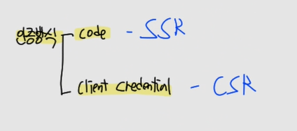
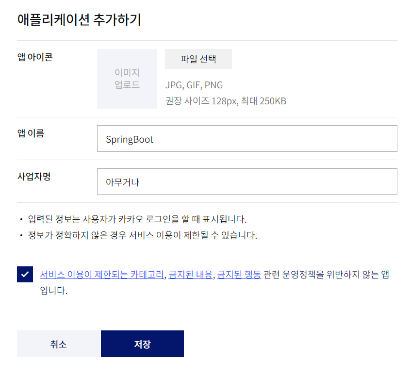
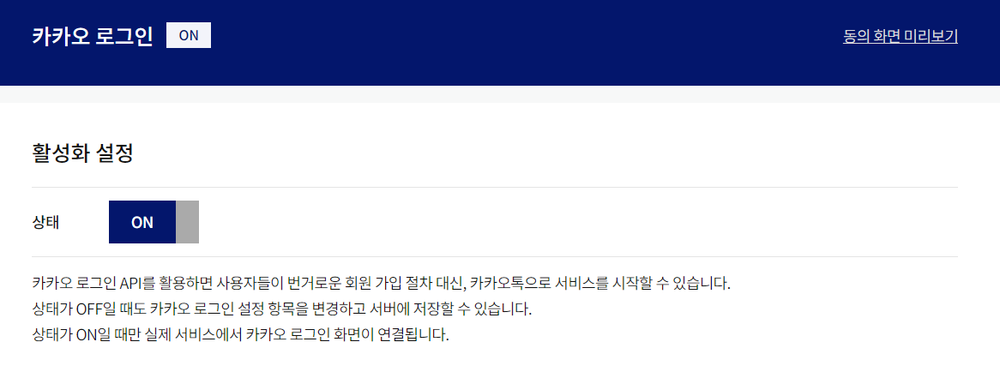

# CH21 스프링부트 OAuth2.0 카카오 로그인

#### 소스코드

https://github.com/codingspecialist/Springboot-OAuth-Kakao-Login

## 1. OAuth 2.0 역할 정리


OAuth는 인증을 열어준다는 의미입니다. 즉, 리소스 오너가 클라이언트에게 리소스 서버에 접근할 수 있는 권한을 부여하는 것입니다. 왜냐하면 리소스 서버에 접근을 하려면 우선적으로 인증서버를 통과해야 하기 때문입니다.

## 2. OAuth 2.0 종류

### (1) 고객의 권함을 위임받기

- Authorization Code Grant 권한 부여 승인 코드 방식

- code 방식의 목적 : 중걔인 - 은행 (교류)

> 고객, 중개인, 은행
>
> (1) 중개인이 고객을 대신하여 은행 업무를 보려고 한다.
>
> (2) 고객은 은행에 가서 본인 인증을 하고, 인증 토큰을 부여 받는다.
>
> (3) 고객은 인증 토큰을 중개인에게 전달한다.
>
> (4) 중개인은 이제 마음껏 인증 토큰을 통해 고객 대신 은행 업무를 본다.

#### 대칭키 방식


대칭키 방식으로 하면 키는 1개이기 때문에 은행에서 토큰 생성과 검증을 다 해야합니다.

#### 공개키 방식


공개키 방식인 경우 중개인이 토큰을 받고 은행에게 갈 필요가 없습니다. 은행의 공개키로 토큰을 열어보면 되기 때문입니다.

#### 카카오


카카오는 리소스오너를 신뢰할 수 없습니다. 왜냐하면 토큰을 주게 된다면 탈취당 할 수 있기 때문입니다. 따라서 리소스 오너와 통신중인 클라이언트를 신뢰할 수 있는지 먼저 확인하고 인증서버에 클라이언트 이름을 기록해 둡니다.

- 카카오 인증 순서
  - 리소스 오너가 카카오에게 로그인 요청
  - 카카오가 리소스 오너에게 임시코드를 제공
  - 리소스 오너가 클라이언트에게 임시코드를 제공
  - 클라이언트가 카카오에게 임시코르를 전송하면서 코드 검증 요청
  - 카카오는 2개를 검증 후 통과가 되면 토큰 발급
    - 코드 검증
    - 신뢰가능한 클라이언트인지 검증
  - 토큰을 받은 클라이언트가 인증 서버를 통과하고 리소스 서버에 접근해서 리소스 오너의 정보만 접근
  - 리소스 오너의 정보를 들고 가져와서 확인


본래의 code 방식 목적은 클라이언트와 카카오가 통신을 하는 것입니다. 하지만 우리는 목적과는 다르게 사용합니다.

#### code 목적과 반대로 사용


code 목적과 반대로 사용하는 것은 클라이언트(서버)와 리소스 오너(리엑트)가 서로 교류하게 만드는 것입니다. 따라서 클라이언트(서버)는 카카오의 리소스 서버(리엑트)에가서 리소스 오너(리엑트)의 정보들을 가져오고, 가져온 정보들을 바탕으로 강제 회원가입을 진행합니다.

그리고 클라이언트(서버)는 리소스 서버(리엑트)와 교류하기 위한 토큰을 만들고 교류를 시작합니다. 이때 토큰을 JWT 토큰이라고 합니다.

만약 클라이언트(서버)가 리소스 오너(리엑트)에게 JWR토큰이 아닌 카카오의 토큰을 주면 안됩니다. 왜냐하면 신뢰할 수 없고, 리소스 오너(서버)가 또 다시 카카오에 매번 접근을 해야하는 불편함이 있기 때문입니다.

### (2) 고객이 정상적인 이민자인지 확인하기

- Clinet Credentials Grant 클라이언트 자격증명 승인 방식

- client 방식의 목적 : 이민자 - 은행 (교류)

> 외국인, 은행, 이민국
>
> (1) 외국인이 은행에 업무를 보려고 한다.
>
> (2) 은행은 외국인이 정상적인 이민자인지 알지 못한다.
>
> (3) 외국인은 이민국에 본인 인증을 하고, 인증 토큰을 부여 받는다.
>
> (4) 외국인은 인증 토큰을 은행에 전달한다.
>
> (5) 은행은 해당 인증 토큰을 신뢰할 수 없기에 이민국에 확인 요청을 한다.
>
> (6) 확인이 완료되면, 은행은 외국인이 업무를 볼 수 있게 허용한다.


client 방식의 목적은 은행와 외국인이 교류를 하는 것입니다. 

- client 인증 방식 순서
  - 외국인이 이민국에게 인증 요청
  - 이민국이 외국인에게 토큰 발급
  - 외국인이 은행에게 토큰 전달
  - 은행이 이민국에게 토큰검증 요청
  - 이민국이 토큰검증 후, 응답
  - 은행과 외국인은 교류 가능


### (3) 정리


- Client 인증 방식 목적 : 이민자 - 은행 (교류), 목적에 부합
- code 인증 방식 목적 : 중개인 - 은행 (교류), 목적에 부합하지 않음
  - 목적과는 다르게 홍길동 - 중개인 (교류) 사용
  - JWT를 사용해서
- 카카오의 경우 code 방식 + 대칭키 방식

> `인증방식`
>
> 
>
> - code 방식 : SSR에 많이 사용
> 
> - client 방식 : CSR에 많이 사용

## 3. 카카오 로그인

### (1) 카카오 개발자 센터 사이트 세팅

https://developers.kakao.com/





카카오 인증 서버에 나를 신뢰가능한 클라이언트로 등록을 했습니다.



 

 

알아야 하는 키는 REST API 키 입니다.


> `call back 주소가 필요한 이유`
>
> code 인증 방식에서 홍길동이 코드를 받고 중개인에게 전달할 때 call back 주소를 사용해서 전달합니다.

### (2) 실습 코드

- 카카오 REST-API 문서

https://developers.kakao.com/docs/latest/ko/kakaologin/rest-api

#### 의존성

```gradle
dependencies {
    implementation 'org.springframework.boot:spring-boot-starter-mustache'
    implementation 'org.springframework.boot:spring-boot-starter-web'
    compileOnly 'org.projectlombok:lombok'
    developmentOnly 'org.springframework.boot:spring-boot-devtools'
    annotationProcessor 'org.projectlombok:lombok'
    testImplementation 'org.springframework.boot:spring-boot-starter-test'
}
```

#### application.yml

```yaml
server:
  port: 8080
  servlet:
    context-path: /
    encoding:
      charset: utf-8
      force: true
spring:
  mustache:
    servlet:
      expose-session-attributes: true # mustache 에서 세션접근 허용, mustache는 스코프 4가지 중에서 접근할수 있는 것은 request만 가능
```

#### resources

- resources/templates/loginForm.mustache

본인의 REST API key를 넣으면 됩니다.

```html
<!DOCTYPE html>
<html lang="en">
<head>
    <meta charset="UTF-8">
    <title>Title</title>
</head>
<body>
<h1>로그인 페이지</h1>
<hr/>
<a href="https://kauth.kakao.com/oauth/authorize?client_id=1f7061f93b3e8f6cbb2a143f64f71f0c&redirect_uri=http://localhost:8080/callback&response_type=code&scope=account_email">카카오로그인</a> 
</body>
</html>
```

- resources/templates/main.mustache

```html
<!DOCTYPE html>
<html lang="en">
<head>
    <meta charset="UTF-8">
    <title>Title</title>
</head>
<body>
<h1>메인 페이지</h1>
<hr/>
{{#principal}}
    username : {{username}} <br/>
    email : {{email}} <br/>
{{/principal}}
</body>
</html>
```

> `URL 분석`
>
> 
>
> 1. REST API key
> 2. callback 주소
> 3. code 방식
> 4. scope 허용 데이터

#### dto

- dto/KakaoToken.java

```java
@Setter
@Getter
public class KakaoToken {

    private String accessToken;
    private String tokenType;
    private String refreshToken;
    private int expiresIn;
    private String scope;
    private int refreshTokenExpiresIn;
}
```

- dto/OAuthProfile.java

```java
@Getter @Setter
public class OAuthProfile { // 문서보고 만듬

    private Long id;
    @JsonProperty("connected_at")
    private String connectedAt;
    @JsonProperty("kakao_account")
    private KakaoAccount kakaoAccount;

    @Getter @Setter
    public class KakaoAccount {

        @JsonProperty("has_email")
        private Boolean hasEmail;
        @JsonProperty("email_needs_agreement")
        private Boolean emailNeedsAgreement;
        @JsonProperty("is_email_valid")
        private Boolean isEmailValid;
        @JsonProperty("is_email_verified")
        private Boolean isEmailVerifed;
        private String email;
    }
}
```

#### util

- util/Fetch.java

```java
public class Fetch {
    public static ResponseEntity<String> kakao(String url, HttpMethod method, MultiValueMap<String, String> body){
        RestTemplate rt = new RestTemplate();

        HttpHeaders headers = new HttpHeaders();
        headers.setContentType(MediaType.APPLICATION_FORM_URLENCODED);

        HttpEntity<?> httpEntity = new HttpEntity<>(body, headers);

        ResponseEntity<String> responseEntity = rt.exchange(url, method, httpEntity, String.class);
        return responseEntity;
    }

    public static ResponseEntity<String> kakao(String url, HttpMethod method, String accessToken){
        RestTemplate rt = new RestTemplate();

        HttpHeaders headers = new HttpHeaders();
        headers.setContentType(MediaType.APPLICATION_FORM_URLENCODED);
        headers.setBearerAuth(accessToken);

        HttpEntity<?> httpEntity = new HttpEntity<>(headers);

        ResponseEntity<String> responseEntity = rt.exchange(url, method, httpEntity, String.class);
        return responseEntity;
    }
}
```

- util/UserStore.java

```java
public class UserStore {

    private static List<User> userList = new ArrayList<>();

    static {
        userList.add(
                new User(
                        1,
                        "kakao_2705547888",
                        UUID.randomUUID().toString(),
                        "ssarmango@gmail.com",
                        "kakao")
        );
    }

    public static void save(User user){
        userList.add(user);
    }

    public static User findByUsername(String username){
        for (User user: userList) {
            if(user.getUsername().equals(username)){
                return user;
            }
        }
        return null;
    }
}
```

#### controller

```java
@RequiredArgsConstructor
@Controller
public class UserController {

    private final HttpSession session;

    @GetMapping("/")
    public String main(){
        return "main";
    }

    @GetMapping("/loginForm")
    public String loginForm(){
        return "loginForm";
    }

    @GetMapping("/callback")
    public String callback(String code) throws JsonProcessingException { // 문서 반드시 참조
        // 1. code 값 존재 유무 확인
        if(code == null || code.isEmpty()){
            return "redirect:/loginForm";
        }

        // 2. code 값 카카오 전달 -> access token 받기
        MultiValueMap<String, String> body = new LinkedMultiValueMap<>(); // x-www-form-urlencoded 만듬
        body.add("grant_type", "authorization_code");
        body.add("client_id", "1f7061f93b3e8f6cbb2a143f64f71f0c");
        body.add("redirect_uri", "http://localhost:8080/callback"); // 2차 검증
        body.add("code", code); // 핵심

        ResponseEntity<String> codeEntity = Fetch.kakao("https://kauth.kakao.com/oauth/token", HttpMethod.POST, body);

        // 3. access token으로 카카오의 홍길동 resource 접근 가능해짐 -> access token(가장 중요)을 파싱하고
        ObjectMapper om = new ObjectMapper();
        om.setPropertyNamingStrategy(PropertyNamingStrategy.SNAKE_CASE); // <- 바꾸기
        KakaoToken kakaoToken = om.readValue(codeEntity.getBody(), KakaoToken.class);

        // 4. access token으로 email 정보 받기 (ssar@gmail.com)
        ResponseEntity<String> tokenEntity = Fetch.kakao("https://kapi.kakao.com/v2/user/me", HttpMethod.POST, kakaoToken.getAccessToken());
        OAuthProfile oAuthProfile = om.readValue(tokenEntity.getBody(), OAuthProfile.class);

        // 5. 해당 provider_id 값으로 회원가입되어 있는 user의 username 정보가 있는지 DB 조회 (X)
        User user = UserStore.findByUsername("kakao_"+oAuthProfile.getId());

        // 6. 있으면 그 user 정보로 session 만들어주고, (자동로그인) (X)
        if(user != null){
            System.out.println("디버그 : 회원정보가 있어서 로그인을 바로 진행합니다");
            session.setAttribute("principal", user);
        }

        // 7. 없으면 강제 회원가입 시키고, 그 정보로 session 만들어주고, (자동로그인)
        if(user == null){
            System.out.println("디버그 : 회원정보가 없어서 회원가입 후 로그인을 바로 진행합니다");
            User newUser = new User(
                    2,
                    "kakao_"+oAuthProfile.getId(),
                    UUID.randomUUID().toString(),
                    oAuthProfile.getKakaoAccount().getEmail(),
                    "kakao"
                    );
            UserStore.save(newUser);
            session.setAttribute("principal", newUser);
        }
        return "redirect:/";
    }
}
```


> `callback`
>
> ```java
> @GetMapping("/callback")
> public @ResponseBody String callback(String code) {
>      return "받은 코드 : " + code;
> }
> ```
> 
>
> 
>
> 1. 카카오로그인 클릭
> 2. 카카오에게 3가지를 전달하면서 요청이 날라감(client_id, call back주소, scope)
> 3. 카카오는 302 Location(client_id, call back주소, scope이 포함된 주소)를 응답
> 4. 고객은 Location으로 받은 주소로 redirect를 실행

### (2) 카카오 인증 방식

> Authorization Code Grant 권한 부여 승인 코드 방식 사용 + 대칭키


### (3) 코드 방식, 크리덴셜 방식


## 4. 마인드 맵

