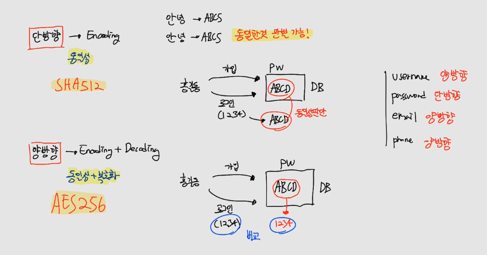
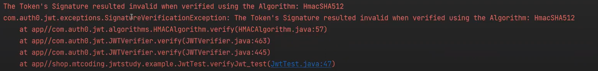
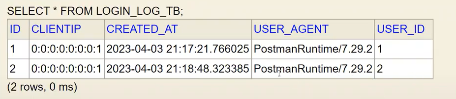

# CH22 스프링부트 인증 - Json Web Token

#### 소스코드

https://github.com/codingspecialist/Springboot-JWT

## 1. JWT

> JWT (JSON Web Token)은 웹 표준 (RFC 7519)으로, 정보를 안전하게 전송하기 위한 열린 표준입니다. JWT는 JSON 형식으로 데이터를 전송하며, 이 데이터는 서명 된 토큰으로 구성됩니다.
>
> JWT는 인증과 권한 부여를 위해 사용됩니다. 사용자가 로그인하면 JWT가 생성되고, 이 JWT는 서버에서 유지되며, 매 요청마다 클라이언트에서 서버로 전송됩니다. 서버는 JWT를 검증하고 사용자의 권한을 확인한 후, 요청에 대한 응답을 반환합니다. (매 요청마다 클라이언트는 토큰을 가지고 와야한다.)
>
> JWT는 세 가지 부분으로 구성됩니다.
>
> 1. Header : 토큰의 유형과 서명에 사용되는 알고리즘을 지정하는 JSON 형식의 객체입니다.
> 2. Payload : 토큰에 저장되는 정보 (클레임)가 들어 있는 JSON 형식의 객체입니다.
> 3. Signature : Header와 Payload의 인코딩 값을 비밀 키로 서명하여 생성된 문자열입니다.
>
> 서버에서는 JWT의 서명을 검증하여 토큰이 유효한지 확인합니다. 서명이 유효하지 않은 경우, 토큰이 변조되었거나 위조되었다는 것을 의미합니다.
>
> JWT는 특히 분산된 서비스 아키텍처에서 인증을 처리할 때 유용합니다. JWT를 사용하면 서비스 간에 인증을 공유할 수 있으며, 이는 더욱 유연하고 확장 가능한 시스템을 구축할 수 있도록 도와줍니다.


- JWT 과정
  - 클라이언트가 서버에게 인증요청
  - 서버는 인증 확인
  - 서버가 JWT 토큰을 생성
  - 서버가 클라이언트에게 response에 JWT를 담아 전달
  - 클라이언트가 다른 서버에 자원을 요청 시, 받았던 JWT를 requestHeader에 담아서 전송
  - 서버는 JWT 검증
  - 서버가 자원 전달

JWT 과정을 보면, JsessionId를 사용하지 않습니다. 그렇기 때문에 클리이언트의 상태를 기억하지 못합니다. 그러면 JWT는 stateless서버가 됩니다.

하지만 기억해야 할 것은 JsessionId만 사용하지 않을 뿐이지 세션영역은 사용할 수 있습니다. 왜냐하면 세션영역은 데이터를 잠시 저장할 수 있는 목적을 가진 영역이기 때문입니다.

### (1) 단방향, 양방향



- 단방향
  - 인코딩
  - 인코딩("안녕" -> "ABC5")
  - 효과
    - 인코딩 : 동일성

- 양방향
  - 인코딩, 디코딩
  - 디코딩("ABC5" -> "안녕")
  - 효과
    - 인코딩 : 동일성
    - 디코딩 : 복호화

비밀번호가 같은지 비교가 목적인 경우에는 단방향으로 하면됩니다. 굳이 양방향을 이용해서 복호화를 하는 방법을 할 필요가 없습니다.

그래서 대부분 password의 경우는 단방향으로 인코딩만 합니다. 이를 통해 인코딩 전의 password는 아무도 알 수 없습니다.

### (2) base64


JWT는 base64(양방향)기반으로 만들어집니다. 따라서 인코딩도 되고 디코딩도 가능합니다. 하지만 보안의 목적으로 인코딩, 디코딩을 하는 것이 아닙니다.

예를 들어, 사진 데이터를 보내려면 binaryData를 base64 인코딩을 통해 JSON(String)으로 바꿉니다. 그리고 받을 때 base64 디코딩을 통해 binaryData 형태로 바꾸기 위해서 base64를 사용합니다. 이때 참고하는 표가 base64표 입니다.

따라서 base64는 보안의 목적이 아닌, binaryData를 문자열로 바꾸거나 그 반대일 경우에 목적을 가집니다.


### (3) JWT


JWT는 3가지 부분으로 나뉩니다.

- header
  - type
  - algorithm
- payload
  - id
  - role
  - expired
- verify signature

payload 3가지는 무조건 적으로 보내줘야 하는 데이터들 입니다. 이를 통해서 권한을 체크할 수 있기 때문입니다. 그리고 header와 payload 2개를 시크릿키를 통해 HS512로 단방향 암호화를 합니다. 시크릿 키로 단방향 암호화를 하는 이유는 시크릿 키는 오직 본인만 동일성 체크가 가능하기 때문입니다.

그렇게 해서 나온 것이 verity signature 입니다. 이 3가지를 base64로 각각 인코딩하면 encoded Token 처럼 일정한 길이를 가진 문자열이 나오게 됩니다.

> `Authentication vs Authorization`
>
> 인증(Authentication): JWT는 사용자가 자신의 신분을 확인하고 인증하는 데 사용됩니다. 사용자가 로그인하면 서버는 해당 사용자의 신분을 확인하고 유효한 JWT를 발급합니다. 이후 클라이언트는 발급된 JWT를 보관하고, 서버에 요청할 때마다 JWT를 함께 전송하여 자신의 신분을 인증하는데 사용합니다.
> 
> 권한(Authorization): JWT에는 사용자에게 부여된 권한 정보가 포함될 수 있습니다. 서버는 JWT를 디코딩하여 해당 사용자에게 허용된 기능이나 리소스에 대한 권한을 확인합니다. 이를 통해 서버는 인증된 사용자에게만 특정 기능이나 데이터에 접근할 수 있는 권한을 부여할 수 있습니다.
>
> JWT는 서버에서 발급되고 클라이언트 측에서 저장되어 사용되므로, 토큰 자체가 모든 인증 및 권한 정보를 담고 있어서 서버의 상태를 저장할 필요 없이 무상태(stateless) 아키텍처를 구현하는 데에도 유용합니다. 또한, 클라이언트 측에서 검증이 가능하므로 권한 확인을 위한 추가적인 데이터베이스 조회를 최소화하여 성능을 향상시킬 수 있습니다.

## 2. 실습코드

### (1) 의존성

https://mvnrepository.com/artifact/com.auth0/java-jwt

```gradle
dependencies {
    implementation group: 'com.auth0', name: 'java-jwt', version: '4.3.0'
    implementation 'org.springframework.boot:spring-boot-starter-data-jpa'
    implementation 'org.springframework.boot:spring-boot-starter-web'
    compileOnly 'org.projectlombok:lombok'
    developmentOnly 'org.springframework.boot:spring-boot-devtools'
    runtimeOnly 'com.h2database:h2'
    annotationProcessor 'org.projectlombok:lombok'
    testImplementation 'org.springframework.boot:spring-boot-starter-test'
}
```

### (2) 세팅

#### JwtstudyApplication.java

```java
@SpringBootApplication
public class JwtstudyApplication {

    // 서버 실행시 실행됨!!
    @Bean // return 되면, 전부 띄움
    CommandLineRunner initDatabase(UserRepository userRepository){
        return (args)->{
            userRepository.save(User.builder().username("ssar").password("1234").email("ssar@nate.com").role("USER").build());
            userRepository.save(User.builder().username("admin").password("1234").email("admin@nate.com").role("ADMIN").build());
        };
    }

    public static void main(String[] args) {
        SpringApplication.run(JwtstudyApplication.class, args);
    }
}
```

#### model

- model/user/User.java

```java
@NoArgsConstructor
@Setter // DTO 만들면 삭제해야됨
@Getter
@Table(name = "user_tb")
@Entity
public class User {

    @Id
    @GeneratedValue(strategy = GenerationType.IDENTITY)
    private Long id;
    private String username;
    @JsonIgnore
    private String password;
    private String email;
    private String role;
    private LocalDateTime createdAt;
    private LocalDateTime updatedAt;

    @PrePersist
    protected void onCreate() {
        this.createdAt = LocalDateTime.now();
    }

    @PreUpdate
    protected void onUpdate() {
        this.updatedAt = LocalDateTime.now();
    }

    @Builder
    public User(Long id, String username, String password, String email, String role, LocalDateTime createdAt) {
        this.id = id;
        this.username = username;
        this.password = password;
        this.email = email;
        this.role = role;
        this.createdAt = createdAt;
    }
}
```

- model/user/UserRepository.java

```java
public interface UserRepository extends JpaRepository<User, Integer> {

    @Query("select u from User u where u.username = :username and u.password = :password")
    Optional<User> findByUsernameAndPassword(
            @Param("username") String username,
            @Param("password") String password
    );
}
```

- model/log/LogingLog.java

```java
@NoArgsConstructor
@Setter // DTO 만들면 삭제해야됨
@Getter
@Table(name = "login_log_tb")
@Entity
public class LoginLog {

    @Id
    @GeneratedValue(strategy = GenerationType.IDENTITY)
    private Long id;
    private Long userId;
    private String userAgent;
    private String clientIP;
    private LocalDateTime createdAt;

    @Builder
    public LoginLog(Long id, Long userId, String userAgent, String clientIP, LocalDateTime createdAt) {
        this.id = id;
        this.userId = userId;
        this.userAgent = userAgent;
        this.clientIP = clientIP;
        this.createdAt = createdAt;
    }

    @PrePersist
    protected void onCreate() {
        this.createdAt = LocalDateTime.now();
    }
}
```

- model/log/LogingLogRepository.java

```java
public interface LoginLogRepository extends JpaRepository<LoginLog, Integer> {
}
```

#### dto

- dto/user/UserRequest.java

```java
public class UserRequest {
    @Getter @Setter
    public static class LoginDto {
        private String username;
        private String password;
    }
}
```
- dto/ResponseDto.java

```java
@Getter
public class ResponseDto<T> {

    private Integer status; // 에러시에 의미 있음.
    private String msg; // 에러시에 의미 있음. ex) badRequest
    private T data; // 에러시에는 구체적인 에러 내용 ex) username이 입력되지 않았습니다

    public ResponseDto(){
        this.status = HttpStatus.OK.value();
        this.msg = "성공";
        this.data = null;
    }

    public ResponseDto<?> data(T data){
        this.data = data;
        return this;
    }

    public ResponseDto<?> fail(HttpStatus httpStatus, String errorTitle, T errorDetail){
        this.status = httpStatus.value();
        this.msg = errorTitle;
        this.data = errorDetail;
        return this;
    }
}
```

### (2) HMacTest

```java
public class HMacTest {

    @Test
    public void hmac_test(){
        String message = "Your message to be hashed";
        String secretKey = "Your secret key";

        try {
            String hashedMessage = hmacSha512(message, secretKey); // 단방향 암호화
            System.out.println("HMAC-SHA512 Hashed Message: " + hashedMessage);
        } catch (NoSuchAlgorithmException | InvalidKeyException e) {
            e.printStackTrace();
        }
    }

    private static String hmacSha512(String message, String secretKey) throws NoSuchAlgorithmException, InvalidKeyException {
        Mac mac = Mac.getInstance("HmacSHA512");
        SecretKeySpec secretKeySpec = new SecretKeySpec(secretKey.getBytes(StandardCharsets.UTF_8), "HmacSHA512");
        mac.init(secretKeySpec);
        byte[] hmacSha512Bytes = mac.doFinal(message.getBytes(StandardCharsets.UTF_8));

        // 바이트 배열을 Base64로 인코딩하여 문자열로 변환
        return Base64.getEncoder().encodeToString(hmacSha512Bytes);
    }
}
```

### (3) JwtTest

```java
@Test
public void createJwt_test(){
    // given

    // when
    String jwt = JWT.create()
            .withSubject("토큰제목")
            .withExpiresAt(new Date(System.currentTimeMillis()+1000*60*60*24*7)) // 1주일 만료
            .withClaim("id", 1)
            .withClaim("role", "guest")
            .sign(Algorithm.HMAC512("메타코딩")); // 노출되면 안되는 비밀키
    System.out.println(jwt);
    // then
}
```

실행 후, 콘솔에 나온 값을 디코딩을 해봅시다.

#### JWT 디코딩

https://jwt.io/


#### JWT 검증 테스트

```java
@Test
public void verifyJwt_test(){
    String myVar = System.getenv("SECRET");

    // given
    // 토큰 생성 -> base64 인코딩
    String jwt = JWT.create()
            .withSubject("토큰제목")
            .withExpiresAt(new Date(System.currentTimeMillis()+1000*60*60*24*7)) // 1000(1초)로 바꿔 만료 테스트 해보기
            .withClaim("id", 1)
            .withClaim("role", "guest")
            .sign(Algorithm.HMAC512(myVar)); // 시크릿 키
    System.out.println(jwt);

    // when
    try {
        // base64 디코딩 -> 토큰 검증(검증이 되면, 내가 만든 JWT토큰이 맞구나!)
        DecodedJWT decodedJWT = JWT.require(Algorithm.HMAC512(myVar)) // 시크릿키 가지고 있는 사람만 검증이 가능하다
                .build().verify(jwt);
        int id = decodedJWT.getClaim("id").asInt();
        String role = decodedJWT.getClaim("role").asString();
        System.out.println(id);
        System.out.println(role);
    }catch (SignatureVerificationException sve){
        System.out.println("토큰 검증 실패 "+sve.getMessage()); // 위조
    }catch (TokenExpiredException tee){
        System.out.println("토큰 만료 "+tee.getMessage()); // 오래됨
    }

    // then
}
```

> `Jwt 테스트를 통해서 에러잡기`
>
> TokenExpiredException, 토큰 시간 만료시 발생하는 에러
> 
>
> SignatureVerificationException, 토큰 검증 실패 에러
> 
>
> 테스트를 통해 발생하는 에러들을 JwtProvider에서 throw를 해줍니다. 미리 예방을 하는 것입니다.

### (4) EnvTest

```java
public class EnvTest {

    @Test
    public void env_test(){
        String myVar = System.getenv("JAVA_HOME");
        System.out.println(myVar);
    }
}
```


EnvTest 코드 추가

```java
@Test
public void env2_test(){
    String myVar = System.getenv("SECRET"); // OS변수로 관리
    System.out.println(myVar);
}
```


```
echo %SELECT%
```


### (5) controller

```java
@RequiredArgsConstructor
@RestController
public class UserController {

    private final UserRepository userRepository;
    private final LoginLogRepository loginLogRepository; // 추후 AOP로 완성하는 거 과제 내기
    private final HttpSession session;

    @GetMapping("/") // 인증 불필요
    public ResponseEntity<?> main() {
        return ResponseEntity.ok().build();
    }

    // ssar로 로그인해서 /user/2/v1 호출해보기
    @GetMapping("/user/{id}/v1") // 인증, 권한 필요
    public ResponseEntity<?> userV1(@PathVariable Integer id) {
        // 권한처리 이 사람이 이 정보의 주인
        LoginUser loginUser = (LoginUser) session.getAttribute("loginUser");
        if (loginUser.getId() == id) { // 권한체크
            return ResponseEntity.ok().build();
        } else {
            throw new Exception403("해당 리소스의 주인이 아닙니다");
        }
    }

    // 관리자로 로그인 해보기
    @GetMapping("/user/{id}/v2") // 인증, 권한 필요 and 관리자 접근 가능
    public ResponseEntity<?> userV2(@PathVariable Integer id) {
        // 권한처리 이 사람이 이 정보의 주인
        LoginUser loginUser = (LoginUser) session.getAttribute("loginUser");
        if (loginUser.getId() == id || loginUser.getRole().equals("ADMIN")) {
            return ResponseEntity.ok().build();
        } else {
            throw new Exception403("해당 리소스의 주인이 아닙니다");
        }
    }

    @Transactional // 트랜젝션 종료시 em.flush 발동
    @PostMapping("/login")
    public ResponseEntity<?> login(@RequestBody UserRequest.LoginDto loginDto, HttpServletRequest request) {
        Optional<User> userOP = userRepository.findByUsernameAndPassword(loginDto.getUsername(), loginDto.getPassword());

        // 로그인 됐다는 뜻!!
        if (userOP.isPresent()) {
            // 1. 유저 정보 꺼내기
            User loginUser = userOP.get();

            // 2. JWT 생성하기
            String jwt = JwtProvider.create(userOP.get());

            // 3. 최종 로그인 날짜 기록 (더티체킹 - update 쿼리 발생)
            loginUser.setUpdatedAt(LocalDateTime.now());

            // 4. 로그 테이블 기록
            LoginLog loginLog = LoginLog.builder()
                    .userId(loginUser.getId())
                    .userAgent(request.getHeader("User-Agent"))
                    .clientIP(request.getRemoteAddr())
                    .build();
            loginLogRepository.save(loginLog);

            // 5. 응답 DTO 생성
            ResponseDto<?> responseDto = new ResponseDto<>().data(loginUser);
            return ResponseEntity.ok().header(JwtProvider.HEADER, jwt).body(responseDto);
        } else {
            throw new Exception400("유저네임 혹은 아이디가 잘못되었습니다");
        }
    }
}
```




Bearer 확인(JWT 프로토콜)


토큰을 넣어서 다시 user/1/v1 전달


user/2/v1


어드민으로 로그인 후 토큰과 함께 보내기, 관리자는 전부 접근 가능


#### core

- core/jwt/JwtProvider.java

```java
public class JwtProvider {

    private static final String SUBJECT = "jwtstudy";
    private static final int EXP = 1000 * 60 * 60;
    public static final String TOKEN_PREFIX = "Bearer "; // 스페이스 필요함
    public static final String HEADER = "Authorization";
    private static final String SECRET = "메타코딩";

    // 로그인 완료시 JWT 토큰 생성
    public static String create(User user) {
        String jwt = JWT.create()
                .withSubject(SUBJECT)
                .withExpiresAt(new Date(System.currentTimeMillis() + EXP))
                .withClaim("id", user.getId())
                .withClaim("role", user.getRole())
                .sign(Algorithm.HMAC512(SECRET));
        System.out.println("디버그 : 토큰 생성됨");
        return TOKEN_PREFIX + jwt;
    }

    // 인증이 필요한 리소스 접근시 JWT 토큰 검증
    public static DecodedJWT verify(String jwt) throws SignatureVerificationException, TokenExpiredException { // 에러 런지기
        DecodedJWT decodedJWT = JWT.require(Algorithm.HMAC512(SECRET))
                .build().verify(jwt);
        System.out.println("디버그 : 토큰 검증됨");
        return decodedJWT;
    }
}
```

- core/filter/JwtVerifyFilter.java

```java
public class JwtVerifyFilter implements Filter {
    
    @Override
    public void doFilter(ServletRequest request, ServletResponse response, FilterChain chain) throws IOException, ServletException {
        System.out.println("디버그 : JwtVerifyFilter 동작함");

        // 1. 다운 캐스팅
        HttpServletRequest req = (HttpServletRequest) request;
        HttpServletResponse resp = (HttpServletResponse) response;

        // 2. 해더 검증
        String prefixJwt = req.getHeader(JwtProvider.HEADER); // Authorization
        if(prefixJwt == null){
            error(resp, new Exception400("토큰이 전달되지 않았습니다"));
            return;
        }

        // 3. 토큰 검증을 위한 Bearer 제거, 순수 JWT 
        String jwt = prefixJwt.replace(JwtProvider.TOKEN_PREFIX, "");

        try {
            // 4. 검증
            DecodedJWT decodedJWT = JwtProvider.verify(jwt);
            int id = decodedJWT.getClaim("id").asInt();
            String role = decodedJWT.getClaim("role").asString();

            // 5. 세션생성 - 세션값으로 권한처리하기 위해(세션은 오래 저장하기 위해서 사용하는 것이다. 로그인을 사용하기 위해서 사용하는 것은 아님)
            HttpSession session =  req.getSession();
            LoginUser loginUser = LoginUser.builder().id(id).role(role).build();
            session.setAttribute("loginUser", loginUser);

            // 6. 다음필터로 이동, 없으면 DS로
            chain.doFilter(req, resp);
        }catch (SignatureVerificationException sve){
            error(resp, sve);
        }catch (TokenExpiredException tee){
            error(resp, tee);
        }
    }

    // 필터 예외는 Exception 핸들러에서 처리하지 못한다. -> util로 따로 빼는게 좋다
    private void error(HttpServletResponse resp, Exception e) throws IOException {
        resp.setStatus(401);
        resp.setContentType("application/json; charset=utf-8");
        ResponseDto<?> responseDto = new ResponseDto<>().fail(HttpStatus.UNAUTHORIZED, "인증 안됨", e.getMessage());
        ObjectMapper om = new ObjectMapper();
        String responseBody = om.writeValueAsString(responseDto);
        resp.getWriter().println(responseBody);
    }
}
```

- core/session/LoginUser.java

```java
@Getter
public class LoginUser {
    
    private Integer id;
    private String role;

    @Builder
    public LoginUser(Integer id, String role) {
        this.id = id;
        this.role = role;
    }
}
```

- core/advice/MyExceptionAdvice.java

```java
@RestControllerAdvice
public class MyExceptionAdvice {

    @ExceptionHandler(Exception400.class)
    public ResponseEntity<?> badRequest(Exception400 e){
        return new ResponseEntity<>(e.body(), e.status());
    }

    @ExceptionHandler(Exception401.class)
    public ResponseEntity<?> unAuthorized(Exception401 e){
        return new ResponseEntity<>(e.body(), e.status());
    }

    @ExceptionHandler(Exception403.class)
    public ResponseEntity<?> forbidden(Exception403 e){
        return new ResponseEntity<>(e.body(), e.status());
    }

    @ExceptionHandler(Exception404.class)
    public ResponseEntity<?> notFound(Exception404 e){
        return new ResponseEntity<>(e.body(), e.status());
    }

    @ExceptionHandler(Exception500.class)
    public ResponseEntity<?> serverError(Exception500 e){
        return new ResponseEntity<>(e.body(), e.status());
    }
}
```

- core/exception/Exception400.java
  - core/exception/Exception401.java
  - core/exception/Exception403.java
  - core/exception/Exception404.java
  - core/exception/Exception500.java

```java
// 유효성 실패
@Getter
public class Exception400 extends RuntimeException {
    public Exception400(String message) {
        super(message);
    }

    public ResponseDto<?> body(){
        ResponseDto<String> responseDto = new ResponseDto<>();
        responseDto.fail(HttpStatus.BAD_REQUEST, "badRequest", getMessage());
        return responseDto;
    }

    public HttpStatus status(){
        return HttpStatus.BAD_REQUEST;
    }
}
```

> `JWT와 Session 그리고 권한체크`
>
> JWT를 사용하면 상태관리를 하지 않기 때문에 JsessionId를 사용하지 않고 Session은 사용할 수 있습니다. 세션은 저장소이기 때문입니다. 즉, 세션은 오래 저장할 수 있는 저장소이기 때문에 JWT에서 id값 같은 것을 세션에 저장해 권한을 처리 할 수 있는 것입니다.

> `에러 상태코드`
>
> 

#### config

- cofig/FilterRegisterConfig.java

```java
@Configuration
public class FilterRegisterConfig {
    
    @Bean
    public FilterRegistrationBean<?> jwtVerifyFilterAdd() {
        FilterRegistrationBean<JwtVerifyFilter> registration = new FilterRegistrationBean<>();
        registration.setFilter(new JwtVerifyFilter());
        registration.addUrlPatterns("/user/*");
        registration.setOrder(1); // 필터순서
        return registration;
    }

    // 필터추가..
}
```

- config/WebMvcConfig.java

```java
@Configuration
public class WebMvcConfig implements WebMvcConfigurer { // SSR이기 떄문에 CORS 설정
    
    @Override
    public void addCorsMappings(CorsRegistry registry) { // CORS: 자바스크립트 공격막기
        registry.addMapping("/**") // 모든 주소가 들어올때 자바스크립트는 아래의 과정을 따른다.
                .allowedHeaders("*") // 모든 헤더 요청을 자바스크립트로 받을거다 (전부 허용) 
                .allowedMethods("*") // GET, POST, PUT, DELETE (Javascript 요청 전부 허용)
                .allowedOriginPatterns("*") // 모든 IP 주소 허용 (프론트 앤드 IP만 허용하게 변경해야함. * 안됨)
                .allowCredentials(true) // 쿠키, 인증 허용한다는 것
                .exposedHeaders("Authorization"); // FE가 JWT토큰에 접근하기 위해서 응답헤더의 Authorization을 브라우저에게 노출하라는 것
    }
}
```

## 3. JWT 사용이유

> JWT의 사용 이유는 다음과 같습니다.
>
> 1. 인증 정보 전달: JWT는 인증 정보를 포함한 토큰을 생성하고, 이를 전달하여 인증을 처리합니다. 이를 통해 사용자가 로그인 인증을 한 번 거친 후, 이후 요청에서는 토큰만 전송하여 인증을 처리할 수 있습니다. 이는 사용자가 매번 로그인 정보를 입력할 필요 없이, 더욱 편리한 인증 처리를 가능하게 합니다.
> 2. 정보 안전성: JWT는 서명을 사용하여 정보를 안전하게 전송합니다. 이를 통해 정보의 무결성을 보장하고, 데이터 변조나 위조를 방지합니다. 서명이 있는 JWT는 클라이언트에서 변경하려고 시도해도 서버에서 검증할 때 변경된 것으로 간주되어 유효하지 않게 됩니다.
> 3. 분산 시스템에서의 인증 처리: JWT는 분산된 시스템에서 인증 처리를 효과적으로 할 수 있습니다. 이는 서비스 간의 인증 정보 공유를 용이하게 하며, 여러 서비스에서 공통으로 사용할 수 있는 표준화된 방식을 제공합니다.
> 4. 확장성: JWT는 유연하고 확장 가능한 구조를 가지고 있습니다. 클레임을 추가하여 JWT에 더 많은 정보를 포함시킬 수 있으며, 토큰의 만료 시간을 설정할 수 있습니다. 이는 보안성과 편의성을 더욱 향상시켜 줍니다.
>
> 따라서 JWT는 정보의 안전성과 분산 시스템에서의 인증 처리를 간편하게 할 수 있어, 인증 처리에 유용하게 사용됩니다.

### (1) React와 같은 자바스크립트 FrontEnd

> JSessionID는 일반적으로 쿠키에 저장되며, 쿠키의 `httpOnly` 속성이 설정된 경우, 클라이언트 측에서 쿠키를 직접 읽을 수 없으므로 React에서 쿠키에 접근하여 JSessionID를 얻을 수 없습니다.
>
> 이 경우, JSessionID를 얻기 위해선, React 앱에서 백엔드 API를 호출하여 인증 정보를 전달하는 방법을 사용해야 합니다. 이 방법은 React 앱에서 백엔드와의 통신을 위해 HTTP 쿠키와 같은 다른 인증 방식을 사용하거나, 인증 헤더를 수동으로 추가하여 인증 정보를 전달합니다.
>
> 하지만 `httpOnly` 속성을 사용하는 이유는 XSS 공격 등에서 쿠키를 탈취하거나 조작하는 것을 방지하기 위함입니다. 따라서 쿠키에 접근하지 않고, API 호출을 통해 인증 정보를 전달하는 것이 보안상 더 안전합니다.
>
> JWT를 HTTP only 속성의 쿠키에 저장하게 되면, 웹 브라우저는 해당 도메인에 대한 모든 AJAX 요청 시에 자동으로 쿠키를 전송합니다. 이는 쿠키의 동작 방식 때문입니다. 웹 브라우저는 동일한 도메인에 대한 요청 시 쿠키를 자동으로 첨부하므로, JWT가 HTTP only 쿠키에 저장되어 있으면 서버는 쿠키에서 JWT를 추출하여 인증 및 인가를 수행할 수 있습니다.
>
> HTTP only 속성은 클라이언트 측 JavaScript를 통해 쿠키에 접근할 수 없도록 하여, XSS(Cross-site scripting) 공격으로부터 쿠키를 보호하는 데 도움이 됩니다. 따라서 HTTP only 쿠키에 JWT를 저장하면 보안성이 향상됩니다.

리엑트에서 JWT 인증 방식을 사용하지 않고, 세션을 사용하게 되면, JSessionID를 쿠키로 전달받게 되는데, JSessionID는 HTTP Only 속성이 적용되어 있어서 프론트앤드에서 자바스크립트로 접근할 수 없다. 때문에, JSessionID를 전달받기 위한 API를 추가로 만들던지, 아니면 브라우저가 자동으로 요청하는 프로세스를 따라가야 한다.

그리고 Session을 사용하게 되면, 서버의 확장성에 제약이 따른다. 이를 해결하기 위해 Redis를 사용한다. Redis는 메모리DB를 제공해주기 때문에 원래의 DB보다 접근성이 좋습니다.


### (2) IOS, Android와 같은 FrontEnd

> JSESSIONID는 Java 기반의 웹 애플리케이션에서 세션 관리에 사용되는 쿠키입니다. 안드로이드와 iOS에서 JSESSIONID에 접근할 수 있었다면, 이는 모바일 애플리케이션에서 웹뷰(Webview)나 네이티브 HTTP 클라이언트를 사용하여 Java 기반의 웹 서버와 통신하고 있을 가능성이 높습니다.
>
> 웹뷰는 모바일 애플리케이션 내에서 웹 페이지를 표시하고, 웹 사이트와 사용자와의 상호작용을 가능하게 해줍니다. 웹뷰에서 로드된 웹 페이지는 일반적으로 서버에서 생성된 쿠키를 저장하고 사용할 수 있으므로, JSESSIONID와 같은 세션 관리에 필요한 쿠키도 저장하고 사용할 수 있습니다.
>
> 네이티브 HTTP 클라이언트는 모바일 애플리케이션에서 서버와 통신하기 위해 사용되는 네트워크 라이브러리입니다. 안드로이드에서는 HttpURLConnection, OkHttp 등의 라이브러리를 사용하며, iOS에서는 URLSession, Alamofire 등의 라이브러리를 사용합니다. 이러한 라이브러리들은 기본적으로 쿠키를 저장하고 관리하는 기능을 제공하므로, JSESSIONID와 같은 쿠키도 저장하고 사용할 수 있습니다.
>
> 결론적으로, 안드로이드와 iOS에서 JSESSIONID에 접근 가능한 것은 웹뷰나 네이티브 HTTP 클라이언트가 Java 기반의 웹 서버와 통신하면서 세션 관리에 필요한 쿠키를 저장하고 사용하기 때문입니다. 이를 통해 모바일 애플리케이션은 웹 서버와 사용자간의 상태 유지, 인증 등의 기능을 구현할 수 있습니다.

## 4. JWT 인증 서버 동작 방식

- 클라이언트는 서버에 인증을 요청한다
- 서버는 사용자 정보를 확인하고, 맞으면 JWT를 생성한다. (대칭키 사용)
- response header에 Authorization 키값에 Bearer JWT 방식으로 토큰을 담아서 응답한다. (프로토콜)
- 이것을 Bearer 인증 방식이라고 한다.
- 클라이언트는 JWT 토큰을 클라이언트 측 애플리케이션에 저장한다. (localstorage, sessionstorage, Cookie, KeyStore(Android), Keychain(iOS))
  - FE가 localstorage에 저장
- 클라이언트는 서버쪽 인증 자원을 요청할 때마다, 토큰을 헤더에 싫어서 요청한다.
  - id
  - role
  - expired

> Bearer 인증 방식은 웹 서비스와 API에 대한 인증 및 권한 부여를 제공하는 일반적인 방법입니다. 이 방식은 OAuth 2.0 인증 프레임워크에서 사용되며, 사용자의 자격 증명을 대신하여 클라이언트와 서버 사이에 액세스 토큰(Access Token = JWT)을 전달하는데 사용됩니다.
>
> Bearer 인증 방식의 주요 개념은 다음과 같습니다:
>
> 1. 클라이언트는 사용자의 자격 증명을 사용하여 인증 서버에 인증을 요청합니다.
> 2. 인증 서버는 클라이언트의 자격 증명을 확인하고, 올바른 경우 액세스 토큰을 발급합니다.
> 3. 클라이언트는 이 액세스 토큰을 사용하여 API에 요청을 보낼 때 인증 헤더에 포함시킵니다. 일반적으로 `Authorization: Bearer {access_token}` 형식으로 전달됩니다.
> 4. API 서버는 액세스 토큰의 유효성을 검사하고, 요청이 유효한 경우 적절한 데이터를 반환합니다.
>
> Bearer 인증 방식의 주요 장점은 사용자의 자격 증명을 직접 전달하는 대신 액세스 토큰을 사용하여 인증 및 권한 부여를 처리한다는 것입니다. 이 방식은 API를 사용하는 다양한 클라이언트에 대한 인증을 간소화하고, 각 클라이언트에 대한 권한을 조절할 수 있습니다.
>
> 그러나 Bearer 인증 방식의 주요 단점은 액세스 토큰이 탈취되면 해당 토큰을 사용하여 악의적인 요청을 보낼 수 있다는 것입니다. 따라서 이 방식을 사용할 때는 HTTPS와 같은 안전한 프로토콜을 사용하여 토큰의 유출을 방지하는 것이 중요합니다. 또한, 토큰의 만료 시간을 짧게 설정하여 토큰의 유효 기간을 제한하는 것도 좋은 방법입니다.

### (1) 토큰 생성

```java
public static String create(User user){
    String jwt = JWT.create()
            .withSubject(SUBJECT)
            .withExpiresAt(new Date(System.currentTimeMillis()+EXP))
            .withClaim("id", user.getId())
            .withClaim("role", user.getRole())
            .sign(Algorithm.HMAC512(SECRET));
    return TOKEN_PREFIX+jwt;
}
```

### (2) 토큰 검증

```java
public static DecodedJWT verify(String jwt) throws SignatureVerificationException, TokenExpiredException{
    DecodedJWT decodedJWT = JWT.require(Algorithm.HMAC512(SECRET))
                .build().verify(jwt);
    return decodedJWT;
}
```

## 5. 상태가 없는 JWT 서버

> 스프링 시큐리티에서 JWT를 사용하게 되면, 일반적으로 csrf.disable()을 설정하는 이유는 다음과 같습니다:
>
> 1. Stateless 인증: JWT 인증은 stateless한 인증 방식입니다. 이는 서버가 사용자의 세션 상태를 추적하거나 저장하지 않는다는 뜻입니다. 그러나 CSRF 공격을 방어하기 위해 사용되는 CSRF 토큰은 일반적으로 세션을 기반으로 합니다. 따라서 JWT를 사용할 때 세션 기반의 CSRF 토큰을 사용하는 것은 일반적이지 않습니다.
> 2. CORS 정책과 요청 헤더: JWT 인증을 사용하는 애플리케이션에서는 보통 CORS 정책을 설정하고, 사용자 정의 요청 헤더를 검사하는 방법으로 CSRF 공격을 방어합니다. 이러한 방법으로 충분한 보안을 제공할 수 있기 때문에, 추가적으로 CSRF 토큰을 사용할 필요가 없습니다.
> 3. 헤더 기반 인증: JWT 인증은 클라이언트가 매 요청마다 JWT를 요청 헤더에 포함시켜 서버에 전송하는 방식으로 동작합니다. 이 헤더는 보통 공격자가 다른 사이트에서 요청을 보낼 때 손쉽게 조작할 수 없습니다. 따라서, JWT를 사용하는 경우 CSRF 공격에 대한 위험이 상대적으로 낮습니다.
>
> 이러한 이유로 인해, 스프링 시큐리티에서 JWT 인증을 사용할 경우 csrf.disable()을 설정하는 것이 일반적입니다. 하지만, 이러한 설정이 모든 경우에 적합하지는 않으며, 웹 애플리케이션의 요구사항에 따라 적절한 보안 설정을 선택해야 합니다.

## 6. 리플래시 토큰 (사용자 경험 개선)

> JWT를 앱과 리액트에서 사용하는 서버를 구축하려면, 일반적으로 다음과 같은 방법을 사용할 수 있습니다. 이 예에서는 jsession을 사용하지 않고, JWT를 HttpOnly 쿠키로 관리하는 방법을 설명합니다. (AccessToken = JWT)
>
> 1. 액세스 토큰 발급: 클라이언트가 인증 정보(이메일, 비밀번호 등)를 전송하면, 서버는 인증 정보를 확인하고, JWT 액세스 토큰 Authorization에 발급합니다.
> 2. 리프레시 토큰 발급: 동시에 서버는 JWT 리프레시 토큰을 발급하고, 이 토큰을 HttpOnly 속성의 쿠키로 클라이언트에 전송합니다. 이렇게 하면, 클라이언트의 스크립트는 리프레시 토큰에 접근할 수 없으므로, XSS 공격으로부터 보호됩니다.
> 3. 액세스 토큰 저장: 액세스 토큰은 웹 브라우저의 메모리에 저장하거나, 로컬 스토리지에 저장할 수 있습니다. 모바일 앱에서는 안전한 저장소(예: Android의 KeyStore, iOS의 Keychain)를 사용하여 액세스 토큰을 저장합니다.
> 4. 액세스 토큰 사용: 클라이언트는 API 요청 시 액세스 토큰을 인증 헤더에 포함시켜 전송합니다(Authorization: Bearer {access_token}). 서버는 액세스 토큰의 유효성을 검사하고, 요청을 처리합니다.
> 5. 액세스 토큰 만료 및 리프레시: 액세스 토큰이 만료되면, 클라이언트는 HttpOnly 쿠키로 저장된 리프레시 토큰을 사용하여 새로운 액세스 토큰을 요청합니다. 서버는 리프레시 토큰의 유효성을 검사하고, 새로운 액세스 토큰을 발급합니다.
> 6. 로그아웃: 사용자가 로그아웃하면, 클라이언트는 액세스 토큰을 삭제하고, 서버에 로그아웃 요청을 보냅니다. 서버는 리플래시 토큰을 삭제합니다.

AccessToken의 유효시간을 짧게하고, RefreshToken의 유효시간을 길게 한다.

> `logout`
>
> 
> 완벽한 logout 불가능한 이유는 공격자가 localStorage에서 가져와 다시 넣어서 사용이 가능하기 때문에 불가능합니다. 따라서 AccessToken과 RefreshToken을 사용해야 합니다.

## 7. JWT 보안 취약점

- AccessToken 탈취 - 시간을 짧게 설정한다.
- RefreshToken 탈취 (탈취를 못하게 막거나, 탈취당하더라도 사용하지 못하게 해야함)

> 1. HttpOnly 쿠키 사용: RefreshToken을 HttpOnly 쿠키에 저장하면 클라이언트 스크립트가 쿠키에 직접 접근할 수 없어 XSS 공격으로부터 보호할 수 있습니다.
> 2. Secure 쿠키 사용: Secure 쿠키를 사용하면 HTTPS를 통해서만 쿠키가 전송되므로, 중간자 공격(MITM)으로부터 보호됩니다.
> 3. SameSite 쿠키 속성 설정: SameSite 속성을 설정하여 CSRF 공격으로부터 보호할 수 있습니다. SameSite 속성은 쿠키가 동일한 사이트에서만 전송되도록 제한합니다.
> 4. IP 주소 확인: 서버에서 RefreshToken을 발급할 때, 사용자의 IP 주소를 기록하고, 토큰 갱신 요청이 있을 때마다 IP 주소를 확인하여, 이상한 접근을 감지할 수 있습니다. 이 방법은 일부 환경에서는 제한적일 수 있습니다(예: 동적 IP 사용).
> 5. RefreshToken의 짧은 유효기간 설정: RefreshToken의 유효기간을 짧게 설정하여, 탈취된 경우에도 영향을 최소화할 수 있습니다.
> 6. 사용자 기기 정보 저장 및 검증: RefreshToken을 발급할 때 사용자의 기기 정보를 저장하고, 토큰 갱신 요청 시 기기 정보를 검증하여, 이상한 접근을 차단할 수 있습니다.
> 7. 토큰 사용 횟수 제한: RefreshToken의 사용 횟수를 제한하여, 토큰이 탈취되어 사용되는 것을 감지하고 차단할 수 있습니다.
> 8. 토큰 회수 및 무효화 기능 구현: 사용자가 비정상적인 접근이나 토큰 탈취를 감지하면, 서버에서 해당 토큰을 무효화하고 회수할 수 있는 기능을 구현합니다.
>
> 위와 같은 방법들을 사용하여 RefreshToken이 탈취되는 것을 방지하거나, 영향을 최소화할 수 있습니다. 가능한 한 여러 가지 방법을 조합하여 더 강력한 보안을 제공하는 것이 좋습니다.

> `개인적인 의견`
>
>회사마다 JWT 인증서버를 구현하는 방식은 다 다릅니다. 회사마다의 고유한 방법을 채택하여 쓰고 있고 그것을 절대 노출하지 않을 것입니다. 노출하면 보안이 취약해질 것이기 때문입니다. 
>
>여기서 핵심은 회사에서 어떻게 사용하는지가 아닙니다. 어떻게 JWT 인증서버를 구현해야 보안성과 사용자 경험 두마리의 토끼를 잡을 수 있을지를 고민해보는 것입니다. 회사에 가면 답이 있습니다. 하지만 정답을 먼저 보면, 사고하는 능력이 떨어지게 됩니다. 저는 이 부분이 가장 아쉽다고 생각합니다.
>
>또한 회사에서 사용하는 방식이 100프로 옳을 수 는 없습니다. 
>
>어떤 회사는 사용자 경험을 위해 보안성을 약간 포기하게 되는 경우도 있습니다.>
>
>어떤 회사는 보안성을 위해 사용자 경험을 무시해버릴 수 도 있습니다.
>
>어떤 회사는 아무 근거 없는 github 소스코드를 복사하여 인증서버를 구축했을 수도 있습니다.

### (1) AccessToken 보안

> JWT는 상태가 없는 서버를 만드는 기술이고, 이것에 이점이 있는 서버를 만드는 것이 핵심입니다.
>
> AccessToken이 탈취되면, 막을 방법이 없기 때문에 AccessToken의 시간은 짧게 설정해야 합니다. (10분)
>
> AccessToken의 시간이 짧으면 Bearer 인증방식은 사용자 경험을 무너뜨리게 됩니다. 왜냐하면 10분 마다 재로그인을 해야 하기 때문입니다. 블로그에 글을 쓰고 있는데, 10분이 지난 상태에서 글쓰기 완료 버튼을 클릭했을 때 어떤 생각이 들까요? 로그인하세요 라고 뜬다면?
>
> 우선 RefreshToken을 고려하기 보단, AccessToken이 탈취되었을 때 어떻게 막을 수 있을지에 대한 고민이 먼저 필요합니다.
>
> 10.1.5.7 IP를 사용하고 있는 일반 데스크탑 컴퓨터(WIndow10 운영체제)에서 크롬브라우저로 사용중인 AccessToken을 제 삼자가 탈취했다고 가정합시다.
>
> 10.1.5.7
> 데스크탑
> Window10
> 크롬브라우저
> CPU코어수 12
>
> 운영체제, 브라우저 정보
>
> 
>
> CPU 코어수
>
> 
>
> 제 삼자는 위 정보와 같은 정보를 가지고 AccessToken을 요청하면 허용해주고, 저 정보와 다르면 요청을 거부할 수 있습니다. 
> 하지만 제 삼자가 우리집 공유기에 접근해서 IP까지 획득한 뒤, 동일한 운영체제에 동일한 크롬과 CPU코어수를 header에 강제로 12로 입력한 뒤 접근을 시도하면 막을 방법이 없습니다.
> 그래서 위 5가지 정보를 해시하여 복호화가 불가능한 암호화를 하고, payload에 싫어서 토큰을 만들어 주면, 제 삼자는 저 정보를 확인할 방법이 없기 때문에, 가짜데이터를 header에 만들어서 보내지 못하게 됩니다.
>
> 그런데 모바일로 사용자가 AccessToken을 사용하고 있다면요? IP정보는 계속 바뀌게 되겠죠? 그러면 모바일의 디바이스정보를 가져와서 사용할 수 있습니다.
>
> 모바일
> 제조사
> 브랜드
>
> 위 정보를 토대로 JWT 토큰을 만들어주면, AccessToken이 탈취되더라도, 동일한 디바이스가 아니면 접근이 불가능해집니다. 운이 좋아서 동일한 기종과 제조사 브랜드로 요청을 할 수 있겠지만,  추가적으로 디바이스의 고유한 식별자 imei(International Mobile Equipment Identity),  mac(네트워크 인터페이스 ID)를 정보를 섞어서 hash하게 되면, AccessToken을 탈취한다 하더라도, 접근이 불가능해집니다.
>
> 안드로이드 10 이후부터는 아래와 같은 식별자들이 제한됩니다.
>
> - MAC 주소
> - Bluetooth 주소
> - IMEI (International Mobile Equipment Identity)
> - Serial Number
>
> 하지만 아래의 대안 방법들을 통해 여전히 고유한 식별자를 얻을 수 있습니다.
>
> - Android ID: 안드로이드 기기의 고유한 식별자 중 하나입니다. 안드로이드 ID는 기기가 초기화되거나 앱데이터가 삭제될 경우 재설정되는 값입니다.
> - Advertising ID: 사용자를 추적하는 데 사용되는 고유한 식별자입니다. 이는 Google Play Services에서 제공됩니다.
> - Instance ID: Google Cloud Messaging (GCM)에서 사용되는 고유한 식별자입니다.
>
> 제 삼자가 모든 디바이스 정보, IP등이 동일하여 AccessToken으로 내 정보에 접근할 수 있습니다.
> 정말 민감한 정보 가령, 결제나, 사용자의 민감한 데이터에 접근하는 경우라면 패스워드 인증, 휴대폰 인증등을 한 번 더 해서 막으면 좋습니다. 이것을 다중인증이라고 합니다.
>
> 
>
> D/Device Info: Model: Pixel 4 
> D/Device Info: Manufacturer: Google 
> D/Device Info: Brand: google 
> D/Device Info: Product: flame 
> D/Device Info: Version: 11 
> D/Device Info: SDK Version: 30

### (2) RefreshToken 보안

> RefreshToken을 사용하면 AccessToken을 짧게 설정하고 (10분) AccessToken 만료시에 RefreshToken으로 서버측으로 요청하여 AccessToken과 RefreshToken 둘 다 자동갱신시켜서 사용자 경험을 좋게 만들 수 있습니다. 이때 주의할점은 RefreshToken을 서버측 Redis나 NoSQL에도 담아둬서 만료시간 뿐만 아니라, 서버측에 존재하는지를 확인해야 한다. 그래야 강제 로그아웃을 할 수 있다. 물론 AccessToken이 사용되는 10분 동안은 막을 방법은 없습니다.
>
> 또 한, AccessToken이 탈취된다하더라도, 10분이 지나면 제 삼자는 더 이상 사용자 정보에 접근할 수 없습니다. 왜냐하면 RefreshToken이 없기 때문입니다.
>
> AccessToken과 RefreshToken을 둘다 갱신을 시켜주면, 제 삼자가 탈취해서 AccessToken과 RefreshToken을 새로 발급 받았기 때문에, 정상적인 사용자는 이제 본인이 들고 있는 AccessToken은 사용할 수 있지만 RefreshToken이 무용지물이 되기 때문에 요청시에 정상적인 사용자가 요청이 거부되게 됩니다. 이때 재로그인 요청을 할 수 있는데, 재 로그인을 정상적으로 하게 되면, AccessToken과 RefreshToken이 재발급되기 때문에 제 삼자는 탈취한 AccessToken은 유효하지만, RefreshToken은 무효화됩니다.
>
> 그리고 정말 민감한 정보에 Access를 시도했을 때, 비밀번호나 추가적인 인증을 요구하게 될 수 있고, 제 삼자는 이 정보를 모를 것입니다. 그러면, 회원가입된 메일이나 휴대폰으로 SMS를 보내어 정상적인 접근이 맞는지 확인요청을 보낼 수 있습니다. 만약에 거부하게 되면, RefreshToken을 삭제해버리고 재로그인을 요구할 수 있습니다. 물론 정상적인 사용자도 로그인을 다시해야 하게 됩니다.

### (3) 자바스크립트 코드 난독화

> React 애플리케이션을 빌드하고 배포하면, 웹 브라우저가 받아야 할 JavaScript 파일들이 생성됩니다. 이러한 파일들은 브라우저에서 실행되기 때문에 사용자(또는 해커)가 소스 코드를 열람할 수 있습니다.
>
> 그러나, 빌드 프로세스에서 일반적으로 소스 코드는 압축되고 난독화되어 직접적으로 소스 코드를 이해하기 어렵게 변환됩니다. 이러한 최적화 작업은 파일 크기를 줄이고 성능을 향상시키기 위한 목적이지만, 소스 코드를 직접 살펴보는 것을 어렵게 만드는 부수적인 효과도 있습니다.
>
> 그렇지만, 난독화와 압축은 절대적인 보안을 제공하지 않습니다. 해커가 충분한 시간과 노력을 들인다면, 코드를 분석하고 이해할 수 있습니다. 따라서, 보안이 중요한 로직이나 민감한 정보를 클라이언트 측에서 처리하는 것은 피해야 합니다. 이러한 민감한 로직은 서버 측에서 처리하고, 클라이언트와 서버 간 통신은 암호화된 방식으로(예: HTTPS) 전송되어야 합니다.

## 8. 결론

완벽한 보안을 원한다면 2차인증을 하는 것이 좋습니다. 하지만 사용자 경험(UX)은 무너지게 됩니다. 사용자 경험(UX)를 좋게 하게 되면 보안이 무너질 수 있습니다. 

완벽한 보안은 가능합니다. 하지만 사용자 경험을 위해서는 적절한 조취가 필요하며, 다양한 방법을 연구해야 합니다.

## 9. 마인드 맵

