# CH23 스프링부트 인증 - AOP

#### 소스코드

https://github.com/codingspecialist/Springboot-AOP

## 1. AOP란

> AOP (Aspect-Oriented Programming)는 프로그래밍 패러다임의 하나로, 관심사를 분리하여 코드의 모듈화를 개선하기 위한 기법입니다. 이를 통해 코드의 가독성과 유지 보수성을 높일 수 있습니다.
>
> 쉽게 말하면 스프링부트에서는 DispatcherServlet을 우리가 제어할 수 없기 때문에 리플렉션하기 위해 AOP를 제공해준다. 리플렉션을 통해 우리는 깃발(어노테이션)을 원하는 위치에 설정하고, 그 깃발이 있는 코드가 실행될 때 수행할 공통기능을 적용할 수 있다. (예를 들어 공통기능이란 로깅 같은 것을 이야기 한다.)

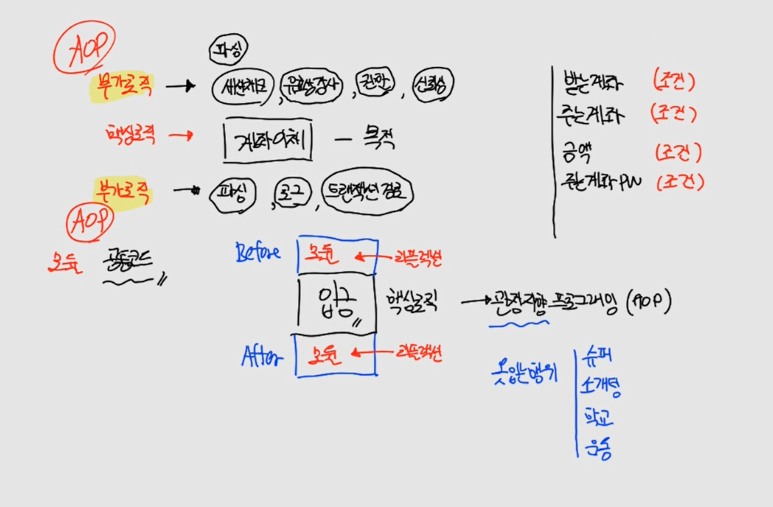

만약 계좌이체를 한다고 생각을 한다면 해당 로직을 하기전에 세션체크, 권한체크, 신뢰성, 유효성검사 등등 여러가지를 해야합니다. 이렇 것들을 부가로직이라고 합니다. 모든 메소드마다 같은 부가로직이 있는 경우 공통화를 해야합니다.

따라서 공통화를 하고 모듈화를 하는 것을 AOP라고 합니다. AOP를 사용해서 얻을 수 있는 효과는 핵심 로직인 계좌이체이 더 집중을 할 수 있게 되는 것입니다.

> `함수형 프로그래밍`
>
> 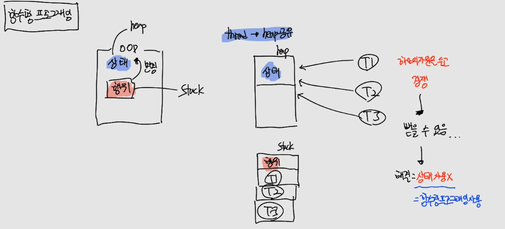
>
> 원래 OOP는 행위를 통해서 상태를 바꿉니다. 행위는 메소드이기 때문에 별도의 Stack이 생성됩니다. 따라서 스레드가 3개가 있으면 3개의 Stack 영역이 생기게 됩니다. 하지만 상태는 Heap에 생깁니다. 따라서 3개의 스레드가 공유를 합니다. 더 정확히 말하면 경쟁을 하게 됩니다.
>
> 최악의 경우에는 경쟁을 하다가 프로그램 자체가 뻗어버릴 수 있습니다. 이런 경우에 해결방법은 상태를 사용하지 않는 것입니다. 이렇게 상태를 사용하지 않는 방법을 함수형 프로그래밍이라고 합니다.

## 2. AOP 용어 정리

> 1. Aspect 생성: 로깅 기능(Advice)을 포함하는 Aspect를 정의합니다. (클래스 생성)
> 2. Advice 정의: 메서드 실행 전후에 로그를 남기는 코드를 작성합니다. (수행할 메서드 생성)
> 3. Pointcut 설정: 로깅 기능을 적용할 메서드를 결정합니다. 예를 들어, 모든 public 메서드에 로깅을 적용하려면 해당하는 패턴을 Pointcut에 지정합니다. (깃발에 별칭주기)
> 4. Advice 적용: 설정한 Pointcut에 따라 메서드 실행 전후에 로그를 남기는 Advice가 실행됩니다. (PointCut(별칭) 적용)

## 3. AOP 적용 방법 3가지

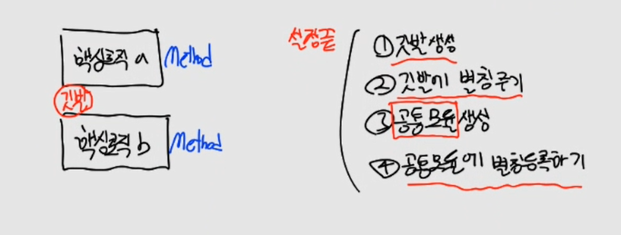

- 깃발 생성
- 깃발에 별칭주기
- 공통모듈 생성
- 공통모듈에 별칭등록하기

깃발을 어노테이션이라고 생각하시면 됩니다. 어노테이션을 생성하고 별칭을 주는데 별칭을 주는 과정을 PointCut이라고 합니다. 그리고 Advice를 생성 후 공통 모듈을 만들고 만들어 놓은 PointCut을 등록하면 설정은 끝이나게 됩니다. 이후에는 해당 어노테이션을 사용하기만 하면됩니다.

### (1) 세팅

https://mvnrepository.com/artifact/org.springframework.boot/spring-boot-starter-aop

```gradle
dependencies {
    implementation 'org.springframework.boot:spring-boot-starter-aop'
    implementation 'org.springframework.boot:spring-boot-starter-web'
    implementation 'org.springframework.boot:spring-boot-starter-validation'
    compileOnly 'org.projectlombok:lombok'
    developmentOnly 'org.springframework.boot:spring-boot-devtools'
    annotationProcessor 'org.projectlombok:lombok'
    testImplementation 'org.springframework.boot:spring-boot-starter-test'
}
```

### (2) 첫번째 방법

깃발(어노테이션)을 만들고
그 깃발을 PointCut(별칭)으로 등록 한다.
Advice를 만든다. (메서드 행위)
PointCut을 Advice에 적용한다.

- config/annotation/Hello.java

```java
@Target(ElementType.METHOD)
@Retention(RetentionPolicy.RUNTIME)
public @interface Hello { // 깃발 생성
}
```

- config/advice/HelloAdvice.java

```java
@Aspect // IoC에 등록하지 못함, AOP지정
@Component // IoC에 등록해줌
public class HelloAdvice {

    // 깃발(어노테이션)에 별칭(포인트컷)주기(길어서)
    @Pointcut("@annotation(shop.mtcoding.aopstudy.config.annotation.Hello)")
    public void hello(){}

    // 매개변수에 접근해서 값을 찾는 것을 가능 - 값을 주입하려면 @Around 사용해야함, 공통 모듈
    @Before("hello()") // @After, @Around
    public void helloAdvice(JoinPoint jp) throws Throwable {
        // 공통모듈(가장 중요)
        Object[] args = jp.getArgs(); // jp : @Hello가 붙어있는 정보들을 가짐(리플렉션과 동일)

        for (Object arg : args) { 
            if(arg instanceof String){
                String username = (String) arg;
                System.out.println(username+"님 안녕");
            }
        }
    }
}
```

- controller/HelloController.java

```java
@RestController
public class HelloController {

    @GetMapping("/hello/v1")
    public String v1(){
        return "v1";
    }

    // http://localhost:8080/hello/v2?username=ssar
    @Hello
    @GetMapping("/hello/v2")
    public String v2(String username){
        System.out.println("username : 값 변경? : "+username);
        return "v2";
    }
}
```

### (2) 두번째 방법

이미 만들어져 있는 깃발을 PointCut(별칭)으로 등록 한다.
Advice를 만든다. (메서드 행위)
PointCut을 Advice에 적용한다.

- config/advice/ValidAdvice.java

```java
@Aspect
@Component
public class ValidAdvice {

    @Pointcut("@annotation(org.springframework.web.bind.annotation.PostMapping)")
    public void postMapping() {
    }

    @Pointcut("@annotation(org.springframework.web.bind.annotation.PutMapping)")
    public void putMapping() {
    }

    @Before("postMapping() || putMapping()")
    public void validationAdvice(JoinPoint jp) throws Throwable {
        // 공통모듈
        Object[] args = jp.getArgs(); // 리플렉션
        for (Object arg : args) {
            if (arg instanceof BindingResult) {
                BindingResult bindingResult = (BindingResult) arg;

                if (bindingResult.hasErrors()) { // JoinDto에서 발생한 모든 에러가 담긴다
                    Map<String, String> errorMap = new HashMap<>();

                    for (FieldError error : bindingResult.getFieldErrors()) {
                        errorMap.put(error.getField(), error.getDefaultMessage());
                    }
                    throw new MyValidationException(errorMap);
                }
            }
        }
    }
}
```

- dto/JoinDto.java

```java
@Getter @Setter
public class JoinInDto {

    @NotNull
    private String username;
    @NotEmpty
    private String password;
    @NotEmpty
    @Size(min = 4, max = 10)
    private String email;
}
```

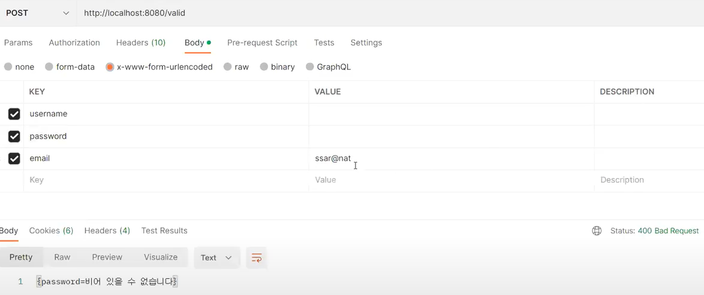

- controller/UserController.java

```java
@RequiredArgsConstructor
@RestController
public class UserController {

    private final HttpSession session;

    @GetMapping("/login")
    public String login(){
        User user = new User(1, "ssar", "1234", "0102222");
        session.setAttribute("loginUser", user); // 세션
        return "login ok";
    }
    
    @GetMapping("/user") // 인증 필요 없음
    public String userInfoNoAuth(){
        return "user ok";
    }

    // username 출력 안됨
    @GetMapping("/auth/v1") // 인증 필요함
    public String userInfo(User user){ // 값 할당 안됨
        return "v1 username : "+user.getUsername();
    }

    @GetMapping("/auth/v2")
    public String authInfoAop(@LoginUserAop User user){ // 인증 필요함, @LoginUserAop 주입
        return "v2 username : "+user.getUsername();
    }

    @GetMapping("/auth/v3")
    public String authInfoResolver(@LoginUserResolver User user){ // 인증 필요함
        System.out.println(user.getUsername());
        return "v3 username : "+user.getUsername();
    }

    @PostMapping("/valid") // Valid AOP 발동, x-www-form-urlencoeded (기본타입)
    public String join(@Valid JoinInDto joinInDto, BindingResult bindingResult){ // @Valid -> BindingResult 연속
        return "ok";
    }
}
```

> `FE에게 에러를 줄 때`
>
> 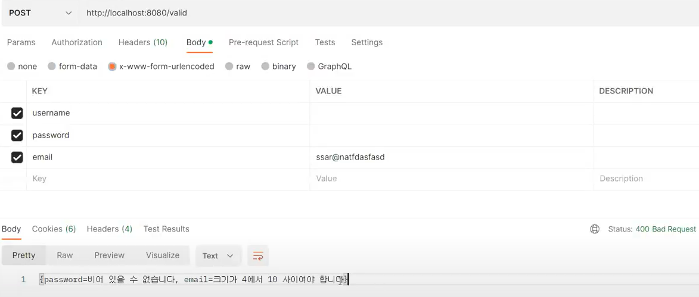
>
> 클라이언트에게 줄 때는 UX를 위해서 1개만 주면 됩니다. 하지만 개발을 할 때는 FE를 위해서 모든 에러를 적어서 주는게 좋습니다.

### (3) 세번째 방법

>  깃발을 생성하지 않고, 특정한 패턴이 수행될 때 정의된 advice를 실행하게 할 수도 있다.
>
> Spring Framework에서는 XML을 이용하여 Aspect-Oriented Programming (AOP)을 설정하는 방법이 있습니다. 그러나 Spring Boot에서는 주로 어노테이션 기반의 AOP를 사용하며, execution expression을 이용하여 pointcut을 등록할 수 있습니다.
>
> 하지만, 직접적으로 execution expression을 이용하여 pointcut을 등록하려면 여러가지 설정을 해주어야 합니다. 대신, Spring Boot에서는 AspectJ를 사용하여 간편하게 pointcut을 등록할 수 있는 기능을 제공합니다. AspectJ는 Java와 비슷한 문법을 가지며, execution expression을 이용하여 pointcut을 등록하는 방법이 있습니다.

```
이 부분은 4. execution expression 에서 설명
```

## 4. execution expression

### (1) 포인트컷 표현식 예시

특정 메소드 찾기

다음은 com.example.service 패키지 내의 MyService 클래스에서 "save"라는 이름을 갖는 메소드를 대상으로 pointcut을 작성한 예제입니다.

```java
@Pointcut("execution(* com.example.service.MyService.save(..))") // 어노테이션 만들필요 없음(전부 해당하기 때문에)
public void saveMethod() {}
```

위의 pointcut은 com.example.service 패키지 내의 MyService 클래스에서 "save"라는 이름을 갖는 메소드를 대상으로 합니다. 이를 이용하여 advice를 작성하면, 해당 메소드가 호출될 때 advice가 수행됩니다.

특정 컨트롤러의 모든 메소드 찾기

다음은 com.example.controller 패키지 내의 UserController 클래스에서 모든 메소드를 대상으로 pointcut을 작성한 예제입니다.

```java
@Pointcut("execution(* com.example.controller.UserController.*(..))")
public void userControllerMethods() {}
```

위의 pointcut은 com.example.controller 패키지 내의 UserController 클래스에서 모든 메소드를 대상으로 합니다. 이를 이용하여 advice를 작성하면, 해당 컨트롤러의 모든 메소드가 호출될 때 advice가 수행됩니다. 만약 UserController 클래스를 상속한 하위 클래스에서도 advice를 적용하려면, "UserController+"와 같이 패턴을 작성하면 됩니다.

### (2) 포인트컷 표현식 문법

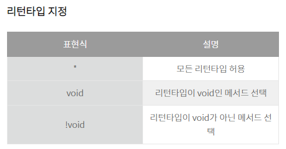
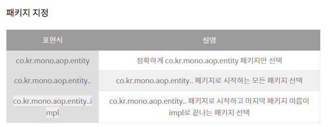
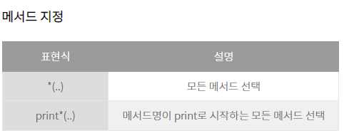
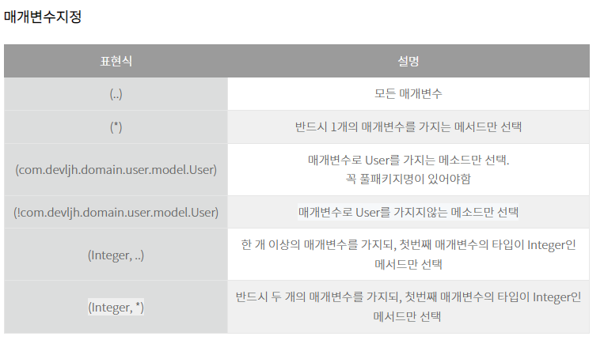

> execution(* onj.spring.aop.*.*(..)) : onj.spring.aop 패키지의 모든 메소드가 포인트 컷
>
> execution(* onj.spring.aop..*.*(..)) : onj.spring.aop 패키지와 하위 패키지의 모든 메소드가 포인트 컷
>
> execution(public void insert*(..)) : public에 리턴값, 패키지명 없고 메서드 이름은 insert로 시작, 인자값은 0개 이상인 메서드가 포인트 컷
>
> execution(public * *(..)) : public 메소드가 포인트 컷
>
> execution(* onj.spring.aop.*.*()) : 리턴형 관계없고 onj.spring.aop 패키지의 모든 클래스, 인자값이 없는 모든 메서드가 포인트 컷
>
> execution(* onj.spring.aop..*.*(..)) : 리턴형 관계없고 onj.spring.aop 패키지 및 하위 패키지에 있는 모든 클래스,  인자값이 0개 이상인 메서드가 포인트 컷
>
> execution(* delete*(*)) : 메서드 이름이 delete으로 시작하는 인자값이 1개인 메서드가 포인트 컷
>
> execution(* delete*(*,*)) : 메서드 이름이 delete로 시작하는 인자값이 2개인 메서드가 포인트 컷

특정 어노테이션의 파라미터로 있는 메소드를 pointcut으로 잡으려면, execution expression을 이용하여 어노테이션이 적용된 메소드를 대상으로 pointcut을 작성하면 됩니다. 다만, 이 경우에는 @annotation 대신에 @args 키워드를 사용해야 합니다.

### (3) 정규표현식을 사용해서 어노테이션 찾고 값 주입하기

> 정규표현식 자료 필요

- config/annotation/LoginUserAop.java

```java
@Target(ElementType.PARAMETER)
@Retention(RetentionPolicy.RUNTIME)
public @interface LoginUserAop {
}
```

- config/annotation/LoginUserResolver.java

```java
@Target(ElementType.PARAMETER)
@Retention(RetentionPolicy.RUNTIME)
public @interface LoginUserResolver {
}
```

- config/advice/LoginAdvice.java

```java
@Aspect
@Component
public class LoginAdvice {

    @Around("execution(* shop.mtcoding.aopstudy.controller.*.*(..))")
    public Object loginUserAdviceAround(ProceedingJoinPoint jp) throws Throwable {
        // 공통모듈
        MethodSignature signature = (MethodSignature) jp.getSignature();
        Method method = signature.getMethod(); // 현재 실행된 메서드
        Object[] args = jp.getArgs();
        Parameter[] parameters = method.getParameters();

        // 매개변수의 순서 담기
        int loginUserAopIndex = IntStream.range(0, parameters.length)
                .filter(i -> parameters[i].isAnnotationPresent(LoginUserAop.class))
                .findFirst()
                .orElse(-1);

        if (loginUserAopIndex >= 0) {
            HttpServletRequest req = ((ServletRequestAttributes) RequestContextHolder.getRequestAttributes()).getRequest();
            HttpSession session = req.getSession();
            User principal = (User) session.getAttribute("loginUser");

            args[loginUserAopIndex] = principal;

            // 해당 메서드 실행
            Object result = jp.proceed(args);

            // 실행 후 결과 값을 가지고, 로그를 남길 수 있음. (실재 로그는 log4j 사용해야함)
            System.out.println(result);
            return result;
        }
        return jp.proceed(); // 메소드를 호출하는 코드(Object)
    }
}
```

> `@ProceedingJoinPoint`
> 
> ```java
> @GetMapping("/login")
> public User login(){
>     User user = new User(1, "ssar", "1234", "0102222");
>     session.setAttribute("loginUser", user);
>     return user;
> }
> 
> @Aspect
> @Component
> public class LoginAdvice {
> 
>     @Around("execution(* shop.mtcoding.aopstudy.controller.*.*(..))")
>     public Object loginUserAdviceAround(ProceedingJoinPoint jp) throws Throwable {
>         System.out.println("메서드 실행전");
>         Object result = jp.proceed();
>         System.out.println("메서드 실행종료");
>         return result;
>     }
> }
> ```
> 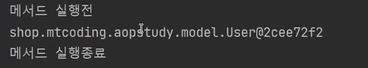

### (4) config

- config/WebMvcConfig.java

```java
@RequiredArgsConstructor
@Configuration
public class WebMvcConfig implements WebMvcConfigurer {

    private final MyLoginArgumentResolver myLoginArgumentResolver;
    private final LoginInterceptor loginInterceptor;

    // 등록
    @Override
    public void addInterceptors(InterceptorRegistry registry) {
        registry.addInterceptor(loginInterceptor)
                .addPathPatterns("/auth/**");
    }

    @Override
    public void addArgumentResolvers(List<HandlerMethodArgumentResolver> resolvers) {
        resolvers.add(myLoginArgumentResolver);
    }
}
```

- config/resolver/MyLoginArgumentResolver.java

```java
@RequiredArgsConstructor
@Configuration
public class MyLoginArgumentResolver implements HandlerMethodArgumentResolver {

    private final HttpSession session;

    @Override // 1번
    public boolean supportsParameter(MethodParameter parameter) { // parameter 주입
        boolean check1 = parameter.getParameterAnnotation(LoginUserResolver.class) != null;
        boolean check2 = User.class.equals(parameter.getParameterType());
        return check1 && check2;
    }

    // 2번 - 조건(1번 true)
    @Override
    public Object resolveArgument(MethodParameter parameter, ModelAndViewContainer mavContainer, NativeWebRequest webRequest, WebDataBinderFactory binderFactory) throws Exception {
        return session.getAttribute("loginUser"); // 어노테이션 옆에 있는 놈한테 값을 주입
    }
}
```

## 5. 정리

> AOP에서 Before, After, Around는 각각 다른 시점에서 AOP 어드바이스를 실행하는 방법입니다.
>
> 1. `@Before`: 메서드 실행 전에 어드바이스를 실행합니다. 이 시점에서 JoinPoint 객체를 통해 메서드의 인자, 클래스, 메서드 이름 등의 정보를 가져올 수 있습니다. `@Before` 어노테이션을 사용하여 선언합니다.
> 2. `@After`: 메서드 실행 후에 어드바이스를 실행합니다. 이 시점에서 JoinPoint 객체를 사용할 수 있으며, 메서드의 실행 결과나 예외 정보 등을 가져올 수 있습니다. `@After` 어노테이션을 사용하여 선언합니다.
> 3. `@Around`: 메서드 실행 전후 모두 어드바이스를 실행합니다. 이 시점에서 ProceedingJoinPoint 객체를 사용하여 메서드 실행을 수행하고, 실행 결과를 반환할 수 있습니다. `@Around` 어노테이션을 사용하여 선언하며, 메서드 실행 전후에 추가적인 로직을 수행할 수 있습니다.
>
> 즉, `@Before`는 메서드 실행 전에 추가적인 로직을 수행하는 어드바이스이고, `@After`는 메서드 실행 후에 추가적인 로직을 수행하는 어드바이스입니다. `@Around`는 메서드 실행 전후에 추가적인 로직을 수행할 수 있는 가장 범용적인 어드바이스입니다.
>
> AOP에서 메서드의 파라미터 값을 검사하거나 변경하는 작업을 수행할 때는 `@Before` 어노테이션을 사용하고, 메서드 실행 시에 새로운 값을 주입하거나, 결과를 가공하는 작업을 수행할 때는 `@Around` 어노테이션을 사용하는 것이 일반적입니다.

#### `@Before` 어드바이스 예제

```java
@Before("execution(* com.example.myapp.service.MyService.*(..))")
public void beforeAdvice(JoinPoint joinPoint) {
    System.out.println("Before Advice: " + joinPoint.getSignature().getName());
}
```

위의 예제에서는 `@Before` 어노테이션을 사용하여 `com.example.myapp.service.MyService` 클래스의 모든 메서드에 적용될 어드바이스를 작성했습니다. 메서드 실행 전에 해당 메서드의 시그니처 정보를 출력하는 기능을 수행합니다.

#### `@After` 어드바이스 예제

```java
@After("execution(* com.example.myapp.service.MyService.*(..))")
public void afterAdvice(JoinPoint joinPoint) {
    System.out.println("After Advice: " + joinPoint.getSignature().getName());
}
```

위의 예제에서는 `@After` 어노테이션을 사용하여 `com.example.myapp.service.MyService` 클래스의 모든 메서드에 적용될 어드바이스를 작성했습니다. 메서드 실행 후 해당 메서드의 시그니처 정보를 출력하는 기능을 수행합니다.

#### `@Around` 어드바이스 예제

```java
@Around("execution(* com.example.myapp.service.MyService.*(..))")
public Object aroundAdvice(ProceedingJoinPoint joinPoint) throws Throwable {
    System.out.println("Before Advice: " + joinPoint.getSignature().getName());
    Object result = joinPoint.proceed();
    System.out.println("After Advice: " + joinPoint.getSignature().getName());
    return result;
}
```

위의 예제에서는 `@Around` 어노테이션을 사용하여 `com.example.myapp.service.MyService` 클래스의 모든 메서드에 적용될 어드바이스를 작성했습니다. 메서드 실행 전후에 해당 메서드의 시그니처 정보를 출력하고, 메서드 실행을 수행한 후 실행 결과를 반환합니다.

## 6. 마인드 맵

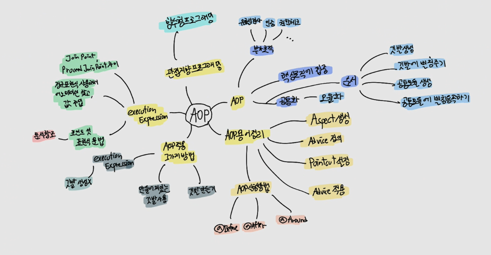