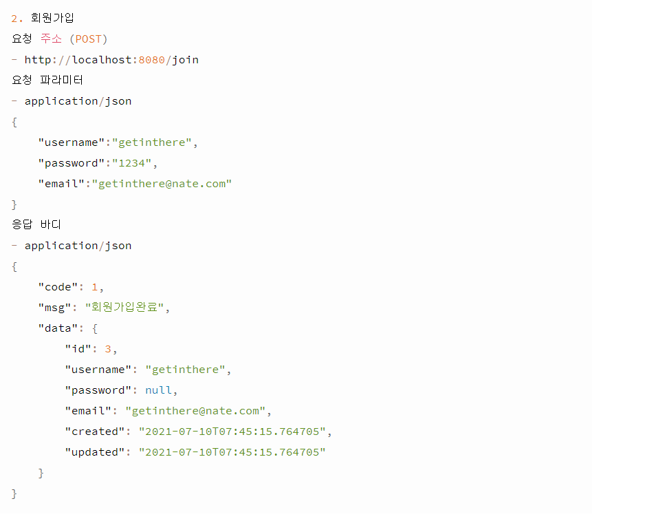
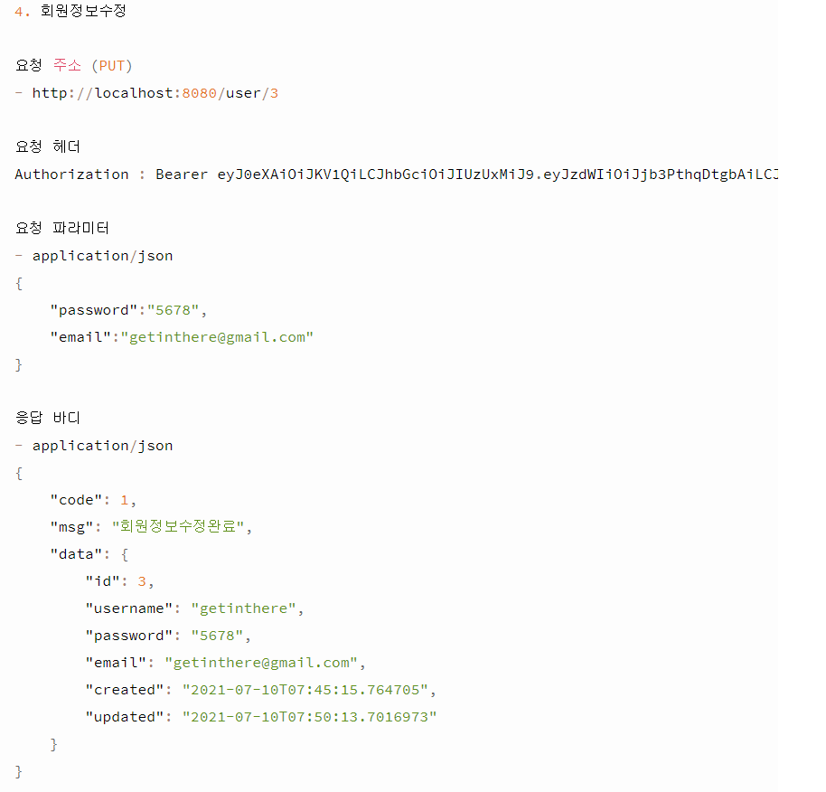
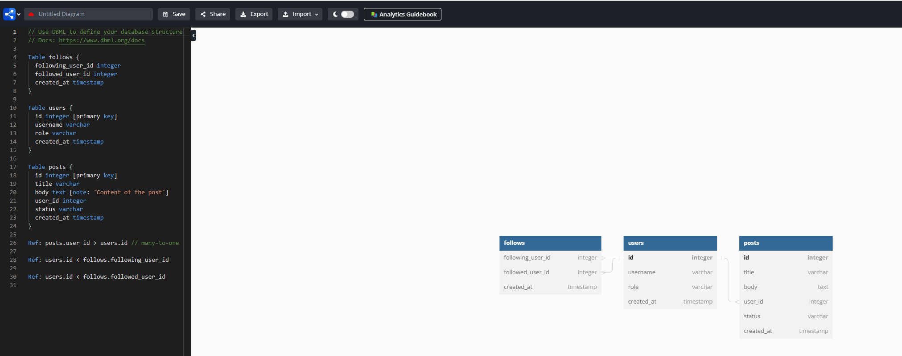
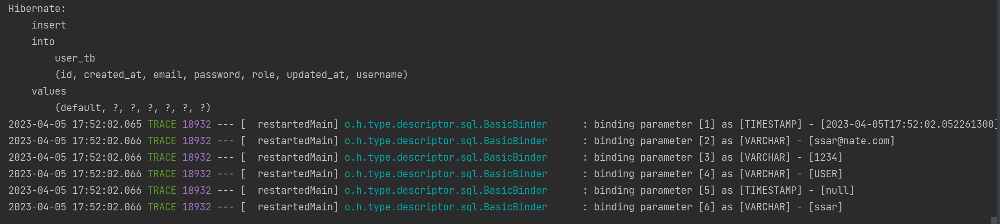

# CH24 스프링부트 미니 프로젝트1 문제

#### 소스코드

https://github.com/codingspecialist/Springboot-MetaMall-Project.git

## 1. 요구사항

> 1. 해당 Github을 Fork 하여 구현하고, 완료된 후에는 PR요청 하시오.
>
> 2. 미니프로젝트 결과는 README로 작성하시오.  (목차 3번 참고)
>
> 3. 상품 주문 서비스를 RestAPI로 만드시오 (VIEW 없음)
>
> 4. 해당 RestAPI에 대한 문서를 만드시오. (Swagger, RestDoc을 사용하지 않고, 직접 만들기) 
>
>    ex) 예시 
>
> 
>
> 
>
> 5. 연관관계에 대한 상세한 설정하기 (목차 4 참고)
> 6. JPA가 기본으로 제공하지 않는 쿼리에 대해서 Repository 테스트 코드를 작성하시오.
> 7. Controller에서 통합테스트를 작성하시오.
> 8. ER-Diagram을 만드시오.
> 9. Login 할때마다 로그 테이블에 기록을 남기시오.
> 10. Error 발생시에 로그 테이블에 기록을 남기시오. (로그인 하지 않은 상태에서는 로그를 남기지 마세요)
> 11. AOP를 꼭 한 군데는 적용하시오. (본인이 필요하다고 느끼는 곳)
> 12. 본인만의 어노테이션을 꼭 만들고, 꼭 한군데는 적용하시오. (본인이 필요하다고 느끼는 곳)
> 13. 어떠한 예외도 ResponseDto로 캐치하여 응답하시오.
> 14. 어떠한 정상적인 응답도 ResponseDto에 담아서 응답하시오.
> 15. 유효성 검사는 필수입니다. (null 여부와 공백 여부만 체크하세요)
> 16. 테이블 구조는 개인 취향에 따라 변경해도 되지만, 목차 2번의 기능은 다 완성해야 함.
> 17. 모든 기능을 완성하시오 (목차 2 참고)

## 2. 기능 정리

> 고객은 다수이다.
>
> 판매자는 한명이다.
>
> 고객은 여러건의 주문을 할 수 있다.
>
> 고객은 한번에 여러개의 상품을 주문할 수 있다.
>
> 고객은 상품 주문시에 개수를 선택할 수 있다.

- 회원가입 (POST)
- 로그인 (POST)
  - JWT 토큰 응답

- 상품등록 (POST)
  - 인증 필요, 판매자 권한
- 상품목록보기 (GET)
  - 인증 필요, 권한 없음
- 상품상세보기 (GET)
  - 인증 필요, 권한 없음
- 상품수정하기 (PUT)
  - 인증 필요, 판매자 권한
- 상품삭제하기 (DELETE)
  - 인증 필요, 판매자 권한
- 주문하기 (POST) - OrderProduct를 생성하여, OrderSheet에 추가하세요
  - 인증 필요, 고객 권한
- 고객입장 - 주문목록보기 (GET)
  - 인증 필요, 고객 권한, 본인의 주문목록만 볼 수 있어야 함
- 판매자입장 - 주문목록보기 (GET)
  - 인증 필요, 판매자 권한, 모든 주문목록을 볼 수 있음
- 고객입장 - 주문취소하기 (DELETE) - Casecade 옵션을 활용하세요. (양방향 매핑)
  - 인증 필요, 고객 권한, 본인의 주문만 취소할 수 있다.
- 판매자입장 - 주문취소하기 (DELETE) - Casecade 옵션을 활용하세요. (양방향 매핑) 
  - 인증 필요, 판매자 권한

## 3. 리드미 작성 (참고)

https://github.com/jaewon2336/Springboot-Everytime-clone-Project

## 4. 영속성 정리 (Service 배우기 전)

> 모든 설정은 Lazy
>
> 필요한 데이터는 getter로 Lazy Loading 하거나 join fetch 사용하기
>
> 공통 응답 DTO 만들어서 응답하기 (Entity를 Controller에서 ResponseDto의 data에 담고 MessageConverter를 통해 응답하기)
>
> 무한 참조를 막기 위해 JsonIgnoreProperties 사용하기
>
> 민감한 개인정보는 JsonIgnore 로 관리하기

## 5. 공통 DTO

- dto/ResponseDto.java

```java
@Getter
public class ResponseDto<T> {
    private Integer status; // 에러시에 의미 있음.
    private String msg; // 에러시에 의미 있음. ex) badRequest
    private T data; // 에러시에는 구체적인 에러 내용 ex) username이 입력되지 않았습니다

    public ResponseDto(){
        this.status = HttpStatus.OK.value();
        this.msg = "성공";
        this.data = null;
    }

    public ResponseDto<?> data(T data){
        this.data = data; // 응답할 데이터 바디
        return this;
    }

    public ResponseDto<?> fail(HttpStatus httpStatus, String msg, T data){
        this.status = httpStatus.value();
        this.msg = msg; // 에러 제목
        this.data = data; // 에러 내용
        return this;
    }
}

```

## 6. 테이블 설계

- model/user/User.java

```java
@NoArgsConstructor
@Setter // DTO 만들면 삭제해야됨
@Getter
@Table(name = "user_tb")
@Entity
public class User {

    @Id
    @GeneratedValue(strategy = GenerationType.IDENTITY)
    private Long id;
    private String username;
    private String password;
    private String email;
    private String role; // USER(고객), SELLER(판매자), ADMIN(관리자)
    private LocalDateTime createdAt;
    private LocalDateTime updatedAt;

    @PrePersist
    protected void onCreate() {
        this.createdAt = LocalDateTime.now();
    }

    @PreUpdate
    protected void onUpdate() {
        this.updatedAt = LocalDateTime.now();
    }

    @Builder
    public User(Long id, String username, String password, String email, String role, LocalDateTime createdAt) {
        this.id = id;
        this.username = username;
        this.password = password;
        this.email = email;
        this.role = role;
        this.createdAt = createdAt;
    }
}
```

- model/product/Product.java

```java
@NoArgsConstructor
@Setter // DTO 만들면 삭제해야됨
@Getter
@Table(name = "product_tb")
@Entity
public class Product {

    @Id
    @GeneratedValue(strategy = GenerationType.IDENTITY)
    private Long id;
    private String name; // 상품 이름
    private Integer price; // 상품 가격
    private Integer qty; // 상품 재고
    private LocalDateTime createdAt;
    private LocalDateTime updatedAt;

    @PrePersist
    protected void onCreate() {
        this.createdAt = LocalDateTime.now();
    }

    @PreUpdate
    protected void onUpdate() {
        this.updatedAt = LocalDateTime.now();
    }

    @Builder
    public Product(Long id, String name, Integer price, Integer qty, LocalDateTime createdAt, LocalDateTime updatedAt) {
        this.id = id;
        this.name = name;
        this.price = price;
        this.qty = qty;
        this.createdAt = createdAt;
        this.updatedAt = updatedAt;
    }
}
```

- model/orderproduct/OrderProduct.java

```java
@NoArgsConstructor
@Setter // DTO 만들면 삭제해야됨
@Getter
@Table(name = "order_product_tb")
@Entity
public class OrderProduct { // 주문 상품

    @Id
    @GeneratedValue(strategy = GenerationType.IDENTITY)
    private Long id;
    @ManyToOne
    private Product product;
    private Integer count; // 상품 주문 개수
    private Integer orderPrice; // 상품 주문 금액
    private LocalDateTime createdAt;
    private LocalDateTime updatedAt;

    @ManyToOne
    private OrderSheet orderSheet;

    @PrePersist
    protected void onCreate() {
        this.createdAt = LocalDateTime.now();
    }

    @PreUpdate
    protected void onUpdate() {
        this.updatedAt = LocalDateTime.now();
    }

    @Builder
    public OrderProduct(Long id, Product product, Integer count, Integer orderPrice, LocalDateTime createdAt, LocalDateTime updatedAt, OrderSheet orderSheet) {
        this.id = id;
        this.product = product;
        this.count = count;
        this.orderPrice = orderPrice;
        this.createdAt = createdAt;
        this.updatedAt = updatedAt;
        this.orderSheet = orderSheet;
    }
}
```

- model/ordersheet/OrderSheet.java

```java
@NoArgsConstructor
@Setter // DTO 만들면 삭제해야됨
@Getter
@Table(name = "order_sheet_tb")
@Entity
public class OrderSheet { // 주문서

    @Id
    @GeneratedValue(strategy = GenerationType.IDENTITY)
    private Long id;
    @ManyToOne
    private User user; // 주문자
    @OneToMany(mappedBy = "orderSheet")
    private List<OrderProduct> orderProductList = new ArrayList<>(); // 총 주문 상품 리스트
    private Integer totalPrice; // 총 주문 금액 (총 주문 상품 리스트의 orderPrice 합)
    private LocalDateTime createdAt;
    private LocalDateTime updatedAt;

    @PrePersist
    protected void onCreate() {
        this.createdAt = LocalDateTime.now();
    }

    @PreUpdate
    protected void onUpdate() {
        this.updatedAt = LocalDateTime.now();
    }
    
    // 연관관계 메서드 구현 필요

    @Builder
    public OrderSheet(Long id, User user, Integer totalPrice, LocalDateTime createdAt, LocalDateTime updatedAt) {
        this.id = id;
        this.user = user;
        this.totalPrice = totalPrice;
        this.createdAt = createdAt;
        this.updatedAt = updatedAt;
    }
}

```

https://dbdiagram.io/home

> ER-Diagram을 만들기



## 7. Application.yml 스프링 설정

```yaml
server:
  servlet:
    encoding:
      charset: utf-8
      force: true

spring:
  datasource:
    url: jdbc:h2:mem:test;MODE=MySQL
    driver-class-name: org.h2.Driver
    username: sa
    password:
  h2:
    console:
      enabled: true
  jpa:
    hibernate:
      ddl-auto: create
    show-sql: true
    properties:
      hibernate:
        format_sql: true
      default_batch_fetch_size: 100 # in query 자동 작성

logging:
  level:
    '[shop.mtcoding.metamall]': DEBUG # DEBUG 레벨부터 에러 확인할 수 있게 설정하기
    '[org.hibernate.type]': TRACE # 콘솔 쿼리에 ? 에 주입된 값 보기
```

