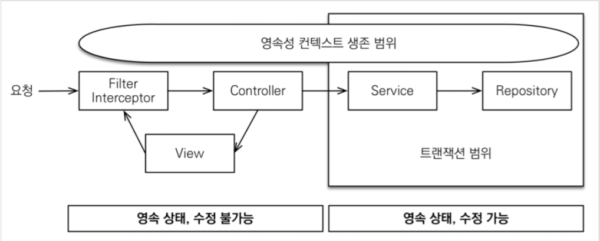

# CH26 스프링부트 서비스 - 비지니스,트랜잭션,OSIV

#### 소스코드

시작 주소

https://github.com/codingspecialist/Springboot-ServiceAndDTO.git

완료 주소

https://github.com/codingspecialist/Springboot-ServiceAndDTO/tree/complete

## 1. 서비스란?

- 비지니스 로직 처리
- DTO 생성 및 Lazy Loading
- 트랜잭션 관리
- 더터 체킹

> Spring Boot에서 서비스는 비즈니스 로직을 수행하는 역할을 담당합니다. 서비스는 데이터베이스나 외부 API와 같은 데이터 소스로부터 데이터를 가져와서 이를 가공하거나 조작하여 비즈니스 요구사항에 맞게 처리하는 로직을 구현합니다.
>
> 서비스는 컨트롤러와 데이터 액세스 계층(Repository) 사이에서 중간 역할을 하며, 컨트롤러에서 요청을 받아 서비스에서 비즈니스 로직을 수행한 후 데이터 액세스 계층을 통해 데이터를 저장하거나 조회합니다. 이를 통해 컨트롤러에서는 단순히 요청의 전달과 응답의 반환만을 수행하며, 비즈니스 로직은 서비스에서 처리하도록 분리함으로써 코드의 가독성과 유지보수성을 향상시킬 수 있습니다.
>
> 또한, 서비스는 트랜잭션 처리와 같은 중요한 역할도 수행합니다. 비즈니스 로직은 종종 여러 단계에 걸쳐 처리되어야 하기 때문에, 이를 하나의 트랜잭션으로 묶어서 원자성을 보장해야 합니다. 이러한 트랜잭션 처리는 서비스에서 수행되며, 데이터 액세스 계층에서는 트랜잭션 처리와 관련된 코드를 작성하지 않아도 됩니다.


## 2. 비지니스로직 예시

```java
@Transactional
public AccountResponse.TransferOutDTO 계좌이체(AccountRequest.TransferInDTO transferInDTO, Long userId) {

    // 1. 출금계좌와 입금계좌 동일 여부
    if (transferInDTO.getWithdrawNumber() == transferInDTO.getDepositNumber()) {
        throw new Exception400("withdrawAccountNumber", "입출금계좌가 동일할 수 없습니다");
    }

    // 2. 출금계좌 확인
    Account withdrawAccountPS = accountRepository.findByNumber(transferInDTO.getWithdrawNumber())
            .orElseThrow(
                    () -> new Exception404("출금계좌를 찾을 수 없습니다"));

    // 3. 입금계좌 확인
    Account depositAccountPS = accountRepository.findByNumber(transferInDTO.getDepositNumber())
            .orElseThrow(
                    () -> new Exception404("입금계좌를 찾을 수 없습니다"));

    // 4. 출금 소유자 확인 (로그인한 사람과 동일한지)
    withdrawAccountPS.checkOwner(userId);

    // 5. 출금계좌 비빌번호 확인
    withdrawAccountPS.checkSamePassword(transferInDTO.getWithdrawPassword());

    // 6. 출금계좌 잔액 확인
    withdrawAccountPS.checkBalance(transferInDTO.getAmount());

    // 7. 이체하기
    withdrawAccountPS.withdraw(transferInDTO.getAmount());
    depositAccountPS.deposit(transferInDTO.getAmount());

    // 8. 거래내역 남기기
    Transaction transaction = Transaction.builder()
            .withdrawAccount(withdrawAccountPS)
            .depositAccount(depositAccountPS)
            .withdrawAccountBalance(withdrawAccountPS.getBalance())
            .depositAccountBalance(depositAccountPS.getBalance())
            .amount(transferInDTO.getAmount())
            .build();

    Transaction transactionPS = transactionRepository.save(transaction);

    // 9. DTO 응답
    return new AccountResponse.TransferOutDTO(withdrawAccountPS, transactionPS);
}
```

## 3. 뱅크 애플리케이션 API

 

 

 

 

 

 

 

 

 

 

 

 


## 4. OSIV

> OSIV는 "Open Session in View"의 약어로, 웹 애플리케이션에서 데이터베이스 세션을 유지하는 방법 중 하나입니다.OSIV가 true일 때, 일반적으로 HTTP 요청이 끝나더라도 데이터베이스 세션이 계속해서 유지됩니다. 그리고 이 세션은 다음 요청에서도 계속 사용됩니다.
>
> 따라서, redirect가 발생하더라도 데이터베이스 세션은 여전히 유지됩니다. 그러나 redirect 이후에 다시 새로운 요청이 발생할 때까지는 해당 세션을 사용하지 않으므로, OSIV 패턴이 세션을 유지한다는 것은 정확하지 않습니다.
>
> 예를 들어, Spring Framework에서 OSIV가 true일 때, HTTP 요청이 끝나면 데이터베이스 세션을 닫지 않고 유지합니다. 그리고 redirect가 발생하더라도 해당 세션은 계속해서 사용됩니다. 그러나 redirect 이후에 다시 새로운 요청이 발생할 때까지는 해당 세션을 사용하지 않습니다.

### (1) OSIV true



- 동작원리
  - 클라이언트의 요청이 들어오면 서블릿 필터나, 스프링 인터셉터에서 영속성 컨텍스트를 생성한다. 단 이 시점에서 트랜잭션은 시작하지 않는다.
  - 서비스 계층에서 @Transeactional로 트랜잭션을 시작할 때 1번에서 미리 생성해둔 영속성 컨텍스트를 찾아와서 트랜잭션을 시작한다.
  - 서비스 계층이 끝나면 트랜잭션을 커밋하고 영속성 컨텍스트를 플러시한다. 이 시점에 트랜잭션은 끝내지만 영속성 컨텍스트는 종료되지 않는다.
  - 컨트롤러와 뷰까지 영속성 컨텍스트가 유지되므로 조회한 엔티티는 영속 상태를 유지한다.
  - 서블릿 필터나, 스프링 인터셉터로 요청이 돌아오면 영속성 컨텍스트를 종료한다. 이때 플러시를 호출하지 않고 바로 종료한다.

### (2) OSIV false


OSIV를 끄면 트랜잭션을 종료할 때 영속성 컨텍스트를 닫고, 데이터베이스 커넥션도 반환합니다. 따라서 커넥션 리소스를 낭비하지 않습니다. OSIV를 끄면 모든 지연로딩을 트랜잭션 안에서 처리해야 해서 지금까지 작성한 많은 지연 로딩 코드를 트랜잭션 안으로 넣어야 하는 단점이 있습니다. 그리고 view template에서 지연로딩이 동작하지 않습니다.

결론적으로 트랜잭션이 끝나기 전에 지연 로딩을 강제로 호출해 두어야 한다.

> 그림 설명 필요 (누락)

## 5. 트랜잭션

### (1) ACID

> 데이터베이스에서 insert, update, delete 작업은 트랜잭션(Transaction) 내에서 수행됩니다. 트랜잭션은 데이터베이스에서 일련의 작업을 원자적(Atomic)으로 처리하는 방법입니다. 원자적으로 처리되는 작업은 모두 성공하거나 모두 실패해야 합니다.
>
> 트랜잭션에는 ACID 원칙이 있습니다. 이 중 고립성(Isolation)은 다른 트랜잭션의 영향을 받지 않도록 트랜잭션을 격리하는 것을 의미합니다. 이를 통해 여러 개의 트랜잭션이 동시에 실행될 때, 데이터베이스 일관성을 유지할 수 있습니다.
>
> 따라서 insert, update, delete 작업이 수행될 때, 해당 트랜잭션은 다른 트랜잭션과 격리되어 작업이 끝날 때까지 다른 트랜잭션에서 변경된 내용을 볼 수 없습니다. 이를 통해 데이터 무결성과 일관성을 보장할 수 있습니다.

1. 원자성(Atomicity): 원자성은 트랜잭션 내에서 수행된 작업이 모두 성공하거나 모두 실패해야 한다는 것을 의미합니다. 즉, 트랜잭션의 작업이 하나라도 실패하면 이전에 성공한 작업들도 모두 롤백되어야 합니다. (커밋이 되지 않은 상태이므로 롤백 가능)
2. 일관성(Consistency): 일관성은 트랜잭션이 실행되기 전과 후에도 데이터베이스가 일관된 상태를 유지해야 한다는 것을 의미합니다. 즉, 트랜잭션을 실행하고 나서도 데이터베이스의 제약 조건이나 규칙 등이 유지되어야 합니다.
3. 고립성(Isolation): 고립성은 동시에 여러 개의 트랜잭션이 실행될 때 각 트랜잭션이 다른 트랜잭션의 작업에 영향을 받지 않도록 격리되어야 한다는 것을 의미합니다. 즉, 한 트랜잭션에서 수행된 작업이 다른 트랜잭션에서 보이지 않도록 해야 합니다.
4. 지속성(Durability): 지속성은 트랜잭션이 성공적으로 완료되면 그 결과가 영구적으로 유지되어야 한다는 것을 의미합니다. 즉, 시스템 장애나 다른 문제가 발생하더라도 트랜잭션의 결과는 보존되어야 합니다. 
   운영체제나 데이터베이스 소프트웨어의 장애, 하드웨어의 고장, 전원 문제 등과 같은 예기치 않은 상황에서도 데이터의 안정성을 보장해야 하기 때문에 트랜잭션 로그를 남겨둔다. 이를 통해 데이터베이스를 복구할 수 있고, 로그는 주기적으로 정리하는 것이 좋다.

### (2) 격리수준 (트랜잭션 범위 내에서만 동작)

> 1. Read Uncommitted(읽기 미확정): 다른 트랜잭션이 변경한 데이터를 읽을 수 있습니다. 이 경우, Dirty Read(더티 리드)라는 현상이 발생할 수 있습니다.
> 2. Read Committed(읽기 확정): 다른 트랜잭션이 변경한 데이터를 읽을 수 없습니다. 단, 변경된 데이터가 트랜잭션 내에서 커밋된 이후에만 읽을 수 있습니다. 이 경우, Non-Repeatable Read(반복 불가능한 읽기)라는 현상이 발생할 수 있습니다.
> 3. Repeatable Read(반복 가능한 읽기): 트랜잭션이 시작된 시점에서 조회한 데이터 집합을 다른 트랜잭션에서 변경할 수 없습니다. 따라서, 같은 쿼리를 반복해서 실행해도 동일한 결과를 반환합니다. 이 경우, Phantom Phenomenon(팬텀 현상)이 발생할 수 있습니다.
> 4. Serializable(직렬화 가능한): 모든 트랜잭션을 순차적으로 실행하는 것과 같은 결과를 보장합니다. 따라서, 다른 트랜잭션이 변경한 데이터에 대해 직렬화(serialization)를 수행하여 격리 수준을 보장합니다. 이 경우, Phantom Phenomenon은 발생하지 않습니다.

- Read Uncommitted (commit 되지 않은 데이터를 읽기 때문에 위험하다.)
- Read Committed (commit된 데이터만 읽는다. 그래서 배치프로그램으로 통계낼 때 갑자기 값이 바뀌는 위험한 상황이 생길 수 있다)
- Repeatable Read (일반적인 데이터베이스는 전부 이 전략을 사용한다  - 배치프로그램을 돌릴 때도 좋다)
- Serializable (트랜잭션을 동시에 수행하지 않고, 순차적으로 실행한다. 은행과 같은 곳에서 사용)

## 6. 실습코드

### (1) 세팅

#### 의존성

```groovy
dependencies {
    implementation 'org.springframework.boot:spring-boot-starter-aop'
    implementation 'org.springframework.boot:spring-boot-starter-data-jpa'
    implementation 'org.springframework.boot:spring-boot-starter-validation'
    implementation 'org.springframework.boot:spring-boot-starter-web'
    compileOnly 'org.projectlombok:lombok'
    developmentOnly 'org.springframework.boot:spring-boot-devtools'
    runtimeOnly 'com.h2database:h2'
    annotationProcessor 'org.projectlombok:lombok'
    testImplementation 'org.springframework.boot:spring-boot-starter-test'
}
```

#### application.yml

```yaml
server:
  servlet:
    encoding:
      charset: utf-8
      force: true
spring:
  datasource:
    url: jdbc:h2:mem:test;MODE=MySQL
    driver-class-name: org.h2.Driver
    username: sa
    password:
  h2:
    console:
      enabled: true
  jpa:
    hibernate:
      ddl-auto: create
    show-sql: true
    properties:
      hibernate:
        format_sql: true
      default_batch_fetch_size: 100
    open-in-view: true
  # 404 ???? ?
  mvc:
    throw-exception-if-no-handler-found: true
  web:
    resources:
      add-mappings: false

logging:
  level:
    '[shop.mtcoding.servicebank]': DEBUG # DEBUG ???? ?? ??? ? ?? ????
    '[org.hibernate.type]': TRACE # ?? ??? ? ? ??? ? ??
```

#### service

- service/UserService.java

```java
@RequiredArgsConstructor
@Service
public class UserService {
    
    private final UserRepository userRepository;

    // INSERT, DELETE, UPDATE 만 @Transaction 추가
    // RuntimeException이 터지면 Rollback
    @Transactional // Springframework Transaction (주의)
    public UserResponse.JoinOutDTO 회원가입(UserRequest.JoinInDTO joinInDTO) {
        // 1. 동일 유저네임 존재 검사
        Optional<User> userOP = userRepository.findByUsername(joinInDTO.getUsername());
        if (userOP.isPresent()) {
            throw new Exception400("username", "동일한 유저네임이 존재합니다");
        }

        // 2. 회원가입
        User userPS = userRepository.save(joinInDTO.toEntity()); // INSERT는 toEntity() 존재

        // 3. DTO 응답
        return new UserResponse.JoinOutDTO(userPS);
    }

    @Transactional(readOnly = true) // 변경감지 하지 않음, SELECT는 Transactional(readOnly = true)
    public SessionUser 로그인(UserRequest.LoginInDTO loginInDTO) {
        // 1. 회원 존재 유무 확인
        User userPS = userRepository.findByUsername(loginInDTO.getUsername())
                .orElseThrow(()-> new Exception404("유저네임을 찾을 수 없습니다"));

        // 2. 패스워드 검증
        if(!userPS.getPassword().equals(loginInDTO.getPassword())){
            throw new Exception401("패스워드 검증에 실패하였습니다");
        }

        // 3. DTO 응답
        return new SessionUser(userPS);
    }
}
```

- service/AccountService.java

```java
@RequiredArgsConstructor
@Service
public class AccountService {
    
    private final AccountRepository accountRepository;
    private final UserRepository userRepository;
    private final TransactionRepository transactionRepository;

    @Transactional
    public AccountResponse.SaveOutDTO 계좌등록(AccountRequest.SaveInDTO saveInDTO, Long userId) {
        // 1. 회원 존재 여부
        User userPS = userRepository.findById(userId).orElseThrow(
                () -> new Exception404("유저를 찾을 수 없습니다"));

        // 2. 계좌 존재 여부
        Optional<Account> accountOP = accountRepository.findByNumber(saveInDTO.getNumber());
        if (accountOP.isPresent()) {
            throw new Exception400("number", "해당 계좌가 이미 존재합니다");
        }

        // 3. 계좌 등록
        Account accountPS = accountRepository.save(saveInDTO.toEntity(userPS));

        // 4. DTO 응답
        return new AccountResponse.SaveOutDTO(accountPS);
    }

    @Transactional(readOnly = true)
    public AccountResponse.ListOutDTO 유저계좌목록보기(Long userId) {
        // 1. 회원 존재 여부
        User userPS = userRepository.findById(userId).orElseThrow(
                () -> new Exception404("유저를 찾을 수 없습니다"));

        // 2. 유저 계좌목록 조회
        List<Account> accountListPS = accountRepository.findByUserId(userId);

        // 3. DTO 응답
        return new AccountResponse.ListOutDTO(userPS, accountListPS);
    }

    @Transactional(readOnly = true)
    public AccountResponse.DetailOutDTO 계좌상세보기(Integer number, Long userId) {
        // 1. 계좌 확인
        Account accountPS = accountRepository.findByNumber(number)
                .orElseThrow(
                        () -> new Exception404("계좌를 찾을 수 없습니다"));

        // 2. 계좌 소유주 확인
        accountPS.checkOwner(userId);

        // 3. DTO 응답
        return new AccountResponse.DetailOutDTO(accountPS);
    }

    @Transactional
    public AccountResponse.TransferOutDTO 계좌이체(AccountRequest.TransferInDTO transferInDTO, Long userId) {

        // 1. 출금계좌와 입금계좌 동일 여부 (QA 테스트)
        if (transferInDTO.getWithdrawNumber() == transferInDTO.getDepositNumber()) {
            throw new Exception400("withdrawAccountNumber", "입출금계좌가 동일할 수 없습니다");
        }

        // 2. 출금계좌 확인
        Account withdrawAccountPS = accountRepository.findByNumber(transferInDTO.getWithdrawNumber())
                .orElseThrow(
                        () -> new Exception404("출금계좌를 찾을 수 없습니다"));

        // 3. 입금계좌 확인
        Account depositAccountPS = accountRepository.findByNumber(transferInDTO.getDepositNumber())
                .orElseThrow(
                        () -> new Exception404("입금계좌를 찾을 수 없습니다"));

        // 4. 출금 소유자 확인 (로그인한 사람과 동일한지)
        withdrawAccountPS.checkOwner(userId);

        // 5. 출금계좌 비빌번호 확인
        withdrawAccountPS.checkSamePassword(transferInDTO.getWithdrawPassword());

        // 6. 출금계좌 잔액 확인
        withdrawAccountPS.checkBalance(transferInDTO.getAmount());

        // 7. 이체하기
        withdrawAccountPS.withdraw(transferInDTO.getAmount());
        depositAccountPS.deposit(transferInDTO.getAmount());

        // 8. 거래내역 남기기
        Transaction transaction = Transaction.builder()
                .withdrawAccount(withdrawAccountPS)
                .depositAccount(depositAccountPS)
                .withdrawAccountBalance(withdrawAccountPS.getBalance())
                .depositAccountBalance(depositAccountPS.getBalance())
                .amount(transferInDTO.getAmount())
                .build();

        Transaction transactionPS = transactionRepository.save(transaction);

        // 9. DTO 응답
        return new AccountResponse.TransferOutDTO(withdrawAccountPS, transactionPS);
    }
}
```

- service/TransactionService.java

```java
@RequiredArgsConstructor
@Service
public class TransactionService {
    
    private final AccountRepository accountRepository;
    private final TransactionRepository transactionRepository;

    @Transactional(readOnly = true)
    public TransactionResponse.WithdrawOutDTO 출금내역보기(Integer number, Long userId) {
        // 1. 계좌 확인
        Account accountPS = accountRepository.findByNumber(number)
                .orElseThrow(
                        () -> new Exception404("계좌를 찾을 수 없습니다"));

        // 2. 계좌 소유주 확인
        accountPS.checkOwner(userId);

        // 3. 출금 내역 조회
        List<Transaction> transactionListPS = transactionRepository.findByWithdraw(number);
        return new TransactionResponse.WithdrawOutDTO(accountPS, transactionListPS);
    }

    @Transactional(readOnly = true)
    public TransactionResponse.DepositOutDTO 입금내역보기(Integer number, Long userId) {
        // 1. 계좌 확인
        Account accountPS = accountRepository.findByNumber(number)
                .orElseThrow(
                        () -> new Exception404("계좌를 찾을 수 없습니다"));

        // 2. 계좌 소유주 확인
        accountPS.checkOwner(userId);

        // 3. 입금 내역 조회
        List<Transaction> transactionListPS = transactionRepository.findByDeposit(number);
        return new TransactionResponse.DepositOutDTO(accountPS, transactionListPS);
    }

    @Transactional(readOnly = true)
    public TransactionResponse.WithDrawAndDepositOutDTO 입출금내역보기(Integer number, Long userId) {
        // 1. 계좌 확인
        Account accountPS = accountRepository.findByNumber(number)
                .orElseThrow(
                        () -> new Exception404("계좌를 찾을 수 없습니다"));

        // 2. 계좌 소유주 확인
        accountPS.checkOwner(userId);

        // 3. 입출금 내역 조회
        List<Transaction> transactionListPS = transactionRepository.findByDepositAndWithdraw(number);
        return new TransactionResponse.WithDrawAndDepositOutDTO(accountPS, transactionListPS);
    }
}
```

#### controller

- controller/UserController.java

```java
@RequiredArgsConstructor
@RestController
public class UserController {

    private final UserService userService;
    private final HttpSession session;

    @PostMapping("/join")
    public ResponseEntity<?> join(@RequestBody @Valid UserRequest.JoinInDTO joinInDTO, Errors errors) {
        UserResponse.JoinOutDTO joinOutDTO = userService.회원가입(joinInDTO);
        ResponseDTO<?> responseDTO = new ResponseDTO<>().data(joinOutDTO);
        return ResponseEntity.ok(responseDTO);
    }

    @PostMapping("/login")
    public ResponseEntity<?> login(@RequestBody @Valid UserRequest.LoginInDTO loginInDTO, Errors errors) {
        SessionUser sessionUser = userService.로그인(loginInDTO);
        session.setAttribute("sessionUser", sessionUser);
        ResponseDTO<?> responseDTO = new ResponseDTO<>().data(sessionUser);
        return ResponseEntity.ok(responseDTO);
    }
}
```

- controller/AccountController.java

```java
@RequiredArgsConstructor
@RestController
public class AccountController {

    private final AccountService accountService;
    private final HttpSession session;

    @PostMapping("/account")
    public ResponseEntity<?> saveAccount(@RequestBody @Valid AccountRequest.SaveInDTO saveInDTO, Errors errors) {
        SessionUser sessionUser = (SessionUser) session.getAttribute("sessionUser");
        if(sessionUser == null){
            throw new Exception401("인증되지 않은 사용자입니다");
        }
        AccountResponse.SaveOutDTO saveOutDTO = accountService.계좌등록(saveInDTO, sessionUser.getId());

        ResponseDTO<?> responseDTO = new ResponseDTO<>().data(saveOutDTO);
        return ResponseEntity.ok(responseDTO);
    }

    @GetMapping("/account/{number}")
    public ResponseEntity<?> findAccountDetail(@PathVariable Integer number) {
        SessionUser sessionUser = (SessionUser) session.getAttribute("sessionUser");
        if(sessionUser == null){
            throw new Exception401("인증되지 않은 사용자입니다");
        }

        AccountResponse.DetailOutDTO detailOutDTO = accountService.계좌상세보기(number, sessionUser.getId());
        ResponseDTO<?> responseDTO = new ResponseDTO<>().data(detailOutDTO);
        return ResponseEntity.ok(responseDTO);
    }

    @GetMapping("/account")
    public ResponseEntity<?> findUserAccountList(Long userId) {
        SessionUser sessionUser = (SessionUser) session.getAttribute("sessionUser");
        if(sessionUser == null){
            throw new Exception401("인증되지 않은 사용자입니다");
        }
        
        if(userId.longValue() != sessionUser.getId()){
            throw new Exception403("해당 계좌목록을 볼 수 있는 권한이 없습니다");
        }

        AccountResponse.ListOutDTO listOutDTO = accountService.유저계좌목록보기(userId);
        ResponseDTO<?> responseDTO = new ResponseDTO<>().data(listOutDTO);
        return ResponseEntity.ok(responseDTO);
    }

    @PostMapping("/account/transfer")
    public ResponseEntity<?> transferAccount(@RequestBody @Valid AccountRequest.TransferInDTO transferInDTO,
                                             Errors errors) {
        SessionUser sessionUser = (SessionUser) session.getAttribute("sessionUser");
        if(sessionUser == null){
            throw new Exception401("인증되지 않은 사용자입니다");
        }

        AccountResponse.TransferOutDTO transferOutDTO = accountService.계좌이체(transferInDTO, sessionUser.getId());
        ResponseDTO<?> responseDTO = new ResponseDTO<>().data(transferOutDTO);
        return ResponseEntity.ok(responseDTO);
    }
}
```

- controller/TransactionController.java

```java
@RequiredArgsConstructor
@RestController
public class TransactionController {

    private final TransactionService transactionService;
    private final HttpSession session;

    @GetMapping("/account/{number}/transaction")
    public ResponseEntity<?> findTransaction(@PathVariable Integer number,
                                             @RequestParam(defaultValue = "all") String gubun) {
        SessionUser sessionUser = (SessionUser) session.getAttribute("sessionUser");
        if(sessionUser == null){
            throw new Exception401("인증되지 않은 사용자입니다");
        }

        if(gubun.equals("all")){
            ResponseDTO<?> responseDTO = new ResponseDTO<>()
                    .data(transactionService.입출금내역보기(number, sessionUser.getId()));
            return ResponseEntity.ok(responseDTO);
        }else if(gubun.equals("withdraw")){

            ResponseDTO<?> responseDTO = new ResponseDTO<>()
                    .data(transactionService.출금내역보기(number, sessionUser.getId()));
            return ResponseEntity.ok(responseDTO);
        }else if(gubun.equals("deposit")){
            ResponseDTO<?> responseDTO = new ResponseDTO<>()
                    .data(transactionService.입금내역보기(number, sessionUser.getId()));
            return ResponseEntity.ok(responseDTO);
        }else{
            throw new Exception400("gubun", "잘못된 요청을 하였습니다 : "+gubun);
        }
    }
}
```

> `Dto는 공유해서 사용하지 않는 이유`
>
> 화면단의 경우는 변화가 많이 일어나기 때문에 공유해서 사용할 경우, 계속해서 수정해야하거나 겹치는 큰 문제가 생기게됩니다.

## 7. 마인드 맵

