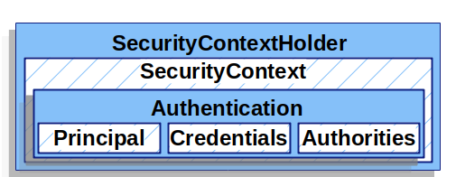

# CH27 스프링부트 인증 - 시큐리티

#### 소스코드

SSR기반 Form Login (JSP 같은 템플릿엔진 사용, @Controller)

https://github.com/codingspecialist/Springboot-Security/tree/ssr-topic

CSR기반 Login Customizer (JWT)

https://github.com/codingspecialist/Springboot-Security/tree/csr-topic

#### 공식문서

https://docs.spring.io/spring-security/reference/servlet/architecture.html

#### 토리맘의 한글 라이즈

https://godekdls.github.io/Spring%20Security/servletsecuritythebigpicture/

## 1. 스프링부트 시큐리티란

> 스프링 시큐리티(Spring Security)는 스프링 프레임워크 기반의 웹 어플리케이션에서 보안 기능을 구현할 수 있도록 지원하는 프레임워크입니다.
>
> 스프링 시큐리티는 인증(Authentication)과 권한 부여(Authorization)를 위한 다양한 기능을 제공합니다. 인증은 사용자가 시스템에 접근할 때 자신의 신원을 증명하는 과정을 말하며, 스프링 시큐리티는 다양한 인증 방식을 지원합니다. 예를 들어, 폼 기반 인증, HTTP 기본 인증, OAuth2, JWT(JSON Web Token) 등이 있습니다.
>
> 권한 부여는 인증된 사용자에 대해 특정한 권한을 부여하는 것을 말합니다. 스프링 시큐리티에서는 권한 부여를 위해 Access Control List(ACL, 인증), Role-Based Access Control(RBAC, 권한) 등의 방식을 지원합니다.
>
> 스프링 시큐리티는 또한 보안 관련 이벤트 처리, 세션 관리, CSRF(Cross-Site Request Forgery) 방어, XSS(Cross-Site Scripting) 방어 등의 기능을 제공합니다. 이러한 기능들을 통해 스프링 시큐리티는 안전하고 보안성 높은 웹 어플리케이션 개발을 도와줍니다.

> `시큐리티 디폴트 인증 로직`
> 
> 
> 
> 1. 모든 주소는 인증을 필요로 한다. 
> -> /loginForm, /joinForm은 인증이 안 필요하게 변경해야 한다.
> 2. 인증이 필요한 주소 요청시에 /login으로 모두 리다이렉션이 된다. 
> -> 기존의 /login을 해제하고, 리다이렉션 주소를 /loginForm으로 바꿔야한다. 
> 3. 인증은 POST 방식, x-www-form-urlencoded, username, password, _CSRF 토큰이 필요하다.
> -> 토큰 해제하기
> 4. 로그아웃은 /longout으로 한다.

## 2. 스프링부트 시큐리티 필터 체인

> 스프링부트 시큐리티 필터 체인은 서블릿 필터(Filter) 이후에 실행됩니다. 이는 스프링부트가 서블릿 컨테이너 내에서 동작하는 웹 어플리케이션에서 스프링부트 시큐리티 필터 체인이 서블릿 필터 이후에 실행될 수 있도록 설정되어 있기 때문입니다.
>
> 스프링부트 시큐리티 필터 체인은 DelegatingFilterProxy를 사용하여 구성되며, 이 필터는 서블릿 필터 이후에 실행됩니다. 서블릿 필터는 HTTP 요청에 대한 전처리(pre-processing) 및 후처리(post-processing)를 수행하는데, 스프링부트 시큐리티 필터 체인은 이러한 서블릿 필터 이후에 실행되므로, 서블릿 필터에서 처리되지 않은 보안 관련 요청에 대한 처리를 수행할 수 있습니다.


## 3. 프록시 패턴이란

> 프록시 패턴은 다른 객체에 대한 접근을 제어하고 보안을 강화하는 소프트웨어 디자인 패턴입니다. 원격, 가상, 보호 프록시 등 다양한 유형이 있으며, 클라이언트와 실제 객체 사이에 중개 역할을 수행하여 원본 객체를 수정하지 않고도 기능을 확장하거나 제어할 수 있습니다. 이로 인해 코드의 유지보수성과 재사용성이 개선되며, 보안과 성능 개선에도 도움이 됩니다.

youtube 강의 참고

https://www.youtube.com/watch?v=TO9XnSkuUtg

## 4. 권한과 인증 로직

UsernamePasswordAuthenticationFilter


- 중요한 5가지
  - UsernamePasswordAuthenticationToken
  - UserDetailsService
  - UserDetails
  - SecurityContextHolder
  - Authentication

결국 인증로직의 목표는 Authentication을 만들어서 SecurityContextHolder에 넣는 것입니다.



- Principal : UserDetails 상속
- Credentials : UserDetails.getUsername()
- Autorities : UserDetails.getAuthorities()

## 4. 필터 체인 종류


- LogoutFilter
  - /logout 발동
- UsernamePasswordAuthenticationFilter (문지기)
  - /login 발동
  - 무력화 시 : formLogin().disable()
- BasicAuthenticationFilter
  - formLogin().disable() 해야 발동
  - 알림 창 때문에 해제 추천
- SecurityContextHolderAwareRequestFilter
  - 어떤 주소에 어떤 유저가 들어갈 수 있는지 알고 있는 필터
  - FilterSecurityInterceptor가 SecurityContextHolderAwareRequestFilter를 보고 동작(FilterSecurityInterceptor가 비교를 하면서 통과시킬지 말지 결정)
- SessionManagementFilter
  - stateless or stateful 선택할 때 사용하는 필터
- ExceptionTranslationFilter
  - 인증, 권한 처리에서 터지는 경우
  - authenticationEntryPoint(인증실패) or accessDeniedHandler(권한실패) 2개 중 1개로 가게됩니다.
- FilterSecurityInterceptor (헬스장 감시자)
  - client의 request 정보
  - SecurityConfig 에 설정되어 있는 주소 정보
  - client의 세션정보

> `FilterSecurityInterceptor`는 예외 처리를 위해 `AccessDeniedHandler`와 `AuthenticationEntryPoint`를 사용합니다. `AccessDeniedHandler`는 인증된 사용자가 요청한 자원에 대한 권한이 없는 경우 처리할 로직을 제공하며, `AuthenticationEntryPoint`는 인증되지 않은 사용자가 보호된 자원에 접근하려고 할 때 로그인 페이지로 리다이렉트하는 로직을 제공합니다.

> `FilterSecurityInterceptor`는 `SecurityContextHolderAwareRequestFilter`와 함께 사용될 때, `SecurityContextHolderAwareRequestFilter`가 제공하는 `SecurityContext`를 사용하여 현재 사용자의 인증 정보를 확인하고, 이를 바탕으로 요청에 대한 접근 권한을 결정합니다.


SecurityFilter는 DispatcherServlet 전인 Filter 부분에서 작동을 합니다. 

### (1) UserPasswordAuthenticationFilter 작동시점

- POST 요청 : /login 
- UserPasswordAuthenticationFilter 목적
  - SecurityContextHolder에 Authentication 객체를 추가하기 위해서

### (2) FilterSecurityInterceptor 작동시점

- /user/**
- /manager/**
- /admin/**
- FilterSecurityInterceptor 목적
  - SecurityContextHolder를 통해 권한, 인증을 체크하기 위해서

## 5. FormLogin

> `formLogin`을 사용하는 경우에는 `UsernamePasswordAuthenticationFilter`가 작동하고, `BasicAuthenticationFilter`는 작동하지 않습니다. 반면에, `http.httpBasic()`를 사용하여 HTTP Basic 인증을 활성화하는 경우에는 `BasicAuthenticationFilter`가 작동하고, `UsernamePasswordAuthenticationFilter`는 작동하지 않습니다.


### (1) Filter Process


Filter Process 목적 : Authentication 객체를 통해서 인증, 권한 체크를 하는 것

- Filter Process 순서
  - 요청이 들어오면, Authentication 객체가 존재하는지 확인
  - 만약 권한을 필요로 하는 요청이 들어온 경우, Authentication 객체 내부의 Authorities(권한)을 체크
  - 만약 PathVariable 같이 보내는 요청이 들어온 경우, Authentication 객체 내부의 UserDetails와 PathVariable 비교

서버에 세션이 달려있고, 세션 내부에는 authentication 객체를 가지는 SecurityContextHolder라고 하는 공간이 별도로 생깁니다. 해당 내부는 로그인되어 있는 client 수 만큼 authentication이 생기게 됩니다.

예를 들어, 권한(USER)을 필요로 하는 요청이 /user/3 다음과 같이 온다면, 우선적으로 authentication을 확인해서 같은 것이 있는지 확인합니다. 없으니까 새롭게 객체를 만드는데 이때 authentication 내부에 3가지 UserDetails, Credentials, Authorities 를 만들면서 authentication을 생성합니다.

UserDetails는 DB에 SELECT된 user object를 넣습니다. Credentials에는 비밀번호가 들어가고 Authorities에는 권한이 들어가게 됩니다.

> `UserDetails`
>
> UserDetails 내부의 메소든 강제되어 있습니다. 왜냐하면 Security가 유저의 이름, 비밀번호를 불러내는 메소드를 통제할 수 있어야 하기 때문입니다. 만약 개발자가 이 부분을 컨트롤 할 수 있다면 모두 다른 이름의 메소드를 만들기 때문입니다.

### (2) Login Process


Login Process 목적 : Authentication을 SecurityContextHolder에 담기 위해서

- login Process 조건 5 가지
  - POST요청
  - /login
  - x-www-formencoded
  - username
  - password

- login Process 순서
  - UserPasswordAuthenticationFilter 발동
  - UsernamePasswordToken 생성
    - username : ssar
    - password : 1234
  - UserDetailsServuce.loadByUsername(ssar) 호출

> `loadByUsername(ssar) 내부 구현`
>
> 1. DB username(ssar) 존재 유무 확인
> 2. 존재하는 경우, 영속화된 user object 리턴 받음
> 3. UserDetails 생성
> 4. UserDetails 로 Authentication 객체 생성
> 5. Authentication을 SecurityContextHolder에 담기

## 6. JWT Login

### (1) 헬스장과 락커


stateful한 헬스장의 경우, 처음에 들어오면 앞으로 사용할 락카를 고정시고 락카열쇠를 받습니다. 그러면 그 락카만 사용이 가능합니다. 여기서 고정된 락카를 JsessionId라고 합니다.

하지만 stateless한 헬스장의 경우, 고정된 락카열쇠 대신에 입장권(토큰)을 받습니다. 따라서 고정된 락카가 아니라 필요할 때 아무곳이나 사용할 수 있습니다. 이 경우는 JsessionId가 존재하지 않습니다.

### (2) CSR 기반 JWT


SSR은 UsernamePasswordAuthenticationFilter를 기반으로 돌아갑니다. 따라서 디폴트로 POST요청과 /login 그리고 x-www-form-urlencoded에 발동을 합니다. 하지만 CSR 경우에는 JWT를 사용할 수 없기 때문에 UsernamePasswordAuthenticationFilter를 무력화 시켜야합니다.

무력화를 시킨 후, SecurityFilter에 JWTFilter 를 넣어주면 됩니다. 따라서 인가처리를 JWTFilter가 대신하는 것입니다.


원래 SSR로 진행을 했다면 SecuritFilter에서 막혔을 것입니다. 하지만 UserPasswordAuthenticationFilter를 무력화 시켜서 /login은 controller까지 들어올 수 있게 됩니다. 이제 컨트롤러에서 로그인을 제어하고 처리를 해야합니다.

그리고 JWT를 사용하기 때문에 컨트롤러에서 JWT 토큰을 제공합니다. 다시 /user/1로 요청이 들어오는 경우, 이제는 UsernamePasswordAuthenticationFilter를 대신하는 JwtVerifyFilter가 먼저 발동하며 토큰을 검증을 하고 강제로 세션을 생성한 후, FilterSecurityInterceptor를 작동시킵니다.

### (3) 세션 강제로 생성

```java
User user = User.builder().id(id).role(role).build();
MyUserDetails myUserDetails = new MyUserDetails(user);
Authentication authentication =
        new UsernamePasswordAuthenticationToken(
                myUserDetails,
                myUserDetails.getPassword(),
                myUserDetails.getAuthorities()
        );
SecurityContextHolder.getContext().setAuthentication(authentication);
```

### (4) 세선 강제로 가져오기

```java
SecurityContext context = SecurityContextHolder.getContext();
Authentication authentication = context.getAuthentication();
String username = authentication.getName();
Object principal = authentication.getPrincipal(); // MyUserDetails
Collection<? extends GrantedAuthority> authorities = authentication.getAuthorities();
```

## 7. SSR 실습코드

### (1) 세팅

#### 의존성

```groovy
dependencies {
	implementation group: 'com.auth0', name: 'java-jwt', version: '4.3.0'
	implementation 'org.springframework.boot:spring-boot-starter-mustache'
	implementation 'org.springframework.boot:spring-boot-starter-data-jpa'
	implementation 'org.springframework.boot:spring-boot-starter-security'
	implementation 'org.springframework.boot:spring-boot-starter-web'
	compileOnly 'org.projectlombok:lombok'
	developmentOnly 'org.springframework.boot:spring-boot-devtools'
	runtimeOnly 'com.h2database:h2'
	annotationProcessor 'org.projectlombok:lombok'
	testImplementation 'org.springframework.boot:spring-boot-starter-test'
	testImplementation 'org.springframework.security:spring-security-test'
}
```

#### application.yml

```yaml
server:
  servlet:
    encoding:
      charset: utf-8
      force: true

spring:
  datasource:
    url: jdbc:h2:mem:test;MODE=MySQL
    driver-class-name: org.h2.Driver
    username: sa
    password:
  h2:
    console:
      enabled: true
  jpa:
    hibernate:
      ddl-auto: create
    show-sql: true
    properties:
      hibernate:
        format_sql: true
      default_batch_fetch_size: 100 # in query 자동 작성
    open-in-view: false
  output:
    ansi:
      enabled: always
  security:
    user:
      name: ssar
      password: 1234
logging:
  level:
    '[shop.mtcoding.securityapp]': DEBUG # DEBUG 레벨부터 에러 확인할 수 있게 설정하기
    '[org.hibernate.type]': TRACE # 콘솔 쿼리에 ? 에 주입된 값 보기

#meta:
#  name: ${HS512.SECRET}
```

### (2) SecurityConfig

- config/SecurityConfig.java

```java
@Slf4j
@Configuration // IOC 등록
public class SecurityConfig {

    // 패스워드 암호화 알고리즘 BCrypt -> 60 Byte (암호화 + 솔트(랜덤 값)) -> 단방향 해시
    // https://n-square.tistory.com/66 참고
    @Bean
    BCryptPasswordEncoder passwordEncoder(){
        return new BCryptPasswordEncoder();
    }

    @Bean
    SecurityFilterChain filterChain() throws Exception{
        // 1. CSRF 해제
        http.csrf().disable(); // postman 접근할 수 있께 오픈 - CSR 할때!!

        // 2. Form 로그인 설정 (그림참고)
        http.formLogin()
                .loginPage("/loginForm")
                .userNameParameter("username")
                .passwordParameter("password")
                .loginProcessingUrl("/login")
                .successHandler((request, response, authentication) -> {
                        System.out.println("디버그 : 로그인 성공");

                        // SSR 기반이기 때문에 화면라턴
                        response.sendRedirect("/");
                })
                .failureHandler((request, response, exception) -> {
                        System.out.println("디버그 : 로그인 실패");

                        // SSR 기반이기 때문에 화면라턴
                        response.sendRedirect("/loginForm");
                });

        // 3. 인증과 권한 필터 설정
        http.authorizeRequests(
                authorize -> authorize.antMatchers("/users/**").authenticated() // 해당 URL : 인증필요
                        .antMatchers("/manager/**")
                        .access("hasRole('ADMIN') or hasRole('MANAGER')")
                        .antMatchers("/admin/**")
                        .access("hasRole(`ADMIN`)")
                        .anyRequest().permitAll()
                );
    }
}
```

> `formLogin().disable()`
> 
> ```java
> http.formLogin().disable(); // 아무것도 작동하지 않음
> ```
> 왜냐하면 formLogin()을 사용해야 UsernamePasswordAuthenticationFilter 작동하는데 disable() 처리를 하면 아무것도 작동하지 않습니다. 따라서 disable() 처리를 하게되면 직접 구현을 해야합니다.

### (3) MyUserDetailsService

- core/auth/MyUserDetailsService.java

```java
@RequiredArgsConstructor
@Service
public class MyUserDetailsService implements UserDetailsService {

    private final UserRepository userRepository;

    // UserDetails를 리턴하면, Security가 password 검증을 알아서 함
    // UsernamePasswordToken 값(rawPassword)을 BCrypt로 해시한 UserDetails의 비밀번호(encPassword) 비교
    @Override
    public UserDetails loadUserByUsername(String username) throws UsernameNotFoundException { 
        System.out.println("디버그 : UserDetailsService loadUserByUsername 실행됨");
        Optional<User> userOP = userRepository.findByUsername(username);
        if(userOP.isPresent()){
            return new MyUserDetails(userOP.get()); // return 시, Authentication 객체에 넣음
        }else{
            return null; // 로그인 실패
        }
    }
}
```

- core/auth/MyUserDetail.java

```java
@Getter
public class MyUserDetails implements UserDetails {

    private User user;

    public MyUserDetails(User user) {
        this.user = user;
    }

    @Override
    public Collection<? extends GrantedAuthority> getAuthorities() {
        Collection<GrantedAuthority> authorities = new ArrayList<>();
        authorities.add(()-> "ROLE_"+user.getRole()); // ROLE_ 무조건 붙어야한다.
        return authorities;
    }

    @Override
    public String getPassword() {
        return user.getPassword(); // credentials 부분
    }

    @Override
    public String getUsername() {
        return user.getUsername();
    }

    @Override
    public boolean isAccountNonExpired() {
        return true;
    }

    @Override
    public boolean isAccountNonLocked() {
        return true;
    }

    @Override
    public boolean isCredentialsNonExpired() {
        return true;
    }

    @Override
    public boolean isEnabled() {
        return user.getStatus();
    }
}
```

> `ROLE_`
>
> 시큐리티 규칙
>
> 

### (4) UserService

- service/UserService.java

```java
@RequiredArgsConstructor
@Service
public class UserService {

    private final UserRepository userRepository;
    private final BCryptPasswordEncoder passwordEncoder; // DI 가능한 이유 : SecurityConfig에서 주입했기 때문에

    /**
     *  1. 트랜잭션 관리
     *  2. 영속성 객체 변경감지
     *  3. RequestDTO 요청받기
     *  4. 비지니스 로직 처리하기
     *  5. ResponseDTO 응답하기
     */
    @Transactional
    public UserResponse.JoinDto 회원가입(UserRequest.JoinDTO joinDTO){
        // select
        String rawPassword = joinDTO.getPassword();
        String encPassword = passwordEncoder.encode(rawPassword); // 단방향 암호화, 60Byte
        joinDTO.setPassword(encPassword);
        User userPS = userRepository.save(joinDTO.toEntity());
        return new UserResponse.JoinDto(userPS);
    }
}
```

### (5) HelloController

- controller/HelloController.java

```java
@RequiredArgsConstructor
@Controller
public class HelloController {

    private final UserService userService;

    @GetMapping("/users/{id}")
    public ResponseEntity<?> userCheck(
            @PathVariable Long id,
            @AuthenticationPrincipal MyUserDetails myUserDetails){
        String username =myUserDetails.getUser().getUsername();
        String role = myUserDetails.getUser().getRole();
        return ResponseEntity.ok().body(username+" : "+role);
    }

    @GetMapping("/")
    public ResponseEntity<?> hello(){
        return ResponseEntity.ok().body("ok");
    }

    @GetMapping("/joinForm")
    public String joinForm(){
        return "joinForm";
    }

    @GetMapping("/loginForm")
    public String loginForm(){
        return "loginForm";
    }

    @PostMapping("/join")
    public ResponseEntity<?> join(UserRequest.JoinDTO joinDTO){
        // select 됨
        UserResponse.JoinDto data = userService.회원가입(joinDTO);
        // select 안됨
        ResponseDTO<?> responseDTO = new ResponseDTO<>().data(data);
        return ResponseEntity.ok().body(responseDTO);
    }
}
```

### (6) CSR 실습코드

#### config

- config/SecurityConfig.java

```java
@Slf4j
@Configuration // IOC 등록
public class SecurityConfig {

    // 패스워드 암호화 알고리즘 BCrypt -> 60 Byte (암호화 + 솔트(랜덤 값)) -> 단방향 해시
    // https://n-square.tistory.com/66 참고
    @Bean
    BCryptPasswordEncoder passwordEncoder(){
        return new BCryptPasswordEncoder();
    }

    @Bean // 인증 처리
    AuthenticationManager authenticationManager(AuthenticationConfiguration authenticationConfiguration) throws Exception {
        return authenticationConfiguration.getAuthenticationManager();
    }

    // JWT 필터 등록이 필요함, 시큐리티 필터 등록은 무조건 여기서 한다.
    public class CustomSecurityFilterManager extends AbstractHttpConfigurer<CustomSecurityFilterManager, HttpSecurity> {
        @Override
        public void configure(HttpSecurity builder) throws Exception {
            AuthenticationManager authenticationManager = builder.getSharedObject(AuthenticationManager.class);
            builder.addFilter(new JwtAuthorizationFilter(authenticationManager)); // 필터 등록하는 부분(여러개 등록 가능)
            super.configure(builder);
        }
    }

    @Bean
    SecurityFilterChain filterChain(HttpSecurity http) throws Exception {
        // 1. CSRF 해제 (CSRF 공격 방어할 수 있다.)
        http.csrf().disable(); // formLogin을 사용하지 않고 postman 접근할 것이기 때문에

        // 2. iframe 거부
        http.headers().frameOptions().disable();

        // 3. cors 설정 (XSS 공격 방어할 수 있다.)
        http.cors().configurationSource(configurationSource());

        // 4. jSessionId 사용 거부 (jSessionId만 사용하지 않는 것이지 Session 영역은 존재한다.)
        http.sessionManagement().sessionCreationPolicy(SessionCreationPolicy.STATELESS);

        // 5. form 로긴 해제 (UsernamePasswordAuthenticationFilter 비활성화 -> loadByUsername() 사용 불가 -> UserDetails 사용불가)
        http.formLogin().disable();

        // 6. BasicAuthentication 비활성화 (팝업이 떠서 로그인 해라는 username, password 팝업창이 뜨지 않게 비활성화)
        http.httpBasic().disable();

        // 7. 커스텀 필터 적용 (시큐리티 필터 교환, JwtVerifyFilter)
        http.apply(new CustomSecurityFilterManager());

        // 8. 인증 실패 처리
        http.exceptionHandling().authenticationEntryPoint((request, response, authException) -> {
            // checkpoint -> 예외핸들러 처리
            log.debug("디버그 : 인증 실패 : "+authException.getMessage());
            log.info("인포 : 인증 실패 : "+authException.getMessage());
            log.warn("워닝 : 인증 실패 : "+authException.getMessage());
            log.error("에러 : 인증 실패 : "+authException.getMessage());
            
            // CSR 기반이기 때문에 데이터만 응답
            response.setContentType("text/plain; charset=utf-8");
            response.setStatus(401);
            response.getWriter().println("인증 실패");
        });

        // 10. 권한 실패 처리
        http.exceptionHandling().accessDeniedHandler((request, response, accessDeniedException) -> {
            // checkpoint -> 예외핸들러 처리
            log.debug("디버그 : 권한 실패 : "+accessDeniedException.getMessage());
            log.info("인포 : 권한 실패 : "+accessDeniedException.getMessage());
            log.warn("워닝 : 권한 실패 : "+accessDeniedException.getMessage());
            log.error("에러 : 권한 실패 : "+accessDeniedException.getMessage());

            // CSR 기반이기 때문에 데이터만 응답
            response.setContentType("text/plain; charset=utf-8");
            response.setStatus(403);
            response.getWriter().println("권한 실패");
        });

        // 11. 인증, 권한 필터 설정
        http.authorizeRequests(
                authorize -> authorize.antMatchers("/users/**").authenticated()
                        .antMatchers("/manager/**")
                        .access("hasRole('ADMIN') or hasRole('MANAGER')")
                        .antMatchers("/admin/**").hasRole("ADMIN")
                        .anyRequest().permitAll()
                );

        return http.build();
    }

    public CorsConfigurationSource configurationSource() {
        CorsConfiguration configuration = new CorsConfiguration();
        configuration.addAllowedHeader("*");
        configuration.addAllowedMethod("*"); // GET, POST, PUT, DELETE (Javascript 요청 허용)
        configuration.addAllowedOriginPattern("*"); // 모든 IP 주소 허용 (프론트 앤드 IP만 허용 react)
        configuration.setAllowCredentials(true); // 클라이언트에서 쿠키 요청 허용
        configuration.addExposedHeader("Authorization"); // 옛날에는 디폴트 였다. 지금은 아닙니다.
        UrlBasedCorsConfigurationSource source = new UrlBasedCorsConfigurationSource();
        source.registerCorsConfiguration("/**", configuration);
        return source;
    }
}
```

> `BasicAuthentication`
> 
> ```java
> http.httpBasic().disable();
> ```
> 만약 httpBasic을 disable()처리를 하지 않으면 다음과 같은 팝업창이 뜨게욉니다.
>
> 

#### controller

- controller/HelloController.java

```java
@Slf4j
@RequiredArgsConstructor
@RestController
public class HelloController {

    private final UserService userService;
    private final AuthenticationManager authenticationManager;
    private final UserRepository userRepository;

    @Value("${meta.name}")
    private String name;
    
    // Filter에서 처리하는 것보다 Controller 에서 처리하는 것이, 스프링의 각종 기술에 도움을 받을 수 있다. -> throw, valid 체크하는 것이 힘들다.
    @PostMapping("/login")
    public ResponseEntity<?> login(@RequestBody UserRequest.LoginDTO loginDTO){
        String jwt = userService.로그인(loginDTO);
        return ResponseEntity.ok().header(MyJwtProvider.HEADER, jwt).body("로그인완료");
    }

    @GetMapping("/users/{id}")
    public ResponseEntity<?> userCheck(
            @PathVariable Long id,
            @AuthenticationPrincipal MyUserDetails myUserDetails){
        Long id =myUserDetails.getUser().getId();
        String role = myUserDetails.getUser().getRole();
        return ResponseEntity.ok().body(id+" : "+role);
    }

    @GetMapping("/")
    public ResponseEntity<?> hello(){
        return ResponseEntity.ok().body(name);
    }

    @PostMapping("/join")
    public ResponseEntity<?> join(UserRequest.JoinDTO joinDTO){
        // select 됨
        UserResponse.JoinDto data = userService.회원가입(joinDTO);
        // select 안됨
        ResponseDTO<?> responseDTO = new ResponseDTO<>().data(data);
        return ResponseEntity.ok().body(responseDTO);
    }
}
```

> `@Value("${meta.name}")`
>
> ```java
> @Value("${meta.name}")
> private String name;
> ```
> 
> application.yml 접근 후 확인
> 
> ```yaml
> .
> .
> .
> meta:
>   name: ${HS512.SECRET} # . -> _ (바꿔서 찾는다.)
> ```

#### service

- service/UserService.java

```java
@RequiredArgsConstructor
@Service
public class UserService {

    private final UserRepository userRepository;
    private final BCryptPasswordEncoder passwordEncoder; // DI 가능한 이유 : SecurityConfig에서 주입했기 때문에

    /**
     *  1. 트랜잭션 관리
     *  2. 영속성 객체 변경감지
     *  3. RequestDTO 요청받기
     *  4. 비지니스 로직 처리하기
     *  5. ResponseDTO 응답하기
     */
    @Transactional
    public UserResponse.JoinDto 회원가입(UserRequest.JoinDTO joinDTO){
        // select
        String rawPassword = joinDTO.getPassword();
        String encPassword = passwordEncoder.encode(rawPassword); // 단방향 암호화, 60Byte
        joinDTO.setPassword(encPassword);
        User userPS = userRepository.save(joinDTO.toEntity());
        return new UserResponse.JoinDto(userPS);
    }

    public String 로그인(UserRequest.LoginDTO loginDTO) {
        Optional<User> userOP = userRepository.findByUsername(loginDTO.getUsername());
        if(userOP.isPresent()){
            User userPS = userOP.get();
            if(passwordEncoder.matches(loginDTO.getPassword(), userPS.getPassword())){ // matches (비밀번호 비교시)
                String jwt = MyJwtProvider.create(userPS);
                return jwt;
            }
            throw new RuntimeException("패스워드 틀렸어");
        }else{
            throw new RuntimeException("유저네임 없어");
        }
    }
}
```

#### core

- core/jwt/MyJwtProvider.java

```java
public class MyJwtProvider {

    private static final String SUBJECT = "jwtstudy";
    private static final int EXP = 1000 * 60 * 60;
    public static final String TOKEN_PREFIX = "Bearer "; // 스페이스 필요함
    public static final String HEADER = "Authorization";
    private static final String SECRET = System.getenv("HS512_SECRET"); // metacoding, 환경변수 등록

    public static String create(User user) {
        String jwt = JWT.create()
                .withSubject(SUBJECT)
                .withExpiresAt(new Date(System.currentTimeMillis() + EXP))
                .withClaim("id", user.getId())
                .withClaim("role", user.getRole())
                .sign(Algorithm.HMAC512(SECRET));
        return TOKEN_PREFIX + jwt;
    }

    public static DecodedJWT verify(String jwt) throws SignatureVerificationException, TokenExpiredException {
        DecodedJWT decodedJWT = JWT.require(Algorithm.HMAC512(SECRET))
                .build().verify(jwt);
        return decodedJWT;
    }
}
```

- core/jwt/JwtAuthorizationFilter.java

```java
/**
 * 토큰이 있는지 검증
 * - 있으면 : 세션을 만들고 락카에 짐을 보관 - 헬스장에 진입할 수 있게 해줌 - 시큐리티에 권한, 인증처리한테 위임
 * - 없으면 : 핼스장에 진입하게 해줌
 * 모든 주소에서 발생
 */ 
@Slf4j
//@Component // 추가하면 AuthenticationManager도 @Bean 붙여야 한다.
public class JwtAuthorizationFilter extends BasicAuthenticationFilter {

    // @Component를 통해서 JwtAuthorizationFilter가 IoC 컨테이너에 들어가게된다. 
    // 하지만 AuthenticationManager는 IoC 컨테이너에 존재하지 않기 때문에 SecurityConfig 에서 @Bean을 해줘야한다.
    public JwtAuthorizationFilter(AuthenticationManager authenticationManager) { 
        super(authenticationManager);
    }

    @Override
    protected void doFilterInternal(HttpServletRequest request, HttpServletResponse response, FilterChain chain) throws IOException, ServletException {
        String prefixJwt = request.getHeader(MyJwtProvider.HEADER);

        if (prefixJwt == null) {
            chain.doFilter(request, response);
            return;
        }

        String jwt = prefixJwt.replace(MyJwtProvider.TOKEN_PREFIX, "");
        try {
            DecodedJWT decodedJWT = MyJwtProvider.verify(jwt);
            Long id = decodedJWT.getClaim("id").asLong();
            String role = decodedJWT.getClaim("role").asString();

            // userDetailsService 를 타진 않음 -> 강제로 Authentication 객체를 만들어서 세션에 주입할 수 있음
            User user = User.builder().id(id).role(role).build();
            MyUserDetails myUserDetails = new MyUserDetails(user);
            Authentication authentication =
                    new UsernamePasswordAuthenticationToken(
                            myUserDetails,
                            myUserDetails.getPassword(), // null
                            myUserDetails.getAuthorities()
                    );
            SecurityContextHolder.getContext().setAuthentication(authentication);

        } catch (SignatureVerificationException sve) {
            log.error("토큰 검증 실패");
        } catch (TokenExpiredException tee) {
            log.error("토큰 만료됨");
        } finally {
            chain.doFilter(request, response); // FilterSecurityInterceptor에게 전부 위임
        }
    }
}
```

> `JwtAuthorizationFilter에서 DB를 사용하고 싶은 경우`
>
> ```java
> @Slf4j
> @Component // 추가하면 AuthenticationManager도 @Bean 붙여야 한다.
> public class JwtAuthorizationFilter extends BasicAuthenticationFilter {
> 
>     private AuthenticationManager authenticationManager;
>     private UserRepository userRepository;
> 
>     // @Component를 통해서 JwtAuthorizationFilter가 IoC 컨테이너에 들어가게된다. 
>     // 하지만 AuthenticationManager는 IoC 컨테이너에 존재하지 않기 때문에 SecurityConfig 에서 @Bean을 해줘야한다.
>     public JwtAuthorizationFilter(AuthenticationManager authenticationManager, UserRepository userRepository) { 
>         super(authenticationManager);
>         this.authenticationManager = authenticationManager;
>         this.userRepository = userRepository;
>     }
> .
> .
> .
> ```

## (7) 정리

- 문지기 : UsernamePasswordAuthenticationFilter
- 감시자 : FilterSecurityInterceptor
- 락카 : 세션
- 헬스장 : 서버

### (1) stateful 서버


헬스장에 가면 락카에 짐을 놓고 나갈 때, 락카열쇠를 받습니다. 그리고 락카열쇠를 가지고 다시 방문을 하면 짐이 있는 락카를 열 수 있습니다.

하지만 단점은 헬스장이 늘어나면 다른 헬스장에서는 나의 짐이 존재하지 않습니다.

### (2) stateless 서버


이번에는 회원증을 사용해 보겠습니다. 처음에 들어갈 때 문지기는 회원의 회원증이 유효한지만 체크를 합니다. 단순히 체크만 하기 때문에 없어도 통과는 됩니다. 헬스장으로 들어올 수 있게되는데 이때 감시자는 입장한 사람이 락카에 짐이 없는지 있는지 체크를 합니다. 있으면 놔두고 없을 경우에는 내보냅니다.

## (8) 마인드 맵

