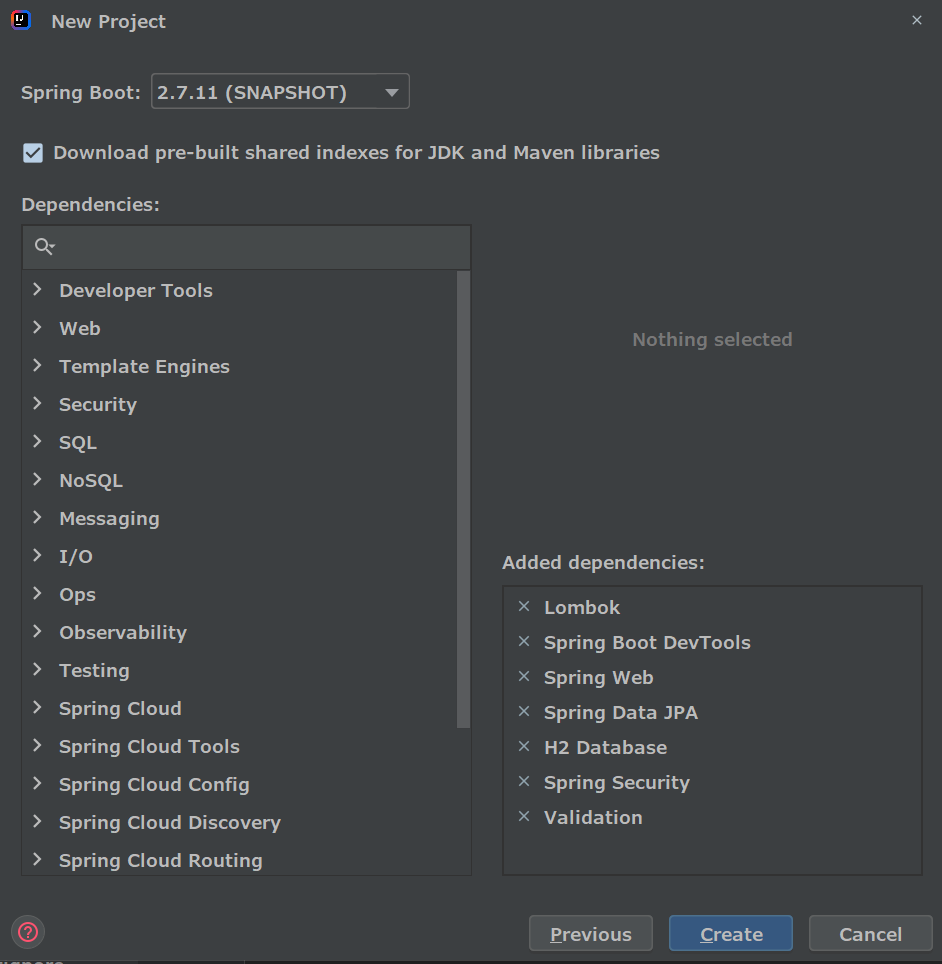

# CH28 스프링부트 블로그 프로젝트 - SSR 최종정리

## 진행중인 레포지토리

> https://github.com/codingspecialist/Springboot-Fastcampus-Project

## 참고 블로그 프로젝트 MyBatis 기반 레포지토리

> - 회원가입, 로그인, 글쓰기, 글목록보기(섬네일제외), 글상세보기, 글삭제, 글수정, 섬네일보기
> - https://github.com/codingspecialist/Springboot-MyBatis-Jsp-Blog-V3
>
> - 댓글쓰기, 댓글목록보기, 댓글삭제, 프로필사진추가및변경하기, 프로필사진보기
> - https://github.com/codingspecialist/Springboot-MyBatis-Jsp-Blog-V3-STEP2
>
> - 좋아요하기, 좋아요취소, 좋아요보기, 아이디중복체크, 회원수정하기, 페이징
> - https://github.com/codingspecialist/Springboot-MyBatis-Jsp-Blog-V3-STEP2/tree/step3

## 참고 레포지토리

> #### 스프링부트 시큐리티
>
> https://github.com/codingspecialist/Springboot-Security/tree/ssr-topic
>
> https://github.com/codingspecialist/Springboot-Security/tree/csr-topic
>
> 
>
> #### 스프링부트 서비스
>
> https://github.com/codingspecialist/Springboot-ServiceAndDTO
>
> https://github.com/codingspecialist/Springboot-ServiceAndDTO/tree/complete
>
> 
>
> #### 스프링부트 인증, 레포, 컨트롤러 총정리 미니프로젝트
>
> https://github.com/codingspecialist/Springboot-MetaMall-Project
>
> https://github.com/codingspecialist/Springboot-MetaMall-Project/tree/complete
>
> 
>
> #### 스프링부트 인증
>
> https://github.com/codingspecialist/Springboot-OAuth-Kakao-Login
>
> https://github.com/codingspecialist/Springboot-JWT
>
> https://github.com/codingspecialist/Springboot-AOP
>
> https://github.com/codingspecialist/Springboot-Session-Cookie
>
> 
>
> #### 스프링부트 레포지토리
>
> https://github.com/codingspecialist/Springboot-ORM-Lazy-Eager
>
> https://github.com/codingspecialist/Springboot-JpaRepository.git
>
> https://github.com/codingspecialist/Springboot-Hirbernate.git
>
> https://github.com/codingspecialist/Springboot-JDBC.git
>
> 
>
> #### 스프링부트 컨트롤러
>
> https://github.com/codingspecialist/java-reflection.git
>
> https://github.com/codingspecialist/Springboot-Controller-High.git
>
> https://github.com/codingspecialist/Springboot-Controller.git
>
> 
>
> #### 자바스크립트 기초
>
> https://github.com/codingspecialist/javascript-class.git
>
> 
>
> #### 자바 기초
>
> https://github.com/codingspecialist/javahigh-oop2.git
>
> https://github.com/codingspecialist/javahigh-oop.git
>
> 
>
> #### 웹 기초
>
> https://github.com/codingspecialist/mvcapp.git
>
> https://github.com/codingspecialist/web5.git
>
> https://github.com/codingspecialist/web4.git
>
> https://github.com/codingspecialist/web3.git
>
> https://github.com/codingspecialist/web2.git
>
> https://github.com/codingspecialist/web1.git
>
> https://github.com/codingspecialist/socket-study.git

## 1. 기술스택

- JDK 11
- Springboot 2.X 버전
- JPA
- H2 인메모리 디비 - 방언 MySQL
- JSP
- Security
- AJAX
- JSoup
- 부트스트랩

## 2. 요구사항

> HTTP 메서드를 POST와 GET만 사용한다.

#### 요구사항 1단계 

- 회원가입
- 로그인
- 글쓰기
- 게시글 목록보기
- 게시글 상세보기
- 썸네일 등록하기

#### 요구사항 2단계 

- 아이디 중복확인
- 비밀번호 동일체크
- 로그인 아이디 기억하기
- 프론트 유효성 검사 (onsubmit)
- 백엔드 유효성 검사 (AOP 등록)
- 글로벌 Exception 처리
- Script 응답 설정

#### 요구사항 3단계 

- 회원 프로필 사진 등록
- 회원정보 보기
- 회원정보 수정
- 에러 로그 테이블 관리

#### 요구사항 4단계 

- 페이징
- 검색

#### 요구사항 5단계  (개인 프로젝트)

- Love 테이블 생성
- Reply 테이블 생성
- 연관관계 설정
- 댓글쓰기
- 댓글삭제
- 좋아요 하기
- 좋아요 보기
- 좋아요 취소하기

## 3. 화면 설계

### 3.1 게시글 목록보기 / 메인 화면


### 3.2 게시글 상세 화면


### 3.3 회원가입 화면


### 3.4 로그인 화면


### 3.5 게시글 쓰기 화면


### 3.6 게시글 목록 화면 / 글 작성 이후 (썸네일 반영)


### 3.7 긴 글 넣으면 ... 처리


### 3.8 프로필 사진 업데이트 화면


## 4. 엔티티 설계

```java
public class User {
    private int id;
    private String username;
    private String password;
    private String email;
    private String role;
    private Timestamp createdAt;
}

public class Board {
    private int id;
    private User user;
    private String title;
    private String content;
    private String thumbnail;
    private Timestamp createdAt;
}
```

## 5. 프로젝트 세팅

https://github.com/codingspecialist/Springboot-SSR-Blog-Project

> ssr 프로젝트는 packaging을 war로 한다 (war로 배포하기)
>
> csr 프로젝트는 packaging을 jar로 한다




```groovy
implementation 'org.springframework.boot:spring-boot-starter-aop'
implementation 'org.jsoup:jsoup:1.15.3'
implementation 'javax.servlet:jstl'
implementation 'org.apache.tomcat.embed:tomcat-embed-jasper'
```

## 6. YML 세팅

> application.yml

```yaml
spring:
  profiles:
    active:
      - dev
```

> application-dev.yml

```yaml
server:
  servlet:
    encoding:
      charset: utf-8
      force: true
  port: 8080

spring:
  mvc:
    view:
      prefix: /WEB-INF/views/
      suffix: .jsp
  datasource:
    url: jdbc:h2:mem:test;MODE=MySQL
    driver-class-name: org.h2.Driver
    username: sa
    password:
  h2:
    console:
      enabled: true
  jpa:
    hibernate:
      ddl-auto: create
    show-sql: true
    properties:
      hibernate:
        format_sql: true
      default_batch_fetch_size: 100 # in query
    open-in-view: false
  output:
    ansi:
      enabled: always # vscode console color
logging:
  level:
    '[shop.mtcoding.metablog]': DEBUG
    '[org.hibernate.type]': TRACE
```

> application-prod.yml

```yaml
server:
  servlet:
    encoding:
      charset: utf-8
      force: true
  port: 80

spring:
  mvc:
    view:
      prefix: /WEB-INF/views/
      suffix: .jsp
  datasource:
    url: jdbc:mariadb://${rds.hostname}:${rds.port}/${rds.db.name}?allowPublicKeyRetrieval=true&useSSL=false
    driver-class-name: org.mariadb.jdbc.Driver
    username: ${rds.username}
    password: ${rds.password}
  jpa:
    hibernate:
      ddl-auto: none
      default_batch_fetch_size: 100 # in query
    open-in-view: false
logging:
  level:
    '[shop.mtcoding.metablog]': INFO
```

## 7. 화면 만들기

> 시작화면 다운 받기

https://github.com/codingspecialist/Springboot-Fastcampus-Project/tree/main/startview/webapp/WEB-INF/views

## 8. 요구사항 1단계 시작

> 실습

#### 회원가입
#### 로그인 (시큐리티)
#### 글쓰기 (섬머 노트)
#### 게시글 목록보기 (Lazy 전략 - N+1문제 해결)
#### 게시글 상세보기 (데이터 뿌리기)
#### 썸네일 등록하기 (JSoup)

## 9. 요구사항 2단계 시작

> 실습

#### 아이디 중복확인
#### 비밀번호 동일체크
#### 프론트 유효성 검사 (onsubmit)
#### 백엔드 유효성 검사 (AOP 등록)
#### 글로벌 Exception 처리
#### Script 응답 설정

## 10. 요구사항 3단계 시작

> 실습

#### 회원 프로필 사진 등록
#### 회원정보 보기
#### 게시글 삭제
#### 회원정보 수정

## 11. 요구사항 4단계 시작

> 실습

#### 검생

## 12. 요구사항 5단계 시작

> 실습

#### Love 테이블 생성
#### Reply 테이블 생성
#### 연관관계 설정
#### 댓글쓰기
#### 댓글삭제
#### 좋아요 하기
#### 좋아요 보기
#### 좋아요 보기
#### 로그인 아이디 기억하기
#### 에러 로그 테이블 관리