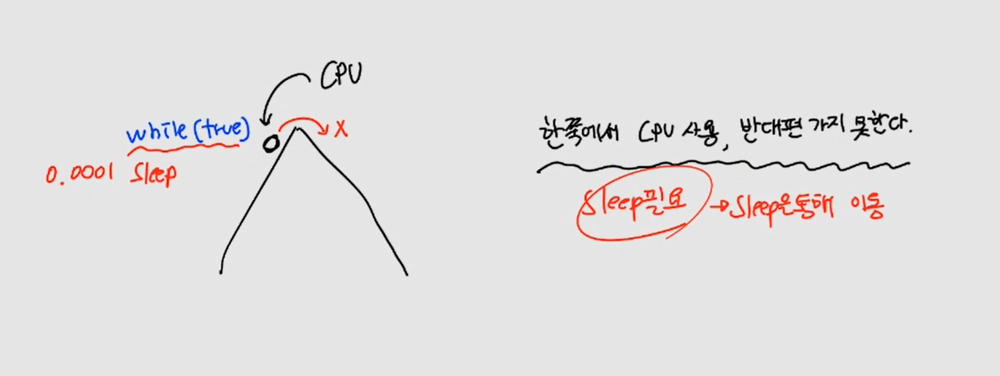
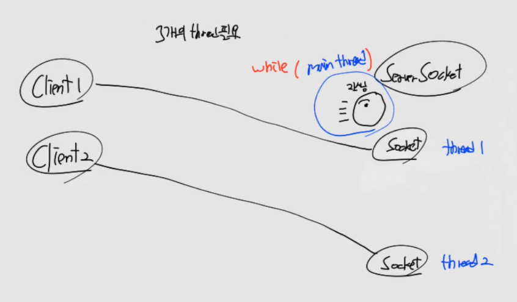

# CH03 소켓통신 고급


CPU 가 1개만 존재한다면, 여러 Client가 접근시 ServerSocekt에 CPU가 계속 위치할 수 없습니다. 왜냐하면 연결할 때마다 연결을 끊고 새로운 소켓과 연결을 해줘야 합니다. 따라서 thread가 꼭 필요합니다. thread에 대해서 알아보겠습니다.

## 1. 프로세스
> 프로세스(process)란 단순히 실행 중인 프로그램(program)이라고 할 수 있습니다.
> 즉, 사용자가 작성한 프로그램이 운영체제에 의해 메모리 공간을 할당받아 실행 중인 것을 말합니다.
> 이러한 프로세스는 프로그램에 사용되는 데이터와 메모리 등의 자원 그리고 스레드로 구성됩니다. 

1개의 프로세스는 최소 1개의 메인 스레드를 가집니다.


Zoom, Slack을 CPU가 1개로 사용을 하면 동시에 BW, BR를 할 수 없습니다. 왜냐하면 CPU(일꾼)이 1명이기 때문입니다.

따라서 우리는 각 Process 마다 main thread를 만들어 줘야합니다. 그러면 CPU가 빠르게 이동하면서 일처리를 합니다.


## 2. thread

### (1) thread 이해
> 스레드(thread)란 프로세스(process) 내에서 실제로 작업을 수행하는 주체를 의미합니다.
> 모든 프로세스에는 한 개 이상의 스레드가 존재하여 작업을 수행합니다.
> 또한, 두 개 이상의 스레드를 가지는 프로세스를 멀티스레드 프로세스(multi-threaded process)라고 합니다.


thread는 실이라는 의미입니다. 따라서 1명의 CPU(일꾼)은 실을 따라서 일을 합니다.

그래서 분기 전 까지를 main thread 라고 부릅니다. main thread가 분기 되는 시점에 main thread는 한쪽 방향으로 진행하고, 남은 thread는 새로운 thread가 만들어지게 됩니다.

그러면서 빠른속도로 좌우로 CPU(일꾼)이 이동을 하는 것입니다.

- CPU 일의 순서
  - 1, 2, 3, 4, 5, 8, 6, 9, 7, 10

> 데몬 스레드 프로세스


- 싱글 스레드 프로세스
- 멀티 스레드 프로세스
- 데몬 스레드 프로세스
  - 무한대
  - 강제종료시, interrupt
  - 네이버

결국 스레드는 실일 뿐이고 해당 길이만큼 thread의 수명이 있는 것입니다. 또한 일하는 실체는 CPU가 일을 합니다.

### (2) Context Switching


만약 CPU가 1개면, Round Robin 처럼 Time Slicing을 기준으로 빠르게 작업을 하면서 이동합니다. 

따라서 이전에 어디까지 작업을 했는지, 어디서부터 작업을 해야하는지를 기억해야 합니다. 우리는 이것을 컨텍스트 스위칭이라고 부릅니다.

> thread는 OS가 만듭니다.
- OS 종류 Window, mac, Linux 에서 각 컴퓨터에 맞는 thread를 생성합니다.

> sleep이 필요한 이유



만약 한쪽에서 모든 퍼포먼스를 보이면, 다른 쪽으로 넘어가지 못합니다. 따라서 sleep을 주어서 그 틈을 이용해 다른 thread로 이동할 수 있습니다.

이동을 하기 위해서는 현재 작업중이 위치를 기억하고 기록해야 합니다. 따라서 이 모든 일련의 과정이 sleep에서 이루어집니다.

### (3) thread 코드 실습

```java
package ch13;

// 쓰레드가 시작되면 OS가 쓰레드를 만들고 Java에게 알려주고 Java는 run을 호출
class SubThread implements Runnable { // 실이 되기 위한 조건: Runnable

     // 서브 thread
	@Override
	public void run() {
		for (int i = 1; i < 11; i++) {
			System.out.println("서브 쓰레드 : "+i);
			try {
				Thread.sleep(1000); // 1000 = 1초
			} catch (Exception e) {
				e.printStackTrace();
			}
		}
	}
}

public class ThreadEx01 {

	// 메인 쓰레드
	public static void main(String[] args) {
		Thread t1 = new Thread(new SubThread());
		t1.start(); // thread 분기
		
		for (int i = 1; i < 6; i++) {
			System.out.println("메인 쓰레드 : " + i);
			try {
				Thread.sleep(1000); 
			} catch (Exception e) {
				e.printStackTrace();
			}
		}
	}
}
```


- main thread, sub thread 의 생명주기와 각 thread의 진행 순서를 생각해보자.

## 3. single server
> Single server는 하나의 서버가 모든 클라이언트 요청을 처리하는 시스템 구조를 말합니다. 이 구조에서 모든 클라이언트 요청은 하나의 서버에 도착하고, 해당 서버에서 처리됩니다.

```java
package singleserver;

import java.io.BufferedReader;
import java.io.BufferedWriter;
import java.io.InputStreamReader;
import java.io.OutputStreamWriter;
import java.net.ServerSocket;
import java.net.Socket;

public class MyServer {

    static int clientCount = 0;

    public MyServer() throws Exception{
        // 1. 서버 대기중
        ServerSocket serverSocket = new ServerSocket(10000);
        while(true){
            Socket socket = serverSocket.accept();
            clientCount++;
            System.out.println("===============================");
            System.out.println("클라이언트가 연결되었습니다");
            System.out.println("연결된 클라이언트 : "+clientCount);

            // 2. 서버 요청 받음
            BufferedReader request = new BufferedReader(new InputStreamReader(socket.getInputStream(), "utf-8"));
            String msg = request.readLine(); // 버퍼에 \n까지 읽음
            System.out.println("클라이언트에게서 요청이 왔습니다 : "+msg);

            // 3. 테스트를 위해 5초 대기
            Thread.sleep(5000);

            // 4. 서버 응답
            BufferedWriter response = new BufferedWriter(new OutputStreamWriter(socket.getOutputStream(), "utf-8"));
            response.write("<html><h1>Hello</h1></html>");
            response.write("\n");
            response.flush();
            System.out.println("클라이언트에게 응답합니다");
            System.out.println("===============================");
            clientCount--;
        }
    }
    public static void main(String[] args) {
        try {
            new MyServer();
        } catch (Exception e) {
            throw new RuntimeException(e);
        }
    }
}
```

```java
package singleserver;

import java.io.BufferedReader;
import java.io.BufferedWriter;
import java.io.InputStreamReader;
import java.io.OutputStreamWriter;
import java.net.Socket;

public class MyClient1 {

    public MyClient1() throws Exception {
        // 1. 서버 연결
        Socket socket = new Socket("localhost", 10000);

        // 2. 클라이언트 요청함
        BufferedWriter request = new BufferedWriter(new OutputStreamWriter(socket.getOutputStream(), "utf-8"));
        request.write("html 페이지 주세요");
        request.write("\n"); // 버퍼에 끝을 알려주는 프로토콜
        request.flush(); // 버퍼에 담긴 메시지를 전송

        // 3. 클라이언트 응답 받음
        BufferedReader response = new BufferedReader(new InputStreamReader(socket.getInputStream(), "utf-8"));
        String msg = response.readLine(); // 버퍼에 \n까지 읽음
        System.out.println("서버에게서 응답이 왔습니다 : "+msg);
    }

    public static void main(String[] args) {
        try {
            new MyClient1();
        } catch (Exception e) {
            throw new RuntimeException(e);
        }
    }
}
```

```java
package singleserver;

import java.io.BufferedReader;
import java.io.BufferedWriter;
import java.io.InputStreamReader;
import java.io.OutputStreamWriter;
import java.net.Socket;

public class MyClient2 {

    public MyClient2() throws Exception {
        // 1. 서버 연결
        Socket socket = new Socket("localhost", 10000);

        // 2. 클라이언트 요청함
        BufferedWriter request = new BufferedWriter(new OutputStreamWriter(socket.getOutputStream(), "utf-8"));
        request.write("html 페이지 주세요");
        request.write("\n"); // 버퍼에 끝을 알려주는 프로토콜
        request.flush(); // 버퍼에 담긴 메시지를 전송

        // 3. 클라이언트 응답 받음
        BufferedReader response = new BufferedReader(new InputStreamReader(socket.getInputStream(), "utf-8"));
        String msg = response.readLine(); // 버퍼에 \n까지 읽음
        System.out.println("서버에게서 응답이 왔습니다 : "+msg);
    }

    public static void main(String[] args) {
        try {
            new MyClient2();
        } catch (Exception e) {
            throw new RuntimeException(e);
        }
    }
}
```
Server 실행 -> Client 1, Client 2 동시 실행


동시에 실행을 시켜도 동기적으로 결과가 나옵니다. 따라서 현재는 데몬이기 때문에 서버는 죽지 않습니다. 하지만 동기식이여서 동시에 접근해도 순차적으로 처리를 합니다.



동기식을 thread로 바꿔야합니다. 3개의 thread가 필요합니다.

- ServerSocket에서 리스닝 하는 main thread
- client1을 담당하는 thread
- client2를 담당하는 thread

## 4. web server
> 웹 서버(Web Server)는 클라이언트의 웹 요청에 응답하여 웹 페이지, 이미지, 파일 등의 정적 혹은 동적인 컨텐츠를 제공하는 소프트웨어입니다. 웹 서버는 클라이언트와의 HTTP(Hypertext Transfer Protocol) 통신을 처리하고, 웹 리소스를 요청에 맞게 전송하는 역할을 수행합니다.


web server 의 조건
- 반이중
- 데몬 서버
- 동시접속 허용
  - multi thread

### (1) 소스코드

https://github.com/codingspecialist/socket-study/tree/main/webserver

### (2) 코드 실습

```java
package webserver;

import java.io.BufferedReader;
import java.io.InputStreamReader;
import java.io.PrintWriter;
import java.net.ServerSocket;
import java.net.Socket;

public class MyServer {

    public MyServer() throws Exception{
        // 1. 서버 대기중
        ServerSocket serverSocket = new ServerSocket(10000);

        while (true) { // 데몬 스레드로 변경
            Socket socket = serverSocket.accept(); // 1번 메인 쓰레드 대기, 4번 메인 쓰레드 대기
            System.out.println("클라이언트가 연결되었습니다."); // 2번 출력

            new Thread(() -> { // 3번 새로운 스레드 실행, 5번 새로운 쓰레드 실행
                try {
                    // 2. 서버 요청 받음
                    BufferedReader request = new BufferedReader(new InputStreamReader(socket.getInputStream(), "utf-8"));
                    String msg = request.readLine(); // 클라이언트가 BW, 서버가 BR
                    System.out.println("클라이언트에게서 요청이 왔습니다.: " + msg);

                    // 3. 테스트를 위해 10초 대기
                    Thread.sleep(10000);

                    // 4. 서버응답 (반이중)
                    PrintWriter response = new PrintWriter(socket.getOutputStream(), true);
                    response.println("<html><h1>Hello</h1></html>");
                    System.out.println("클라이언트에게 응답합니다.");
                    System.out.println("=================================================");
                } catch (Exception e) {
                    e.printStackTrace();
                }
            }).start();
        }
    }

    public static void main(String[] args) {
        try {
            new MyServer();
        } catch (Exception e) {
            throw new RuntimeException();
        }
    }
}
```

```java
package webserver;

import java.io.BufferedReader;
import java.io.InputStreamReader;
import java.io.PrintWriter;
import java.net.Socket;

public class MyClient1 {

    // GET 요청 (자원을 주세요 의미)
    public MyClient1() throws Exception{
        // 1. 서버 연결
        Socket socket = new Socket("localhost", 10000);

        // 2. 클라이언트가 요청함 (xml, html) - 두가지
        PrintWriter request = new PrintWriter(socket.getOutputStream(), true);
        request.println("클라이언트1의 요청 : html 페이지 주세요");

        // 3. 클라이언트가 응답을 받음 (반이중)
        BufferedReader response = new BufferedReader(new InputStreamReader(socket.getInputStream(), "utf-8"));
        String msg = response.readLine(); // 버퍼에 \n까지 읽음
        System.out.println("서버에게서 응답이 왔습니다 : "+msg);
    }

    public static void main(String[] args) {
        try {
            new MyClient1();
        } catch (Exception e) {
            throw new RuntimeException(e);
        }
    }
}
```

```java
package webserver;

import java.io.BufferedReader;
import java.io.InputStreamReader;
import java.io.PrintWriter;
import java.net.Socket;

public class MyClient2 {

    // GET 요청 (자원을 주세요 의미)
    public MyClient2() throws Exception{
        // 1. 서버 연결
        Socket socket = new Socket("localhost", 10000);

        // 2. 클라이언트가 요청함 (xml, html) - 두가지
        PrintWriter request = new PrintWriter(socket.getOutputStream(), true);
        request.println("클라이언트2의 요청 : html 페이지 주세요");

        // 3. 클라이언트가 응답을 받음 (반이중)
        BufferedReader response = new BufferedReader(new InputStreamReader(socket.getInputStream(), "utf-8"));
        String msg = response.readLine(); // 버퍼에 \n까지 읽음
        System.out.println("서버에게서 응답이 왔습니다 : "+msg);
    }

    public static void main(String[] args) {
        try {
            new MyClient2();
        } catch (Exception e) {
            throw new RuntimeException(e);
        }
    }
}
```

서버 실행 -> 클라이언트 동시 실행


single server 처럼 10초 대기 없이 바로 연결이 되는 것을 알 수 있습니다. 이게 web server 입니다. 따라서 client가 100명이 와도 동시에 접속이 가능하게 됩니다.

## 5. 반이중과 전이중 (챕터 정리)
> 반이중과 전이중은 데이터 통신에서 송신과 수신이 어떻게 이루어지는지를 나타내는 개념입니다. 반이중은 번갈아가며 한 번에 하나의 방향으로 데이터를 전송하는 방식이고, 전이중은 양방향 동시 전송이 가능한 방식입니다. 선택할 통신 방식은 사용 환경과 요구 사항에 따라 다르게 결정될 수 있습니다.

### (1) 반이중


- 두 디바이스간 통신선이 하나 (선은 byte stream을 의미함)
- 한쪽 디바이스에서 송신과 수신 모두 가능
- 하나의 통신선으로 송신과 수신을 함. 때문에 동시에 송신과 수신을 할 수 없음.
  - 읽고, 쓰기를 동시에 못한다는 의미
- 일의 순서가 존재(동기적)
- 데몬은 아님


따라서 client 1명과 통신 후, 종료가 됩니다.

### (2) 전이중

- 두 디바이스간 통신선이 두 개(송신선, 수신선)
- 송신선과 수신선선이 각각 존재하므로 데이터 송신과 동시에 수신이 가능
  - 채팅
- 따라서 버퍼마다 thread가 달림


## 5. 마인드 맵

