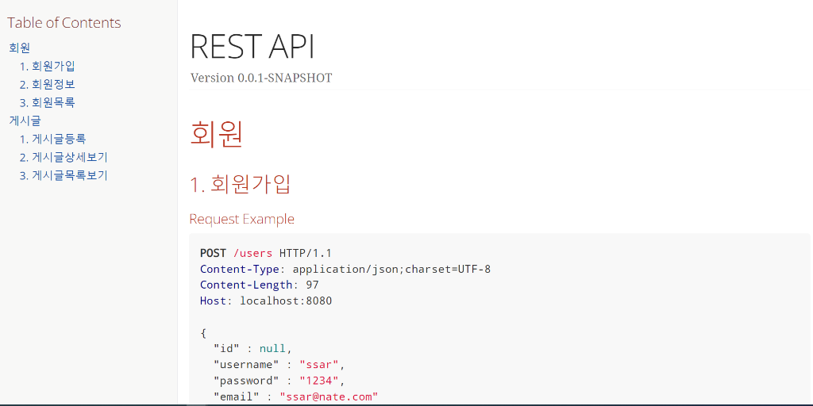
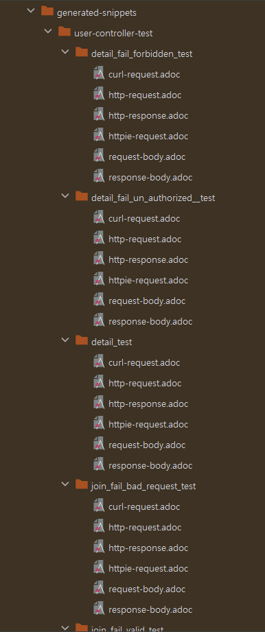
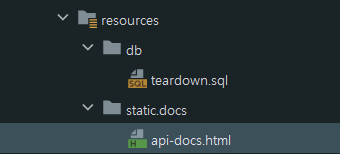

# CH31 API문서 - RestDoc



## 1. build.gradle 설정

```gralde
plugins {
    ...생략
	id "org.asciidoctor.jvm.convert" version "3.3.2"
}
```
```gralde
dependencies {
	...생략
	testImplementation 'org.springframework.restdocs:spring-restdocs-mockmvc'
}
```
```gralde
ext {
    set('snippetsDir', file("build/generated-snippets"))
}


tasks.named('test') {
    outputs.dir snippetsDir
    useJUnitPlatform()
}

tasks.named('asciidoctor') {
    inputs.dir snippetsDir
    dependsOn test
}

bootJar {
    dependsOn asciidoctor
    copy {
        // src/docs/asciidoc == from 경로
        from "${asciidoctor.outputDir}"
        into 'src/main/resources/static/docs'    // /static/docs로 복사!
    }
}
```

## 2. 추상 테스트 클래스 작성

- test/java/shop/mtcoding/resstend/core/MyWithRestDoc.java

```java
@ExtendWith({ SpringExtension.class, RestDocumentationExtension.class })
public class MyWithRestDoc {
    protected MockMvc mockMvc;
    protected RestDocumentationResultHandler document;

    @BeforeEach
    private void setup(WebApplicationContext webApplicationContext,
                       RestDocumentationContextProvider restDocumentation) {
        this.document = MockMvcRestDocumentation.document("{class-name}/{method-name}",
                Preprocessors.preprocessRequest(Preprocessors.prettyPrint()),
                Preprocessors.preprocessResponse(Preprocessors.prettyPrint()));

        mockMvc = MockMvcBuilders.webAppContextSetup(webApplicationContext)
                .addFilter(new CharacterEncodingFilter(StandardCharsets.UTF_8.name(), true))
                .apply(MockMvcRestDocumentation.documentationConfiguration(restDocumentation))
                // .apply(SecurityMockMvcConfigurers.springSecurity())
                .alwaysDo(document)
                .build();
    }
}
```

## 3. ControllerTest 파일 작성
- MyWithRestDoc 파일을 상속해서 사용
- mockMvc와 document를 부모에게 물려받아서 사용
- AbstractControllerTest 파일에서 adoc파일 생성 위치를 자동화함.
- 시큐리티 환경이 필요하면 apply() 메서드 주석 해제하면 됨.

## 4. api-docs.adoc 파일생성


- src/docs/asciidoc 폴더가 디폴트 경로임
- 해당 폴더에서 (아무이름).adoc 파일생성
- 난 api-docs.adoc으로 생성함.
- 여기에서 build/generated-snippets/ 내부에 만들어지는 adoc 파일들을 html 파일로 변환하기 위한 코드를 작성함.

## 5. 직접 테스트를 한번 하기



- @Test로 테스트를 하면 generated-snippets/ 내부에 adoc 파일생성됨.

## 6. 빌드하기

```
./gradlew clean build
```

빌드를 합니다.



html파일이 src/main/resources/static/docs 내부에 생성됩니다.

빌드시에 clean을 사용해야합니다. 왜냐하면 build폴더가 삭제되었다가 다시 생성되기 때문입니다.