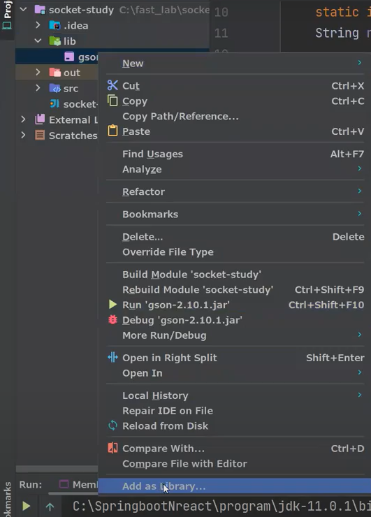

# CH04 MIME 타입

## 1. MIME 타입이란
> **MIME 타입**이란 클라이언트에게 전송된 문서의 다양성을 알려주기 위한 메커니즘입니다. 웹에서 파일의 확장자는 별 의미가 없습니다. 그러므로, 각 문서와 함께 올바른 MIME 타입을 전송하도록, 서버가 정확히 설정하는 것이 중요합니다. 브라우저들은 리소스를 내려받았을 때 해야 할 기본 동작이 무엇인지를 결정하기 위해 대게 MIME 타입을 사용합니다.

- main type/sub type
  - image/jpeg
  - application/json


https://developer.mozilla.org/ko/docs/Web/HTTP/Basics_of_HTTP/MIME_types/Common_types

## 2. 중간 언어 이해

> JavaScript Object Notation (JSON)은 Javascript 객체 문법으로 구조화된 데이터를 표현하기 위한 문자 기반의 표준 포맷입니다. 웹 어플리케이션에서 데이터를 전송할 때 일반적으로 사용합니다(서버에서 클라이언트로 데이터를 전송하여 표현하려거나 반대의 경우)


만약 중간언어가 없다면, 자바의 코드를 압축해서 파이썬으로 보낸다면 파이썬은 절대로 이해하지 하지 못합니다.


예를 들어, 영어와 같이 중간언어 없이 소통을 한다면 계속해서 다른 국적의 사람과 대화를 하고 싶으면 그 나라의 언어를 공부해야 합니다. 매우 비효율적입니다.

하지만 영어라는 중간언어를 사용하면 모든 국적의 사람과 대화를 할 수 있게 됩니다. 단, 조건은 영어를 알아야 합니다.


똑같은 원리로 Java Object를 중간언어인 json 으로 변경하고 전송하면, JavaScript는 json을 JavaScript Object로 바꿔서 읽기만 하면됩니다. 반대로 보내는 경우도 마찬가지 입니다.

만약 Java와 Java의 경우라도 예외는 없습니다. 규율이 절대로 깨지면 안됩니다.

### (1) 중간언어 종류 <javascript, class, json, xml, yaml>

- javascript
```javascript
let transaction = {
    id:6,
    gubun:"입금",
    sender:"ATM",
    reciver:1111,
    amount:100,
    createdAt:"2023-01-08 12:13:40"
}
```

- java
```java
public class Transaction {
    Long id=6;
    String gubun="입금";
    String sender="ATM";
    String reciver=1111;
    Long amount=100;
    String createdAt="2023-01-08 12:13:40";
}
```
- json
```json
{
    "id":6,
    "gubun":"입금",
    "sender":"ATM",
    "reciver":1111,
    "amount":100,
    "createdAt":"2023-01-08 12:13:40"
}
```
- xml
  - markup language
```xml
<transaction>
    <id>6</id>
    <gubun>입금</gubun>
    <sender>ATM</sender>
    <reciver>1111</reciver>
    <amount>100</amount>
    <createdAt>2023-01-08 12:13:40</createdAt>
</transaction>
```
- yaml
```yaml
id: 6
gubun: 입금
sender: ATM
reciver: 1111
amount: 100
createdAt: 2023-01-08 12:13:40
```

- 가장 가벼운 언어: yaml
- 가장 많이 사용하는 언어(표쥰): json

## 3. GSON 라이브러리 실습
> GSON은 Google에서 개발한 Java용 JSON(JavaScript Object Notation) 라이브러리입니다. GSON은 Java 객체와 JSON 데이터 간의 변환을 쉽게 처리할 수 있도록 도와줍니다.
>
> JSON은 경량의 데이터 교환 형식으로, 사람과 기계 모두 이해하기 쉬운 텍스트 기반 형식입니다. Java에서 JSON 데이터를 처리하려면 일반적으로 문자열로 된 JSON 데이터를 Java 객체로 변환하거나, Java 객체를 JSON 문자열로 변환해야 합니다. 이러한 변환 작업을 수행하기 위해 GSON 라이브러리를 사용할 수 있습니다.


### (1) 라이브러리 다운로드

https://mvnrepository.com/artifact/com.google.code.gson/gson/2.10.1

- jar 다운로드
- 라이브러리 등록하는 방법
  - lib 라는 directory 생성 (project 내부에)
  - jar 파일을 lib 복사
  - Add as library
  - 등록(ok)
  


### (2) 블로그 라이브러리 다운로드

https://blog.naver.com/getinthere/223009231524

### (3) 소스코드

https://github.com/codingspecialist/socket-study.git

### (4) 실습 코드

- lombok 사용가능 

```java
package parser;

public class Transaction {
    private int id;
    private String gubun;
    private String sender;
    private String receiver;
    private int amount;

    public Transaction(int id, String gubun, String sender, String receiver, int amount) {
        this.id = id;
        this.gubun = gubun;
        this.sender = sender;
        this.receiver = receiver;
        this.amount = amount;
    }

    public int getId() {
        return id;
    }
    public void setId(int id) {
        this.id = id;
    }

    public String getGubun() {
        return gubun;
    }
    public void setGubun(String gubun) {
        this.gubun = gubun;
    }

    public String getSender() {
        return sender;
    }
    public void setSender(String sender) {
        this.sender = sender;
    }

    public String getReciver() {
        return receiver;
    }
    public void setReceiver(String receiver) {
        this.receiver = receiver;
    }

    public int getAmount() {
        return amount;
    }
    public void setAmount(int amount) {
        this.amount = amount;
    }
}
```

```java
package parser;

import com.google.gson.Gson;

public class ObjectParseApp {
    public static void main(String[] args) {
        String json = "{\"id\":6,\"gubun\":\"입금\",\"sender\":\"ATM\",\"receiver\":\"1111\",\"amount\":100}";
        Gson gson = new Gson();
        Transaction transaction = gson.fromJson(json, Transaction.class);
        System.out.println("id : " + transaction.getId());
        System.out.println("gubun : " + transaction.getGubun());
        System.out.println("sender : " + transaction.getSender());
        System.out.println("receiver : " + transaction.getReciver());
        System.out.println("amount : " + transaction.getAmount());
    }
}
```


```java
package parser;

import com.google.gson.Gson;

public class JasonParseApp {
    public static void main(String[] args) {
        Transaction transaction = new Transaction(6, "입금", "ATM", "1111", 100);
        // MIME 타입중에 하나를 보내야 함. application/json
        Gson gson = new Gson();
        String json = gson.toJson(transaction);
        System.out.println(json);
    }
}
```


## 4. 반이중 통신으로 인터페이스에 맞게 데이터 전달하고 받기

- 멀티쓰레드 프로세스
- 반이중 구현
- msg -> application/json
- msg -> application/x-www-form-urlencoded
- msg-> text/html
- msg -> text/plain

```json
class Data {
    private String title;
    private String content;
}
```

> 요청에 따라, 파싱하여 응답하는 소켓 서버를 구현하라. 반이중으로 구현하고, 멀티쓰레드 프로세스가 되어야 한다.

### (1) 소스코드

https://github.com/codingspecialist/socket-study.git

### (2) MIME server

```java
package mimeserver.model;

public class Data {
    private String title;
    private String content;

    public Data(String title, String content) {
        this.title = title;
        this.content = content;
    }

    public String getTitle() {
        return title;
    }

    public void setTitle(String title) {
        this.title = title;
    }

    public String getContent() {
        return content;
    }

    public void setContent(String content) {
        this.content = content;
    }
}
```

```java
package mimeserver;

/**
 * public static final 생략
 */
public interface MimeType {
    String APPLICATION_JASON = "application/json"; // {"title":"제목", "content":"내용"}
    String TEXT_HTML = "text/html"; // <html>title : 제목 <br/> content : 내용</html>
    String FORM_URLENCODED = "application/x-www-form-urlencoded"; // title=제목&content=내용
}
```

```java
package mimeserver;

import java.io.BufferedReader;
import java.io.InputStreamReader;
import java.io.PrintWriter;
import java.net.Socket;
import java.util.Scanner;

public class MyClient1 {

    // GET 요청 (자원을 주세요 의미)
    public MyClient1() throws Exception{
        // 1. 서버 연결
        Socket socket = new Socket("localhost", 10000);

        // 2. 키보드 연결
        Scanner sc = new Scanner(System.in);
        String requestData = sc.nextLine(); // 대기

        // 3. 클라이언트가 요청함 (xml, html) - 두가지
        PrintWriter request = new PrintWriter(socket.getOutputStream(), true);
        request.println(requestData);

        // 4. 클라이언트가 응답을 받음 (반이중)
        BufferedReader response = new BufferedReader(new InputStreamReader(socket.getInputStream(), "utf-8"));
        String msg = response.readLine(); // 버퍼에 \n까지 읽음
        System.out.println("서버에게서 응답이 왔습니다 : "+msg);
    }

    public static void main(String[] args) {
        try {
            new MyClient1();
        } catch (Exception e) {
            throw new RuntimeException(e);
        }
    }
}
```

```java
package mimeserver;

import java.io.BufferedReader;
import java.io.InputStreamReader;
import java.io.PrintWriter;
import java.net.Socket;
import java.util.Scanner;

public class MyClient2 {

    // GET 요청 (자원을 주세요 의미)
    public MyClient2() throws Exception{
        // 1. 서버 연결
        Socket socket = new Socket("localhost", 10000);

        // 2. 키보드 연결
        Scanner sc = new Scanner(System.in);
        String requestData = sc.nextLine();// 대기

        // 3. 클라이언트가 요청함 (xml, html) - 두가지
        PrintWriter request = new PrintWriter(socket.getOutputStream(), true);
        request.println(requestData);

        // 4. 클라이언트가 응답을 받음 (반이중)
        BufferedReader response = new BufferedReader(new InputStreamReader(socket.getInputStream(), "utf-8"));
        String msg = response.readLine(); // 버퍼에 \n까지 읽음
        System.out.println("서버에게서 응답이 왔습니다 : "+msg);
    }

    public static void main(String[] args) {
        try {
            new MyClient2();
        } catch (Exception e) {
            throw new RuntimeException(e);
        }
    }
}
```

```java
package mimeserver;

import com.google.gson.Gson;
import mimeserver.model.Data;

import java.io.BufferedReader;
import java.io.InputStreamReader;
import java.io.PrintWriter;
import java.net.ServerSocket;
import java.net.Socket;

public class MyServer {

    public MyServer() throws Exception {
        // 1. 서버 대기중
        ServerSocket serverSocket = new ServerSocket(10000);

        while (true) { // 데몬 스레드로 변경
            Socket socket = serverSocket.accept(); // 1번 메인 쓰레드 대기 4번 메인 쓰레다가 여기서 대기
            System.out.println("클라이언트가 연결되었습니다."); // 2번 출력

            new Thread(() -> { // 3번 새로운 스레드 실행  5번 새로운 쓰레드 실행
                try {
                    // 2. 서버 요청 받음
                    BufferedReader request = new BufferedReader(new InputStreamReader(socket.getInputStream(), "utf-8"));
                    String mimeType = request.readLine(); // 클라이언트가 BW, 서버가 BR
                    String responseData = parser(mimeType); // 분석하는 메소드

                    // 3. 테스트를 위해 10초 대기
                    Thread.sleep(10000);

                    // 4. 서버응답 (반이중)
                    PrintWriter response = new PrintWriter(socket.getOutputStream(), true);
                    response.println(responseData);
                    System.out.println("클라이언트에게 응답합니다.");
                    System.out.println("=================================================");
                } catch (Exception e) {
                    e.printStackTrace();
                }

            }).start();
        }
    }

    private String parser(String mimeType) {
        Data data = new Data("SocketStudy", "portAndIp");
        if (mimeType.equals(MimeType.TEXT_HTML)) {
            return  "<body>title : "+data.getTitle()+" <br/> content : "+data.getContent()+"</body>";
        } else if (mimeType.equals(MimeType.FORM_URLENCODED)) {
            return "title="+data.getTitle()+"&content="+data.getContent();
        } else if (mimeType.equals(MimeType.APPLICATION_JASON)) {
            Gson gson = new Gson();
            return gson.toJson(data);
        }
        return "badRequest";
    }

    public static void main(String[] args) {
        try {
            new MyServer();
        } catch (Exception e) {
            throw new RuntimeException();
        }
    }
}
```


## 5. 마인드 맵

