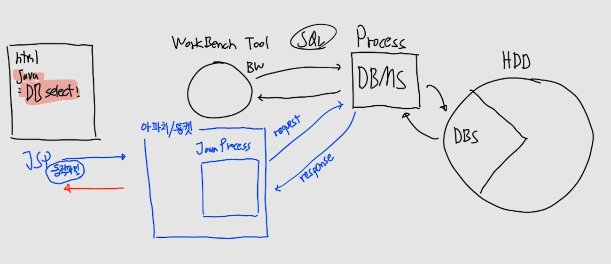
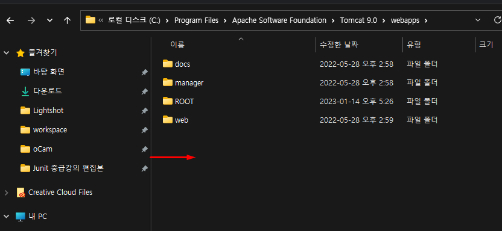

# CH05 웹서버

## 1. 서버

> 서버는 '제공한다'는 뜻을 가진 'serve'에 사람이라는 뜻을 나타내는 'er'을 붙인 단어이다. 위의 사전의 뜻을 보면 공통적으로 뭔가를 제공한다는 것을 알 수 있다. 컴퓨터에서는 서버는 클라이언트에게 여러 가지 서비스를 제공하는 것을 뜻한다.

통신을 하지 않는 서버도 있다. 단지 서버는 자원을 가지고 있고, 그것을 어떠한 방법으로든 공유할 수 있으면 됩니다. 하지만 웹 서버는 규약을 가진 HTTP 통신을 통해 자원을 공유하고, 그에 따른 규약을 가집니다.

## 2. 논문 공유


- CERN 입자물리 연구소 - 전세계 과학자들이 연구하고 논문을 쓰는 곳

- 조건 3가지
  - **논문 작성 방법에 대한 일관성** 필요 (종이, 프로그램등등..)
  - **논문을 읽는 공통된 프로그램 필요**
  - **전 세계 흩어져 있는 논문을 쉽게 공유**할 수 있는 방법이 필요
- WWW 프로젝트 시작

## 3. HTML

> [HTML](https://developer.mozilla.org/ko/docs/Glossary/HTML) (Hypertext Markup Language,하이퍼텍스트 마크업 언어)는 프로그래밍 언어는 아니고, 우리가 보는 웹페이지가 어떻게 구조화되어 있는지 브라우저로 하여금 알 수 있도록 하는 마크업 언어입니다. 이는 개발자로 하여금 복잡하게도 간단하게도 프로그래밍 할 수 있습니다. HTML은 [elements](https://developer.mozilla.org/ko/docs/Glossary/Element)로 구성되어 있으며, 이들은 적절한 방법으로 나타내고 실행하기 위해 각 컨텐츠의 여러 부분들을 감싸고 마크업 합니다.

HTML의 탄생으로 **논문 작성 방법에 대한 일관성** 생겼습니다.


- Hypertext  - a 태그를 통해 문서를 읽으면서 참고 자료를 확인할 수 있습니다.
- Markup Language - 문자 앞 뒤로 마크를 하여 감싸는 언어, 즉 문자의 특징을 표시하는 언어입니다.

## 4. 웹 브라우저

> 브라우저란 웹 페이지, 이미지, 비디오 등의 콘텐츠를 수신, 전송 및 표현하는 소프트웨어다.

브라우저의 탄생으로 HTML로 작성된 문서를 표현(해석 or 렌더링)할 수 있게 됩니다. 

웹 브라우저를 통해서 **논문을 읽는 공통된 프로그램**을 해결했습니다.


## 5. URL

> URL(Uniform Resource Locator)이란 사용자가 원하는 정보의 위치와 종류를 파악할 수 있도록 웹페이지의 정보 구조를 반영한 것이다.

URL의 탄생으로 서버가 들고 있는 자원을 외부에 노출시킬 수 있는 표기법을 발견했습니다. 즉, 자윈의 위치를 알려주는 것입니다.


- protocol
- ip 주소
- prot
- folder 명
  - 특정 폴더만 web server로 만들수 있음
- web page

예시
- http://12.34.56.78:10000/a.html
- http://12.34.56.78:10000/user/b.html

## 6. HTTP(Hyper Text Transfer Protocol)

> HTML파일을 가진 웹서버 컴퓨터가 어떻게 HTML을 필요로 하는 클라이언트에게 정보를 전달할 것인가에 대한 형식과 방법에 대해 정의되어 있다.

HTML을 송수신하는 규약을 만들고(HTTP), 해당 규약을 바탕으로 HTML 파일을 공유할 수 있게 되었다. 즉, HTML을 전송하는 규약입니다.

HTTP 와 URL을 통해 전 세계 흩어져 있는 논문을 쉽게 공유할 수 있습니다.


- 예시 (Get 요청, 단순한 프로토콜)
  - http://12.34.56.78:10000/user/b.html
  - /user/b.html
  - C:/webapp/user/b.html 경로로 찾기
  - 해당 파일 찾기
  - 버퍼로 b.html의 내용 read
  - 읽은 내용 버퍼로 write 응답

### (1) 최초의 HTTP 프로토콜

> 웹서버는 수동적인 애플리케이션이다.

일단 웹서버가 되기위한 조건은 3가지가 있습니다.
- 데몬: while
- 멀티스레드: 다수의 요청을 받기 위해서
- 가만히 있기(= 수동적): client가 요청을 하기 때문에

웹서버는 갑이라는 뜻!! (자원을 가지고 공유할 준비를 하고 있다)

> 클라이언트는 필요로 하는 자원이 있을 때, URL 요청을 통해 웹서버에게 HTML 파일을 요청한다.
> 이것을 GET 요청이라고 한다.

### (2) 프로토콜 정리

 - 클라이언트는 서버의 서버소켓에게 연결을 요청한 뒤, 서버소켓은 새로운 소켓을 만들고 클라이언트와 연결된다. 클라이언트는 BufferedWriter를 생성한 뒤, 요청에 내용을 웹서버에게 전송한다(URL이 담긴다). 이를 요청(Request)이라고 하고 URL을 사용한다.
 - 웹서버는 BufferedReader를 생성한 뒤, 요청에 대한 내용을 읽는다. 이때, URL을 파싱(분석)한다.
 - 분석된 URL을 바탕으로 HTML 자원을 찾는다.
 - 찾은 HTML 파일의 내용을 파일에 연결된 소켓에 BufferedReader를 달고 읽어드린다.
 - 읽어드린 HTML 파일을 클라이언트쪽에 연결된 BufferedWriter에 담는다.
 - 최종적으로 flush하여 클라이언트에게 전송한다. 이를 응답(Response)이라고 한다.
 - 정보가 응답되면 더 이상 소켓을 유지할 필요가 없기 때문에 소켓을 닫는다.

따라서 서버는 수동적이기 때문에 **Request**를 받아야 **Response**를 합니다.

### (3) stateless 무상태 서버
> 클라이언트는 다시 자원 요청이 필요하면 새로운 GET요청(Request)을 해야 한다. 그 이유는 웹서버로부터 정보를 응답받은 뒤 소켓이 유지되지 않기 때문이다. 이렇게 클라이언트의 상태를 저장하지 않는 서버를 stateless 무상태 서버라고 한다.


stateless 의 반대는 stateful 서버입니다. 해당 서버는 상태를 기업합니다.

## 7. 아파치/톰켓


### (1) 아파치 웹서버

> 아파치는 웹서버이다. 단순히 브라우저가 이해할 수 있는 파일을  HTTP 프로토콜을 통해 공유하는 소프트웨어이다. 특정 폴더를 웹서버로 만듭니다. 

만약 브라우저에게 이해할 수 없는 파일을 준다면, 읽을 수 없기 때문에 다운로드가 됩니다.

### (2) HTTP 프로토콜 종류

현재의 HTTP 프로토콜은 GET 요청만 있지 않다.

- GET (SELECT)
- POST (INSERT)
- PUT (UPDATE)
- DELETE (DELETE)

### (3) 톰켓 웹 애플리케이션 서버(Web Application Server, WAS)

- html 파일은 정적인 파일이다. 100번을 요청해도 동일한 결과를 응답한다.
- html 코드에 Java 언어를 섞어 만든 파일을 JSP(Java Server Page)라고 한다.
- 클라이언트는 웹 브라우저를 통해 웹서버에게 JSP 파일을 요청할 수 있다.


- html 경우
  - Apache는 특정 폴더를 웹서버로 만듭니다.
  - 브라우저가 a.html 파일을 요청하면 웹서버 폴더에서 a.html파일을 찾고 내용을 응답합니다.

- jsp 경우
  - c.jsp요청
  - jsp는 java + html, 톰캣으로 보냄
  - 톰캣에서 java만 compile 실행, 순수 html로 변경
  - Apache에게 응답
  - c.html 내용을 브라우저에게 전송 

### (4) 동적인 JSP

JSP는 동적인 파일이기 때문에, DB로 적혀있어도 가능하다.



- JSP 내부에 Java 코드르 SELECT가 들어가있는 경우
- Apache/Tomcat을 통해 DBMS와 통신
- DBMS는 DBS와 commit, load

#### 동적파일의 장점

정적파일이면 500개, 동적파일이면 1개로 해결이 가능하다.


- 논문500개 존재
- 정적파일인 경우: 1 ~ 500 .html 존재
- 동적파일인 경우: 1개의 .jsp 파일
  - Tomcat을 통해 DB내용으로 commit과 load

## 8. 아파치 톰켓 실습

### (1) 아파치 실습

[아파치설치](./설치-아파치설치방법.pdf)

> 해당 실습은 보기만 합니다.


### (2) 아파치/톰켓 실습

[톰켓설치](./설치-톰켓설치방법.pdf)


- PORT 변경
  - conf/server.xml
  - 8080 -> 10000
  - 톰캣 재시작


- WelcomeFileList 변경
  - conf/web.xml
  - 변경 후 톰갯 재시작
  - localhost:10000 (파일명 삭제)
  


- ThreadPool 변경
  - conf/server.xml
  - maxThreads, minSpareThreads 
  - 직접 컴퓨터를 늘리는 것보다, AWS에서 빌려오는게 훨씬 효율적입니다. 따라서 얼만큼 빌려와야하는지 알려면 우리가 필요한 threads의 개수를 알아야합니다.


- HTTP 프로토콜  버전 확인
  - conf/server.xml


- HTTPS 서버 설정 (RSA) 확인
  - conf/server.xml


- unpackWARs 와 autoDeploy 확인 
  - conf/server.xml
  - myapp-1.0.war 파일을 appBase에 복사
  - 시간지나면 같은 경로에 myapp-1.0 폴더 자동 생성
    - unpackWARs true이기 때문에 자동 배포가 된 것

- Host appBase 확인 
  - conf/server.xml

### (3) war 파일 배포해보기

#### 1. server.xml 에 Context docbase 설정

conf/server.xml

```xml
<Host name="localhost"  appBase="webapps" unpackWARs="true" autoDeploy="true">
    <Context docBase="myapp-1.0" path="/" reloadable="true" />
</Host>
```

- localhost:10000/my 는 docBase 폴더(myapp-1.0)까지 진입
- context path를 노출시키지 않는 것이 좋습니다.

#### 2. myapp-1.0.war 파일 배포

> myapp-1.0.war 파일을 아파치/톰켓을 start한 상태에서 webapps 폴더에 배포해보자. (복사 붙여넣기)



#### 3. 브라우저로 요청해보기

- 실습 1. server/xml의 context path를 바꾸기
  - localhost:10000/my/user
  - localhost:10000/my/board

- 실습 2. Port: 10000


#### 4. 그림으로 이해하기


## 9. 마인드 맵

