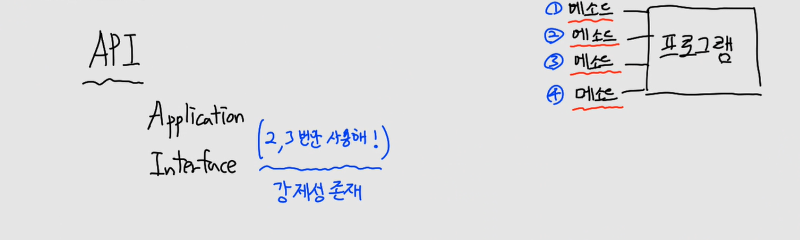
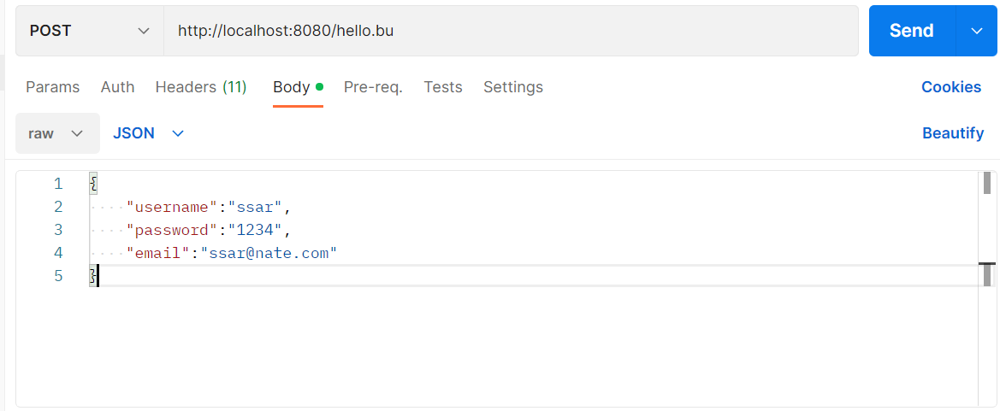
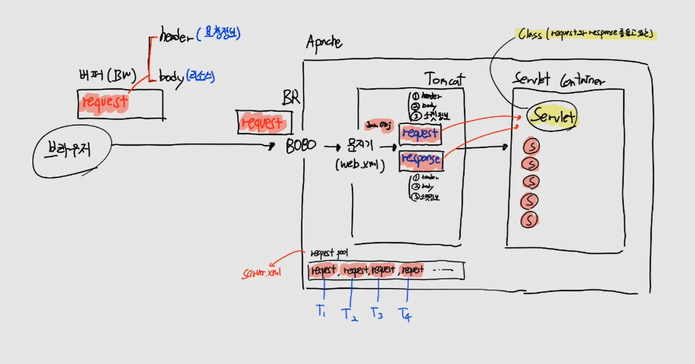
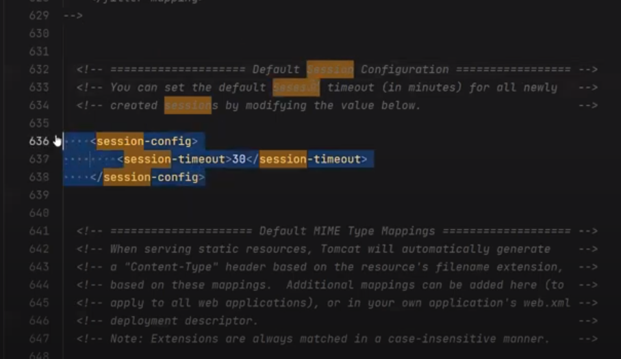

# CH06 서블릿 기본

## 1. POSTMAN 설치

> 포스트맨은 개발자들이 API를 디자인하고 빌드하고 테스트하고 반복하기 위한 API 플랫폼이다.

https://www.postman.com/downloads/


## 2. Fake API

> Free fake API for testing and prototyping.

https://jsonplaceholder.typicode.com/

- JSON viwer

https://chrome.google.com/webstore/detail/json-viewer/gbmdgpbipfallnflgajpaliibnhdgobh?hl=ko

### (1) Resources


- 하이퍼링크를 클릭하면서 연관관계 이해

### (2) Host

```
https://jsonplaceholder.typicode.com
```

- webapp 폴더까지 접근

### (3) Endpoint

- webapp 도착 후, 정확한 자원 찾기

```
GET	/posts
GET	/posts/1
GET	/posts/1/comments
GET	/comments?postId=1 -> DB WHERE 절
POST /posts
PUT	/posts/1
DELETE	/posts/1
```
- Get: 하이퍼링크, 주소창에 입력 후 엔터
  - SELECT (DB)
- Post: PostMan 테스트
  - UPDATE (DB)


만약 endpoint에 숫자가 나오면 Primary Key를 의미합니다. 

- QueryString: ? 존재 O
- form-Urlencoded: ? 존재 X

#### 예시

- /comments?postId=1&title=스프링
  - SELECT * FROM comment WHERE postId = 1 AND title = '스프링'

### (4) URL

host + endpoint -> URL

```
url: https://jsonplaceholder.typicode.com/posts

protocol: https://
domain or ip 주소: jsonplaceholder.typicode.com
```

### (5) API

> 해당 부분 처리 필요


#### API

API는 Application Interface의 약자이기 때문에, 강제성이 존재합니다. 

만약 프로그램에 4개의 메소드가 있다면, 2 ~ 3번만 사용하도록 만들 수 있는 것입니다.



#### API가 필요한 이유


- API가 존재하지 않으면
  - client가 직접 DB에 접근해서 위험
  - client는 SQL을 알아야하는 번거로움

이것을 보완하기 위해서 API가 존재합니다. API가 대신 client의 요청을 받아 DB에 접근합니다. 

- API 요청(HTTP 메소드 4가지)
  - GET
  - POST
  - PUT
  - DELETE


API를 통해서 프로그램을 만들면, API 문서가 만들어지게 됩니다. API 문서가 나온 이후로는 수정이 불가능합니다.

> client는 어떤 화면이 필요할까?
GUI 화면, 버튼이 필요합니다. 규칙 기반 프로그램이라고 합니다.


#### API 명세서 예시

API 명세서에 맞게 Postman 으로 보내봅시다.


### (6) 요청 상세 가이드

https://jsonplaceholder.typicode.com/guide/

## 3. 서블릿 이론

> 자바 서블릿은 자바를 사용하여 웹페이지를 동적으로 생성하는 서버측 프로그램 혹은 그 사양을 말하며, 흔히 "서블릿"이라 불린다. 자바 서블릿은 웹 서버의 성능을 향상하기 위해 사용되는 자바 클래스의 일종이다.

### (1) 버퍼 내용


### (2) 아파치/톰켓

> 아파치 톰켓은 서블릿 자바 클래스 파일에 요청 정보를 파싱해서 넘겨준다.


## 4. DynamicWebProject 세팅

https://getinthere.notion.site/J-Dynamic-WebProject-ec8b19067a5746c3886f35a0c3bfdb54

## 5. 서블릿
> 서블릿(Servlet)은 Java 언어를 사용하여 웹 애플리케이션을 개발하는 데에 사용되는 서버 측 프로그램입니다. 서블릿은 클라이언트의 요청에 대해 동적으로 처리하고, 그 결과를 다시 클라이언트에게 응답으로 전송합니다.
>
> 서블릿은 웹 서버에서 동작하며, Java Servlet API를 통해 제공됩니다. 주로 웹 애플리케이션 서버(예: Apache Tomcat, Jetty)와 함께 사용되어 웹 요청과 응답을 처리합니다.

### (1) 소스코드

https://github.com/codingspecialist/web1

### (2) web.xml 재정의

> 웹 애플리케이션의 배포 설명자는 애플리케이션의 클래스, 리소스, 구성 및 웹 서버가 이를 사용해서 웹 요청을 처리하는 방법을 기술합니다. 웹 서버는 애플리케이션에 대한 요청이 수신되면 배포 설명자를 사용하여 요청의 URL을 해당 요청을 처리해야 하는 코드에 매핑합니다.
>
> 쉽게 생각하면 web.xml은 필터이다.


```xml
<?xml version="1.0" encoding="UTF-8"?>
<web-app xmlns="http://xmlns.jcp.org/xml/ns/javaee"
         xmlns:xsi="http://www.w3.org/2001/XMLSchema-instance"
         xsi:schemaLocation="http://xmlns.jcp.org/xml/ns/javaee http://xmlns.jcp.org/xml/ns/javaee/web-app_4_0.xsd"
         version="4.0">
    <welcome-file-list>
        <welcome-file></welcome-file>
    </welcome-file-list>
</web-app>
```
- welcome-file-list 변경
  - index.jsp 추가
  - 재시작 후, 바로 index.jsp 열리는지 확인

web.xml은 재정의 파일입니다. web 서버의 문지기 역할(Filter)을 하고 있기 때문에 재정의를 할 수 밖에 없습니다. 반면에 server.xml은 서버를 만드는 역할을 합니다.


### (3) context-path 변경

> 웹 어플리케이션 서버(Web Application Server) = Tomcat에서 웹상의 어플리케이션들을 구분하기 위한 Path입니다.
>
> 쉽게 생각하면 이클립스에서 프로젝트를 여러개 생성해도 톰캣(WAS)은 하나밖에 없기 때문에 실행할때 프로젝트들을 구분해 줄 필요성이 있습니다. 그럴때를 대비해서 서로간의 프로젝트를 구분시켜 주는 Path를 톰캣(WAS)쪽에 설정해 놓는다고 보면 됩니다.


### (4) WEB-INF 보안폴더

- web -> home.jsp

```jsp
<%@ page contentType="text/html;charset=UTF-8" language="java" %>
<html>
<head>
    <title>Title</title>
</head>
<body>
    <h1>home</h1>
</body>
</html>
```

- WEB-INF -> hello.jsp
  - 외부접근 불가

```jsp
<%@ page contentType="text/html;charset=UTF-8" language="java" %>
<html>
<head>
    <title>Title</title>
</head>
<body>
  <h1>hello</h1>
</body>
</html>
```


## 6. 서블릿 실습 코드


- request 과정 이해
  - 브라우저에서 request(header, body) 생성
  - Tomcat이 받아서 Java Object로 파싱 후, request와 response 생성
    - 각각 header, body, 소켓정보를 가짐
  - Servlet Container의 Servlet에 request, response 제공
    - getter로 다양한 정보 호출 가능

### (1) Step1. MyServletHeader.java

```java
import javax.servlet.ServletException;
import javax.servlet.annotation.WebServlet;
import javax.servlet.http.Cookie;
import javax.servlet.http.HttpServlet;
import javax.servlet.http.HttpServletRequest;
import javax.servlet.http.HttpServletResponse;
import java.io.IOException;
import java.util.Enumeration;

@WebServlet("*.he")
public class MyServletHeader extends HttpServlet {

    @Override
    protected void service(HttpServletRequest req, HttpServletResponse resp) throws ServletException, IOException {
        Enumeration<String> names = req.getHeaderNames();
        while (names.hasMoreElements()){
            String headerName = names.nextElement();
            System.out.println(headerName);
        }
    }
}
```

- http://localhost:8080/hello.he
- http://localhost:8080/springking.he
- Tomcat Catalina Log
  - HTTP header data

```
host
accept
upgrade-insecure-requests
cookie
user-agent
accept-language
accept-encoding
connection
```

### (2) Step2. MyServletHeader.java (코드 추가)

```java
import javax.servlet.ServletException;
import javax.servlet.annotation.WebServlet;
import javax.servlet.http.Cookie;
import javax.servlet.http.HttpServlet;
import javax.servlet.http.HttpServletRequest;
import javax.servlet.http.HttpServletResponse;
import java.io.IOException;
import java.util.Enumeration;

@WebServlet("*.he")
public class MyServletHeader extends HttpServlet {

    @Override
    protected void service(HttpServletRequest req, HttpServletResponse resp) throws ServletException, IOException {
        Enumeration<String> names = req.getHeaderNames();
        while (names.hasMoreElements()){
            String headerName = names.nextElement();
            String value = req.getHeader(headerName);
            System.out.println(headerName+" : "+value);
        }
    }
}
```

- http://localhost:8080/hello.he
- Tomcat Catalina Log
  - HTTP header data
```
host : localhost:8080
connection : keep-alive
sec-ch-ua : "Not_A Brand";v="99", "Google Chrome";v="109", "Chromium";v="109"
sec-ch-ua-mobile : ?0
sec-ch-ua-platform : "Windows"
upgrade-insecure-requests : 1
user-agent : Mozilla/5.0 (Windows NT 10.0; Win64; x64) AppleWebKit/537.36 (KHTML, like Gecko) Chrome/109.0.0.0 Safari/537.36
accept : text/html,application/xhtml+xml,application/xml;q=0.9,image/avif,image/webp,image/apng,*/*;q=0.8,application/signed-exchange;v=b3;q=0.9
sec-fetch-site : none
sec-fetch-mode : navigate
sec-fetch-user : ?1
sec-fetch-dest : document
accept-encoding : gzip, deflate, br
accept-language : en-US,en;q=0.9,ko;q=0.8
cookie : JSESSIONID=A55D8A16BCA7EFD46694CC9EDD1D7602
```
- browser -> F12


### (3) Step3. MyServlet.java (톰켓이 만들어준 메서드 사용)

```java
import javax.servlet.ServletException;
import javax.servlet.annotation.WebServlet;
import javax.servlet.http.Cookie;
import javax.servlet.http.HttpServlet;
import javax.servlet.http.HttpServletRequest;
import javax.servlet.http.HttpServletResponse;
import java.io.IOException;

@WebServlet("*.do")
public class MyServlet extends HttpServlet {

    @Override
    protected void service(HttpServletRequest req, HttpServletResponse resp) throws ServletException, IOException {
        System.out.println("request 요청됨");
        System.out.println("getRequestURI : " + req.getRequestURI());
        System.out.println("getContextPath : "+req.getContextPath());
        System.out.println("getMethod : "+req.getMethod());
        System.out.println("getRequestURL : "+req.getRequestURL());
        System.out.println("getQueryString : "+req.getQueryString());
        System.out.println("getParameter : "+req.getParameter("username"));
        System.out.println("getSession().getId() : "+req.getSession().getId());
        System.out.println("getCharacterEncoding : "+req.getCharacterEncoding());
        System.out.println("getContentLength : "+req.getContentLength());
        System.out.println("getContentType : "+req.getContentType());
        System.out.println("Cookie Start ==============================");
        for (Cookie cookie : req.getCookies()) {
            System.out.print(cookie.getName()+" = " + cookie.getValue());
            System.out.print(";");
        }
        System.out.println();
        System.out.println("Cookie End ==============================");
        System.out.println("getProtocol : "+req.getProtocol());
        System.out.println("getServerPort : "+req.getServerPort());
        System.out.println("getLocalAddr(서버 IP) : "+req.getLocalAddr());
        System.out.println("getLocalName(서버 이름) : "+req.getLocalName());
        System.out.println("getRemoteAddr(요청자 IP) : "+req.getRemoteAddr());
        System.out.println("getRemoteUser(요청자 이름) : "+req.getRemoteUser());
        System.out.println("getRemotePort(요청자 포트) : "+req.getRemotePort());
        System.out.println("getLocale : "+req.getLocale());
    }
}
```

- http://localhost:8080/hello.do?username=ssar
- Tomcat Catalina Log
  - HTTP header data

```txt
request 요청됨
getRequestURI : /hello.do
getContextPath : 
getMethod : GET
getRequestURL : http://182.216.27.162:8080/hello.do
getQueryString : username=ssar
getParameter : ssar
getSession().getId() : 1F0D64E2AA6230B3DB1727AE6ED9AABC
getCharacterEncoding : null
getContentLength : -1
getContentType : null
Cookie Start ==============================
JSESSIONID = 1F0D64E2AA6230B3DB1727AE6ED9AABC;
Cookie End ==============================
getProtocol : HTTP/1.1
getServerPort : 8080
getLocalAddr(서버 IP) : 182.216.27.162
getLocalName(서버 이름) : getinthere
getRemoteAddr(요청자 IP) : 211.36.151.69
getRemoteUser(요청자 이름) : null
getRemotePort(요청자 포트) : 43805
getLocale : ko_KR
```

### (4) Step4. MyServletBuffer.java (http body 값 확인해보기)

```java
import javax.servlet.ServletException;
import javax.servlet.annotation.WebServlet;
import javax.servlet.http.HttpServlet;
import javax.servlet.http.HttpServletRequest;
import javax.servlet.http.HttpServletResponse;
import java.io.BufferedReader;
import java.io.IOException;
import java.util.Enumeration;

@WebServlet("*.bu")
public class MyServletBuffer extends HttpServlet {

    @Override
    protected void service(HttpServletRequest req, HttpServletResponse resp) throws ServletException, IOException {
        // PostMan 으로 Post 요청
        // 아파치/톰켓은 TCP에 연결된 소켓으로 정보를 읽어드린다.
        // 읽어 드린 정보를 다시 Servlet.java 파일에 넘겨주는데 크게 두분류로 나뉜다.
        // 1. header 정보, 2. body 정보 (body 정보는 getReader()를 통해서 읽는다.)
        BufferedReader br = req.getReader(); // 이 버퍼는 소켓 버퍼를 읽는게 아니라, 아파치/톰켓이 만든 버퍼에 접근
        StringBuilder sb = new StringBuilder();
        while(true){
            String input = br.readLine();
            if(input == null){
                break;
            }else{
                sb.append(input);
            }
        }
        System.out.println("1. 버퍼에 담긴 http body 데이터");
        System.out.println(sb.toString());
        System.out.println("2. header 정보");
        Enumeration<String> requestHeaderNames = req.getHeaderNames();
        while (requestHeaderNames.hasMoreElements()){
            String headerName = requestHeaderNames.nextElement();
            String value = req.getHeader(headerName);
            System.out.println(headerName+" : "+value);
        }
    }
}

```




- http://localhost:8080/hello.bu
- Tomcat Catalina Log
  - HTTP header data
```
1. 버퍼에 담긴 http body 데이터
{    "username":"ssar",    "password":"1234",    "email":"ssar@nate.com"}
2. header 정보
referer : www.naver.com
user-agent : iam chrome browser
content-type : application/json
accept : */*
cache-control : no-cache
postman-token : 30d4169e-04b6-49b9-af5e-129d98a08fef
host : localhost:8080
accept-encoding : gzip, deflate, br
connection : keep-alive
content-length : 81
```

### (5) Step5. MyServletResponse.java (http body 값 확인해보기)

```java
import javax.servlet.ServletException;
import javax.servlet.annotation.WebServlet;
import javax.servlet.http.HttpServlet;
import javax.servlet.http.HttpServletRequest;
import javax.servlet.http.HttpServletResponse;
import java.io.IOException;
import java.io.PrintWriter;

@WebServlet("*.resp")
public class MyServletResponse extends HttpServlet {

    @Override
    protected void service(HttpServletRequest req, HttpServletResponse resp) throws ServletException, IOException {
        resp.addHeader("metacoding", "youtuber");
        resp.addHeader("Set-Cookie", "password=9999");
        resp.addHeader("Content-Type", "application/x-www-form-urlencoded");
        PrintWriter out = resp.getWriter();
        out.println("username=ssar&email=ssar@nate.com");
    }
}
```
- http://localhost:8080/hello.resp


부라우저는 html만 해석이 가능하고 나머지는 다운로드를 합니다.

### (6) Step6. MyServletResponse.java (Content-Type 변경)

```java
import javax.servlet.ServletException;
import javax.servlet.annotation.WebServlet;
import javax.servlet.http.HttpServlet;
import javax.servlet.http.HttpServletRequest;
import javax.servlet.http.HttpServletResponse;
import java.io.IOException;
import java.io.PrintWriter;

@WebServlet("*.resp")
public class MyServletResponse extends HttpServlet {

    @Override
    protected void service(HttpServletRequest req, HttpServletResponse resp) throws ServletException, IOException {
        resp.addHeader("metacoding", "youtuber");
        resp.addHeader("Set-Cookie", "password=9999");
        resp.addHeader("Content-Type", "text/html");
        PrintWriter out = resp.getWriter();
        out.println("username=ssar&email=ssar@nate.com");
    }
}
```
- http://localhost:8080/hello.resp


- 결과 생각해보기

```java
resp.addHeader("metacoding", "youtuber");
resp.addHeader("Set-Cookie", "password=9999");
resp.addHeader("Content-Type", "text/plain");
PrintWriter out = resp.getWriter();
out.println("<h1>spring king</h1>");
```

### (7) 실습
```
1. MyServletResponse 파일을 수정!!
2. Content-Type 에 들어가는 MIME 타입을 text/html 로 변경
3. out.println()에 담을 response body  데이터에 html 을 작성해서 아래와 같이 출력되게 하시오.
```


## 7. HttpServletRequest, HttpServletResponse
> HttpServletRequest와 HttpServletResponse는 서블릿에서 클라이언트와의 상호작용을 위한 중요한 요소입니다. HttpServletRequest는 클라이언트로부터의 요청 데이터를 읽고 처리하는 데 사용되며, HttpServletResponse는 서버에서 생성된 응답을 클라이언트에게 전송하는 데 사용됩니다. 이 두 인터페이스를 활용하여 클라이언트의 요청에 따라 동적으로 콘텐츠를 생성하고, 적절한 응답을 보낼 수 있습니다.

> [HttpServletRequest PDF](<HttpServletRequest 살펴보기.pdf>)

Tomcat에서 Servlet Container에 Java Object으로 파싱이 된 request와 response를 전달해줍니다. 그리고 Servlet에서 request는 getter를 response는 setter를 사용합니다.

따라서 Servlet은 단 1번만 메모리에 new가 됩니다. 사용자 1명당 1개의 service가 생기는 것 입니다.


> request pool 이 필요한 이유



- request pool은 Apache 내부에 존재
- server.xml에서 설정 가능
- request 많이 준비(사전준비하는 것)
- 톰켓이 request pool에서 request를 가져와 사용할 때 Thread를 연결
- 재사용

## 8. Session
> 세션(Session)은 웹 애플리케이션에서 클라이언트와 서버 간의 상태 정보를 유지하기 위한 메커니즘입니다. 세션은 클라이언트의 요청과 응답을 통해 식별되는 고유한 식별자를 사용하여 데이터를 저장하고 관리합니다.

### (1) 무상태 서버


- 요청시, request body와 header가 존재하지만, 응답을 할 때는 마치 가방의 모든 내용을 삭제하는 것
- 가방의 내용을 삭제한느 이유: request에 많은 내용이 지속되면 부하가 크기 때문에 

### (2) 상태를 기억

세션은 key와 value로 값을 찾기 때문에 HashMap으로 구성되어 있습니다.


- session protocol


### (3) session config

- web.xml
- 은행의 경우 5분



## 9. 마인드 맵

