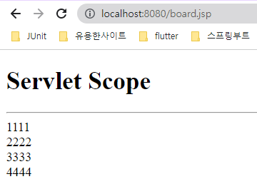

# CH07 서블릿 고급

## 1. JSP 문법 배우기
> JSP(JavaServer Pages)는 동적인 웹 페이지를 생성하기 위한 서버 측 웹 프로그래밍 기술입니다. JSP는 HTML 코드에 Java 코드를 포함하여 웹 페이지를 구성하고, 클라이언트 요청에 따라 동적으로 콘텐츠를 생성합니다.

### (1) 소스코드

https://github.com/codingspecialist/web2.git

### (2) 실습 코드

- web/user.jsp

```jsp
<%@ page import="java.io.PrintWriter" %>
<%@ page contentType="text/html;charset=UTF-8" language="java" %> // jsp page 라는 의미
<!doctype html>
<html lang="en">
<head>
    <meta charset="UTF-8">
    <meta name="viewport"
          content="width=device-width, user-scalable=no, initial-scale=1.0, maximum-scale=1.0, minimum-scale=1.0">
    <meta http-equiv="X-UA-Compatible" content="ie=edge">
    <title>Document</title>
</head>
<body>
    <h1>User 페이지</h1>
    <hr/>
    <%!
       // 선언문, 내부에는 자바코드가 들어간다.
       String getUsername(){
           return "ssar";
       }
    %> 
    <%
        // 스크립트 립, response, request 내장객체
        PrintWriter pw = response.getWriter(); 
        pw.println(getUsername());
    %>
    <h3><%=getUsername()%></h3> // 표현식, 해당자리에 출력
</body>
</html>
```


## 2. JSP -> Servlet 변환 원리

> 개발자는 JSP에서 작업을 하고, 톰켓이 JSP를 Servlet파일로 변환시켜준다.

### (1) 실습 코드

- welcome-file-list: index.jsp
-  web/index.jsp

```java
<%@ page import="java.util.Random" %>
<%@ page contentType="text/html;charset=UTF-8" language="java" %>
<html>
<head>
    <title>Index</title>
</head>
<body>
<h1>Index Page</h1>
<hr/>
<%
    Random r = new Random();
    int num = r.nextInt(5)+1;
%>
<h2>당신의 번호는 : <%=num%></h2>
</body>
</html>

```


- src/MyServlet.java

```java
import javax.servlet.ServletException;
import javax.servlet.annotation.WebServlet;
import javax.servlet.http.HttpServlet;
import javax.servlet.http.HttpServletRequest;
import javax.servlet.http.HttpServletResponse;
import java.io.IOException;
import java.io.PrintWriter;
import java.util.Random;

@WebServlet("*.do")
public class MyServlet extends HttpServlet {

    @Override
    protected void service(HttpServletRequest req, HttpServletResponse resp) throws ServletException, IOException {
        resp.setContentType("text/html; charset=utf-8");
        PrintWriter out = resp.getWriter();

        String html1 = "<html>\n" +
                "<head>\n" +
                "    <title>Index</title>\n" +
                "</head>\n" +
                "<body>\n" +
                "<h1>Index Page</h1>\n" +
                "<hr/>\n";
        out.println(html1);

        // 자바 영역 파싱
        Random r = new Random();
        int num = r.nextInt(5) + 1;

        String html2 = "<h2>당신의 번호는 : ";
        out.println(html2);

        // 자바 영역 파싱
        out.println(num);

        String html3 = "</h2>\n" +
                "</body>\n" +
                "</html>";
        out.println(html3);
    }
}
```


**서블릿**은 Java 코드에 html이 들어간 것입니다. 하지만 html에 Java 코드가 들어간 **JSP**가 훨씬 편합니다.

그래서 서블릿 기술이 나오고 JSP가 나왔습니다.

> .jsp 요청 시, 서블릿 파일변환 과정


## 3. Servlet으로 HTML을 만드는 것은 힘들다


- 소스코드 -> web2/web/css/style/css
- web/airbnb.jsp

```jsp
<%@ page contentType="text/html;charset=UTF-8" language="java" %>
<%
    request.setAttribute("title", "AirBNB HOME");
%>
<!DOCTYPE html>
<html lang="en">

<head>
    <meta charset="UTF-8">
    <meta name="viewport" content="width=device-width, initial-scale=1.0">
    <meta http-equiv="X-UA-Compatible" content="ie=edge">
    <title>${title}</title>
    <link rel="stylesheet" href="/css/style.css">
    <link rel="shortcut icon" sizes="76x76" type="image/x-icon"
          href="https://a0.muscache.com/airbnb/static/logotype_favicon-21cc8e6c6a2cca43f061d2dcabdf6e58.ico">
</head>

<body>

<header>
    <nav>
        <div class="logo">
            <svg viewBox="0 0 1000 1000" role="presentation" aria-hidden="true" focusable="false"
                 style="height: 1em; width: 1em; display: inline-block; fill: currentcolor;">
                <path
                        d="m499.3 736.7c-51-64-81-120.1-91-168.1-10-39-6-70 11-93 18-27 45-40 80-40s62 13 80 40c17 23 21 54 11 93-11 49-41 105-91 168.1zm362.2 43c-7 47-39 86-83 105-85 37-169.1-22-241.1-102 119.1-149.1 141.1-265.1 90-340.2-30-43-73-64-128.1-64-111 0-172.1 94-148.1 203.1 14 59 51 126.1 110 201.1-37 41-72 70-103 88-24 13-47 21-69 23-101 15-180.1-83-144.1-184.1 5-13 15-37 32-74l1-2c55-120.1 122.1-256.1 199.1-407.2l2-5 22-42c17-31 24-45 51-62 13-8 29-12 47-12 36 0 64 21 76 38 6 9 13 21 22 36l21 41 3 6c77 151.1 144.1 287.1 199.1 407.2l1 1 20 46 12 29c9.2 23.1 11.2 46.1 8.2 70.1zm46-90.1c-7-22-19-48-34-79v-1c-71-151.1-137.1-287.1-200.1-409.2l-4-6c-45-92-77-147.1-170.1-147.1-92 0-131.1 64-171.1 147.1l-3 6c-63 122.1-129.1 258.1-200.1 409.2v2l-21 46c-8 19-12 29-13 32-51 140.1 54 263.1 181.1 263.1 1 0 5 0 10-1h14c66-8 134.1-50 203.1-125.1 69 75 137.1 117.1 203.1 125.1h14c5 1 9 1 10 1 127.1.1 232.1-123 181.1-263.1z">
                </path>
            </svg>
        </div>
        <div class="menu">
            <ul>
                <li><a href="#">호스트가 되어보세요</a></li>
                <li><a href="#">도움말</a></li>
                <li><a href="#">회원가입</a></li>
                <li><a href="#">로그인</a></li>
            </ul>
        </div>
    </nav>
    <section>
        <div class="search__box">
            <div class="search__title">특색 있는 숙소와 즐길<br /> 거리를 예약하세요.</div>
            <table>
                <tr>
                    <td colspan="2" class="search__sub__title">목적지</td>
                </tr>
                <tr>
                    <td colspan="2"><input class="search__input" type="text" placeholder=" 모든 위치"></td>
                </tr>
                <tr>
                    <td class="search__sub__title">체크인</td>
                    <td class="search__sub__title">체크아웃</td>
                </tr>
                <tr>
                    <td><input class="search__input"  type="date" /></td>
                    <td><input class="search__input"  type="date" /></td>
                </tr>
                <tr>
                    <td colspan="2" class="search__sub__title">인원</td>
                </tr>
                <tr>
                    <td colspan="2">
                        <select class="search__input" >
                            <option>인원</option>
                        </select>
                    </td>
                </tr>
            </table>
            <div class="search__button"><button>검색</button></div>
        </div>
    </section>
</header>

<main>
    <section>
        <div class="sec__title">
            에어비앤비 둘러보기
        </div>
        <div class="card__box">
            <div class="card">
                <div class="card__img1 card__img"></div>
                <div class="card__content">숙소 및 부티크 호텔</div>
            </div>
            <div class="card">
                <div class="card__img2 card__img"></div>
                <div class="card__content">트립</div>
            </div>
            <div class="card">
                <div class="card__img3 card__img"></div>
                <div class="card__content">어드벤처</div>
            </div>
            <div class="card">
                <div class="card__img4 card__img"></div>
                <div class="card__content">레스토랑</div>
            </div>
        </div>
    </section>

    <section>
        <div class="ad1"></div>
    </section>

    <section>
        <div class="sec__title">추천 여행지</div>
        <div class="choo__box">
            <div class="choo_img1"></div>
            <div class="choo_img2"></div>
            <div class="choo_img3"></div>
            <div class="choo_img4"></div>
            <div class="choo_img5"></div>
        </div>
    </section>

    <section>
        <div class="sec__title2">에어비앤비 플러스를 만나보세요!</div>
        <div class="sec__content">퀄리티와 인테리어 디자인이 검증된 숙소 셀렉션</div>
        <div class="ad2"></div>
    </section>

    <section>
        <div class="sec__title">전 세계 숙소</div>

        <div class="home__box">
            <div class="home">
                <div class="home__img1"></div>
                <div class="home__info">
                    <div class="info1">오두막 · BALIAN BEACH, BALI</div>
                    <div class="info2">BALIAN TREEHOUSE w beautiful pool</div>
                    <div class="info3">
                        <span class="star">★★★★★</span>
                        <span class="count">185</span>
                        <span class="type">슈퍼호스트</span>
                    </div>
                </div>
            </div>

            <div class="home">
                <div class="home__img2"></div>
                <div class="home__info">
                    <div class="info1">키클라데스 주택 · 이아(OIA)</div>
                    <div class="info2">Unique Architecture Cave House</div>
                    <div class="info3">
                        <span class="star">★★★★★</span>
                        <span class="count">188</span>
                        <span class="type">슈퍼호스트</span>
                    </div>
                </div>
            </div>

            <div class="home">
                <div class="home__img3"></div>
                <div class="home__info">
                    <div class="info1">성 · 트웬티나인 팜스(TWENTYNINE PALMS)</div>
                    <div class="info2">Tile House</div>
                    <div class="info3">
                        <span class="star">★★★★★</span>
                        <span class="count">367</span>
                        <span class="type">슈퍼호스트</span>
                    </div>
                </div>
            </div>

            <div class="home">
                <div class="home__img4"></div>
                <div class="home__info">
                    <div class="info1">검증됨 · 케이프타운</div>
                    <div class="info2">Modern, Chic Penthouse with Mountain, City & Sea Views</div>
                    <div class="info3">
                        <span class="star">★★★★★</span>
                        <span class="count">177</span>
                        <span class="type">슈퍼호스트</span>
                    </div>
                </div>
            </div>

            <div class="home">
                <div class="home__img5"></div>
                <div class="home__info">
                    <div class="info1">아파트 전체 · 마드리드(MADRID)</div>
                    <div class="info2">솔광장에 위치한 개인 스튜디오</div>
                    <div class="info3">
                        <span class="star">★★★★★</span>
                        <span class="count">459</span>
                        <span class="type">슈퍼호스트</span>
                    </div>
                </div>
            </div>

            <div class="home">
                <div class="home__img6"></div>
                <div class="home__info">
                    <div class="info1">집 전체 · HUMAC</div>
                    <div class="info2">Vacation house in etno-eco village Humac</div>
                    <div class="info3">
                        <span class="star">★★★★★</span>
                        <span class="count">119</span>
                        <span class="type">슈퍼호스트</span>
                    </div>
                </div>
            </div>

            <div class="home">
                <div class="home__img7"></div>
                <div class="home__info">
                    <div class="info1">개인실 · 마라케시</div>
                    <div class="info2">The Cozy Palace</div>
                    <div class="info3">
                        <span class="star">★★★★★</span>
                        <span class="count">559</span>
                        <span class="type">슈퍼호스트</span>
                    </div>
                </div>
            </div>

            <div class="home">
                <div class="home__img8"></div>
                <div class="home__info">
                    <div class="info1">게스트용 별채 전체 · 로스앤젤레스</div>
                    <div class="info2">Private Pool House with Amazing Views!</div>
                    <div class="info3">
                        <span class="star">★★★★★</span>
                        <span class="count">170</span>
                        <span class="type">슈퍼호스트</span>
                    </div>
                </div>
            </div>
        </div>
    </section>
</main>
</body>

</html>
```

> airbnb.jsp를 서블릿으로 바꾼다면?

## 4. 서블릿 스코프

> 서블릿에서는 필요시 임의의 데이터를 저장하고 나중에 저장된 데이터를 사용할 수 있는 4가지 저장소를 제공한다.

### (1) Page 스코프

- 한 번의 클라이언트 요청으로 하나의 JSP 페이지가 응답한다.
-  하나의 JSP 페이지 내에서만 데이터를 저장 및 공유 한다.

```java
pageContext.setAttribute("키", "값"); // 저장하는 방법
```

### (2) Request 스코프 (중요)

- HttpServletRequest API 사용
- 요청 ~ 응답까지의 Life Cycle을 가진다. (Response 시 해당 스코프는 알아서 삭제 된다.)
- 관리가 편하다.

```java
request.setAttribute("키", "값");
```

### (3) Session 스코프

- HttpSession API 사용
- 브라우저의 Life Cycle을 가짐
- 클라이언트의 브라우저가 종료되거나..
- 세션에 설정된 시간동안 클라이언트가 요청을 하지 않거나...
- 세션값을 강제로 삭제하면 사라진다. (logout)

```java
session.setAttribute("키", "값");
```

### (4) Application

- 해당 어플리케이션이 종료 되기 전까지 저장한다.
- SerlvetContext API 사용
- 웹 어플리케이션에서의 context의 Life Cycle을 가짐
- 가장 큰 Life Cycle

```java
application.setAttribute("키", "값");
```


## 5. EL 표현식

> EL 표현식을 사용하면 서블릿 스코프에 저장된 모든 값을 찾을 수 있다.

### (1) JSP 내장객체

```java
pageContext.setAttribute("pageData", "1111"); //page scope
request.setAttribute("requestData", "2222"); // request scope
session.setAttribute("sessionData", "3333"); // session scope
application.setAttribute("applicationData", "4444"); // application scope

```
### (2) EL 표현식

```jsp
${pageScope.pageData}
${requestScope.requestData}
${sessionScope.sessionData}
${applicationScope.applicationData}
```

- scope를 앞에 붙이지 않고 접근이 가능하다. (불러올때는 생략 가능)
- 이렇게 접근하게 되면 pageScope로 가서 찾고, 없으면 requestScope로 가서 찾고, 없으면 sessionScope로 가서 찾고, 없으면 applicationScope로 가서 찾는다.

```jsp
${pageData}
${requestData}
${sessionData}
${applicationData}
```

- web/board.jsp

```jsp
<%@ page contentType="text/html;charset=UTF-8" language="java" %>
<%
    // 내장객체
    pageContext.setAttribute("pageData", "1111"); //page scope
    request.setAttribute("requestData", "2222"); // request scope
    session.setAttribute("sessionData", "3333"); // session scope
    application.setAttribute("applicationData", "4444"); // application scope
%>
<!doctype html>
<html lang="en">
<head>
    <meta charset="UTF-8">
    <meta name="viewport"
          content="width=device-width, user-scalable=no, initial-scale=1.0, maximum-scale=1.0, minimum-scale=1.0">
    <meta http-equiv="X-UA-Compatible" content="ie=edge">
    <title>Document</title>
</head>
<body>
<h1>Servlet Scope</h1>
<hr/>
// EL 표현식
${pageScope.pageData} <br/>
${requestScope.requestData} <br/>
${sessionScope.sessionData} <br/>
${applicationScope.applicationData} <br/>
</body>
</html>
```



## 6. 서블릿 스코프가 필요한 이유

### (1) request

> 클라이언트는 서버쪽으로 요청을 하고, 응답이 될 때까지 변수를 저장할 필요가 있다. 이런 데이터는 request 에 저장한다.

### (2) session

> 클라이언트는 서버쪽으로 요청을 하고, 응답을 받은 뒤 다시 재요청을 했을 때, 서버는 stateless 무상태 서버이기 때문에 클라이언트를 기억하지 못한다.
> 클라이언트를 기억하기 위한 데이터 저장 공간이 필요하다. 이런 데이터는 session에 저장한다.

## 7. 마인드 맵

