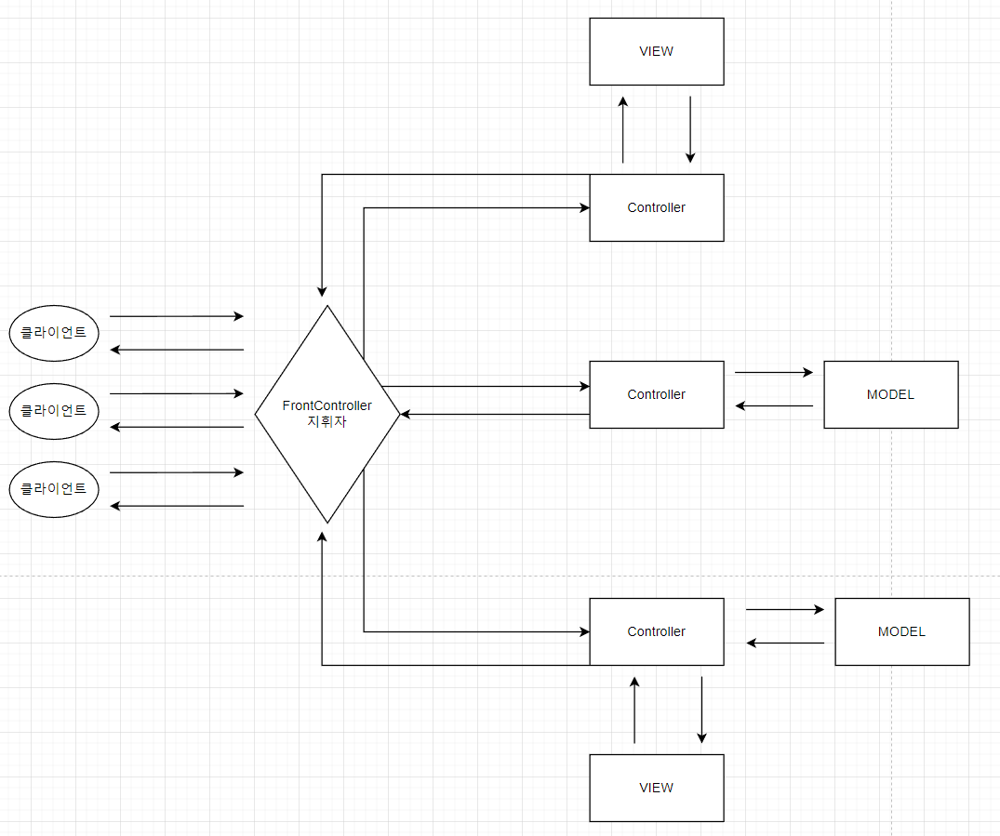
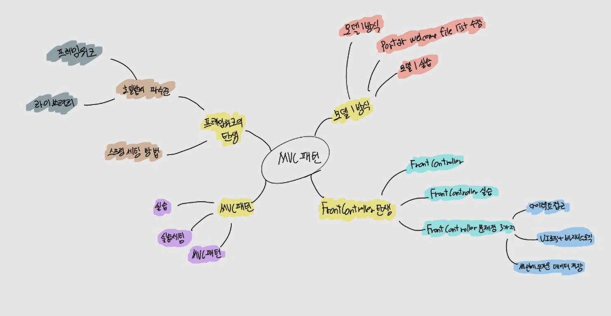

# CH08 MVC 패턴

> 우리는 왜 Servlet을 사용하지 않고, JSP를 사용하는가?
> JSP를 활용하는 방식이 프로그래밍 하기 편하기 때문이다.
>
> 그렇다면 이번 시간에는 JSP만 사용하는 방식에는 어떤 문제가 있는지 알아보고 MVC 패턴의 탄생 과정에 대해서 알아보자.

## 1. 모델 1 방식
> MVC 모델1에서는 일반적으로 JSP(JavaServer Pages)와 서블릿을 사용하여 View와 Controller를 구현하고, Java 클래스를 사용하여 Model을 구현합니다. 웹 애플리케이션의 동작 흐름은 클라이언트의 요청이 Controller로 전달되고, Controller가 Model을 호출하여 데이터 처리를 수행한 후, 결과를 View에 전달하여 클라이언트에게 응답합니다.
> 
> MVC 모델1은 간단한 웹 애플리케이션의 개발에 적합한 방식이지만, 큰 규모의 애플리케이션에는 부적합할 수 있습니다. 이는 코드의 복잡성과 유지 보수의 어려움 때문입니다. 따라서, 대규모 웹 애플리케이션의 개발에는 보다 확장성과 유연성을 갖는 MVC 모델2 등의 구조를 고려하는 것이 일반적입니다.

### (1) 소스코드

https://github.com/codingspecialist/web3

### (2) 모델 1 방식

> 모델 1은 뷰와 로직을 모두 JSP 페이지 하나에서 처리하는 구조를 말한다.


- 단점
  - 공통 로직 처리가 불가능
  - 1개의 JSP파일에 UI 로직과 비지니스 로직이 함께 들어간다.

### (3) Port와 WelcomeFileList 수정

- server.xml -> port -> 8080

- web.xml -> welcome file list -> index.jsp

### (4) 모델 1 실습

#### DynamicWebProject 생성

- 프로젝트명 web3

#### 가짜 DAO(Data Access Object) 생성

- src.shop.mtcoding.web.Board

```java
package shop.mtcoding.web3.model; // model: DB -> Java 에 모델링

public class Board {
    private int id;
    private String title;
    private int userId;

    public Board(int id, String title, int userId) {
        this.id = id;
        this.title = title;
        this.userId = userId;
    }

    public int getId() {
        return id;
    }

    public String getTitle() {
        return title;
    }

    public int getUserId() {
        return userId;
    }
}
```

- src.shop.mtcoding.web.User

```java
package shop.mtcoding.web3.model;

public class User {
    private int id;
    private String username;
    private String password;

    public User(int id, String username, String password) {
        this.id = id;
        this.username = username;
        this.password = password;
    }

    public int getId() {
        return id;
    }

    public String getUsername() {
        return username;
    }

    public String getPassword() {
        return password;
    }
}
```

- src.shop.mtcoding.web.FakeDao

```java
package shop.mtcoding.web3.model;

// Fake DataAccessObject (데이터베이스에 접근하는 클래스)
public class FakeDao {

    public User userData(){
        User u1 = new User(1, "ssar", "1234");
        return u1;
    }

    public Board boardData(){
        Board b1 = new Board(1, "제목1", 1);
        return b1;
    }
}
```

#### JSP 파일 생성

- index.jsp

```jsp
<%@ page contentType="text/html;charset=UTF-8" language="java" %>
<html>
  <head>
    <title>Model 1</title>
  </head>
  <body>
  <h1>모델1 실습</h1>
  <hr/>
  <p>유저 데이터가 필요하면 user.jsp 호출, 게시글 데이터가 필요하면 board.jsp 호출</p>
  </body>
</html>
```

- user.jsp

```jsp
<%@ page import="shop.mtcoding.web3.model.User" %>
<%@ page import="shop.mtcoding.web3.model.FakeDao" %>
<%@ page import="java.io.PrintWriter" %>
<%@ page contentType="text/html;charset=UTF-8" language="java" %>

<%
    String httpMethod = request.getMethod();
    if(httpMethod.equals("POST")){
        response.setContentType("text/html; charset=utf-8");
        PrintWriter pw = response.getWriter();
        pw.println("잘못된 요청입니다");
        return;
    }
    User u1 = new FakeDao().userData();
%>
<html>
<head>
    <title>Model 1</title>
</head>
<body>
    <h1>유저</h1>
    <hr/>
    <h3>번호 : <%=u1.getId()%></h3>
    <h3>유저명 : <%=u1.getUsername()%></h3>
    <h3>비밀번호 : <%=u1.getPassword()%></h3>
</body>
</html>
```

- board.jsp

```jsp
<%@ page import="shop.mtcoding.web3.model.FakeDao" %>
<%@ page import="shop.mtcoding.web3.model.Board" %>
<%@ page import="java.io.PrintWriter" %>
<%@ page contentType="text/html;charset=UTF-8" language="java" %>

<%
    String httpMethod = request.getMethod();
    if(httpMethod.equals("POST")){
        response.setContentType("text/html; charset=utf-8");
        PrintWriter pw = response.getWriter();
        pw.println("잘못된 요청입니다");
        return;
    }
    Board b1 = new FakeDao().boardData();
%>
<html>
<head>
    <title>Model 1</title>
</head>
<body>
<h1>게시글</h1>
<hr/>
<h3>번호 : <%=b1.getId()%></h3>
<h3>제목 : <%=b1.getTitle()%></h3>
<h3>작성자 번호 : <%=b1.getUserId()%></h3>
</body>
</html>

```


#### 공통 처리 로직이 중복됨 (단점)

```jsp
<%
    String httpMethod = request.getMethod();
    if(httpMethod.equals("POST")){
        response.setContentType("text/html; charset=utf-8");
        PrintWriter pw = response.getWriter();
        pw.println("잘못된 요청입니다");
        return;
    }
    Board b1 = new FakeDao().boardData();
%>
```

## 2. FrontController 탄생
> FrontContoller 패턴은 **지휘자**를 만드는 것이다. 여러 클라이언트들의 요청이 있고 해당하는 요청을 처리하는 JSP파일이 있다고 가정하자. 요청을 보낼 때마다 특정한 작업을 하는 것이 필수적이라면 요청이 들어올 때마다 해당 작업을 실어서 보내야 하는데 이 결과 **코드의 중복**이 생기고 해당 **작업을 누락**한다면 최악의 경우에는 장애로 이어질 수도 있다. 
>
> 이러한 까닭에 앞에서 언급한 지휘자가 필요한데 요청을 처리하는 지휘자는 해당 작업을 가지고 있고 해당 작업을 처리한 뒤에 요청에 맞는 JSP에게 전달해주는 역할을 하게 된다. 이것이 바로 FrontController 패턴이다.

### (1) 소스코드

https://github.com/codingspecialist/web4.git

### (2) FrontController


- 장점
  - FrontController
    - Servlet 파일 또는 JSP 파일 가능
    - Front에 위치, 필터링 역할
  - 공통처리가 가능
- 단점 
  - View가 필요하지 않아도 View를 호출해야 한다.
  - JSP파일에 그림 로직과 비지니스 로직이 함께

### (3) FrontController 실습

####  DynamicWebProject 생성

- 프로젝트명 web4

####  FrontController 생성

-   src.shop.mtcoding.web4.FrontController.java

```java
package shop.mtcoding.web4.controller;

import javax.servlet.ServletException;
import javax.servlet.annotation.WebServlet;
import javax.servlet.http.HttpServlet;
import javax.servlet.http.HttpServletRequest;
import javax.servlet.http.HttpServletResponse;
import java.io.IOException;
import java.io.PrintWriter;

@WebServlet("*.do")
public class FrontController extends HttpServlet {

    @Override
    protected void service(HttpServletRequest req, HttpServletResponse resp) throws ServletException, IOException {
        // 공통코드 처리
        String httpMethod = req.getMethod();
        if(httpMethod.equals("POST")){
            resp.setContentType("text/html; charset=utf-8");
            PrintWriter pw = resp.getWriter();
            pw.println("잘못된 요청입니다");
            return;
        }

        // localhost:8080/board.do
        // localhost:8080/user.do
        String action = req.getRequestURI(); // /board.do or /user.do
        System.out.println("uri : "+action);

        if(action.equals("/board.do")){
            resp.sendRedirect("board.jsp");
        }else if(action.equals("/user.do")){
            resp.sendRedirect("user.jsp");
        }else{
            resp.setContentType("text/html; charset=utf-8");
            PrintWriter pw = resp.getWriter();
            pw.println("잘못된 요청입니다");
        }
    }
}
```

- board.jsp

```jsp
<%@ page import="shop.mtcoding.web4.model.FakeDao" %>
<%@ page import="shop.mtcoding.web4.model.Board" %>
<%@ page contentType="text/html;charset=UTF-8" language="java" %>

<%
    Board b1 = new FakeDao().boardData();
%>
<html>
<head>
    <title>Model 1</title>
</head>
<body>
<h1>게시글</h1>
<hr/>
<h3>번호 : <%=b1.getId()%></h3>
<h3>제목 : <%=b1.getTitle()%></h3>
<h3>작성자 번호 : <%=b1.getUserId()%></h3>
</body>
</html>
```

- user.jsp

```jsp
<%@ page import="shop.mtcoding.web4.model.User" %>
<%@ page import="shop.mtcoding.web4.model.FakeDao" %>
<%@ page contentType="text/html;charset=UTF-8" language="java" %>

<%
    User u1 = new FakeDao().userData();
%>
<html>
<head>
    <title>Model 1</title>
</head>
<body>
    <h1>유저</h1>
    <hr/>
    <h3>번호 : <%=u1.getId()%></h3>
    <h3>유저명 : <%=u1.getUsername()%></h3>
    <h3>비밀번호 : <%=u1.getPassword()%></h3>
</body>
</html>

```

- user.do 호출 - FrontController를 통해서!!


- 302, 리다이렉션
- https://developer.mozilla.org/ko/docs/Web/HTTP

> 리다이렉션

리다이렉션은 서버가 브라우저에게 body 없이 header에다가 Location을 넣고 다시 보내는 과정을 의미합니다. 그러면 브라우저가 302를 보고 Location에 다시 요청을 하는 것입니다.


#### user.jsp 다이렉트 호출 (단점)

user.do를 지나지 않고도 바로 접근이 가능합니다.


### (4) FrontController 문제점 살펴보기

> 문제점 1
>
> user.jsp 를 호출할 수도 있고, user.do를 호출할 수 도 있기 때문에 강제성이 없다.
> user.jsp를 다이렉트하게 호출하는 것을 막을 필요가 있다.
>
> 문제점 2
>
> jsp 파일에서 쓸데 없는 자바 코드가 많다.
>
>  문제점 3
>
> request에 저장된 body 데이터를 유지하려면 세션에 저장하는 방법밖에 없다. 그런데 세션에는 무거운 데이터를 저장하면 좋지 않다.

web4 소스코드를 변경하여 문제점에 대해서 확인해보자!!

- 다이렉트하게 호출해보기
- 자바 비지니스 로직 코드 옮겨보기

> 세션 데이터 만료
```
1. 브라우저를 다 종료하면
2. 시간이 만료되면
3. 서버가 껐다가 다시 켜지면
4. 세션을 강제로 제거!!리퀘스트 데이터 만료
```
> 리퀘스트 데이터 만료
```
1. 요청하고, 응답이 끝나면 종료스택
2. 메서드 요청시에 열리고, 메서드가 종료되면 사라진다.
```
> 2번의 request를 보내는 의미

FrontController 구조 (2번의 request)
- 처음 request 보낼 때
- 서버에서 클라이언트로 리다이렉트 후 다시, Location에 request 보낼 때

첫 request의 데이터는 기억되지 못합니다. 왜냐하면 response를 할 때, request 데이터가 전부 사라집니다. 그렇기 때문에 첫 request가 session 영역에 데이터를 저장해줘야 합니다. 우리는 이것을 stateful 서버라고 부릅니다.


- 세션에 저장하는 코드를 추가 후 확인

```java
if(action.equals("/board.do")){
    resp.sendRedirect("board.jsp");
}else if(action.equals("/user.do")){
    HttpSession session = req.getSession();
    session.setAttribute("num", 7); // session 저장
    resp.sendRedirect("user.jsp");
}else{
    .
    .
```

### (5) FrontController 문제점 1,2 해결

#### 소스코드

https://github.com/codingspecialist/web5.git

#### DynamicWebProject 생성

- 프로젝트명 web5

#### JSP 파일 보안폴더에 숨김(WEB-INF)


#### RequestDispatcher 사용 전

- src.shop.mtcoding.web5.controller.FrontController.java

```java
package shop.mtcoding.web5.controller;

import shop.mtcoding.web5.model.Board;
import shop.mtcoding.web5.model.FakeDao;
import shop.mtcoding.web5.model.User;

import javax.servlet.ServletException;
import javax.servlet.annotation.WebServlet;
import javax.servlet.http.HttpServlet;
import javax.servlet.http.HttpServletRequest;
import javax.servlet.http.HttpServletResponse;
import java.io.IOException;
import java.io.PrintWriter;

@WebServlet("*.do")
public class FrontController extends HttpServlet {

    @Override
    protected void service(HttpServletRequest req, HttpServletResponse resp) throws ServletException, IOException {
        String httpMethod = req.getMethod();
        if(httpMethod.equals("POST")){
            resp.setContentType("text/html; charset=utf-8");
            PrintWriter pw = resp.getWriter();
            pw.println("잘못된 요청입니다");
            return;
        }

        String action = req.getRequestURI();
        System.out.println("uri : "+action);

        if(action.equals("/board.do")){
            // JSP에 있던 비지니스 코드를 UI와 분리
            Board b1 = new FakeDao().boardData(); 
            req.setAttribute("board", b1); // request에 b1 저장
            req.sendRedirect("/WEB-INF/views/board.jsp");
        }else if(action.equals("/user.do")){
            User u1 = new FakeDao().userData();
            req.setAttribute("user", u1); // request에 u1 저장
            req.sendRedirect("/WEB-INF/views/user.jsp");
        }else{
            resp.setContentType("text/html; charset=utf-8");
            PrintWriter pw = resp.getWriter();
            pw.println("잘못된 요청입니다");
        }
    }
}
```

- WEB-INF 보안폴더 때문에 404

#### RequestDispatcher 사용 후

> RequestDispatcher를 사용하면 request, response가 새로 생기지 않는다.
> 내부적으로 request와 response를 유지한 채로 재 요청을 한다.
>
> 장점 - tomcat에 의해서 막히는 WEB-INF 보안 폴더에 접근이 가능하다.

```java
if(action.equals("/board.do")){
    Board b1 = new FakeDao().boardData(); 
    req.setAttribute("board", b1);
    // 내부적 요청을 하기 때문에, web.xml에 필터링이 안되고, request가 2번 만들어지지 않음.
    req.getRequestDispatcher("/WEB-INF/views/board.jsp").forward(req, resp);
}else if(action.equals("/user.do")){
    User u1 = new FakeDao().userData();
    req.setAttribute("user", u1);
    req.getRequestDispatcher("/WEB-INF/views/user.jsp").forward(req, resp);
}else{
    resp.setContentType("text/html; charset=utf-8");
    PrintWriter pw = resp.getWriter();
    pw.println("잘못된 요청입니다");
}
```
> RequestDispatcher


RequestDispatcher를 적용해서 서버 밖으로 나가지 않으면서 **내부적 요청**으로 request를 추가생성 할 필요가 사라졌습니다. 즉, sendRedirect 하지 않습니다. 또한 session에 저장해야 하는 번거로움이 사라졌습니다.

#### EL 표현식으로 변경

- web/WEB-INF/views/board.jsp

```jsp
<%@ page contentType="text/html;charset=UTF-8" language="java" %>

<html>
<head>
    <title>Model 1</title>
</head>
<body>
<h1>게시글</h1>
<hr/>
<h3>번호 : ${board.id}</h3>
<h3>제목 : ${board.title}</h3>
<h3>작성자 번호 : ${board.userId}</h3>
</body>
</html>
```

- web/WEB-INF/views/user.jsp

```jsp
<%@ page contentType="text/html;charset=UTF-8" language="java" %>
<html>
<head>
    <title>Model 1</title>
</head>
<body>
    <h1>유저</h1>
    <hr/>
    <h3>번호 : ${user.id}</h3>
    <h3>유저명 : ${user.username}</h3>
    <h3>비밀번호 : ${user.password}</h3>
</body>
</html>
```
- user.jsp 다이렉트 접근


- WEB-INF/views/user.jsp 다이렉트 접근


- user.do 접근
  - sendRedirect 처럼 주소가 변경되지 않음
  - 왜냐하면 내부적 요청을 하기 때문에 (request 1번)


> 3가지 문제해결방법
- WEB-INF 사용
- UI로직과 비즈니스 로직 분리
- RequestDispatcher 사용

## 3. MVC 패턴
> MVC 패턴은 각 구성 요소의 분리와 역할의 명확한 분담을 통해 코드의 재사용성, 유지 보수성, 테스트 용이성을 향상시킵니다. 또한, 애플리케이션의 로직과 표현을 분리하여 다양한 UI 환경에 대한 유연성을 제공합니다. 이로써 개발자는 각각의 역할에 집중하여 개발을 진행할 수 있습니다.
>
> MVC 패턴은 주로 웹 및 응용 프로그램 개발에서 널리 사용되며, 다양한 프로그래밍 언어와 프레임워크에서 구현되고 있습니다. 이 패턴은 애플리케이션의 구조화와 관리를 위한 유용한 지침을 제공하여 효율적인 개발을 도와줍니다.

### (1) 소스코드

https://github.com/codingspecialist/mvcapp.git

### (2) MVC 패턴

> MVC 소프트웨어 디자인 패턴
>
> 1. 모델: 데이터와 비즈니스 로직을 관리합니다.
> 2. 뷰: 레이아웃과 화면을 처리합니다.
> 3. 컨트롤러: 명령을 모델과 뷰 부분으로 라우팅합니다.

#### SRP

- Single Response Principal: 단일 책임의 원칙
- 1개의 클래스는 1개의 책임을 가지는 것이 좋다.
- 강제성 X
- 따라서 MVC 패턴 또한 각각의 역할과 책임을 가집니다.


#### DispatcherServlet과 MVC 패턴

FrontController(= DispatcherServlet) 책임: Controller 를 찾아주는 것 (라우팅)



- 최초의 요청은 DispatcherServlet에게 한다.
- DispatcherServlet은 공통처리를 하고, 적절한 컨트롤러를 요청한다.
- 컨트롤러에서 Data가 필요하면  Model에 도움을 받은 뒤 Data를 request에 저장하고 View를 찾아서 응답한다.
- 컨트롤러에서 Data가 필요하면 Model에 도움을 받은 뒤 Data를 그대로 응답한다.
- 컨트롤러에서 Data가 필요없으면 View를 찾아서 응답한다.
- View를 찾을 때는 재 요청(request)이 필요한데, 이를 Redirect라고 한다.
- 즉 request가 두 번 만들어진다.
- 이 때 문제가 발생한다.  request에 저장된 데이터가 날라간다.
- RequestDispatcher를 사용하여 request를 유지해야 한다.

> request에 데이터를 저장

- request.setAttribute()로 model에서 데이터를 받아서 저장
- EL 표현식으로 View에서 뿌리기 

### (3) 실습세팅

- edit configuration


- 톰켓 라이브러리 빌드


### (4) 실습 코드

- src/shop/mtcoding/mvcapp/DispatcherServlet.java

```java
/**
 * GET -> ex) http://localhost:8080/comment/list.do
 * GET -> http://localhost:8080/board/list.do
 * GET -> http://localhost:8080/board/saveForm.do
 * POST -> http://localhost:8080/board/save.do
 */
@WebServlet("*.do")
public class DispatcherServlet extends HttpServlet {

    @Override
    protected void service(HttpServletRequest req, HttpServletResponse resp) throws ServletException, IOException {
        // 1. 버퍼로 들어오는 모든 것을 UTF-8로 인코딩해서 받기 (공통처리)
        req.setCharacterEncoding("utf-8");
        // 2. path를 파싱 <- board, comment
        String path = getPath(req);
        System.out.println("path : " + path);
        // 3. action 파싱
        String action = getAction(req);
        System.out.println("action : "  + action);
        // 4. 컨트롤러 객체 생성
        BoardController boardController = new BoardController(new BoardRepository()); // DI(의존성 주입)
        // 5. 라우팅하기
        if (path.equals("board")) {
            switch (action) {
                case "saveForm":
                    String saveFormView = boardController.saveForm();
                    req.getRequestDispatcher(saveFormView).forward(req, resp); // request를 2번 만들면 안되기 때문에(접근 못함)
                    break;
                case "save": // POST로 게시글 쓰기 요청(GET 요청이 아님), 게시글 쓰기 후 저장된 list를 보이게 하는 것 (content, title)
                    String method = req.getMethod();
                    if (!method.equals("POST")) {
                        resp.setContentType("text/html; charset=utf-8");
                        resp.getWriter().println("POST로 요청해야 합니다.");
                        break;
                    }
                    String title = req.getParameter("title");
                    String content = req.getParameter("content");
                    String saveRedirect = boardController.save(title, content);
                    resp.sendRedirect(saveRedirect);  // list로 가라! || request에 list 데이터를 담지 않았다
                    //req.getRequestDispatcher("/WEB-INF/views/board/list.jsp").forward(req, resp); // 실습 해보기 -> 저장할 공간이 없어서
                    break;
                case "list":
                    // MVC에게 위임하는 코드
                    String listView = boardController.list(req); // boardController에게 request 전달
                    req.getRequestDispatcher(listView).forward(req, resp);
                    break;
                default: // 위에 아무것도 걸리지 않으면
                    resp.sendRedirect("/board/list.do"); // case list로 가라!
            }
        }
    }

    // http://localhost:8080/board/list.do
    private String getAction(HttpServletRequest req) {
        String action = getUri(req).split("/")[1];
        action = action.replace(".do", "");
        //System.out.println(action);
        return action; // list
    }
    // http://localhost:8080/board/list.do
    private String getUri(HttpServletRequest req) {
        String uri = req.getRequestURI(); // 서브스트링을 제외한 /board/list.do을 가져온다
        uri = uri.substring(1); // board/list.do
        return uri;
    }
    private String getPath(HttpServletRequest req) {
        // board/list.do
        String path = getUri(req).split("/")[0]; // board
        //System.out.println(path);
        return path;
    }
}
```

- http://localhost:8080/board/list.do
- http://localhost:8080/user/list.do


#### model

- src/mtcoding/mvcapp/model/Board.java

```java
public class Board {
    private int id;
    private String title;
    private String content;

    public Board(int id, String title, String content) {
        this.id = id;
        this.title = title;
        this.content = content;
    }

    public int getId() {
        return id;
    }
    public void setId(int id) {
        this.id = id;
    }
    public String getTitle() {
        return title;
    }
    public void setTitle(String title) {
        this.title = title;
    }
    public String getContent() {
        return content;
    }
    public void setContent(String content) {
        this.content = content;
    }
}
```

- src/mtcoding/mvcapp/model/BoardRepository.java

```java
// 책임: DB에 접근
public class BoardRepository {

    public List<Board> findAll() {
        // SELECT * FROM board
        return DB.selectAll();
    }

    // 클라이언트(formUrlEncoded) -> DS(request body) -> Controller(title, content) -> Repository(title, content)
    // DS or Controller 에서 데이터가 올바르게 왔나 체크를 해줘야한다(유효성 검사!), 만약 DB 도착 전에 체크를 하지 않으면 DB에 이상한 값이 들어온다.
    public void save(String title, String content) {
        // INSERT INTO board(title, content) VALUES('제목1', '내용1')
        DB.insert(title, content);
    }
}
```

#### config

- src/mtcoding/mvcapp/config/ViewResolver.java

ViewResolver는 path와 action을 사용하기 편하게 만들어줍니다.

```java
public class ViewResolver { // 귀찮은 path랑 action을 해결하는 장소 || 스프링에도 나옴!
    private static String prefix = "/WEB-INF/views";
    private static String suffix = ".jsp";

    public static String resolve(String viewName) { // /board/list
        // /WEB-INF/views/board/list.jsp
        return prefix + viewName + suffix;
    }
}
```

- src/mtcoding/mvcapp/config/DB.java

가짜 DB를 만듭니다.

```java
public class DB {
    private static List<Board> boardList = new ArrayList<>();

    static {
        boardList.add(new Board(1, "제목 ", "내용"));
        boardList.add(new Board(2, "제목 ", "내용"));
    }

    public static List<Board> selectAll(){
        return boardList;
    }

    public static void insert(String title, String content){
        int id = boardList.size()+1;
        boardList.add(new Board(id, title, content));
    }
}
```

#### controller

- src/mtcoding/mvcapp/controller/BoardController.java

```java
// 책임: 클라이언트의 요청 잘(유효성 검사 = validation check) 받고, 응답(View, Data)
public class BoardController {
    // Controller -> Repository를 필요
    // Controller는 Repository에 의존적이다.
    // 의존적인 객체를 DS로 부터 생성자로 주입받을 것이다.
    private BoardRepository boardRepository;

    // 초기화
    public BoardController(BoardRepository boardRepository) {
        this.boardRepository = boardRepository;
    }

    public String list(HttpServletRequest request){
        // Controller -> Model -> View
        System.out.println("list : 요청됨");
        List<Board> boardList = boardRepository.findAll();
        request.setAttribute("boardList", boardList);
        return ViewResolver.resolve("/board/list");
    }

    public String saveForm(){
        // Controller -> View
        System.out.println("saveForm : 요청됨");
        return ViewResolver.resolve("/board/saveForm");
    }

    // 스프링은 컨트롤러에 매개변수를 적기만 하면 forUrlEncoded(디폴트) 데이터를 DS로부터 전달받음
    public String save(String title, String content){
        // 검증코드: http method 4가지 중에!!
        // POST와 PUT은 resource를 client로 부터 전달 받으니까!!
        if (title == null || title.equals("")) {
            throw new NullPointerException("title이 없습니다.");
        }
        if (content == null || content.equals("")) {
            throw new NullPointerException("content가 없습니다.");
        }

        System.out.println("save : 요청됨");
        boardRepository.save(title, content);
        return "/board/list.do";
    }
}
```

- http://localhost:8080/board/list.do


- http://localhost:8080/board/saveForm.do


> DispatcherServlet 바꿔서 실습해보기


```java
req.getRequestDispatcher("/WEB-INF/views/board/list.jsp").forward(req, resp);
```

## 4. 프레임워크의 탄생
> 스프링(Spring) 프레임워크는 Java 기반의 오픈 소스 애플리케이션 개발을 위한 프레임워크입니다. 스프링은 애플리케이션의 구조와 관련된 다양한 기능과 도구를 제공하여 개발자가 효율적으로 애플리케이션을 개발하고 관리할 수 있도록 돕습니다.

> 추운 겨울이 가고 봄이 온다. (스프링 프레임워크)

### (1) 스프링 세팅 방법


- Spring Web: MVC 패턴 자동으로 만들어짐


- 완성된 모습

```java
@RestController
public class BoardController {

    @GetMapping("/home")
    public String home() {
        return "<h1>Home</h1>";
    }

    @PostMapping("/save")
    public String save(String title, String content) {
        return title + " : " + content;
    }
}
```

- http://localhost:8080/home

- http://localhost:8080/na/save


위의 코드는 여태까지 우리가 DispatcherServlet를 기반으로 만든 MVC 패턴을 한번에 표현할 수 있습니다. 우리는 단순히 요청만 하기만 하면 됩니다.

> server.xml, web.xml -> application.properties

스프링에서는 한곳에서 전부 설정이 가능합니다.

```
server.port=8000
server.servlet.context-path=/na
server.servlet.encoding.charset=UTF-8
server.reactive.session.timeout=5
```

### (2) 호밑밭의 파수꾼


- 호밀밭의 파수꾼 이야기
  - 주인공이 좋은대학을 감.
  - 남자애들의 돈, 차, 시계 이런 이야기가 시시하고 한심해 보임.
  - 어른들은 바꿀 수 없다고 생각.
  - 본인의 여동생만큼은 순수하게 만들고 싶음.
  - 호밀밭을 만들고 울타리 외부는 낭떠러지
  - 호밀밭 내부에 미끄럼틀, 바람개비 설치
  - 파수꾼이 피비가 위험하지 않게 보호

#### 프레임워크

호밀밭의 파수꾼 이야기에서 프레임워크는 호밀밭입니다. 호밀밭(Framework)의 바깥으로 나가면 위험하기 때문에 파수꾼(실력좋은 개발자)이 지켜줍니다. 그리고 파수꾼이 피비(신입개발자)가 놀 수 있도록 미끄럼틀과 바람개비(libaray)를 만듭니다.

#### 라이브러리

호밀밭의 파수꾼 이야기에서 라이브러리는 미끄럼틀과 바람개비입니다. 호밀밭(Framework)안에 만들어 놓은 것을 가지고 피비(신입 개발자)가 노는 것입니다.

## 5. 마인드 맵

