# CH09 스프링 이해를 위한 자바 고급 -1

#### 소스코드

https://github.com/codingspecialist/javahigh-oop.git

## 1. 클래스 vs 오브젝트 vs 인스턴스
> 클래스(Class), 객체(Object), 인스턴스(Instance)는 객체지향 프로그래밍에서 중요한 개념입니다.
>
>  클래스는 객체를 생성하기 위한 설계도이며, 객체는 클래스로부터 생성된 실체로 클래스에 정의된 상태와 행위를 갖습니다. 객체의 실체화된 형태를 인스턴스라고 합니다. 클래스는 객체의 공통된 특징과 동작을 정의하고, 객체는 클래스의 인스턴스로 실제로 메모리에 할당되어 동작합니다.

### (1) 추상명사, 물질명사

추상명사와 물질명사의 가장 큰 차이점은 존재 가능성의 여부입니다.

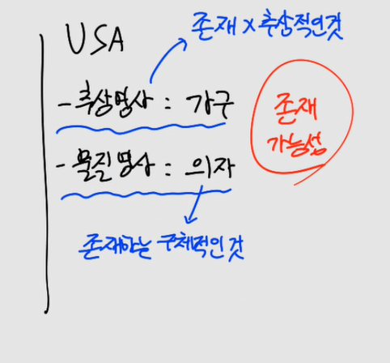

- 추상명사: 존재하지 않는 것, 추상적임
- 물질명사: 존재하는 구체적인 것

### (2) class, object, instance

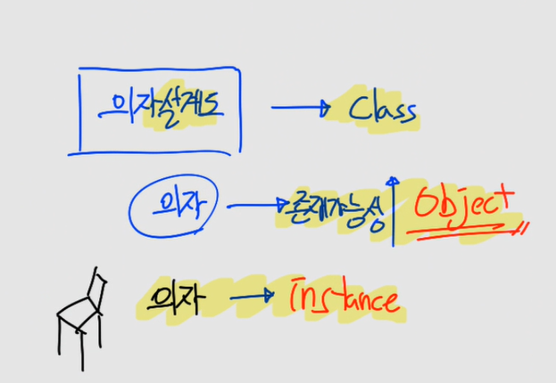

- 클래스는 설계도 (class 파일)
- 오브젝트는 존재가능성 (new 가능한 대상)
- 인스턴스는 존재하는 것 (new 된 대상)

#### 예시

Cat class, Dog class 가 있습니다. 이 2개의 클래스는 존재의 가능성이 있기 때문에 구체적입니다. 하지만 Animal의 경우 존재 가능성이 없기 때문에 추상적입니다.

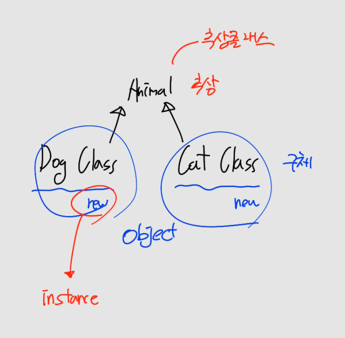

이때 Cat class, Dog class 는 존재가능성이 있어서 Object가 되고, 각 class에 new 를 해서 heap에 띄워지게 되면 instance가 됩니다.

### (3) 상태는 행위를 통해 변경

Class는 Onject이기 때문에 존재 가능성이 있습니다. 따라서 상태(변수)와 행위(메소드)를 가지게 됩니다.

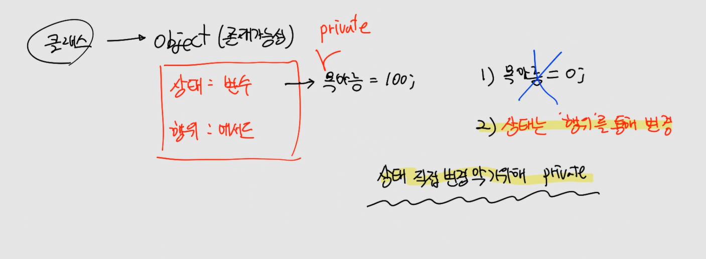

- 상태 직접 변화 불가능
  - 상태에 private이 붙는 이유
- 반드시 행위를 통해서 상태를 변경
  - 행위에 public이 붙는 이유

## 2. Static vs Heap vs Stack
> 스택(Stack), 힙(Heap), 정적 메모리(Static Memory)은 프로그램 실행 중에 메모리를 할당하고 관리하는 방법을 나타냅니다.


### (1) Static

- static은 main 메서드가 실행되기 전에 메모리에 로드된다. 즉 main 실행 전에 정적 할당된다.(= 고정적으로 할당)
- class가 없는 언어는 static 메모리가 없다.
- static은 class별로 존재한다.
- static은 자바 프로그램이 프로세스가 되었을 때 부터 자바 프로그램이 종료될 때까지 메모리에 존재한다.
  - 가장 오래존재
  - static이 많으면 프로그램이 무거워짐
- static 메모리를 관리하는 방법은 없다. 그냥 static 데이터는 최대한 적게 설계하는 것이다.
- static은 언제 사용할까? 내 프로그램이 실행되고, 프로그램이 종료될 때까지 필요한 데이터가 있다면 만든다.

> static은 main 메서드가 실행되기 전에 메모리에 단 한번 로드되기 때문에 프로그램이 실행되는 동안 두 번 메모리에 로드하는 방법은 없다.

#### 소스코드

- StaticEx01

```java
class Data {
    int num = 1;
    static int sum = 20;
}

public class StaticEx01 {

    public static void main(String[] args) {
        System.out.println("Data.sum : "+Data.sum);
    }
}
```

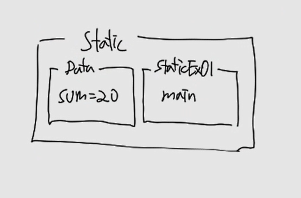

### (2) Heap

- heap은 class를 new할 때 메모리에 로드된다.
- 자바 프로그램이 실행되기 전에 메모리에 확보되는 것이 아니라, 실행 중에 확보된다. 즉 동적 할당된다.
- heap에 할당된 데이터는 가비지 컬렉션에 의해 관리된다.
- class를 3번 new하면 3개의 heap이 할당된다. 즉 static과는 다르게 여러번 할당할 수 있다. 

> 태양이 static 메모리 공간에 정적 할당된다면! - 두 번 생성할 수 없다. 오로지 1번!
>
> 인간은 heap 메모리에 공간에 동적 할당된다. - 계속 생성할 수 있다.

#### 소스코드

- HeapEx01

```java
class Data {
    int num = 1;
    static int sum = 20;
}

public class HeapEx01 {

    public static void main(String[] args) {
        Data d1 = new Data();
        Data d2 = new Data();
        System.out.println("d1.num : "+d1.num);
        System.out.println("d2.num : "+d2.num);
        System.out.println("Data.sum : "+Data.sum);

        d1.num = 2;

        System.out.println("d1.num : "+d1.num);
        System.out.println("d2.num : "+d2.num);
    }
}
```

### (3) Stack

- First In Last Out
- stack은 메서드가 실행될 때 메모리에 로드된다.
- stack은 메서드가 종료될 때 메모리에서 사라진다.

> stack 메모리는 가장 짧은 생명주기를 가지는 메모리 공간이다.
> 메서드가 호출될 때 잠깐 할당되었다고, 메서드가 종료될 때 사라지기 때문에 관리가 필요 없다.

#### Stack 의 호출 과정

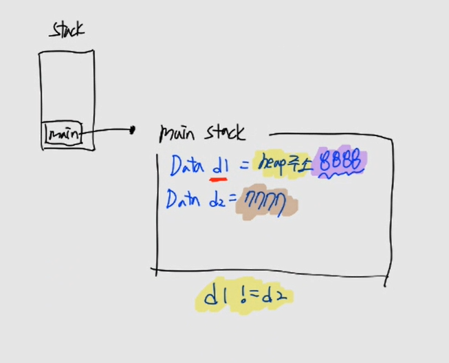

- Stack에 main 메소드 적재
- main stack에 d1, 과 d2의 heap 주소 생김
  - d1과 d2의 내용이 생기는 것 아님

#### 소스코드

> StackOverFlow

```java
public class StackEx01 {

    static void hello() {
        int num = 10;
        hello(); // 재귀호출, stack이 쌓인다.
        System.out.println("끝");
    }

    public static void main(String[] args) {
        StackEx01.hello();
    }
}
```

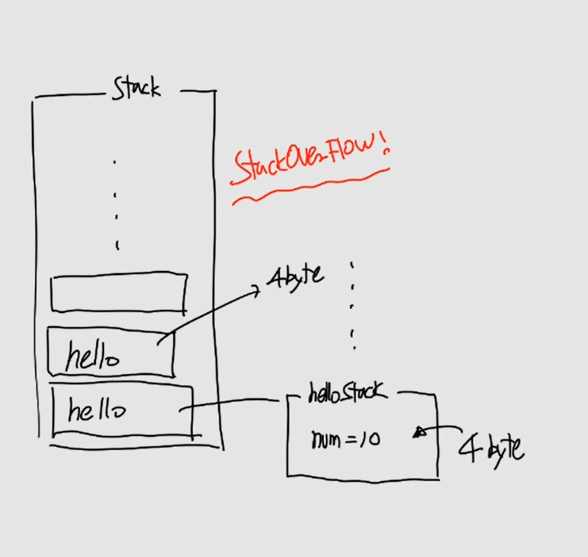

- StackOverFlow 수정

```java
public class StackEx01 {

    static void hello() {
        int num = 10;
        hello2(); // 호출
    }

    static void hello2() {
        int num = 10;
        hello3(); // 호출
    } 

    static void hello3() {
        int num = 10;
    }

    public static void main(String[] args) {
        StackEx01.hello(); // 호출
    }
}
```

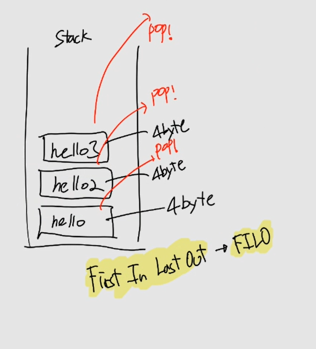

### (4) 실습코드

- MethodEx01
  - instance를 생성할 때, 메소드를 호출할 때 어떤일이 일어나는지 생각해보기

```java
class Data{
    public void think() throws InterruptedException {
        LocalDateTime start = LocalDateTime.now(); // 현재시간
        for (int i = 0; i < 10; i++) {
            Thread.sleep(100);
            System.out.print(".");
        }
        LocalDateTime end = LocalDateTime.now(); // 1초 후 시간 저장
        System.out.println("시작시간 : "+start);
        System.out.println("끝시간 : "+end);
    }
}

public class MethodEx01 {
    public static void main(String[] args) {
        Data d1 = new Data();
        try {
            d1.think();
        } catch (InterruptedException e) {
            throw new RuntimeException(e);
        }
    }
}
```

### (5) 커피 빨리 마시기 대회

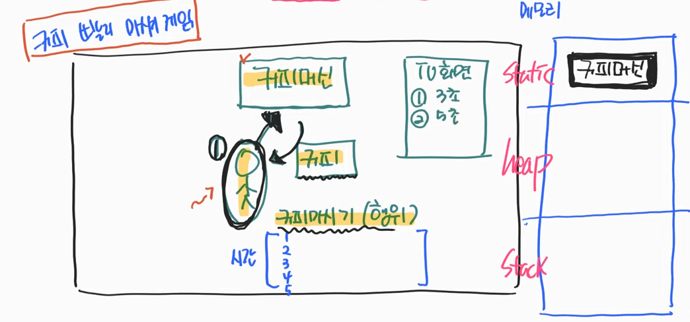

- 순서
  - 참가자 등장: heap에 뜬다.
  - 커피 등장: heap에 뜬다.
  - 커피를 마신다: stack, 이때 커피를 마시기 시작한 시간과 종료시간이 저장된다. 걸린시간을 측정한다.
  - 값을 리턴한다: TV화면에 기록, stack(커피 마시기)은 행위 가 끝나면 사라지기 때문에 기록을 해야한다.
  - Garbage Collector에 의해서 heap에 있는 커피와 참가자는 사라진다.
  - 반복

## 3. 상태와 행위
> 객체지향 프로그래밍은 이러한 객체의 상태와 행위를 중심으로 프로그램을 설계하고 구현하는 패러다임입니다. 이를 통해 현실 세계의 복잡성을 단순화하고, 프로그램의 유지보수성과 재사용성을 향상시킬 수 있습니다.
>
> 상태(State): 객체가 가지는 데이터나 속성을 말합니다. 객체의 상태는 속성이나 변수로 표현됩니다. 예를 들어, 자동차 객체의 상태는 속도, 연료량, 현재 위치 등이 될 수 있습니다.
>
> 행위(Behavior): 객체가 수행할 수 있는 동작이나 기능을 말합니다. 행위는 메서드 또는 함수로 표현됩니다. 예를 들어, 자동차 객체의 행위는 가속, 감속, 정지, 방향 전환 등이 될 수 있습니다.

> 소나타 클래스(설계도)

### (1) 상태

변경되지 않을 것들은 final로 만듭니다.

- 기어상태
- 속력
- final 엔진파워
- final 색상

### (2) 행위

상태는 행위를 통해서 변경합니다.

- 기어 변경
- 엑셀 밟기

> new 하기 (자동차를 태어나게 하기)
> 우선 자동차가 이 세상에 존재해야 한다. 
>
> constructor 사용하기 (자동차가 태어날 때)
> 자동차가 처음에 생성될 때 생성자를 통해 엔진파워와 색상을 초기화 한다.
>
> setter 사용하기 (자동차가 태어난 뒤)
> 기어를 변경하면 기어 상태를 변경할 수 있다. 전진 or 후진
> 엑셀을 밟으면 속력의 상태를 변경할 수 있다.

> 엔진파워와 색상에 대한 setter가 필요한가? setter란 무엇일까?
> setter는 오브젝트의 상태 변화가 필요할 때 만드는 것이다.

### (3) 객체(Object)의 상태는 행위에 의해서 변경된다

- 클래스의 맴버변수를 상태라고 한다.
- 클래스의 메서드를 행위라고 한다.
- 객체의 상태를 초기화할 때는 생성자로 한다.
- 객체가 태어난 뒤 상태 변경이 일어나려면 행위가 필요하다. 행위에 의해서 상태를 변경한다.
- 상태에 직접 접근을 막기 위해 상태에 private 접근제어자를 사용한다.
- 상태를 행위를 통해 변경하기 위해 public 메서드를 만든다.

### (4) 실습코드

- OOPEx01

```java
class Car {
    private String 기어상태; // d(전진), r(후진), p(파킹)
    private int 속력;
    private final int 엔진파워;
    private final String 색상;

    // 생성자도 메서드 
    public Car(int 엔진파워, String 색상) {
        this.엔진파워 = 엔진파워;
        this.색상 = 색상;
        this.기어상태 = "p";
        this.속력 = 0;
    }
    
    public void 기어변경(String state){
        if(state.equals("d")){
            기어상태 = "전진";
        }else if(state.equals("r")){
            기어상태 = "후진";
        }
    }
    public void 엑셀밟기(int level){
        if(!기어상태.equals("전진")){
            System.out.println("기어 변경을 d로 해주세요");
            return;
        }
        속력 = level * 엔진파워;
    }
    public String get기어상태() {
        return 기어상태;
    }
    public int get속력() {
        return 속력;
    }
    public int get엔진파워() {
        return 엔진파워;
    }
    public String get색상() {
        return 색상;
    }
}

public class OOPEx01 {
    public static void main(String[] args) {
        Car car = new Car(30, "노랑");
        System.out.println("색상 : "+car.get색상());
        System.out.println("엔진파워 : "+car.get엔진파워());
        System.out.println("기어상태 : "+car.get기어상태());
        System.out.println("속력 : "+car.get속력());
        System.out.println("===========================");

        car.엑셀밟기(1); 
        System.out.println("속력 : "+car.get속력());
        System.out.println("===========================");

        car.기어변경("d"); // 상태변경
        System.out.println("기어상태 : "+car.get기어상태());
        System.out.println("===========================");

        car.엑셀밟기(2);
        System.out.println("속력 : "+car.get속력());
        System.out.println("===========================");
    }
}
```

## 4. 상속 (추상화)

> 상속(inheritance)이란 기존의 클래스에 기능을 추가하거나 재정의하여 새로운 클래스를 정의하는 것을 의미
>
> 상속에 목적은 추상화에 있다. 재사용에 있지 않다.
> 상속의 목적은 추상화이고, 메서드 혹은 변수의 재사용은 추상화를 했기 때문에 얻어지는 부가적인 효과일 뿐이다.
> 즉, 재사용을 위해서 상속을 사용하지 않는다.

### (1) 상속과 메모리

> 상속을 하게 될 때 메모리 구조가 어떻게 될까?

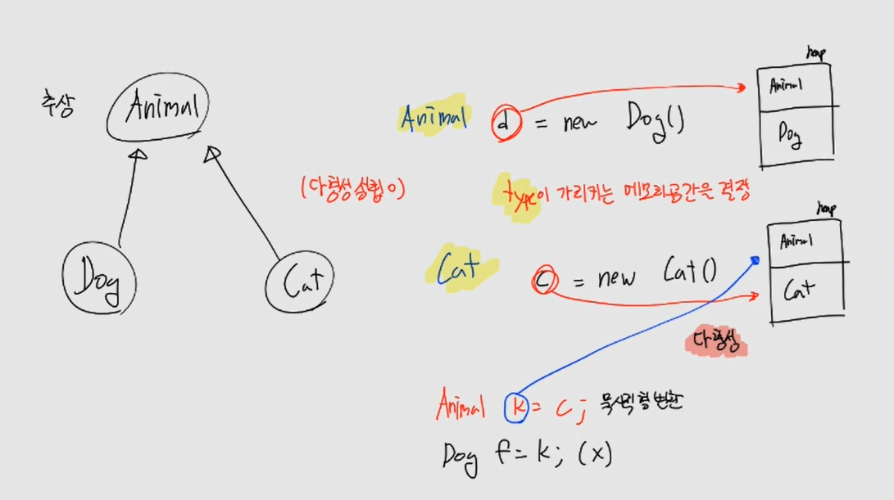

```java
Animal d = new Dog();
```

- new Dog 를 한 시점에 heap에는 Animal과 Dog가 뜨게 된다.
  - 이유: Dog -> Animal
  - Dog 포함해서 상속하고 있는 것들을 모두 메모리에 띄운다.
- d 의 Type이 Animal이기 때문에 d 는 Animal 메모리 공간을 가리킴
  - Animal에 있는 메소드 사용가능

```java
Cat c = new Cat();
```

- new Cat 를 한 시점에 heap에는 Animal과 Cat이 뜨게 된다.
  - 이유: Cat -> Animal
  - Cat 포함해서 상속하고 있는 것들을 모두 메모리에 띄운다.
- c 의 Type이 Cat이기 때문에 c 는 Cat 메모리 공간을 가리킨다.
  - Cat에 있는 메소드 사용가능
  - 추가로 부모인 Animal 메소드도 물려받아 사용가능

```java
Animal k = c; // 묵시적 형변환
Dog f = k; // 안됨
```

- c 는 Animal을 포함해서 Cat을 Type으로 가지고 있다.
  - c Type을 Cat에서 Animal로 형변환이 가능
- k를 Dog로 바꾸는 것은 불가능
  - heap 메모리에 Dog 존재 X

> TextButton tb -> Button tb 가 된다면?

TextButton --> Button

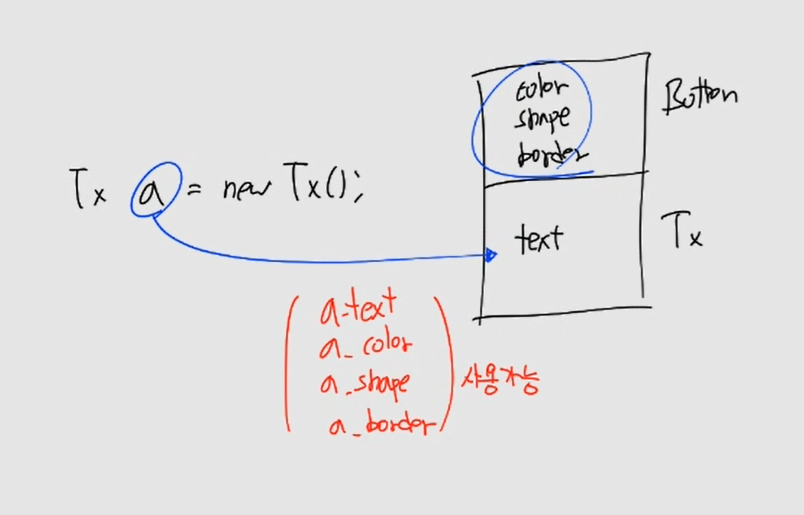

```java
TextButton tb = new TextButton();
```

- 메모리 상태: TextButton, Button
- tb의 타입: TextButton
- 사용가능한 메소드
  - Button: color, shape, border
  - TextButton: text

```java
Button tb = new TextButton(); 
```

- 메모리 상태: TextButton, Button
- tb의 타입: Button
- 사용가능한 메소드
  - Button: color, shape, border


### (2) 다형성 (IS-A)

> 다형성(polymorphism)이란 하나의 객체가 여러 가지 타입을 가질 수 있는 것을 의미

- 사과에게 너 과일이니? (가능)
- 사자에게 너 동물이니? (가능)
- 자동차에게 너 엔진이니? (불가능)

잘 만들어진 동물 클래스가 있다면, 사자 클래스를 만들 때, 동물 클래스를 상속 받아 만들면 편하게 만들 수 있다. 왜냐하면 상속을 하면 부모가 만들어 둔 메서드나, 변수를 재사용할 수 있기 때문이다.

하지만, 잘 만들어진 엔진 클래스를 자동차가 상속해서 사용하면 안된다. 그 이유는 다형성이 성립하지 않기 때문이다.


다형성을 통해 DIP를 지킬 수 있다.

> *DIP는 의존 관계를 맺을 때 변화하기 쉬운 것 또는 자주 변화하는 것에 의존하기 보다는, **변화하기 어려운것, 거의 변화가 없는 것**에 의존하라는 원칙* (**Dependency inversion principle**)

#### 이상한 나라의 엘리스 이야기(누가 여왕의 파이를 훔쳤을까?)

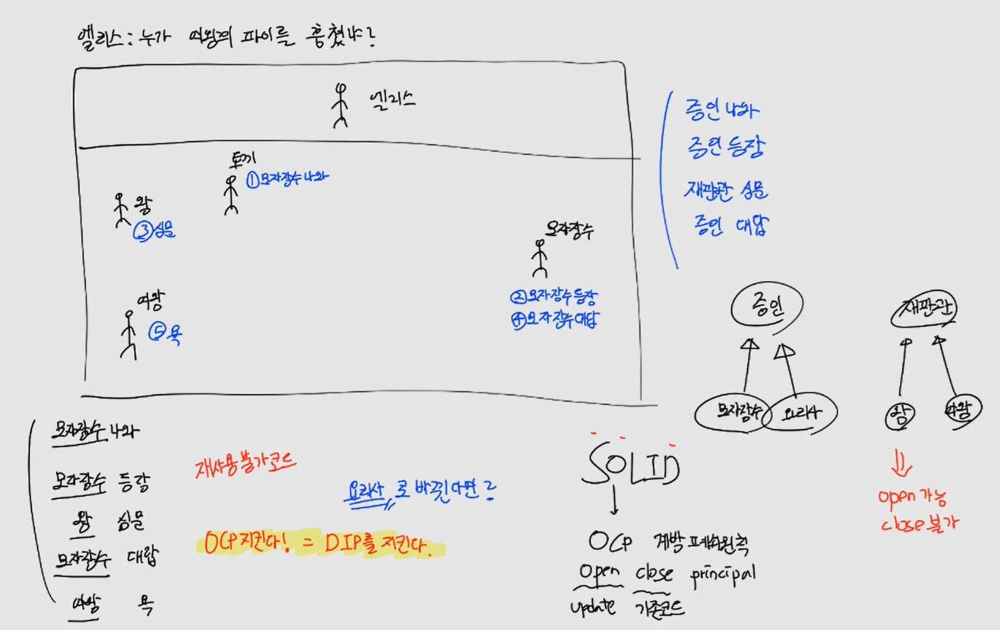

- OCP 위배
  - 토끼: 모자장수 나와
  - 모자장수: 모자장수 등장
  - 왕: 너가 여왕의 파이를 훔쳤어?
  - 모자장수: 대답
  - 여왕: 욕
- 구체적인 것에 의존하고 있다.
  - 토끼, 모자장수, 여왕 ...

위의 프로그램을 모자장수가 아닌 **요리사**로 바꾼다면, 모든 코드들을 전부 바꿔야 한다. 따라서 OCP에 위배가 된다.

그렇기 때문에 **OCP를 지키려면 DIP를 지켜야한다.**

- OCP 충족
  - 진행자: 증인 나와
  - 증인: 증인 등장
  - 재판관: 심문
  - 증인: 대답
  - 부 재판관: 욕
- 추상적인 것에 의존하고 있다.
  - 진행자, 증인, 재판관 ...

구체적인 것이 아닌 추상적인 것에 의존하는 것을 DIP라고 하고, DIP를 지키면 OCP를 지킬 수 있다. 증인의 자리에는 요리사, 농구선수 등등 모두가 올 수 있다.

> OCP

- SOLID
- Open Close Principal(개방 폐쇠의 원칙)
- 확장에 대해 열려 있어야 하고, 수정에 대해서는 닫혀 있어야 한다

### (3) 컴퍼지션 (HAS-A)

> 기존 클래스가 새로운 클래스의 구성요소가 되는 것

- 자동차 클래스를 만들 때, 잘 만들어진 엔진이 있으면 컴퍼지션한다.
- 컴퍼지션한다는 것은 엔진 클래스를 자동차 클래스에 상태로 등록하는 것이다.

#### 실습코드

- src/ex05/ExtendsEx01.java

```java
class Engine {
    int power = 2000;
}

class Car {
    // Car는 Engline에게 의존한다.
    Engine e;

    public Car(Engine e) {
        this.e = e;
    }
}

public class ExtendsEx01 {
    public static void main(String[] args) {
        // DI
        Car car = new Car(new Engine());
        System.out.println(car.e.power);
    }
}
```

> 햄버거 세트

```java
class Hamburger {
    String name = "햄버거";
}

class Potato {
    String name = "감자";
}

class Coke {
    String name = "콜라";
}

// HamburgerSet has Coke, Potata, Coke
class HamburgerSet {
    Hamburger hamburger;
    Potato potato;
    Coke coke;

    public HamburgerSet(Hamburger hamburger, Potato potato, Coke coke) {
        this.hamburger = hamburger;
        this.potato = potato;
        this.coke = coke;
    }
}

public class CompositeEx01 {
    public static void main(String[] args) {
        HamburgerSet set = new HamburgerSet(new Hamburger(), new Potato(), new Coke());
        System.out.println(set.hamburger.name);
        System.out.println(set.potato.name);
        System.out.println(set.coke.name);
    }
}
```

### (4) 상속의 진짜 목적

#### 실습코드

- src/ex05/ExtendsEx02.java

```java
/**
 * 추상화와 재사용의 목적이 있다.
 */
class Button {
    String color = "blue";
    String shape = "circle";
    boolean border = true;
}

// TextButton is Button
class TextButton extends Button{
    String text = "완료";
}

public class ExtendsEx02 {
    public static void main(String[] args) {
        TextButton tb = new TextButton(); // TextButton(text), Button(color, shape, border)
        System.out.println(tb.text);
        System.out.println(tb.color);
        System.out.println(tb.shape);
        System.out.println(tb.border);
    }
}
```

- src/ex05/ExtendsEx03.java

```java
/**
 * 오직 추상화에 목적이 있다
 * 타입을 일치시키기 위해
 */
abstract class Animal{}

class Dog extends Animal{}
class Cat extends Animal{}

public class ExtendsEx03 {
    public static void main(String[] args) {
        Animal[] animals = new Animal[2];
        animals[0] = new Dog();
        animals[1] = new Cat();
    }
}
```

## 5. 마인드 맵

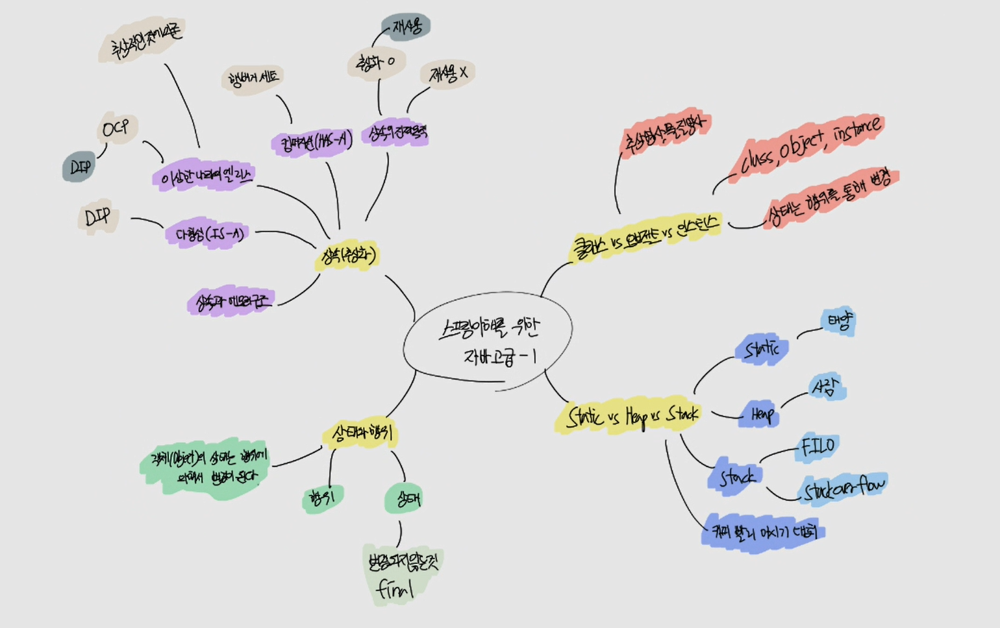