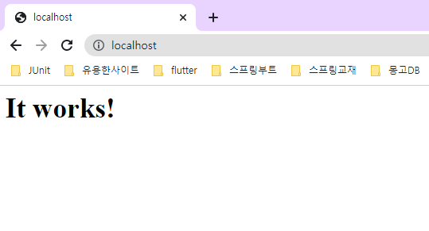

# 아파치 설치 방법

### 1. 다운로드 사이트 이동

https://www.apachelounge.com/download/

### 2. 다운로드


### 3. 압축풀고 폴더 이동

>C:\workspace\tools\Apache24


### 4. 서버 루트 폴더 설정

- C:\workspace\tools\Apache24\conf 폴더로 이동

- httpd.conf 파일 열기

- 루트 폴더 설정

  

### 5. 설치

- 관리자 모드로 CMD 열기

- C:\workspace\tools\Apache24\bin 폴더로 이동

  ```
  httpd.exe -k install
  ```

- 혹시 설치가 잘못되었다면 삭제하는 법

  ```
  httpd.exe -k uninstall
  ```

  

### 6. 아파치 실행


